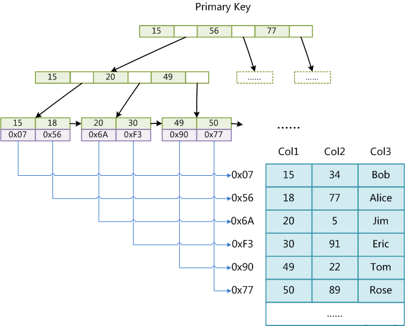
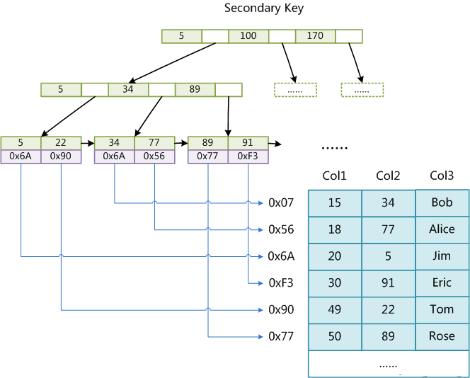
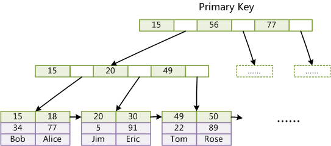
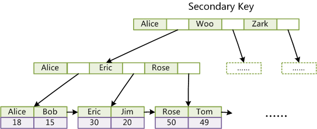

# B树B+树B*树和索引

## B树

### B树的意义

起初二叉查找树由于会退化为链表，诞生了平衡二叉查找树（AVL树和红黑树），虽然平衡二叉查找树时间复杂度已达到了O(logn)，但当考虑到磁盘IO时，由于内存大小的限制，无法一次性将整棵二叉查找树读入内存中，只能逐一加载每个磁盘页，当使用二叉查找树时，最坏情况下进行的磁盘IO操作数等于树高，而B树将二叉查找树的一棵瘦高的树转化为一棵矮胖的树，从而降低了树高，减少了磁盘IO操作数，因此适用于文件存储系统。

磁盘顺序读写时才能达到其宣传的数值，因为随机读写，机械磁盘需要旋转及寻道时间，哪怕是ssd，随机读写也需要寻址时间；那么如果将索引tree构建的层数越低，使得key相近的数据都存在一起，伴随磁盘预读特性，能更进一步提高性能。

### B树的定义

B-树指的就是B树，B树又称为平衡多路查找树

B树的每一个节点最多包含M个子节点，M就称为B树的阶，2-3树就是3阶B树

- 每个结点至多有M个子结点
- 根结点至少有2个子结点
- 中间节点至少有`ceil(M/2)`个子结点（`ceil()函数表示向上取整`）
- 所有叶子结点都出现在同一层
- 单节点最多有M-1个元素,一个节点的子节点数量会比元素个数多1


在B树中，无论是中间节点还是叶子节点都存储着对应的data（图中的红色小方块），正因为**B树key和data域聚合在一起**，所以MongoDB这种文档型的数据库索引选择B树

## B+树

### B+树的特点

- M阶B+树表示每个节点至多M个关键词，至多有M个子节点
- 每个父节点都出现在子节点中，并且是子节点中最大或最小元素
- B+树中非叶子节点不再保存data，而仅仅保存key，所有data都存储在叶子节点中，而B树中所有节点key和data域都是聚合在一起存储的
- 每个叶子节点都带有一个指向下一节点的指针，形成有序链表

### B+树的优点

#### 1. B+树的磁盘读写代价更低

由于B+树非叶子节点只存储key，因此每个磁盘块能存储更多的key，一次读取读到内存中的key数量也更多，因此就可以减少磁盘IO操作数

B树中可能因为某一节点中的data过大，被存储在两个磁盘页中，需要磁盘IO操作两次，而B+树中由于只存储key，只需要占用一个磁盘页即可，因此只需要磁盘IO操作一次

#### 2. B+树的查询效率更加稳定

由于B+树中只有叶子节点才存有data，因此每次查找都需要从根节点开始寻找到叶子节点的路，由于B+树是绝对平衡的树，因此经过的节点数一定相同，每一个数据的查询效率也相同

```text
   5        B树中找到5对应的数据          5         B+树中找到5对应的数据
  / \    -> 只需要访问根节点即可         / \     -> 需先访问根节点，再访问2，5节点
 2   8      取到数据（一次访问）       2,5  5,8     才能取到数据（两次访问）
```

#### 3. B+树可以轻松遍历整棵树

B树在遍历整棵树时必须使用中序遍历，许多次磁盘IO操作，效率低下，而B+树中每个叶子节点都带有一个指向下一节点的指针，因此只需从头开始遍历一遍链表即可

并且B+树支持范围查找（range-query），类似`between`关键词在B+树可以轻松实现


## B*树

B*树是B+树的变体，在B+树的非根和非叶子结点再增加指向兄弟的指针

B\*树定义了非叶子结点关键字个数至少为(2/3)\*M，即块的最低使用率为2/3（代替B+树的1/2）

### B+树和B*树最大差别：分裂的方法不同

1. B+树的分裂：当一个结点满时，分配一个新的结点，并将原结点中1/2的数据复制到新结点，最后在父结点中增加新结点的指针；B+树的分裂只影响原结点和父结点，而不会影响兄弟结点，所以它不需要指向兄弟的指针

2. B*树的分裂：当一个结点满时，如果它的下一个兄弟结点未满，那么将一部分数据移到兄弟结点中，再在原结点插入关键字，最后修改父结点中兄弟结点的关键字（因为兄弟结点的关键字范围改变了）；如果兄弟也满了，则在原结点与兄弟结点之间增加新结点，并各复制1/3的数据到新结点，最后在父结点增加新结点的指针。

```text
                                B+树和B*树的分裂示例
                                      9,20       -> 3阶
                                     /   \
                              2,3,5,9    20,23
           B+树                                             B*树
          3,9,20                                            5,9
         /  |   \                                          /   \
      2,3  5,9   20,23                                2,3,5     9,20,23
```

### B*树的优点

B*树分配新结点的概率比B+树要低，空间使用率更高，是一棵更“丰满”的B+树


## 索引和B+树

### MyISAM

#### 主索引

MyISAM引擎使用B+Tree作为索引结构，**叶结点的data域存放的是数据记录的地址** （非聚集索引）



#### 辅助索引

在MyISAM中，主索引和辅助索引（Secondary key）在结构上没有任何区别，只是主索引要求key是唯一的，而辅助索引的key可以重复。



MyISAM中索引检索的算法为首先按照B+Tree搜索算法搜索索引，如果指定的Key存在，则取出其data域的值，然后以data域的值为地址，读取相应数据记录。

### InnoDB

#### 主索引

InnoDB中，表数据文件本身就是按B+Tree组织的一个索引结构，**这棵树的叶结点data域保存了完整的数据记录** （聚集索引）

InnoDB的数据文件本身要按主键聚集，**所以InnoDB要求表必须有主键** （MyISAM可以没有），如果没有显式指定，则MySQL系统会自动选择一个可以唯一标识数据记录的列作为主键，如果不存在这种列，则MySQL自动为InnoDB表生成一个隐含字段作为主键，这个字段长度为6个字节，类型为长整形。



#### 辅助索引

聚集索引这种实现方式使得按主键的搜索十分高效，但是辅助索引搜索需要检索两遍索引：**首先检索辅助索引获得主键，然后用主键到主索引中检索获得记录**(称作回表)



## 参考

- [MySQL索引背后的数据结构及算法原理](http://blog.codinglabs.org/articles/theory-of-mysql-index.html)
