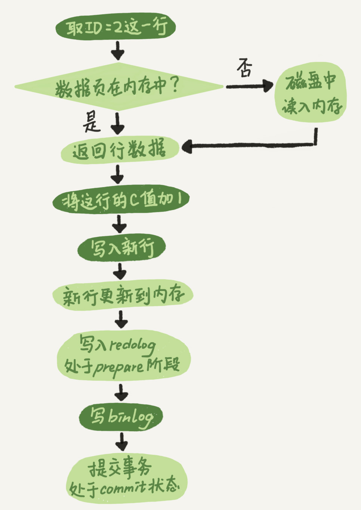
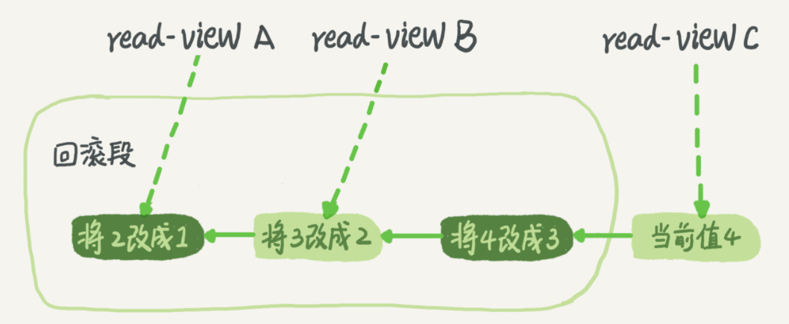
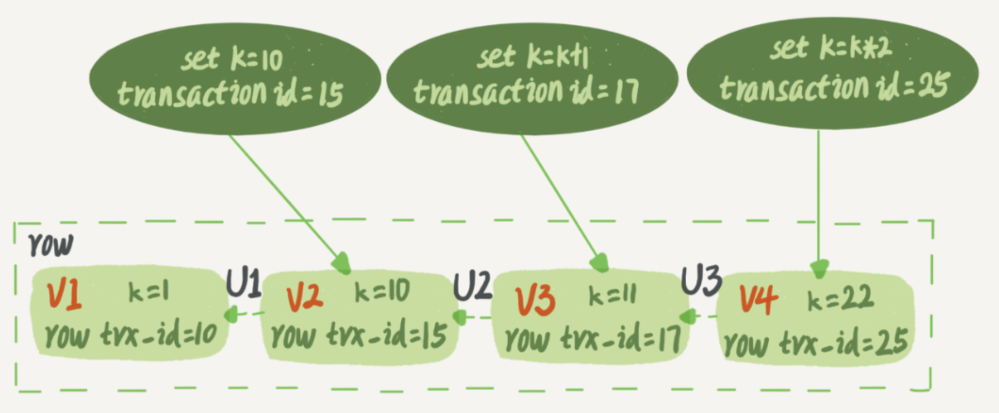

# MySQL笔记

## SQL执行流程

- Server层：包括连接器、查询缓存、分析器、优化器、执行器等，所有内置函数、存储过程、触发器、视图等也在该层
- 存储引擎层：负责数据存储和提起，其架构是插件式的，支持InnoDB、MyISAM、Memory等存储引擎

### 连接器

当建立连接时，连接器会到权限表中查出你拥有的所有权限，之后的该连接中的所有权限判断都依赖于刚刚读取到的权限，因此当更新权限后需要建立新的连接才能起效

建立连接的过程通常比较复杂，所以减少连接动作，尽量使用长连接(连接成功后，如果客户端持续有请求，则一直使用同一连接)

### 查询缓存

查询缓存指之前执行过的语句及其结果可能会以key-value对的形式，被直接缓存在内存中。key是查询的语句，value是查询的结果。如果你的查询能够直接在这个缓存中找到key，那么这个value就会被直接返回给客户端

**但大多数情况下不建议使用查询缓存**，因为查询缓存失效特别频繁，只要对表进行了更新，该表的所有查询缓存都会被删除，可能前面好不容易存下来的查询缓存还没用就被删除了，反而更浪费性能

在MySQL 8.0版本直接将查询缓存的整块功能删掉了

### 分析器

先做词法分析，例如`SELECT`等关键词，还有表名和列名

再做语法分析，判断输入的语句是否满足语法

### 优化器

在正式执行之前，MySQL会就索引的选择(当存在多个索引时)，表的连接顺序(多表做join时)等做出选择，从众多的选择中选择一个

### 执行器

在执行前要先判断一下对这张表是否有操作权限(由于某些触发器会在执行时才知晓具体的表，因此无法在优化器前做权限检查)

执行器就会根据表的引擎定义，去使用这个引擎提供的接口，例如调取InnoDB引擎接口获取这个表的第一行

## bin log和redo log日志模块

### redo log

redo log是InnoDB的，其记录了该行所在页做了什么改动，其作用是由于日志先被写入，使得写入磁盘的动作可以延迟(这就是MySQL中常说的WAL技术(Write-Ahead Logging))

虽然redo log的日志记录是需要立即写入磁盘的，但是由于redo log是一次**顺序**磁盘读取，而数据写入往往是多次磁盘的**随机**写入(因为需要维护索引)。并且此后将内存中的脏数据写入磁盘时将多次的单独写入变成了批量的一次写入

InnoDB的redo log大小是固定的，循环写入。write pos是当前记录的位置，checkpoint是当前要擦除的位置，两者之间的空间是可用的，当write pos追上了checkpoint，就让checkpoint向后推进擦除一部分数据

有了redo log，InnoDB就可以保证即使数据库发生异常重启，之前提交的记录都不会丢失，这个能力称为crash-safe

### bin log

MySQL整体来看有两层，引擎层中InnoDB引擎负责管理redo log，而在Server层也有自己的日志，称为bin log(归档日志)

起初MySQL自带的引擎是MyISAM，但MyISAM是不具备crash-safe的能力的，bin log只提供归档功能，InnoDB发现只依靠bin log无法提供crash-safe功能，因此引入了redo log来实现crash-safe功能

### 两个日志模块差异

- redo log是InnoDB引擎特有的；bin log是MySQL的Server层实现的，所有引擎都可以使用
- redo log是物理日志，记录的是在某个数据页上做了什么修改；bin log是逻辑日志，记录的是这个语句的原始逻辑，比如给ID=2这一行的c字段加1
- redo log是循环写的，空间固定会用完；bin log是可以追加写入的。追加写是指bin log文件写到一定大小后会切换到下一个，并不会覆盖以前的日志

### 两个记录模块记录流程

首先来看一下update操作时bin log和redo log的记录流程，浅色表示在InnoDB中执行，深色表示在执行器中执行

可以发现在最后三步中将redo log拆分为了prepare和commit两个阶段，这里的commit不是指事务的commit，而是确保redo log和bin log同时写入的一个步骤(可以理解为redo log有prepare和commit两个状态，其作用和事务相同)。其作用是为了防止使用bin log恢复数据库的状态和现有数据库状态不一致

- 先写redo log后写bin log：redo log写入后即使数据库奔溃，数据也能正常恢复进数据库，但是当通过bin log恢复数据库时，由于bin log未被写入，因此恢复出来的数据库会比现有数据库状态少上那一条
- 先写bin log后写redo log：当通过bin log恢复数据库时，未被持久化到数据库的数据也会被恢复(redo log没写入，因此数据库没有这条数据)

### 异常重启与两个日志

1. 在写入redo log 处于prepare阶段之后、写binlog之前发生崩溃

此时redo log还未提交，bin log还没写入。在恢复时，这个事务会回滚，而bin log没写，因此也不会传到备库

2. 在bin log写完，redo log还没commit前发生奔溃

此时bin log是完整的，而redo log处在完整的prepare阶段。在恢复时，直接提交事务

### 崩溃恢复时的判断规则

- 如果redo log里面的事务是完整的，也就是已经有了commit标识，则直接提交
- 如果redo log里面的事务只有完整的prepare，则判断对应的事务bin log是否存在并完整，完整就提交，不完整就回滚

### 两个日志关联

它们有一个共同的数据字段，叫XID。崩溃恢复的时候，会按顺序扫描redo log：

- 如果碰到既有prepare、又有commit的redo log，就直接提交
- 如果碰到只有parepare、而没有commit的redo log，就拿着XID去bin log找对应的事务

## 浅讲事务隔离级别

- 读未提交：一个事务还没提交时，它做的变更就能被别的事务看到。 -- 脏读
- 读提交：一个事务提交之后，它做的变更才会被其他事务看到。  -- 不可重复读
- 可重复读：一个事务执行过程中看到的数据，总是跟这个事务在启动时看到的数据是一致的。当然在可重复读隔离级别下，未提交变更对其他事务也是不可见的。 -- 幻读
- 串行化：顾名思义是对于同一行记录，“写”会加“写锁”，“读”会加“读锁”。当出现读写锁冲突的时候，后访问的事务必须等前一个事务执行完成，才能继续执行。

依次分析四种隔离界比在以上流程中的值：
- 读未提交：则V1的值就是2。这时候事务B虽然还没有提交，但是结果已经被A看到了。因此，V2、V3也都是2。
- 读提交：则V1是1，V2的值是2。事务B的更新在提交后才能被A看到。所以， V3的值也是2。
- 可重复读：则V1、V2是1，V3是2。之所以V2还是1，遵循的就是这个要求：事务在执行期间看到的数据前后必须是一致的。
- 串行化：则在事务B执行“将1改成2”的时候，会被锁住。直到事务A提交后，事务B才可以继续执行。所以从A的角度看， V1、V2值是1，V3的值是2。

在MySQL中配置启动参数`transaction-isolation`来设定需要的隔离界别，默认是`Repeatable Read`

### 可重复读的实现

在MySQL中，实际上每条记录在更新的时候都会同时记录一条回滚日志(undo log)。记录上的最新值，通过回滚操作，都可以得到前一个状态的值

因此在将一个值从1改到2、3、4，在MySQL中会记录如下的一个回滚日志

在前面说明了可重复读中每次启动事务都会新建一个视图，该事务中所有数据都是根据这张视图来的，这也就是俗称的多版本并发控制(MVCC)。
在将值修改的过程，其他事务运行时会对应不同的视图，比如这里的read-view A或者read-view B，其对应的值也不一样，当另一个事务获取read-View A中的值时，MySQL会通过回滚日志，将现在表里的4回滚到1，从而保证另一个事务在整个过程中获取到的都是同一个视图中的值

我们可以发现在一个事务中将会记录对数据库的任何操作的回滚日志，而这些回滚日志只有到这个事务提交后才会被删除(尤其在MySQL5.5之前，回滚日志会被保存到ibdata中，即使事务提交文件大小也不会改变)，因此如果使用长事务，MySQL就不得不保存大量的回滚日志，从而造成数据库奔溃，所以不推荐使用长事务

关于事务启动：
- 显示启动事务，使用`begin`或者`start transaction`，然后使用`commit`提交事务或者`rollback`回滚事务
- 当`set autocommit = 0`时会关闭自动提交，此时任意执行一条语句事务就启动了，并且不会被提交，直到显示使用`commit`或`rollback`
- 因此推荐`set autocommit = 1`打开自动提交

### 更多

- **InnoDB支持RC和RR隔离级别都是通过一致性视图(consistent read view)实现的**，[详细解释会在后面介绍](#锁和事务)
- [可能更为详细的隔离级别笔记](../四种隔离级别.md)

## 浅讲索引

### 三个常见索引模型

- 哈希表：以key-value形式存储，通过哈希函数计算出key，当key重复时以链表形式向后追加
  - 优点：由于无需关心排序，因此插入很快，只需往后添加
  - 缺点：不具备范围索引，因此区间索引时要遍历整张表
  - 使用场景：适用于只有等值查询的场景
- 有序数组：按key顺序存储
  - 优点：key是有序排列的，通过二分查找法在等值查询和范围查询场景中的性能就都非常优秀
  - 缺点：当插入值时，需要将该key后的所有元素后移，耗费性能
  - 使用场景：适用于静态存储引擎，即数据存储后不再改变
- B+树：B+树比二叉树在每一层有更多的节点，从而使得从磁盘中读取数据块的次数减少，减少IO操作，加快查询速度
  - [B+树详解](../../data-structure/B树和索引.md)

在MySQL中，索引是在存储引擎层实现的，所以并没有统一的索引标准，即不同存储引擎的索引的工作方式并不一样

### 索引维护

在[B+树详解](../../data-structure/B树和索引.md)中可以知道在B+树中插入数据时，如果该页已经满了(即新插入的索引在两个现有索引之间)，那么就要申请一个新的页，并复制一般的数据，这个过程叫做页分裂，这毫无疑问会造成性能损失

怎么才能减少页分裂呢？如果我们的索引是递增的，那么数据的写入就都是追加，不会造成申请新的页的页分裂过程，并且InnoDB中辅助索引的B+树中记录的是主索引的值，因此主索引长度越小，辅助索引的B+树占用的空间也越小，总结就是**从性能和存储空间方面考量，自增主键往往是更合理的选择**

重建索引：
- 重建普通索引：索引可能因为删除，或者页分裂等原因，导致数据页有空洞，重建索引的过程会创建一个新的索引，把数据按顺序插入，这样页面的利用率最高，也就是索引更紧凑、更省空间
- 重建主索引：不论是删除主键还是创建主键，都会将整个表重建，消耗大

### 覆盖索引

如果查询条件使用的是普通索引(或是联合索引的最左原则字段)，查询结果是联合索引的字段或是主键，不用回表操作，直接返回结果，减少IO磁盘读写读取正行数据

例如一张表，自增id做为主键，身份证字段作为索引，此时如果需要通过身份证查询姓名的话，需要在辅助索引中先找到id，再在主索引中找到具体数据，经历了一次回表。但如果创建了(身份证，姓名)的联合索引时，只需要在辅助索引中找到该数据，它的索引中已包括了姓名，从而不需要了回表操作，减少性能浪费

数据量很大的时候，辅助索引比主键索引更快，这正是利用了覆盖索引的特效，否则还是需要回表操作

### 最左前缀原则

B+树这种结构中索引项是按照索引定义里面出现的字段顺序排序的，因此可以使用最左前缀原则来定位记录

在索引维护中举的例子中，创建的(身份证)的普通索引是可以通过最左前缀原则的(身份证，姓名)的普通索引实现的，此外`like`关键词查找身份证以某些数字开头的记录时，也可以通过最左前肢原则使用索引

考虑到最左前缀原则，因此在创建联合索引时字段的顺序也很重要：
- 将高频的单个索引可以作为联合索引的第一个字段，比如(身份证，姓名)索引就可以代替了(身份证)索引
- 当联合索引中多个字段都需要当作独立索引时，应将占用空间小的字段作为单独索引，减少空间

### 索引下推

在上个例子中(身份证，姓名)索引中，如果要查询`身份证 like '310%' and 姓名 = '张三'`，身份证这个字段可以使用最左前缀原则利用索引查询，但是在MySQL5.6之前，对姓名字段的判断就必须通过回表操作找到主索引中记录进行判断，但在MySQL5.6之后，可以在索引遍历过程中，对索引中包含的字段先做判断，直接过滤掉不满足条件的记录，减少回表次数，在这里姓名字段的判断也可以在普通索引中完成了，不再需要进行回表操作

## 浅讲锁

### 全局锁

在MySQL中使用Flush tables with read lock (FTWRL)添加全局锁，此时整个库处于只读状态的时候

**全局锁的典型使用场景是，做全库逻辑备份**，虽然FTWRL提供了全局锁，但是还是存在问题：
- 如果你在主库上备份，那么在备份期间都不能执行更新，业务基本上就得停摆
- 如果你在从库上备份，那么备份期间从库不能执行主库同步过来的binlog，会导致主从延迟

最关键的就问题就在于备份与数据更新无法同时进行，因此就需要一致性视图，这里就可以在可重复读隔离级别下开启一个事务。官方自带的逻辑备份工具是mysqldump。当mysqldump使用参数–single-transaction的时候，导数据之前就会启动一个事务，来确保拿到一致性视图。而由于MVCC的支持，这个过程中数据是可以正常更新的

虽然一致性视图解决了备份和数据更新无法同时进行的问题，但是这个隔离级别是由InnoDb这个引擎实现的，single-transaction方法只适用于支持事务的引擎，因此MyISAM就无能为力了，只能使用FTWRL了

为什么不使用set global readonly=true方式来开启全库只读
- 在有些系统中，readonly的值会被用来做其他逻辑，比如用来判断一个库是主库还是备库
- 如果执行FTWRL命令之后由于客户端发生异常断开，那么MySQL会自动释放这个全局锁，整个库回到可以正常更新的状态。而将整个库设置为readonly之后，如果客户端发生异常，则数据库就会一直保持readonly状态，这样会导致整个库长时间处于不可写状态

### 表锁

MySQL里面表级别的锁有两种：一种是表锁，一种是元数据锁（meta data lock，MDL)

#### 1. 表锁

使用`lock tables … read/write`创建表锁，其会在客户端断开连接后自动释放，也可以`unlock tables`主动释放

注意：这里的表锁除了会限制别的线程的读写外，也限定了本线程接下来的操作对象，比如对t1加锁，别的线程不能访问t1，而该线程也只能访问t1

在没有更细粒度的锁之前，表锁是最常用的处理并发的方法

#### 2. MDL

MDL是用来保证读写的正确性，防止一个线程查询数据时，另一个线程在改变数据结构，从而导致查询到的结果与数据结构不匹配

在MySQL 5.5版本中引入了MDL，MDL不需要显式使用，在访问一个表的时候会被自动加上。当对一个表做增删改查操作的时候，加MDL读锁；当要对表做结构变更操作的时候，加MDL写锁
- 读锁之间不互斥，因此你可以有多个线程同时对一张表增删改查
- 读写锁之间、写锁之间是互斥的，用来保证变更表结构操作的安全性。因此，如果有两个线程要同时给一个表加字段，其中一个要等另一个执行完才能开始执行

但要注意：当显示开启事务后，MDL锁直到被显示提交或回滚才会被释放，因此当这个事务中语句执行完成但未提交，这时其他线程修改数据结构尝试加写锁就会一直被阻塞，而同时后面的线程尝试加读锁也会因为前面的写锁被阻塞从而也被阻塞

### 行锁

MySQL行锁是由引擎实现的，InnoDB引擎支持行锁而MyISAM引擎就不支持行锁。不支持行锁意味着并发控制只能使用表锁，对于这种引擎的表，同一张表上任何时刻只能有一个更新在执行，这就会影响到业务并发度

#### 两阶段锁

在InnoDB事务中，行锁是在需要的时候才加上的，但并不是不需要了就立刻释放，而是要等到事务结束时才释放

例如一个事务中`update where id = 1`的语句已执行完成，但事务还未提交，此时另一个事务尝试`update where id = 1`的记录时由于前一个还未提交的事务还持有着`id = 1`的行锁，因此该事务被阻塞，因此如果你的事务中需要锁多个行，要把最可能造成锁冲突、最可能影响并发度的锁尽量往后放

**在事务中，更新操作放在后面会更少影响锁的等待时间**

### 死锁

当并发系统中不同线程出现循环资源依赖，涉及的线程都在等待别的线程释放资源时，就会导致这几个线程都进入无限等待的状态

#### 解决死锁

- 通过参数`innodb_lock_wait_timeout`根据实际业务场景来设置超时时间，InnoDB引擎默认值是50s
- 发起主动死锁检测，发现死锁后，主动回滚死锁链条中的某一个事务，让其他事务得以继续执行。将参数`innodb_deadlock_detect`设置为 on，表示开启这个逻辑（默认是开启状态）

#### 解决热点行更新

热点行更新指每个新来的线程都需要判断是否其会造成死锁，当多个线程同时对同一行做更新时会消耗大量CPU资源

- 如果你能确保这个业务一定不会出现死锁，可以临时把死锁检测关闭掉。一般不建议采用
- 控制并发度，对应相同行的更新，在进入引擎之前排队。这样在InnoDB内部就不会有大量的死锁检测工作了
- 将热更新的行数据拆分成逻辑上的多行来减少锁冲突，但是业务复杂度可能会大大提高

**InnoDB行级锁是通过锁索引记录实现的，如果更新的列没建索引是会锁住整个表的**

## 锁和事务

前面介绍了两段锁、行锁、隔离级别还有一致性视图，在这里会把它们都串起来

首先建表，使用InnoDB引擎，且处于可重复读的隔离模式，有初始数据(id = 1, v = 1)

| 事务A | 事务B | 事务C |
| :-: | :-: | :-: |
| start transaction with consistent snapshot |  |  |
|  | start transaction with consistent snapshot |  |
|  |  | update t set v = v + 1 where id = 1 (v = 2) |
|  | update t set v = v + 1 where id = 1 (v = 3)  |  |
|  | select v from t where id = 1 (v = 3) |  |
| select v from t where id = 1 (v = 1) |  |  |

首先奇怪的是为什么两个`select`出来的值是不一样的，在解释这个之前先注意一下事务的启动时机，`begin/start transaction`不是一个事务的起点，只有其中的第一条语句执行时才是真正启动的时间点，因此如果需要事务立即启动需要使用`start transaction with consistent snapshot`

在可重复读的隔离级别下，事务在启动时就对**整个库**做了个快照，这里的快照不是将数据库所有的内容都复制了一份，而是通过[undo log实现](#可重复读的实现)的，因此整个库的修改对于该事务都是不可见的

### MVCC

一致性视图使用MVCC(多版本并发控制)实现的，那么事务是怎么实现的MVCC呢？

1. 每个事务都有一个事务ID,叫做`transaction id`，且严格递增
2. 在事务启动时将所有此时活跃的事务(已创建但还未提交的事务)的`transaction id`添加进该事务的一个数组内，当前事务的`transaction id`也在其中
3. 数据库中的每行数据也都是有多个版本的，因此在数据更新时都会生成一个新的数据版本，并将`transaction id`赋值给这个数据版本的事务id，记作`row trx_id`

在上图中深绿色框代表事务，其对应的数据版本的`row trx_id`就是由该事务的`transaction id`赋值的，因此两者是相同的。在多个数据版本中只有最后一个(V4)是实际存储在数据库中的，其余都是通过`undo log`实现的(`undo log`对应图中的虚线)，当查询的数据版本不是最新的时，会通过`undo log`生成前一个数据版本

4. 在事务开始时，会将此时活跃的所有事务(已创建但还未提交)的`transaction id`添加到该事务的一个数组中，且当前事务也在其中

- 低水位：数组中的最小值
- 高水位：数组中的最大值 + 1

5. 当一个事务要查看某个数据时，首先需要与该事务中的数组做比较

首先将当前事务的`transaction id`和最新的数据版本的`row trx_id`做对比，如果符合则返回，不符合则通过`undo log`找到前一个数据版本，再做比较

- `低水位 >= transaction id`表示该数据版本在事务前已被提交，该数据可用，相等的情况表示该数据版本是该事务提交的，因此可用
- `高水位 < transaction id`表示该数据版本是在事务启动后才被更新，该数据不可用
- `低水位 < transaction id <= 高水位`此时判断该事务是否在该事务的数组中，在表示不可用，不在表示可用(出现这种情况的原因是可能在该事务开启前的事务有些很快提交了，而有些一直未提交)

**以上三条总结而言就是在该事务开启之前已提交的事务数据是可用的**

6. 注意：更新数据都是先读后写的，而这个读，只能读当前的值，称为当前读(current read)，这是因为防止更新丢失

在前面的例子中事务C更新了`v = 1 + 1`，虽然此时事务B读到的`v = 1`，但是更新是当前读，所以事务B更新的是`v = 2 + 1`，如果事务B是更新其读到的值`v = 1 + 1`，最后两个事务执行完做了两次`+1`操作，最后返回的却是`v = 2`，造成了更新丢失，因此必须使用当前读来解决更新丢失问题

7. 注意两段锁的应用：此处事务B可以更新`id = 1`的数据是因为事务C已提交了事务，从而释放了`id = 1`的写锁，但如果事务C不提交，则事务B的更新操作将被阻塞

### RR和RC

可重复读和提交读都是通过一致性视图实现的

- 可重复读(RR)：在事务开启时创建一致性视图，该事务所使用的所有数据都来自于此时的一致性视图
- 提交读(RC)：在每个语句执行前创建一致性视图，该语句用到的数据都来自于该语句创建的一致性视图

### 相同的更新

当给一个`(id = 1, a = 2)`的执行更新语句`update T set a = 2 where id = 1`时，MySQL不会因为更新的a的值和原先a的值相同而不更新，而是会老老实实的执行，该加锁的加锁，该更新的更新

MySQL这里很傻的更新了相同的值，这是因为MySQL这里无法判断a = 2，只能得到id = 1，因此如果`update T set a = 2 where id = 1 and a = 2`，此时将不会执行

## 再谈索引

### 普通索引和唯一索引

首先先确定一下概念：除了主索引以外都叫做普通索引，因此唯一索引也是一种普通索引，所以普通索引和唯一索引都需要访问两颗树才能找到数据

#### 查询过程中普通索引和唯一索引性能几乎相同

以查询(k = 5)为例，k不是主键

- 唯一索引：查询到满足条件k = 5后，由于唯一索引保证了不存在其他满足条件的数据，因此可以直接返回
- 普通索引：查询到满足条件的k = 5后再查看下一个数据是否满足k = 5，直到遇到不满足的。由于磁盘是一页页读的，而连续的数据都是存储在同一页上的，所以查看下一条数据往往只是内存中的一次查询，几乎不损耗性能

#### 更新过程中普通索引会比唯一索引有更好的性能

- 当待更新的数据已在内存中时，直接修改内存值即可。而唯一索引也仅须再在内存中判断一下索引是否唯一，内存中的操作开销可忽略不计，因此此时性能几乎相同
- 当待更新的数据不在内存中时，唯一索引由于需要判断索引是否唯一，因此必须将数据载入到内存中，而普通索引可以将更新写入[change buffer](#change-buffer)从而避免一次磁盘读取，因此此时普通索引的性能更好

不论待更新的数据在不在内存中，都需要记录redo log，不同的是在内存中时记录的是数据页的变换，而不在内存中时记录的是对change buffer进行了操作

由于`change buffer`中的记录会在后台或者读取数据时写入，因此如果是读多写少或者写后就立即读的数据库，往往刚刚写入change buffer就要被持久化，不但无法减少磁盘操作，还白白管理`change buffer`，因此`change buffer`更适用于写多读少的数据库

#### change buffer

在MySQL5.5之前，只针对insert做了优化，叫插入缓冲(insert buffer)；现在对delete和update也有效，叫做写缓冲(change buffer)

change buffer应用在非唯一普通索引页(non-unique secondary index page)不在缓冲池中，对页进行了写操作，并不会立刻将磁盘页加载到缓冲池，而仅仅记录缓冲变更，等未来数据被读取时，再将数据合并(merge)恢复到缓冲池中的技术。change buffer的目的是降低写操作的磁盘IO，提升数据库性能

在MySQL后台会将change buffer里相应的数据持久化到ibdata

使用change buffer机制是不会造成数据库异常导致数据丢失的，虽然是只更新内存，但是在事务提交的时候，我们把change buffer的操作也记录到redo log里了，所以崩溃恢复的时候，change buffer也能找回来

merge的执行流程:

1. 从磁盘读入数据页到内存（老版本的数据页）
2. 从change buffer里找出这个数据页的change buffer 记录(可能有多个），依次应用，得到新版数据页
3. 写redo log。这个redo log包含了数据的变更和change buffer的变更

#### change buffer和redo log

- 所有更新操作都必须立刻写入redo log进行持久化；只有非唯一普通索引的更新，且数据页未加载到内存时才写入change buffer，并且redo log还需写入
- redo log在磁盘中的，所有记录都必须立刻写入磁盘；change log是在内存中的，只是在后台会将其持久化到磁盘
- redo log将随机写记录到磁盘中的IO操作转成顺序写入redo log中；change buffer将随机读磁盘的指定记录的IO操作转为先写入内存，后批量写入

### 错选索引

在优化器中MySQL会自动选择语句执行使用的索引，但有时候会选错索引导致语句执行缓慢

#### 优化器是怎么挑选索引的

优化器通过扫描行数、临时表、是否排序等因素进行综合判断

使用explain查询语句中的rows代表着MySQL预计的扫描行数，扫描行数越小代表访问磁盘的数据量和次数也越少

#### 举个例子

首先创建一张(id, a, b)的表T，其中包含(0, 0, 0)到(10W, 10W, 10W)的数据，且id，a，b都建了索引

| 事务A | 事务B | 事务C |
| :-: | :-: | :-: |
| | | select * from t where a between 10000 and 20000 |
| start transaction with consistent snapshot | |
| | delete from T | |
| | 重新插入0-10W的数据 | |
| | select * from t where a between 10000 and 20000 | |
| commit | | |

当使用explain查询事务C中的select语句能发现使用的是索引a，预计rows为1W，表示通过索引a扫描1W行，毫无疑问优化器选择是正确的 

但当有了事务A后，事务B执行相同的select语句却使用了索引id，扫描的行数为10W。

首先使用`explain`来看一下使用id索引和a索引扫描的行数，可以发现id索引扫描行数为10W(扫描整表)，a索引扫描行数为3W([为什么是3W](#为什么需要事务A))，而使用a索引还需要再到主索引树中找到具体数据，因此还有额外代价，因此MySQL权衡后选择了使用id索引

此时使用`analyze table T`来重新统计索引，即可让MySQL作出正确判得到a索引的扫描行数为1W

> 在使用`show index`查看表索引信息时基数(cardinality)字段表明索引的区分度，区分度越大越好。基数不是通过遍历整个索引树，而是随机选择N个数据页，计算平均值后乘以总页数得到基数。基数在数据库更新到超过一定行后触发重新做一次索引统计

#### 为什么需要事务A

当没有事务A时事务B中的select语句和事务C中预计的rows是一样的1W，这是因为MySQL是使用标记删除来删除记录的,并不从索引和数据文件中真正的删除。如果delete和insert操作之间间隔较小，change buffer还没来得几merge记录，此时如果主键相同，新插入的数据会沿用删除前的记录空间，由于数据量相同所以预计的rows也相同

而当有事务A时，为了保证事务A的一致性视图，所以事务B添加时不再能够使用原本删除的空间，只能另起空间，所以虽然delete删除了数据但未释放空间，而insert又新增了空间，导致a索引树上数据就变成了两份，因此此时事务B的预计rows变成3W

只要避免长事务就可以避免这种索引统计错误(因为事务A就是长事务)

#### 再举个例子

`select * from t where (a between 1 and 1000) and (b between 50000 and 100000) order by b limit 1`

理论上使用a索引只要扫描1千条(0~1000)，而b索引则需要5W(50000～100000)，但是MySQL会选择使用b索引，因为这里有个`order by b`，b索引中已经按b做了排序，所以MySQL认为使用b索引性能更好

这里可以使用`order by b, a`这种巧妙的方法来让MySQL使用a索引，因为a，b都需要排序，那么MySQL就会选择扫描行数最少的索引了

#### 总结一下解决方法

- 使用`analyze table T`让MySQL重新统计索引
- 使用`force index(I)`来强行使用指定索引
- 新增或重建索引

### 字符串索引

#### 前缀索引

在为字符串建立索引时，由于字符串过长(比如身份证)可能导致索引占用过大的空间，此时可以使用前缀索引来节省空间，且又不用额外增加太多的查询成本

使用`index index_name(column_name(number))`创建前缀索引，`number`为截取该字段前`number`个字符作为索引

索引区分度越高越好，因此在确定前缀索引的长度时可以使用`count(distinct left(column_name, number))`来查看不同长度下的区分度

#### 前缀索引会影响覆盖索引

本来是可以使用覆盖索引优化查询的，但是前缀索引导致了该索引字段必须进主索引进行一次查询，因此覆盖索引失效了

#### 其他优化

- 倒序索引：某些字段起尾部区分度大，此时可以使用`reverse()`为该字段的尾部创建索引
- 新增hash字段作为索引：在表上再创建一个整数字段代替字符串作为索引，使用`crc32()`来得到一个4字节的字符串，虽然减少了索引空间，但增加了数据空间

以上两种方法都不再能够进行范围查询了，因为索引和字段并不再前缀匹配了

## SQL语句为什么变"慢"了

为什么一句SQL语句会突然变慢，这很有可能是在刷脏页(flush)

### 脏页与干净页

- 脏页：内存数据页跟磁盘数据页内容不一致(WAL机制导致的)
- 干净页：内存和磁盘上的数据页的内容就一致

### 引发flush的4种情况：

- 由于redo log的大小是固定的，因此当redo log存满时，数据库必须停下来等待清除一部分redo log，对应的就是将一部分脏页持久化到磁盘
- 由于机器内存有限，会存在需要新的内存页加载数据时内存满了，因此空出一部分内存页，如果被空出的是脏页，那么就要将这脏页持久化到磁盘
  - 为什么不能直接空出脏页，等待redo log来持久化：这是为了保证无论从内存中还是磁盘中取出的数据一定是正确的
- MySQL在空闲时安排flush掉脏页
- MySQL正常关闭时也会将内存中所有脏页都flush到磁盘中

在以上4种情况中，前两个对性能影响较大

1. redo log写满了，要flush脏页：这种情况是InnoDB要尽量避免的。因为此时系统不再能接受更新，所有更新都被堵塞了
2. 内存不够用了，要先将脏页写到磁盘：这种情况其实是常态。InnoDB用缓冲池(buffer pool)管理内存，有未使用页、干净页、脏页。当内存满了时会选择最久不使用的数据页来空出

### InnoDB控制脏页

虽然刷脏页是常态，但当一次查询需要空出太多脏页当数据页还是redo log满了清除时脏页的持久化都会造成性能问题，因此InnoDB有一套脏页的控制机制

`innodb_io_capacity`：告诉InnoDB机器的磁盘能力，建议设为磁盘的`IOPS`，因为如果设定过小会导致InnoDB误认为机器磁盘能力很差，从而放慢刷脏页的频率，从而造成脏页累计

`innodb_max_dirty_pages_pct`：设定脏页所占比例上限(默认值75%)。InnoDB通过该参数和redo log的写盘速度计算的数值来控制刷脏页的速度

此外，InnoDB还会通过`innodb_flush_neighbors`该参数来设定刷脏页时是否把相邻的脏页也一起flush了(0表示不刷相邻的只刷自己的)。在机械磁盘中可以减少很多随机IO操作，但是在固态硬盘中IOPS不再是瓶颈，而一次只刷自己能更快完成flush操作，减少SQL语句响应时间。在MySQL 8.0中，`innodb_flush_neighbors`参数的默认值已经是0了

## 为什么删除了数据而表大小不变

当delete了一大部分的记录后，表文件的大小并不会发生变化

这是因为MySQL中delete的记录仅会被标记为删除，空间可复用，但实际数据空间并没有被回收
- 记录复用：某条记录被删除后，如果再插入主键相同的记录则可以复用标记为删除的记录
- 数据页复用：当一个数据页中所有记录都被标记为删除后，该数据页是可复用的，可在其中插入任何数据

删除数据会造成数据页空洞，当然插入也会造成(具体可以查看B+树的插入过程)，因此要在delete后使得表占用空间大小减少，就必须消除这些空洞

### 重建表

使用`alter table T engine = InnoDB`来重建表，从而释放掉空洞，实现空间上的删除

当原表数据本来就没有是什么空洞，此时重建表表空间反而会增大，这是因为重建表的时候，InnoDB不会把整张表占满，每个页留了1/16给后续的更新用，因此重建表之后不是“最”紧凑的

1. MySQL5.5版本之前

MySQL会自动新建一个与原表结构相同的临时表，然后按照主键递增的顺序，把数据一行一行地复制到临时表中，最后交换表名并删除旧表

在整个重建表过程中一直持有MDL写锁

整个过程都在MySQL的Server层进行的

通过将所有数据移动到临时表替换原表实现

2. MySQL5.5版本之后

在5.5之前的重建表过程中是不能更新数据的，因为更新的内容会丢失，因此5.6中引入了Online DDL，使得重建表过程中也能够更新

首先扫描原表中的主键数据页，并以B+树形式拷贝到临时文件中，在拷贝过程中将所有对原表的更新操作记录在row log中，在拷贝完成后将row log中操作应用到临时文件上，最后再用临时文件替换原表数据文件，删除旧表操作

在Online DDL中扫描主键数据页后就将MDL写锁降级为MDL读锁，因此不会阻塞更新操作
- 不直接释放MDL写锁的原因：防止其他线程对这个表做DDL操作
- 拷贝数据到临时文件中是最耗时的操作，因此MDL写锁在这之前降级

整个重建表的过程都是在InnoDB引擎中完成的，不涉及到Server层

通过临时文件替换原表数据文件实现，并没有把数据从一张表移到另一张表，因此是Inplace原地操作

### Online和Inplace

- 不影响更新操作的就是Online
- 在Server层没有新建临时表的就是Inplace

因此MySQL5.5之后的重建表就刚好是Online并且是Inplace的

## count(*)

### count(*)实现方式

- MyISAM引擎把一个表的总行数存在了磁盘上，因此执行count(*)的时候会直接返回这个数，效率很高，但如果添加了where条件也不能返回的这么快
- InnoDB引擎中由于支持了MVCC，其对于每个事务该返回多少行也不确定，它执行count(*)的时候，需要把数据一行一行地从引擎里面读出来，然后累积计数

由于无论主索引还是普通索引行数是相同的，而主索引因为还要存储记录具体信息，数据量比普通索引要大，因此在保证逻辑正确的前提下，InnoDB引擎会选择数据量最少的来扫描，也就是往往会选择普通索引来作为扫描对象

### 不同的count用法

1. count(主键id)

InnoDB引擎遍历整张表，把每一行的id值都取出来，返回给Server层。Server层拿到id后，判断是不可能为空的，按行累加

2. count(1)

InnoDB引擎遍历整张表，但不取值。server层对于返回的每一行，放一个数字“1”进去，判断是不可能为空的，按行累加

对比count(主键)来说，其不用从数据行中解析主键id并拷贝到Server层，因此速度更快

3. count(字段)

InnoDB引擎遍历整张表，把每一行的该字段解析出来并返回给Server层。Server层拿到字段值后，如果该字段是not null的，判断是不可能为空的，按行累加，如果是可以为null的，就还要在将该字段值取出来再做判断，不是null才累加

4. count(*)

InnoDB对于count(*)并不会把全部字段取出来，而是专门做了优化，不取值，因为count(*)肯定不是null，直接按行累加

总结：

count(字段) < count(主键id) < count(1) ≈ count(*)

count(字段)不包含该字段为null的行，而其余的都包含为null的行

优化器只对count(*)进行了优化，对于其他那些一定为非空的并没有做优化，因此在使用时尽量使用count(*)

## order by

在使用`explain`命令查看执行情况中`extra`字段中`Using filesort`表示是需要排序的。MySQL会给每个线程分配一块内存用于排序，称为`sort_buffer`

接下来以`select id, name, age, school from student where age = 18 order by name limit 10000`举例

### 全字段排序

1. 初始化sort_buffer，确定放入id, name, age, school四个字段
2. 从age索引中找到满足age = 18条件的主键id
3. 到主索引中通过id取出整行，并取出id, name, age, school四个字段放入sort_buffer
4. 从age索引中取下一个记录的主键id
5. 重复3，4步直到age不满足18的条件(如果不存在age索引，就遍历整个主索引，找到满足条件的记录放入sort_buffer)
6. 对sort_buffer中的数据按照字段name做快速排序
7. 按照排序结果取前10000行返回给客户端

内存中的sort_buffer大小是有限的(通过`sort_buffer_size`设定)，当sort_buffer无法一次性载入所有待排序的数据时，就需要使用到临时文件。MySQL将需要排序的数据分成12份(`number_of_tmp_files`)，每一份单独排序(归并排序)后存在这些临时文件中,然后把这12个有序文件再合并成一个有序的大文件

### row id排序

在全字段排序中，可能数据行数并不大，但是由于每条记录的字段过多，导致单行过长，使得在sort_buffer中存储的记录就变得很少

`max_length_for_sort_data`参数是MySQL中专门控制用于排序的行数据的长度的，如果单行的长度超过这个值，MySQL就认为单行太大，替换为row id排序，即在sort_buffer中只保存主键id和待排序字段

1. 初始化sort_buffer，确定放入两个字段，即name和id(只保存主键id和待排序字段name)
2. 从age索引中找到满足age = 18条件的主键id
3. 到主索引中通过id取出整行，并取出id, name两个字段放入sort_buffer
4. 从age索引中取下一个记录的主键id
5. 重复3，4步直到age不满足18的条件(如果不存在age索引，就遍历整个主索引，找到满足条件的记录放入sort_buffer)
6. 对sort_buffer中的数据按照字段name做快速排序
7. 遍历排序结果，取前10000行，并按照id的值回到原表中取出id, name, age, school四个字段返回给客户端

在row id排序中会比全字段排序多一次回表查询(即第7步)

对于InnoDB表来说，row id排序会要求回表多造成磁盘读，因此不会被优先选择(后面提到的内存表中由于回表操作也是访问内存，反而选择row id排序)

MySQL是通过row id来定位一行数据的
- 对于有主键的InnoDB表来说，这个row id就是主键ID
- 对于没有主键的InnoDB表来说，其会自己生成一个长度为6字节的row id
- Memeory引擎不是索引组织表，可以理解为数组下表作为了row id
而这row id也正是row id排序的由来

### 索引排序

由于索引是一棵B+树，其本身就是递增排序的，因此如果待排序的字段存在索引，那么就无法再做排序了

首先先创建一个联合索引(age, name)，从而保证age可以通过最左前缀匹配，而name又是被排序好的
1. 从索引(age, name)中找到第一个满足条件的age = 18的主键id
2. 到主索引中通过id取出该行，并返回id, name, age, school四个字段作为结果集的一部分直接返回
3. 从索引(age, name)中取出下一个主键id
4. 重复2，3步，直到查到10000条记录或者不满足age = 18为止

还可以通过覆盖索引来进一步优化，创建(age, name, school)联合索引，省去回表查询的步骤

### 随机排序

当需要随机取出n条记录时，可以使用`order by rand()`来为所有记录进行随机排序

在进行随机排序时，MySQL不但会进行排序，还会使用到临时表。`order by rand()`使用了内存临时表，内存临时表排序的时候使用了rowid排序方法

## 逻辑相同的SQL性能却差那么大

造成性能差异的主要两方面：
1. 能走索引的却没走索引
2. 能直接返回结果的却多次回表查询记录

### 1. 索引参与了计算

举例：取id + 1 = 2的记录

`select * from T where id + 1 = 2` => 不走id索引，因为id参与了计算
`select * from T where id = 2 - 1` => 走id索引

### 2. 索引参与函数运算

对索引字段做函数操作，可能会破坏索引值的有序性，因此优化器就决定放弃走树搜索功能

举例：取第七个月的所有记录

`select * from T where month(datetime) = 7` => 不走datetime索引，因为datetime进行了函数运算
`select * from T where datetime >= '2019-7-1' and datetime <= '2019-7-31'` => 走datetime索引

### 3. 隐式类型转换

举例：id是varchar类型，取id = 100的记录

`select * from T where id = 100` => 不走id索引，其等效于`where CAST(id AS signed int) = 100`，等于是对索引进行函数运算
`select * from T where id = '100'` => 走id索引

> 如果`select '10' > 9`返回1表示将字符串转成数字进行比较，返回0则表示将数字转成字符串进行比较

### 4. 隐式字符编码转换

举例：两张表字符编码分别为utf8和utf8mb4

`select * from A, B where A.id = B.id` => 不走id索引，其等效于`where CONVERT(A.id.value USING utf8mb4) = B.id`，等于是对索引进行了函数运算
`select * from A, B where A.id = CONVERT(B.id.value USING utf8)` => 走id索引

**总结：索引字段不能进行函数操作，但是索引字段的参数可以函数操作**

### 5. 不满足最左前缀索引

举例：寻找id包含关键词的记录

`select * from T where id like '%key%'` => 不走id索引，不满足最左前缀索引
`select * from T where id like 'key%'` => 走id索引

### 6. 字段长度超过类型长度

举例：当给varchar(5)的字段查询where等于六个字符的记录

`select * from T where id = '123456'` => 其中id是varchar(5)而字符串是六位的，很明显应该返回空。但是MySQL会截取前5个字符'12345'，然后走索引回表查出具体记录，返回给Server层判断是否等于'123456'，最后返回空。当表内存在大量id = '12345'的记录时会多次回表造成耗时

## 只查一行也很慢

### 查询长时间不返回

1. 等MDL锁。其他DDL事务持有了MDL写锁又长时间不释放，而查询事务需要得到MDL读锁，从而导致长时间无法返回结果
2. 等flush。flush命令关闭数据表本来执行很快，但是其他事务一直打开着表，从而阻塞了flash操作，结果又阻塞了查询语句，导致无法返回结果
3. 等行锁。查询的记录在别的事务中被加上了行锁，在查询时使用`lock in share mode`来获取当前读(默认的快照读通过MVCC的支持，是不会被阻塞的)会被阻塞，导致无法返回结果

### 查询很慢

1. 没有走索引
2. 长事务导致某行记录存在巨大的undo log，在读取时需要依次执行undo log直到得到正确的值

## 幻读和锁

### 什么是幻读

幻读指在当前读的操作下会存在数据不一致的情况

可重复读隔离级别中的可重复读的支持是通过快照读实现的，因此存在当前读的数据不一致问题

#### 举例1

| 事务A | 事务B |
| :-: | :-: |
| begin | |
| select * from T where id = 1 => (结果为空) | |
| | insert into T (id, name) values (1, 'Alice') => (插入成功) |
| insert into T (id, name) values (1, 'Alice') => (插入失败) | |
| select * from T where id = 1 => (结果为空) | |

事务A首先查询主键为1的记录是否存在，结果返回是不存在。此时事务B插入了主键为1的记录。当事务A尝试插入主键为1的记录时发现插入失败，报错主键冲突。此时事务A再次查询发现主键为1的记录还是为空。

事务A查询主键为1的记录为空是因为是快照读，读取的事务A启动时的数据库快照，而当时是没有主键为1的记录的，因此在整个事务A中都查不到该数据。但在insert操作中是当前读，因此是读到主键为1的记录的，所以报主键冲突错。如果在事务A中尝试`select * from T where id = 1 for update`会发现是能查到主键为1的记录的，因为`for update`加锁后是当前读

#### 举例2

| 事务A | 事务B |
| :-: | :-: |
| begin | |
| select * from T where name = 'Alice' => (1, 'Alice') | |
| | insert into T (id, name) values (2, 'Alice') => (插入成功) |
| update T set name = 'Bob' where name = 'Alice' => (修改了id=1和id=2的两条) | |

事务A首先查询所有name为Alice的记录只有一条。事务B插入了一条name也为Alice的记录。此时事务A尝试将所有name为Alice的修改为Bob，按事务A查询的应该只有id=1这一条，而事实上其更了两条记录，id=1和id=2。

在事务A更新之间，事务B插入之后，查询name为Alice的记录还是为一条，因为这是快照读。但当更新时是当前读，因此事务B插入的新记录也会被读到，从而一同被更新。并且此时事务A是可以查询到id=2的记录了，因为id=2的记录此时有了事务A的版本

#### 举例3

| 事务A | 事务B |
| :-: | :-: |
| begin | |
| select * from T for update => (1, 'Alice') | |
| | insert into T (id, name) values (2, 'Bob') => (插入成功) |
| select * from T for update => (1, 'Alice'), (2, 'Bob') | |

事务A的两次查询都通过`for update`加了写锁，其是当前读，因此理因在可重复的隔离级别下，通过快照读是不应该读到事务B插入的记录的，但是因为是当前读，因此能访问到任何其他事务的更新记录的

这个例子就是为了说明幻读本质就是当前读造成的，只是可重复读的隔离级别下更新操作都是当前读，因此会造成幻读。不是像网上所说的可重复读侧重读-读，幻读侧重读-写，只是因为写的操作涉及到了当前读

### MySQL解决幻读

MySQL通过next-key lock来解决幻读问题

在MySQL的可重复读的隔离级别下默认`innodb_locks_unsafe_for_binlog`参数为1，即默认支持间隙锁。只需要显式为查询语句添加`lock in share mode`或`for update`读或写锁，即能避免幻读

#### 间隙锁

间隙锁锁定的是两个记录之间的空隙

间隙锁的冲突规则与行锁不同，间隙锁和间隙锁之间不会冲突，但是间隙锁和行锁会冲突。比如事务A锁住了(0, 5)的区间，而事务B也可以锁定(0, 5)的区间，因为本质都是为了防止别的事务在该区间内插入记录，是不冲突的。但是如果事务C尝试插入主键为6的记录，获取主键为6的写锁是失败的，因为(0, 5)的区间被间隔锁锁定了，因此行锁与间隙锁是冲突的

间隙锁是在可重复读隔离级别下才会生效的，如果把隔离级别设置为读提交的话，就没有间隙锁了

#### next-key lock

行锁(Record Locks) + 间隙锁(Gap Locks) = next-key lock

每个next-key lock是前开后闭区间

比如当存在主键为5，10两条记录时，存在三个next-key lock，区间分别为(-∞, 5], (5, 10], (10, +∞]

InnoDB给每个索引加了一个不存在的最大值+∞，这样next-key lock才符合前开后闭的区间

#### 加锁规则

1. 加锁的基本单位是前开后闭的next-key lock
2. 查找过程中访问到的对象才会加锁
3. 唯一索引/主索引上的等值查询，如果匹配到该值则退化为行锁
4. 索引上的等值查询，在向右遍历且最后一个值不满足查询值时则退化为间隙锁
5. 唯一索引的范围查询会访问到不满足条件的第一个值为止(这可以理解为bug，因为是唯一索引理论上无需访问不满足条件的值)

虽然加锁的基本单位是next-key lock，但是以先加间隙锁再加行锁的顺序执行的，是分两个阶段执行的，因此很可能间隙锁加上了但行锁被阻塞了

存在(0, 5]，(5, 10]的区间，唯一索引的等值查询5，会加锁(0, 5]，然后退化为5的行锁；普通索引的等值查询5，会先加锁(0, 5]，因为是普通索引所以还需向右遍历到下一个记录10为止，即继续加锁(5, 10]，又因为最后一个值不满足查询值，因此退化为间隙锁(5, 10)

范围查找下无论唯一索引还是覆盖索引都需要向右遍历到下一个记录为止，然后加锁

`lock in share mode`下由于覆盖索引的存在，因此会只加锁该索引而不加主索引上的锁；而`for update`因为是写锁，即使有覆盖索引也是会在主索引上加锁的

在`limit`控制了条数的情况下，向右遍历到下一个记录的操作也会受影响，不再必须找到第一个不满足条件的记录为止，而是找到`limit`数量的记录即可，因此`limit`不但可以控制操作行数，还可以减少加锁范围

#### 易造成死锁

间隙锁的引入，可能会导致同样的语句锁住更大的范围，虽然解决了幻读的问题但是影响了并发

| 事务A | 事务B |
| :-: | :-: |
| begin | begin |
| select * from T where id = 5 for update => (空) | |
| | select * from T where id = 5 for update => (空) |
| | insert into T (id, name) values (5, 'Alice') => (插入失败) |
| insert into T (id, name) values (5, 'Alice') => (插入失败) | |

事务A首先查询主键为5的记录，并加上间隙锁。同时事务B也做相同查询并也加上间隙锁。事务A和事务B加的是相同区间的间隙锁，因为间隙锁是不会相互冲突的，因此两事务的间隙锁加锁成功。此时事务B尝试插入主键为5的记录，但很明显事务A的间隙锁阻塞了该操作，并且事务A的插入操作也被事务B的间隙锁阻塞，两个事务进入相互等待的情况，形成死锁

## 