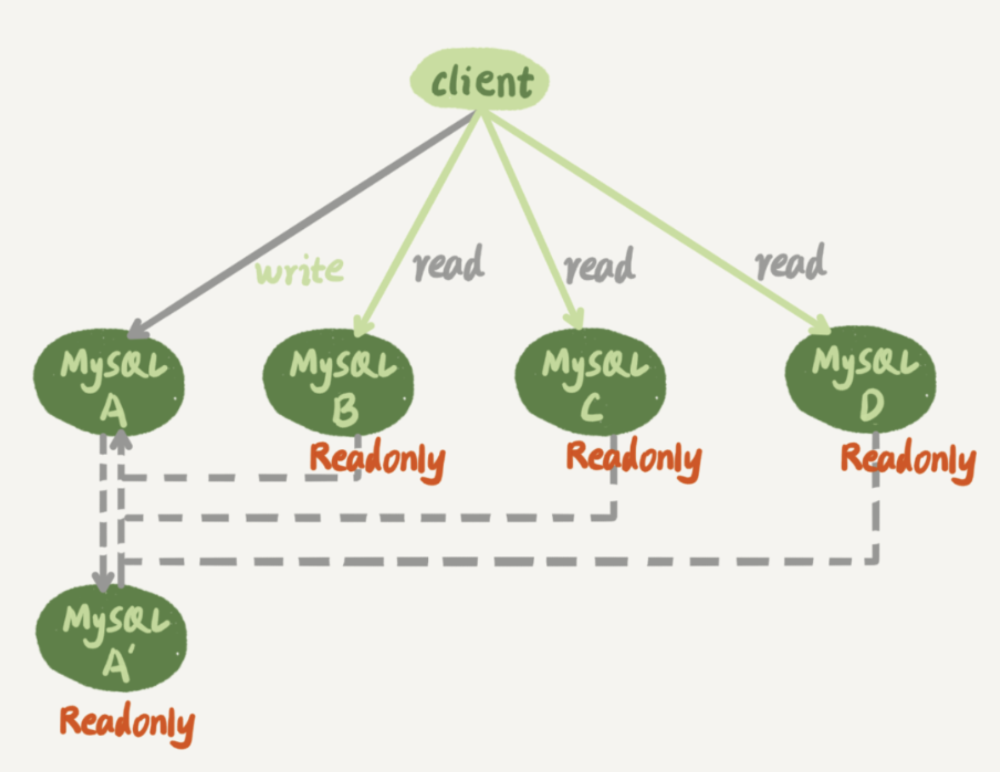

# MySQL笔记

## SQL执行流程


- Server层：包括连接器、查询缓存、分析器、优化器、执行器等，所有内置函数、存储过程、触发器、视图等也在该层
- 存储引擎层：负责数据存储和提起，其架构是插件式的，支持InnoDB、MyISAM、Memory等存储引擎

### 连接器

当建立连接时，连接器会到权限表中查出你拥有的所有权限，之后的该连接中的所有权限判断都依赖于刚刚读取到的权限，因此当更新权限后需要建立新的连接才能起效

建立连接的过程除了TCP三次握手，还要判断登陆权限和获取读写权限，所以减少连接动作，尽量使用长连接(连接成功后，如果客户端持续有请求，则一直使用同一连接)

### 查询缓存

查询缓存指之前执行过的语句及其结果可能会以key-value对的形式，被直接缓存在内存中。key是查询的语句，value是查询的结果。如果你的查询能够直接在这个缓存中找到key，那么这个value就会被直接返回给客户端

**但大多数情况下不建议使用查询缓存**，因为查询缓存失效特别频繁，只要对表进行了更新，该表的所有查询缓存都会被删除，可能前面好不容易存下来的查询缓存还没用就被删除了，反而更浪费性能

在MySQL 8.0版本直接将查询缓存的整块功能删掉了

### 分析器

先做词法分析，例如`SELECT`等关键词，还有表名和列名

再做语法分析，判断输入的语句是否满足语法，比如数据内容是否为空，数据类型是否匹配

### 优化器

在正式执行之前，MySQL会就索引的选择(当存在多个索引时)，表的连接顺序(多表做join时)等做出选择，从众多的选择中选择一个

### 执行器

在执行前要先判断一下对这张表是否有操作权限(由于某些触发器会在执行时才知晓具体的表，因此无法在优化器前做权限检查)

执行器就会根据表的引擎定义，去使用这个引擎提供的接口，例如调取InnoDB引擎接口获取这个表的第一行

## bin log和redo log日志模块

### redo log

redo log是InnoDB的，其记录了该行所在页做了什么改动，其作用是由于日志先被写入，使得写入磁盘的动作可以延迟(这就是MySQL中常说的WAL技术(Write-Ahead Logging))

虽然redo log的日志记录是需要立即写入磁盘的，但是由于redo log是一次**顺序**磁盘读取，而数据写入往往是多次磁盘的**随机**写入(因为需要维护索引)。并且此后将内存中的脏数据写入磁盘时将多次的单独写入变成了批量的一次写入

InnoDB的redo log大小是固定的，循环写入。write pos是当前记录的位置，checkpoint是当前要擦除的位置，两者之间的空间是可用的，当write pos追上了checkpoint，就让checkpoint向后推进擦除一部分数据

有了redo log，InnoDB就可以保证即使数据库发生异常重启，之前提交的记录都不会丢失，这个能力称为crash-safe

### bin log

MySQL整体来看有两层，引擎层中InnoDB引擎负责管理redo log，而在Server层也有自己的日志，称为bin log(归档日志)

起初MySQL自带的引擎是MyISAM，但MyISAM是不具备crash-safe的能力的，bin log只提供归档功能，InnoDB发现只依靠bin log无法提供crash-safe功能，因此引入了redo log来实现crash-safe功能

### 两个日志模块差异

- redo log是InnoDB引擎特有的；bin log是MySQL的Server层实现的，所有引擎都可以使用
- redo log是物理日志，记录的是在某个数据页上做了什么修改；bin log是逻辑日志，记录的是这个语句的原始逻辑，比如给ID=2这一行的c字段加1
- redo log是循环写的，空间固定会用完；bin log是可以追加写入的。追加写是指bin log文件写到一定大小后会切换到下一个，并不会覆盖以前的日志

### 两个记录模块记录流程

首先来看一下update操作时bin log和redo log的记录流程，浅色表示在InnoDB中执行，深色表示在Server层中执行


可以发现在最后三步中将redo log拆分为了prepare和commit两个阶段，因为为了确保redo log和bin log必须一同写入，所以MySQL采用了两阶段提交来解决这个问题

1. 第一阶段：InnoDB将该事务回滚段设为prepare状态，并持有prepare_commit_mutex，然后写入redo log，bin log不进行任何操作
2. 第二阶段：首先写入bin log。接着InnoDB提交该事务(清除undo log，释放锁)，写入commit标记后释放prepare_commit_mutex

> 早期MyQSQL通过prepare_commit_mutex来保证同时提交，但是性能过差且不能同时其他线程不能提交。因此在MySQL5.6后一次引入了bin log组提交和redo log组提交来提升性能

- 先写redo log后写bin log：redo log写入后即使数据库奔溃，数据也能正常恢复进数据库，但是当通过bin log恢复数据库时，由于bin log未被写入，因此恢复出来的数据库会比现有数据库状态少上那一条
- 先写bin log后写redo log：当通过bin log恢复数据库时，未被持久化到数据库的数据也会被恢复(redo log没写入，因此数据库没有这条数据)

### 异常重启与两个日志

1. 在写入redo log 处于prepare阶段之后、写binlog之前发生崩溃

此时redo log还未提交，bin log还没写入。在恢复时，这个事务会回滚，而bin log没写，因此也不会传到备库

2. 在bin log写完，redo log还没commit前发生奔溃

此时bin log是完整的，而redo log处在完整的prepare阶段。在恢复时，直接提交事务

### 崩溃恢复时的判断规则

- 如果redo log里面的事务是完整的，也就是已经有了commit标识，则直接提交
- 如果redo log里面的事务只有完整的prepare，则判断对应的事务bin log是否存在并完整，完整就提交，不完整就回滚

### 两个日志关联

它们有一个共同的数据字段，叫XID。崩溃恢复的时候，会按顺序扫描redo log：

- 如果碰到既有prepare、又有commit的redo log，就直接提交
- 如果碰到只有prepare、而没有commit的redo log，就拿着XID去bin log找对应的事务

## 浅讲事务隔离级别

- 读未提交：一个事务还没提交时，它做的变更就能被别的事务看到。 -- 脏读
- 读提交：一个事务提交之后，它做的变更才会被其他事务看到。  -- 不可重复读
- 可重复读：一个事务执行过程中看到的数据，总是跟这个事务在启动时看到的数据是一致的。当然在可重复读隔离级别下，未提交变更对其他事务也是不可见的。 -- 幻读
- 串行化：顾名思义是对于同一行记录，“写”会加“写锁”，“读”会加“读锁”。当出现读写锁冲突的时候，后访问的事务必须等前一个事务执行完成，才能继续执行。


依次分析四种隔离界比在以上流程中的值：
- 读未提交：则V1的值就是2。这时候事务B虽然还没有提交，但是结果已经被A看到了。因此，V2、V3也都是2。
- 读提交：则V1是1，V2的值是2。事务B的更新在提交后才能被A看到。所以， V3的值也是2。
- 可重复读：则V1、V2是1，V3是2。之所以V2还是1，遵循的就是这个要求：事务在执行期间看到的数据前后必须是一致的。
- 串行化：则在事务B执行“将1改成2”的时候，会被锁住。直到事务A提交后，事务B才可以继续执行。所以从A的角度看， V1、V2值是1，V3的值是2。

在MySQL中配置启动参数`transaction-isolation`来设定需要的隔离界别，默认是`Repeatable Read`

### 可重复读的实现

在MySQL中，实际上每条记录在更新的时候都会同时记录一条回滚日志(undo log)。记录上的最新值，通过回滚操作，都可以得到前一个状态的值

因此在将一个值从1改到2、3、4，在MySQL中会记录如下的一个回滚日志


在前面说明了可重复读中每次启动事务都会新建一个视图，该事务中所有数据都是根据这张视图来的，这也就是俗称的多版本并发控制(MVCC)。
在将值修改的过程，其他事务运行时会对应不同的视图，比如这里的read-view A或者read-view B，其对应的值也不一样，当另一个事务获取read-View A中的值时，MySQL会通过回滚日志，将现在表里的4回滚到1，从而保证另一个事务在整个过程中获取到的都是同一个视图中的值

我们可以发现在一个事务中将会记录对数据库的任何操作的回滚日志，而这些回滚日志只有到这个事务提交后才会被删除(尤其在MySQL5.5之前，回滚日志会被保存到ibdata中，即使事务提交文件大小也不会改变)，因此如果使用长事务，MySQL就不得不保存大量的回滚日志，从而造成数据库奔溃，所以不推荐使用长事务

关于事务启动：
- 显示启动事务，使用`begin`或者`start transaction`，然后使用`commit`提交事务或者`rollback`回滚事务
- 当`set autocommit = 0`时会关闭自动提交，此时任意执行一条语句事务就启动了，并且不会被提交，直到显示使用`commit`或`rollback`
- 因此推荐`set autocommit = 1`打开自动提交

### 更多

- **InnoDB支持RC和RR隔离级别都是通过一致性视图(consistent read view)实现的**，[详细解释会在后面介绍](#锁和事务)
- [可能更为详细的隔离级别笔记](../四种隔离级别.md)

## 浅讲索引

### 三个常见索引模型

- 哈希表：以key-value形式存储，通过哈希函数计算出key，当key重复时以链表形式向后追加
  - 优点：由于无需关心排序，因此插入很快，只需往后添加
  - 缺点：不具备范围索引，因此区间索引时要遍历整张表
  - 使用场景：适用于只有等值查询的场景
- 有序数组：按key顺序存储
  - 优点：key是有序排列的，通过二分查找法在等值查询和范围查询场景中的性能就都非常优秀
  - 缺点：当插入值时，需要将该key后的所有元素后移，耗费性能
  - 使用场景：适用于静态存储引擎，即数据存储后不再改变
- B+树：B+树比二叉树在每一层有更多的节点，从而使得从磁盘中读取数据块的次数减少，减少IO操作，加快查询速度
  - [B+树详解](../../data-structure/B树和索引.md)

在MySQL中，索引是在存储引擎层实现的，所以并没有统一的索引标准，即不同存储引擎的索引的工作方式并不一样

### 索引维护

在[B+树详解](../../data-structure/B树和索引.md)中可以知道在B+树中插入数据时，如果该页已经满了(即新插入的索引在两个现有索引之间)，那么就要申请一个新的页，并复制一般的数据，这个过程叫做页分裂，这毫无疑问会造成性能损失

怎么才能减少页分裂呢？如果我们的索引是递增的，那么数据的写入就都是追加，不会造成申请新的页的页分裂过程，并且InnoDB中辅助索引的B+树中记录的是主索引的值，因此主索引长度越小，辅助索引的B+树占用的空间也越小，总结就是**从性能和存储空间方面考量，自增主键往往是更合理的选择**

重建索引：
- 重建普通索引：索引可能因为删除，或者页分裂等原因，导致数据页有空洞，重建索引的过程会创建一个新的索引，把数据按顺序插入，这样页面的利用率最高，也就是索引更紧凑、更省空间
- 重建主索引：不论是删除主键还是创建主键，都会将整个表重建，消耗大

### 覆盖索引

如果查询条件使用的是普通索引(或是联合索引的最左原则字段)，查询结果是联合索引的字段或是主键，不用回表操作，直接返回结果，减少IO磁盘读写读取正行数据

例如一张表，自增id做为主键，身份证字段作为索引，此时如果需要通过身份证查询姓名的话，需要在辅助索引中先找到id，再在主索引中找到具体数据，经历了一次回表。但如果创建了(身份证，姓名)的联合索引时，只需要在辅助索引中找到该数据，它的索引中已包括了姓名，从而不需要了回表操作，减少性能浪费

数据量很大的时候，辅助索引比主键索引更快，这正是利用了覆盖索引的特效，否则还是需要回表操作

### 最左前缀原则

B+树这种结构中索引项是按照索引定义里面出现的字段顺序排序的，因此可以使用最左前缀原则来定位记录

在索引维护中举的例子中，创建的(身份证)的普通索引是可以通过最左前缀原则的(身份证，姓名)的普通索引实现的，此外`like`关键词查找身份证以某些数字开头的记录时，也可以通过最左前肢原则使用索引

考虑到最左前缀原则，因此在创建联合索引时字段的顺序也很重要：
- 将高频的单个索引可以作为联合索引的第一个字段，比如(身份证，姓名)索引就可以代替了(身份证)索引
- 当联合索引中多个字段都需要当作独立索引时，应将占用空间小的字段作为单独索引，减少空间

### 索引下推

在上个例子中(身份证，姓名)索引中，如果要查询`身份证 like '310%' and 姓名 = '张三'`，身份证这个字段可以使用最左前缀原则利用索引查询，但是在MySQL5.6之前，对姓名字段的判断就必须通过回表操作找到主索引中记录进行判断，但在MySQL5.6之后，可以在索引遍历过程中，对索引中包含的字段先做判断，直接过滤掉不满足条件的记录，减少回表次数，在这里姓名字段的判断也可以在普通索引中完成了，不再需要进行回表操作

## 浅讲锁

### 全局锁

在MySQL中使用Flush tables with read lock (FTWRL)添加全局锁，此时整个库处于只读状态的时候

**全局锁的典型使用场景是，做全库逻辑备份**，虽然FTWRL提供了全局锁，但是还是存在问题：
- 如果你在主库上备份，那么在备份期间都不能执行更新，业务基本上就得停摆
- 如果你在从库上备份，那么备份期间从库不能执行主库同步过来的binlog，会导致主从延迟

最关键的就问题就在于备份与数据更新无法同时进行，因此就需要一致性视图，这里就可以在可重复读隔离级别下开启一个事务。官方自带的逻辑备份工具是mysqldump。当mysqldump使用参数–single-transaction的时候，导数据之前就会启动一个事务，来确保拿到一致性视图。而由于MVCC的支持，这个过程中数据是可以正常更新的

虽然一致性视图解决了备份和数据更新无法同时进行的问题，但是这个隔离级别是由InnoDb这个引擎实现的，single-transaction方法只适用于支持事务的引擎，因此MyISAM就无能为力了，只能使用FTWRL了

为什么不使用set global readonly=true方式来开启全库只读
- 在有些系统中，readonly的值会被用来做其他逻辑，比如用来判断一个库是主库还是备库
- 如果执行FTWRL命令之后由于客户端发生异常断开，那么MySQL会自动释放这个全局锁，整个库回到可以正常更新的状态。而将整个库设置为readonly之后，如果客户端发生异常，则数据库就会一直保持readonly状态，这样会导致整个库长时间处于不可写状态

### 表锁

MySQL里面表级别的锁有两种：一种是表锁，一种是元数据锁（meta data lock，MDL)

#### 1. 表锁

使用`lock tables … read/write`创建表锁，其会在客户端断开连接后自动释放，也可以`unlock tables`主动释放

注意：这里的表锁除了会限制别的线程的读写外，也限定了本线程接下来的操作对象，比如对t1加锁，别的线程不能访问t1，而该线程也只能访问t1

在没有更细粒度的锁之前，表锁是最常用的处理并发的方法

#### 2. MDL

MDL是用来保证读写的正确性，防止一个线程查询数据时，另一个线程在改变数据结构，从而导致查询到的结果与数据结构不匹配

在MySQL 5.5版本中引入了MDL，MDL不需要显式使用，在访问一个表的时候会被自动加上。当对一个表做增删改查操作的时候，加MDL读锁；当要对表做结构变更操作的时候，加MDL写锁
- 读锁之间不互斥，因此你可以有多个线程同时对一张表增删改查
- 写锁和读锁、写锁都是互斥的，用来保证变更表结构操作的安全性。因此，如果有两个线程要同时给一个表加字段，其中一个要等另一个执行完才能开始执行

但要注意：当显示开启事务后，MDL锁直到被显示提交或回滚才会被释放，因此当这个事务中语句执行完成但未提交，这时其他线程修改数据结构尝试加写锁就会一直被阻塞，而同时后面的线程尝试加读锁也会因为前面的写锁被阻塞从而也被阻塞

### 行锁

MySQL行锁是由引擎实现的，InnoDB引擎支持行锁而MyISAM引擎就不支持行锁。不支持行锁意味着并发控制只能使用表锁，对于这种引擎的表，同一张表上任何时刻只能有一个更新在执行，这就会影响到业务并发度

#### 两阶段锁

在InnoDB事务中，行锁是在需要的时候才加上的，但并不是不需要了就立刻释放，而是要等到事务结束时才释放

例如一个事务中`update where id = 1`的语句已执行完成，但事务还未提交，此时另一个事务尝试`update where id = 1`的记录时由于前一个还未提交的事务还持有着`id = 1`的行锁，因此该事务被阻塞，因此如果你的事务中需要锁多个行，要把最可能造成锁冲突、最可能影响并发度的锁尽量往后放

**在事务中，更新操作放在后面会更少影响锁的等待时间**

### 死锁

当并发系统中不同线程出现循环资源依赖，涉及的线程都在等待别的线程释放资源时，就会导致这几个线程都进入无限等待的状态

#### 解决死锁

- 通过参数`innodb_lock_wait_timeout`根据实际业务场景来设置超时时间，InnoDB引擎默认值是50s
- 发起主动死锁检测，发现死锁后，主动回滚死锁链条中的某一个事务，让其他事务得以继续执行。将参数`innodb_deadlock_detect`设置为 on，表示开启这个逻辑（默认是开启状态）

#### 解决热点行更新

热点行更新指每个新来的线程都需要判断是否其会造成死锁，当多个线程同时对同一行做更新时会消耗大量CPU资源

- 如果你能确保这个业务一定不会出现死锁，可以临时把死锁检测关闭掉。一般不建议采用
- 控制并发度，对应相同行的更新，在进入引擎之前排队。这样在InnoDB内部就不会有大量的死锁检测工作了
- 将热更新的行数据拆分成逻辑上的多行来减少锁冲突，但是业务复杂度可能会大大提高

**InnoDB行级锁是通过锁索引记录实现的，如果更新的列没建索引是会锁住整个表的**

## 锁和事务

前面介绍了两段锁、行锁、隔离级别还有一致性视图，在这里会把它们都串起来

首先建表，使用InnoDB引擎，且处于可重复读的隔离模式，有初始数据(id = 1, v = 1)

| 事务A | 事务B | 事务C |
| :-: | :-: | :-: |
| start transaction with consistent snapshot |  |  |
|  | start transaction with consistent snapshot |  |
|  |  | update t set v = v + 1 where id = 1 (v = 2) |
|  | update t set v = v + 1 where id = 1 (v = 3)  |  |
|  | select v from t where id = 1 (v = 3) |  |
| select v from t where id = 1 (v = 1) |  |  |

首先奇怪的是为什么两个`select`出来的值是不一样的，在解释这个之前先注意一下事务的启动时机，`begin/start transaction`不是一个事务的起点，只有其中的第一条语句执行时才是真正启动的时间点，因此如果需要事务立即启动需要使用`start transaction with consistent snapshot`

在可重复读的隔离级别下，事务在启动时就对**整个库**做了个快照，这里的快照不是将数据库所有的内容都复制了一份，而是通过[undo log实现](#可重复读的实现)的，因此整个库的修改对于该事务都是不可见的

### MVCC

一致性视图使用MVCC(多版本并发控制)实现的，那么事务是怎么实现的MVCC呢？

1. 每个事务都有一个事务ID,叫做`transaction id`，且严格递增
2. 在事务启动时将所有此时活跃的事务(已创建但还未提交的事务)的`transaction id`添加进该事务的一个数组内，当前事务的`transaction id`也在其中
3. 数据库中的每行数据也都是有多个版本的，因此在数据更新时都会生成一个新的数据版本，并将`transaction id`赋值给这个数据版本的事务id，记作`row trx_id`


在上图中深绿色框代表事务，其对应的数据版本的`row trx_id`就是由该事务的`transaction id`赋值的，因此两者是相同的。在多个数据版本中只有最后一个(V4)是实际存储在数据库中的，其余都是通过`undo log`实现的(`undo log`对应图中的虚线)，当查询的数据版本不是最新的时，会通过`undo log`生成前一个数据版本

4. 在事务开始时，会将此时活跃的所有事务(已创建但还未提交)的`transaction id`添加到该事务的一个数组中，且当前事务也在其中

- 低水位：数组中的最小值
- 高水位：数组中的最大值 + 1


5. 当一个事务要查看某个数据时，首先需要与该事务中的数组做比较

首先将当前事务的`transaction id`和最新的数据版本的`row trx_id`做对比，如果符合则返回，不符合则通过`undo log`找到前一个数据版本，再做比较

- `低水位 >= transaction id`表示该数据版本在事务前已被提交，该数据可用，相等的情况表示该数据版本是该事务提交的，因此可用
- `高水位 < transaction id`表示该数据版本是在事务启动后才被更新，该数据不可用
- `低水位 < transaction id <= 高水位`此时判断该事务是否在该事务的数组中，在表示不可用，不在表示可用(出现这种情况的原因是可能在该事务开启前的事务有些很快提交了，而有些一直未提交)

**以上三条总结而言就是在该事务开启之前已提交的事务数据是可用的**

6. 注意：更新数据都是先读后写的，而这个读，只能读当前的值，称为当前读(current read)，这是因为防止更新丢失

在前面的例子中事务C更新了`v = 1 + 1`，虽然此时事务B读到的`v = 1`，但是更新是当前读，所以事务B更新的是`v = 2 + 1`，如果事务B是更新其读到的值`v = 1 + 1`，最后两个事务执行完做了两次`+1`操作，最后返回的却是`v = 2`，造成了更新丢失，因此必须使用当前读来解决更新丢失问题

7. 注意两段锁的应用：此处事务B可以更新`id = 1`的数据是因为事务C已提交了事务，从而释放了`id = 1`的写锁，但如果事务C不提交，则事务B的更新操作将被阻塞

### RR和RC

可重复读和提交读都是通过一致性视图实现的

- 可重复读(RR)：在事务开启时创建一致性视图，该事务所使用的所有数据都来自于此时的一致性视图
- 提交读(RC)：在每个语句执行前创建一致性视图，该语句用到的数据都来自于该语句创建的一致性视图

### 相同的更新

当给一个`(id = 1, a = 2)`的执行更新语句`update T set a = 2 where id = 1`时，MySQL不会因为更新的a的值和原先a的值相同而不更新，而是会老老实实的执行，该加锁的加锁，该更新的更新

MySQL这里很傻的更新了相同的值，这是因为MySQL这里无法判断a = 2，只能得到id = 1，因此如果`update T set a = 2 where id = 1 and a = 2`，此时将不会执行

## 再谈索引

### 普通索引和唯一索引

首先先确定一下概念：除了主索引以外都叫做普通索引，因此唯一索引也是一种普通索引，所以普通索引和唯一索引都需要访问两颗树才能找到数据

#### 查询过程中普通索引和唯一索引性能几乎相同

以查询(k = 5)为例，k不是主键

- 唯一索引：查询到满足条件k = 5后，由于唯一索引保证了不存在其他满足条件的数据，因此可以直接返回
- 普通索引：查询到满足条件的k = 5后再查看下一个数据是否满足k = 5，直到遇到不满足的。由于磁盘是一页页读的，而连续的数据都是存储在同一页上的，所以查看下一条数据往往只是内存中的一次查询，几乎不损耗性能

#### 更新过程中普通索引会比唯一索引有更好的性能

- 当待更新的数据已在内存中时，直接修改内存值即可。而唯一索引也仅须再在内存中判断一下索引是否唯一，内存中的操作开销可忽略不计，因此此时性能几乎相同
- 当待更新的数据不在内存中时，唯一索引由于需要判断索引是否唯一，因此必须将数据载入到内存中，而普通索引可以将更新写入[change buffer](#change-buffer)从而避免一次磁盘读取，因此此时普通索引的性能更好

不论待更新的数据在不在内存中，都需要记录redo log，不同的是在内存中时记录的是数据页的变换，而不在内存中时记录的是对change buffer进行了操作

由于`change buffer`中的记录会在后台或者读取数据时写入，因此如果是读多写少或者写后就立即读的数据库，往往刚刚写入change buffer就要被持久化，不但无法减少磁盘操作，还白白管理`change buffer`，因此`change buffer`更适用于写多读少的数据库

#### change buffer

在MySQL5.5之前，只针对insert做了优化，叫插入缓冲(insert buffer)；现在对delete和update也有效，叫做写缓冲(change buffer)

change buffer应用在非唯一普通索引页(non-unique secondary index page)不在缓冲池中，对页进行了写操作，并不会立刻将磁盘页加载到缓冲池，而仅仅记录缓冲变更，等未来数据被读取时，再将数据合并(merge)恢复到缓冲池中的技术。change buffer的目的是降低写操作的磁盘IO，提升数据库性能

在MySQL后台会将change buffer里相应的数据持久化到ibdata

使用change buffer机制是不会造成数据库异常导致数据丢失的，虽然是只更新内存，但是在事务提交的时候，我们把change buffer的操作也记录到redo log里了，所以崩溃恢复的时候，change buffer也能找回来

merge的执行流程:

1. 从磁盘读入数据页到内存（老版本的数据页）
2. 从change buffer里找出这个数据页的change buffer 记录(可能有多个），依次应用，得到新版数据页
3. 写redo log。这个redo log包含了数据的变更和change buffer的变更

#### change buffer和redo log

- 所有更新操作都必须立刻写入redo log进行持久化；只有非唯一普通索引的更新，且数据页未加载到内存时才写入change buffer，并且redo log还需写入
- redo log在磁盘中的，所有记录都必须立刻写入磁盘；change log是在内存中的，只是在后台会将其持久化到磁盘
- redo log将随机写记录到磁盘中的IO操作转成顺序写入redo log中；change buffer将随机读磁盘的指定记录的IO操作转为先写入内存，后批量写入

### 错选索引

在优化器中MySQL会自动选择语句执行使用的索引，但有时候会选错索引导致语句执行缓慢

#### 优化器是怎么挑选索引的

优化器通过扫描行数、临时表、是否排序等因素进行综合判断

使用explain查询语句中的rows代表着MySQL预计的扫描行数，扫描行数越小代表访问磁盘的数据量和次数也越少

#### 举个例子

首先创建一张(id, a, b)的表T，其中包含(0, 0, 0)到(10W, 10W, 10W)的数据，且id，a，b都建了索引

| 事务A | 事务B | 事务C |
| :-: | :-: | :-: |
| | | select * from t where a between 10000 and 20000 |
| start transaction with consistent snapshot | |
| | delete from T | |
| | 重新插入0-10W的数据 | |
| | select * from t where a between 10000 and 20000 | |
| commit | | |

当使用explain查询事务C中的select语句能发现使用的是索引a，预计rows为1W，表示通过索引a扫描1W行，毫无疑问优化器选择是正确的 

但当有了事务A后，事务B执行相同的select语句却使用了索引id，扫描的行数为10W。

首先使用`explain`来看一下使用id索引和a索引扫描的行数，可以发现id索引扫描行数为10W(扫描整表)，a索引扫描行数为3W([为什么是3W](#为什么需要事务A))，而使用a索引还需要再到主索引树中找到具体数据，因此还有额外代价，因此MySQL权衡后选择了使用id索引

此时使用`analyze table T`来重新统计索引，即可让MySQL作出正确判得到a索引的扫描行数为1W

> 在使用`show index`查看表索引信息时基数(cardinality)字段表明索引的区分度，区分度越大越好。基数不是通过遍历整个索引树，而是随机选择N个数据页，计算平均值后乘以总页数得到基数。基数在数据库更新到超过一定行后触发重新做一次索引统计

#### 为什么需要事务A

当没有事务A时事务B中的select语句和事务C中预计的rows是一样的1W，这是因为MySQL是使用标记删除来删除记录的,并不从索引和数据文件中真正的删除。如果delete和insert操作之间间隔较小，change buffer还没来得几merge记录，此时如果主键相同，新插入的数据会沿用删除前的记录空间，由于数据量相同所以预计的rows也相同

而当有事务A时，为了保证事务A的一致性视图，所以事务B添加时不再能够使用原本删除的空间，只能另起空间，所以虽然delete删除了数据但未释放空间，而insert又新增了空间，导致a索引树上数据就变成了两份，因此此时事务B的预计rows变成3W

只要避免长事务就可以避免这种索引统计错误(因为事务A就是长事务)

#### 再举个例子

`select * from t where (a between 1 and 1000) and (b between 50000 and 100000) order by b limit 1`

理论上使用a索引只要扫描1千条(0~1000)，而b索引则需要5W(50000～100000)，但是MySQL会选择使用b索引，因为这里有个`order by b`，b索引中已经按b做了排序，所以MySQL认为使用b索引性能更好

这里可以使用`order by b, a`这种巧妙的方法来让MySQL使用a索引，因为a，b都需要排序，那么MySQL就会选择扫描行数最少的索引了

#### 总结一下解决方法

- 使用`analyze table T`让MySQL重新统计索引
- 使用`force index(I)`来强行使用指定索引
- 新增或重建索引

### 字符串索引

#### 前缀索引

在为字符串建立索引时，由于字符串过长(比如身份证)可能导致索引占用过大的空间，此时可以使用前缀索引来节省空间，且又不用额外增加太多的查询成本

使用`index index_name(column_name(number))`创建前缀索引，`number`为截取该字段前`number`个字符作为索引

索引区分度越高越好，因此在确定前缀索引的长度时可以使用`count(distinct left(column_name, number))`来查看不同长度下的区分度

#### 前缀索引会影响覆盖索引

本来是可以使用覆盖索引优化查询的，但是前缀索引导致了该索引字段必须进主索引进行一次查询，因此覆盖索引失效了

#### 其他优化

- 倒序索引：某些字段起尾部区分度大，此时可以使用`reverse()`为该字段的尾部创建索引
- 新增hash字段作为索引：在表上再创建一个整数字段代替字符串作为索引，使用`crc32()`来得到一个4字节的字符串，虽然减少了索引空间，但增加了数据空间

以上两种方法都不再能够进行范围查询了，因为索引和字段并不再前缀匹配了

## SQL语句为什么变"慢"了

为什么一句SQL语句会突然变慢，这很有可能是在刷脏页(flush)

### 脏页与干净页

- 脏页：内存数据页跟磁盘数据页内容不一致(WAL机制导致的)
- 干净页：内存和磁盘上的数据页的内容就一致

### 引发flush的4种情况：

- 由于redo log的大小是固定的，因此当redo log存满时，数据库必须停下来等待清除一部分redo log，对应的就是将一部分脏页持久化到磁盘
- 由于机器内存有限，会存在需要新的内存页加载数据时内存满了，因此空出一部分内存页，如果被空出的是脏页，那么就要将这脏页持久化到磁盘
  - 为什么不能直接空出脏页，等待redo log来持久化：这是为了保证无论从内存中还是磁盘中取出的数据一定是正确的
- MySQL在空闲时安排flush掉脏页
- MySQL正常关闭时也会将内存中所有脏页都flush到磁盘中

在以上4种情况中，前两个对性能影响较大

1. redo log写满了，要flush脏页：这种情况是InnoDB要尽量避免的。因为此时系统不再能接受更新，所有更新都被堵塞了
2. 内存不够用了，要先将脏页写到磁盘：这种情况其实是常态。InnoDB用缓冲池(buffer pool)管理内存，有未使用页、干净页、脏页。当内存满了时会选择最久不使用的数据页来空出

### InnoDB控制脏页

虽然刷脏页是常态，但当一次查询需要空出太多脏页当数据页还是redo log满了清除时脏页的持久化都会造成性能问题，因此InnoDB有一套脏页的控制机制

`innodb_io_capacity`：告诉InnoDB机器的磁盘能力，建议设为磁盘的`IOPS`，因为如果设定过小会导致InnoDB误认为机器磁盘能力很差，从而放慢刷脏页的频率，从而造成脏页累计

`innodb_max_dirty_pages_pct`：设定脏页所占比例上限(默认值75%)。InnoDB通过该参数和redo log的写盘速度计算的数值来控制刷脏页的速度

此外，InnoDB还会通过`innodb_flush_neighbors`该参数来设定刷脏页时是否把相邻的脏页也一起flush了(0表示不刷相邻的只刷自己的)。在机械磁盘中可以减少很多随机IO操作，但是在固态硬盘中IOPS不再是瓶颈，而一次只刷自己能更快完成flush操作，减少SQL语句响应时间。在MySQL 8.0中，`innodb_flush_neighbors`参数的默认值已经是0了

## 为什么删除了数据而表大小不变

当delete了一大部分的记录后，表文件的大小并不会发生变化

这是因为MySQL中delete的记录仅会被标记为删除，空间可复用，但实际数据空间并没有被回收
- 记录复用：某条记录被删除后，如果再插入主键相同的记录则可以复用标记为删除的记录
- 数据页复用：当一个数据页中所有记录都被标记为删除后，该数据页是可复用的，可在其中插入任何数据

删除数据会造成数据页空洞，当然插入也会造成(具体可以查看B+树的插入过程)，因此要在delete后使得表占用空间大小减少，就必须消除这些空洞

### 重建表

使用`alter table T engine = InnoDB`来重建表，从而释放掉空洞，实现空间上的删除

当原表数据本来就没有是什么空洞，此时重建表表空间反而会增大，这是因为重建表的时候，InnoDB不会把整张表占满，每个页留了1/16给后续的更新用，因此重建表之后不是“最”紧凑的

1. MySQL5.5版本之前

MySQL会自动新建一个与原表结构相同的临时表，然后按照主键递增的顺序，把数据一行一行地复制到临时表中，最后交换表名并删除旧表

在整个重建表过程中一直持有MDL写锁

整个过程都在MySQL的Server层进行的

通过将所有数据移动到临时表替换原表实现

2. MySQL5.5版本之后

在5.5之前的重建表过程中是不能更新数据的，因为更新的内容会丢失，因此5.6中引入了Online DDL，使得重建表过程中也能够更新

首先扫描原表中的主键数据页，并以B+树形式拷贝到临时文件中，在拷贝过程中将所有对原表的更新操作记录在row log中，在拷贝完成后将row log中操作应用到临时文件上，最后再用临时文件替换原表数据文件，删除旧表操作

在Online DDL中扫描主键数据页后就将MDL写锁降级为MDL读锁，因此不会阻塞更新操作
- 不直接释放MDL写锁的原因：防止其他线程对这个表做DDL操作
- 拷贝数据到临时文件中是最耗时的操作，因此MDL写锁在这之前降级

整个重建表的过程都是在InnoDB引擎中完成的，不涉及到Server层

通过临时文件替换原表数据文件实现，并没有把数据从一张表移到另一张表，因此是Inplace原地操作

### Online和Inplace

- 不影响更新操作的就是Online
- 在Server层没有新建临时表的就是Inplace

因此MySQL5.5之后的重建表就刚好是Online并且是Inplace的

## count(*)

### count(*)实现方式

- MyISAM引擎把一个表的总行数存在了磁盘上，因此执行count(*)的时候会直接返回这个数，效率很高，但如果添加了where条件也不能返回的这么快
- InnoDB引擎中由于支持了MVCC，其对于每个事务该返回多少行也不确定，它执行count(*)的时候，需要把数据一行一行地从引擎里面读出来，然后累积计数

由于无论主索引还是普通索引行数是相同的，而主索引因为还要存储记录具体信息，数据量比普通索引要大，因此在保证逻辑正确的前提下，InnoDB引擎会选择数据量最少的来扫描，也就是往往会选择普通索引来作为扫描对象

### 不同的count用法

1. count(*)

InnoDB对于count(\*)并不会把全部字段取出来，而是专门做了优化，不取值，因为count(\*)肯定不是null，直接按行累加

在遍历时，如果有普通索引就不会选择走主索引。因为主索引上不但有具体数据还有MVCC版本号和加锁的记录，导致主索引往往很大，而count()操作是要遍历整张表的，因此占用空间较小的普通索引相比于主索引需要更少的磁盘IO次数就能读取整个索引，普通索引才是更好的选择

2. count(1)

MySQL官方说明count(1)和count(\*)是等效的，仅仅在SQL规范中推荐使用count(\*)

3. count(字段)

InnoDB引擎遍历整张表，把每一行的该字段解析出来并返回给Server层。Server层拿到字段值后，如果该字段是not null的，判断是不可能为空的，按行累加，如果是可以为null的，就还要在将该字段值取出来再做判断，不是null才累加

总结：

count(字段) < count(1) = count(*)

count(字段)不包含该字段为null的行，而其余的都包含为null的行

## order by

在使用`explain`命令查看执行情况中`extra`字段中`Using filesort`表示是需要排序的。MySQL会给每个线程分配一块内存用于排序，称为`sort_buffer`

接下来以`select id, name, age, school from student where age = 18 order by name limit 10000`举例

### 全字段排序

1. 初始化sort_buffer，确定放入id, name, age, school四个字段
2. 从age索引中找到满足age = 18条件的主键id
3. 到主索引中通过id取出整行，并取出id, name, age, school四个字段放入sort_buffer
4. 从age索引中取下一个记录的主键id
5. 重复3，4步直到age不满足18的条件(如果不存在age索引，就遍历整个主索引，找到满足条件的记录放入sort_buffer)
6. 对sort_buffer中的数据按照字段name做快速排序
7. 按照排序结果取前10000行返回给客户端

内存中的sort_buffer大小是有限的(通过`sort_buffer_size`设定)，当sort_buffer无法一次性载入所有待排序的数据时，就需要使用到临时文件。MySQL将需要排序的数据分成12份(`number_of_tmp_files`)，每一份单独排序(归并排序)后存在这些临时文件中,然后把这12个有序文件再合并成一个有序的大文件

### row id排序

在全字段排序中，可能数据行数并不大，但是由于每条记录的字段过多，导致单行过长，使得在sort_buffer中存储的记录就变得很少

`max_length_for_sort_data`参数是MySQL中专门控制用于排序的行数据的长度的，如果单行的长度超过这个值，MySQL就认为单行太大，替换为row id排序，即在sort_buffer中只保存主键id和待排序字段

1. 初始化sort_buffer，确定放入两个字段，即name和id(只保存主键id和待排序字段name)
2. 从age索引中找到满足age = 18条件的主键id
3. 到主索引中通过id取出整行，并取出id, name两个字段放入sort_buffer
4. 从age索引中取下一个记录的主键id
5. 重复3，4步直到age不满足18的条件(如果不存在age索引，就遍历整个主索引，找到满足条件的记录放入sort_buffer)
6. 对sort_buffer中的数据按照字段name做快速排序
7. 遍历排序结果，取前10000行，并按照id的值回到原表中取出id, name, age, school四个字段返回给客户端

在row id排序中会比全字段排序多一次回表查询(即第7步)

对于InnoDB表来说，row id排序会要求回表多造成磁盘读，因此不会被优先选择(后面提到的内存表中由于回表操作也是访问内存，反而选择row id排序)

MySQL是通过row id来定位一行数据的
- 对于有主键的InnoDB表来说，这个row id就是主键ID
- 对于没有主键的InnoDB表来说，其会自己生成一个长度为6字节的row id
- Memeory引擎不是索引组织表，可以理解为数组下标作为了row id
而这row id也正是row id排序的由来

### 索引排序

由于索引是一棵B+树，其本身就是递增排序的，因此如果待排序的字段存在索引，那么就无法再做排序了

首先先创建一个联合索引(age, name)，从而保证age可以通过最左前缀匹配，而name又是被排序好的
1. 从索引(age, name)中找到第一个满足条件的age = 18的主键id
2. 到主索引中通过id取出该行，并返回id, name, age, school四个字段作为结果集的一部分直接返回
3. 从索引(age, name)中取出下一个主键id
4. 重复2，3步，直到查到10000条记录或者不满足age = 18为止

还可以通过覆盖索引来进一步优化，创建(age, name, school)联合索引，省去回表查询的步骤

### 随机排序

当需要随机取出n条记录时，可以使用`order by rand()`来为所有记录进行随机排序

在进行随机排序时，MySQL不但会进行排序，还会使用到临时表。`order by rand()`使用了内存临时表，内存临时表排序的时候使用了rowid排序方法

## 逻辑相同的SQL性能却差那么大

造成性能差异的主要两方面：
1. 能走索引的却没走索引
2. 能直接返回结果的却多次回表查询记录

### 1. 索引参与了计算

举例：取id + 1 = 2的记录

`select * from T where id + 1 = 2` => 不走id索引，因为id参与了计算
`select * from T where id = 2 - 1` => 走id索引

### 2. 索引参与函数运算

对索引字段做函数操作，可能会破坏索引值的有序性，因此优化器就决定放弃走树搜索功能

举例：取第七个月的所有记录

`select * from T where month(datetime) = 7` => 不走datetime索引，因为datetime进行了函数运算
`select * from T where datetime >= '2019-7-1' and datetime <= '2019-7-31'` => 走datetime索引

### 3. 隐式类型转换

举例：id是varchar类型，取id = 100的记录

`select * from T where id = 100` => 不走id索引，其等效于`where CAST(id AS signed int) = 100`，等于是对索引进行函数运算
`select * from T where id = '100'` => 走id索引

> 如果`select '10' > 9`返回1表示将字符串转成数字进行比较，返回0则表示将数字转成字符串进行比较

### 4. 隐式字符编码转换

举例：两张表字符编码分别为utf8和utf8mb4

`select * from A, B where A.id = B.id` => 不走id索引，其等效于`where CONVERT(A.id.value USING utf8mb4) = B.id`，等于是对索引进行了函数运算
`select * from A, B where A.id = CONVERT(B.id.value USING utf8)` => 走id索引

**总结：索引字段不能进行函数操作，但是索引字段的参数可以函数操作**

### 5. 不满足最左前缀索引

举例：寻找id包含关键词的记录

`select * from T where id like '%key%'` => 不走id索引，不满足最左前缀索引
`select * from T where id like 'key%'` => 走id索引

### 6. 字段长度超过类型长度

举例：当给varchar(5)的字段查询where等于六个字符的记录

`select * from T where id = '123456'` => 其中id是varchar(5)而字符串是六位的，很明显应该返回空。但是MySQL会截取前5个字符'12345'，然后走索引回表查出具体记录，返回给Server层判断是否等于'123456'，最后返回空。当表内存在大量id = '12345'的记录时会多次回表造成耗时


## 只查一行也很慢

### 查询长时间不返回

1. 等MDL锁。其他DDL事务持有了MDL写锁又长时间不释放，而查询事务需要得到MDL读锁，从而导致长时间无法返回结果
2. 等flush。flush命令关闭数据表本来执行很快，但是其他事务一直打开着表，从而阻塞了flash操作，结果又阻塞了查询语句，导致无法返回结果
3. 等行锁。查询的记录在别的事务中被加上了行锁，在查询时使用`lock in share mode`来获取当前读(默认的快照读通过MVCC的支持，是不会被阻塞的)会被阻塞，导致无法返回结果

### 查询很慢

1. 没有走索引
2. 长事务导致某行记录存在巨大的undo log，在读取时需要依次执行undo log直到得到正确的值

## 幻读和锁

### 什么是幻读

幻读指在当前读的操作下会存在数据不一致的情况

可重复读隔离级别中的可重复读的支持是通过快照读实现的，因此存在当前读的数据不一致问题

#### 举例1

| 事务A | 事务B |
| :-: | :-: |
| begin | |
| select * from T where id = 1 => (结果为空) | |
| | insert into T (id, name) values (1, 'Alice') => (插入成功) |
| insert into T (id, name) values (1, 'Alice') => (插入失败) | |
| select * from T where id = 1 => (结果为空) | |

事务A首先查询主键为1的记录是否存在，结果返回是不存在。此时事务B插入了主键为1的记录。当事务A尝试插入主键为1的记录时发现插入失败，报错主键冲突。此时事务A再次查询发现主键为1的记录还是为空。

事务A查询主键为1的记录为空是因为是快照读，读取的事务A启动时的数据库快照，而当时是没有主键为1的记录的，因此在整个事务A中都查不到该数据。但在insert操作中是当前读，因此是读到主键为1的记录的，所以报主键冲突错。如果在事务A中尝试`select * from T where id = 1 for update`会发现是能查到主键为1的记录的，因为`for update`加锁后是当前读

#### 举例2

| 事务A | 事务B |
| :-: | :-: |
| begin | |
| select * from T where name = 'Alice' => (1, 'Alice') | |
| | insert into T (id, name) values (2, 'Alice') => (插入成功) |
| update T set name = 'Bob' where name = 'Alice' => (修改了id=1和id=2的两条) | |

事务A首先查询所有name为Alice的记录只有一条。事务B插入了一条name也为Alice的记录。此时事务A尝试将所有name为Alice的修改为Bob，按事务A查询的应该只有id=1这一条，而事实上其更了两条记录，id=1和id=2。

在事务A更新之间，事务B插入之后，查询name为Alice的记录还是为一条，因为这是快照读。但当更新时是当前读，因此事务B插入的新记录也会被读到，从而一同被更新。并且此时事务A是可以查询到id=2的记录了，因为id=2的记录此时有了事务A的版本

#### 举例3

| 事务A | 事务B |
| :-: | :-: |
| begin | |
| select * from T for update => (1, 'Alice') | |
| | insert into T (id, name) values (2, 'Bob') => (插入成功) |
| select * from T for update => (1, 'Alice'), (2, 'Bob') | |

事务A的两次查询都通过`for update`加了写锁，其是当前读，因此理因在可重复的隔离级别下，通过快照读是不应该读到事务B插入的记录的，但是因为是当前读，因此能访问到任何其他事务的更新记录的

这个例子就是为了说明幻读本质就是当前读造成的，只是可重复读的隔离级别下更新操作都是当前读，因此会造成幻读。不是像网上所说的可重复读侧重读-读，幻读侧重读-写，只是因为写的操作涉及到了当前读

### MySQL解决幻读

MySQL通过next-key lock来解决幻读问题

在MySQL的可重复读的隔离级别下默认`innodb_locks_unsafe_for_binlog`参数为1，即默认支持间隙锁。只需要显式为查询语句添加`lock in share mode`或`for update`读或写锁，即能避免幻读

#### 间隙锁

间隙锁锁定的是两个记录之间的空隙

间隙锁的冲突规则与行锁不同，间隙锁和间隙锁之间不会冲突，但是间隙锁和行锁会冲突。比如事务A锁住了(0, 5)的区间，而事务B也可以锁定(0, 5)的区间，因为本质都是为了防止别的事务在该区间内插入记录，是不冲突的。但是如果事务C尝试插入主键为6的记录，获取主键为6的写锁是失败的，因为(0, 5)的区间被间隔锁锁定了，因此行锁与间隙锁是冲突的

间隙锁是在可重复读隔离级别下才会生效的，如果把隔离级别设置为读提交的话，就没有间隙锁了

#### next-key lock

行锁(Record Locks) + 间隙锁(Gap Locks) = next-key lock

每个next-key lock是前开后闭区间

比如当存在主键为5，10两条记录时，存在三个next-key lock，区间分别为(-∞, 5], (5, 10], (10, +∞]

InnoDB给每个索引加了一个不存在的最大值+∞，这样next-key lock才符合前开后闭的区间

#### 加锁规则

1. 加锁的基本单位是前开后闭的next-key lock
2. 查找过程中访问到的对象才会加锁
3. 唯一索引/主索引上的等值查询，如果匹配到该值则退化为行锁
4. 索引上的等值查询，在向右遍历且最后一个值不满足查询值时则退化为间隙锁
5. 唯一索引的范围查询会访问到不满足条件的第一个值为止(这可以理解为bug，因为是唯一索引理论上无需访问不满足条件的值)

虽然加锁的基本单位是next-key lock，但是以先加间隙锁再加行锁的顺序执行的，是分两个阶段执行的，因此很可能间隙锁加上了但行锁被阻塞了

存在(0, 5]，(5, 10]的区间，唯一索引的等值查询5，会加锁(0, 5]，然后退化为5的行锁；普通索引的等值查询5，会先加锁(0, 5]，因为是普通索引所以还需向右遍历到下一个记录10为止，即继续加锁(5, 10]，又因为最后一个值不满足查询值，因此退化为间隙锁(5, 10)

范围查找下无论唯一索引还是覆盖索引都需要向右遍历到下一个记录为止，然后加锁

`lock in share mode`下由于覆盖索引的存在，因此会只加锁该索引而不加主索引上的锁；而`for update`因为是写锁，即使有覆盖索引也是会在主索引上加锁的

在`limit`控制了条数的情况下，向右遍历到下一个记录的操作也会受影响，不再必须找到第一个不满足条件的记录为止，而是找到`limit`数量的记录即可，因此`limit`不但可以控制操作行数，还可以减少加锁范围

**所谓的间隙，实际上是由间隙右边那个记所定义的**，因此只要某条记录在上锁过程中的被遍历到，则这条记录所定义的间隙也就被上锁了

#### 易造成死锁

间隙锁的引入，可能会导致同样的语句锁住更大的范围，虽然解决了幻读的问题但是影响了并发

| 事务A | 事务B |
| :-: | :-: |
| begin | begin |
| select * from T where id = 5 for update => (空) | |
| | select * from T where id = 5 for update => (空) |
| | insert into T (id, name) values (5, 'Alice') => (插入失败) |
| insert into T (id, name) values (5, 'Alice') => (插入失败) | |

事务A首先查询主键为5的记录，并加上间隙锁。同时事务B也做相同查询并也加上间隙锁。事务A和事务B加的是相同区间的间隙锁，因为间隙锁是不会相互冲突的，因此两事务的间隙锁加锁成功。此时事务B尝试插入主键为5的记录，但很明显事务A的间隙锁阻塞了该操作，并且事务A的插入操作也被事务B的间隙锁阻塞，两个事务进入相互等待的情况，形成死锁

### 查看死锁信息

`show engine innodb status`命令中`LATESTDETECTED DEADLOCK`记录的就是最后一次死锁的信息
- `(1)TRANSACTION` 是第一个事务的信息
- `(2)TRANSACTION` 是第二个事务的信息

## 再说redo log和bin log

### bin log写入机制

先把日志写到binlog cache(在MySQL线程中，每个线程独立一个binlog cache) -> 再把binlog cache中的write到binlog file(即文件系统上的page cache) -> 最后调用fsync将page cache持久化到磁盘，这一步占用磁盘IOPS(物理磁盘)


注意：事务的bin log必须是顺序的且不能被拆开的，因此必须确保一次性写入

write(写到文件系统的page cache)和fsync(持久化到磁盘)的时机由参数`sync_binlog`控制
- `sync_binlog = 0` 表示每次提交事务只write不fsync
- `sync_binlog = 1` 表示每次提交事务都fsync
- `sync_binlog = N(N>1)` 表示每次提交事务都write，但在N次提交后再fsync

当出现IO瓶颈时，可以将`sync_binlog`设定为一个较大值，从而提升性能。但是如果主机发生异常会丢失最近N个事务bin log日志

### redo log写入机制

redo log和bin log不同，使用MySQL中的redo log buffer来存储所有线程中的redo log。并且redo log也不是必须连续和一次性写入的


如上图中redo log存在三种状态：
- 红色部分：存在redo log buffer中，物理上是在MySQL进程内存中
- 黄色部分：写到文件系统的page cache里(write)，但是没有持久化到磁盘(fsync)
- 绿色部分：持久化到磁盘(fsync)

InnoDB提供了`innodb_flush_log_at_trx_commit`参数来控制redo log buffer写入策略：
- `innodb_flush_log_at_trx_commit = 0` 表示每次提交事务只是把redo log留在redo log buffer中
- `innodb_flush_log_at_trx_commit = 1` 表示每次提交都直接将redo log持久化(fsync)到磁盘
- `innodb_flush_log_at_trx_commit = 2` 表示每次提交事务都只是把redo log提交到文件系统的page cache中

InnoDB后台有一个线程每隔1秒就将redo log buffer中的数据write到page cache后再调用fsync持久化到磁盘。因此一个还未提交的事务的redo log是很有可能已经被持久化到磁盘中(除了后台线程做的持久化，并行事务提交时还会顺带将其他未提交的事务的redo log也一起fsync)

当`innodb_flush_log_at_trx_commit = 1`时需要每次事务提交时都要将redo log持久化，但又由于InnoDB中redo log先做prepare，再开始记录bin log，因此在prepare阶段就要进行持久化，又因为InooDB中崩溃恢复可以只依赖于prepare阶段的redo log和完整的bin log，因此在redo log的commit阶段就不再必要写入(fsync)磁盘，只write到page cache就足够了

### 双1配置

MySQL中常说的双1配置指的就是`sync_binlog`和`innodb_flush_log_at_trx_commit`两个参数都设置成1。也就是说在一个事务完整提交前会等待两次磁盘持久化，一次是redo log的prepare阶段的持久化，另一个是bin log的持久化

但不是所有情况双1配置都是适用的，比如备库在追赶主库时，就可以让bin log和redo log延迟写入来加快追赶主库的速度

### 组提交

#### redo log组提交

日志逻辑序列号(LSN)：用来对应redo log的每一个写入点，LSN是单调递增的，每次写入长度为N的redo log后，LSN的值就会加上N

当多个并行且都处于prepare状态的事务在写完redo log buffer准备write/fsync时，第一个发出write/fsync请求的事务被选为leader，在写入时带上组事务(即并行的多个事务)中最大的LSN，因此在第一个事务完成写入操作后，实际上比LSN小的redo log也都进行了write/fsync操作，其他并行的事务也就不再需要做写入操作

在并发场景下，第一个事务写完redo log buffer以后，越晚调用fsync，组员就可能更多，更节约磁盘性能

redo log在写入时无需保证一致性(即redo log可以拆分写入)，因此一个还未提交的事务的redo log是很可能被其他提交事务的顺带写入

#### bin log组提交

bin log的存储过程实际上分为write和fsync两步，因此如果在write之后，fsync之前能够等一等，能集合更多的bin log一起持久化，能提升磁盘性能


还可以通过设置`binlog_group_commit_sync_delay`和`binlog_group_commit_sync_no_delay_count`两个参数来提升bin log组提交效果
- `binlog_group_commit_sync_delay` 表示延迟多少微秒后才调用fsync
- `binlog_group_commit_sync_no_delay_count` 表示累积多少次以后才调用fsync
这两个条件是或的关系，即只要满足一个条件就会调用fsync

并且这两个参数的设置不但减少了磁盘的写盘次数，还没有丢失数据的风险，仅仅会增加语句响应时间

#### WAL机制为什么磁盘性能好

- redo log和bin log都是顺序写，顺序写比随机写速度要快
- 组提交机制，可以大幅度降低磁盘IO次数

### bin log格式

- statement：bin log中记录的就是SQL原文，但是仅仅记录SQL语句会造成在不同库中执行结果不同
- row：bin log中记录了操作的表，进行的操作和操作的数据，保证了操作的幂等性，但占用大量空间
- mixed：MySQL自动对bin log选择使用statement或row格式记录(当删除大量数据时，row格式会将所有删除的数据都进行记录，占用空间得不偿失)，且会对某些SQL进行优化。比如插入字段中包括now()函数，不会使用row格式，而是使用statement格式但将函数代替为常量

不管任何格式，在一个事务的bin log记录后都会带上XID，XID是bin log和redo log进行管理的字段

在执行bin log时必须从头执行到尾，不得从中挑选出一部分执行。因为在mixed格式中说到了MySQL会对某些SQL语句进行优化，使得其依赖于上下文的常量，因此截取一部分执行会有可能出错

## 主备一致

有两个数据库，一个是主库，另一个是备库，备库会将主库上的更新都同步过来到本地执行，从而保证两个数据库数据是相同的


1. 在备库B上通过`change master`命令，设置主库A的IP、端口、用户名、密码，以及要从哪个位置开始请求bin log，这个位置包含文件名和日志偏移量
2. 在备库B上执行`start slave`命令，这时候备库会启动两个线程，就是图中的io_thread和sql_thread。其中io_thread负责与主库建立连接
3. 主库A校验完用户名、密码后，开始按照备库B传过来的位置，从本地读取binlog，发给B
4. 备库B的io_thread拿到bin log后，写到本地文件，称为中转日志(relay log)
5. 备库B的sql_thread读取中转日志，解析出日志里的命令，并执行

### M-S结构


这里建议将备库设为只读模式(readonly)
- 有时候一些运营类的查询语句会被放到备库上去查，设置为只读可以防止误操作
- 防止切换逻辑有bug，比如切换过程中出现双写，造成主备不一致
- 可以用readonly状态，来判断节点的角色

即使备库被设置为readonly，但备库的更新线程拥有超级权限，readonly对超级权限无效

### M-M结构


M-M结构相对于M-S结构来说，两个库之间互为主备关系，因此在切换时就无需再修改主备关系了

`log_slave_updates`参数设置为on时，备库执行执行完主库发来的bin log后也会生成自己的bin log。但这样就存在一个问题，备库生成的bin log再被主库拿去执行，从而造成了循环复制，因此MySQL在bin log中记录了这个命令第一次执行时所在实例的server id来解决这个问题
- 规定两个库的server id必须不同，如果相同，则它们之间不能设定为主备关系
- 一个备库接到binlog并在重放的过程中，生成与原binlog的server id相同的新的binlog
- 每个库在收到从自己的主库发过来的日志后，先判断server id，如果跟自己的相同，表示这个日志是自己生成的，就直接丢弃这个日志

### 主备延迟

1. 主库执行完一个事务，写入bin log
2. 主库将bin log传给备库
3. 备库从relay log中执行完这个事务

以上三个步骤中只要网络通畅，2-3步骤间是造成主备延迟的主要原因

`show slave status`中`seconds_behind_master`参数记录了主备间延迟的值(备库执行时间与主库中日志记录时间差值)，该值的单位是秒

造成主备延迟的原因
- 备库机器的性能不如主库
- 在备库上执行极耗资源的查询，增加备库压力
- 在主库上执行了长事务或大事务，因为bin log是在事务提交后才会被写入的，因此主库上的10分钟的长事务就会导致备库延迟10分钟

### 备库并发复制

在MySQL5.6之前，备库中的sql_thread线程在执行时是只支持单线程的，但是由于主库的MVCC支持，不冲突的并发写入是支持的，因此在备库的单线程会导致备跟不上主库

MySQL并发基本逻辑为由一个coordinator(调度器)来调度多个worker(线程)来并行执行不同的事务，但是并行执行的事务要满足两个基本需求：
- 不能造成更新覆盖。因此更新同一行的两个事务必须被分配在一个worker中
- 同一个事务不能被拆开，必须放到同一个worker中

#### MySQL5.6并行复制策略

MySQL5.6支持按库分配的并发复制。每个worker对应一个哈希表，哈希表的key是库名，value是这个worker中有多少个正在修改该库的数量

分配规则：
- 如果事务影响的库和所有worker的哈希表中库不冲突，则coordinator把这个事务分配给最空闲的worker
- 如果事务影响的库只和一个worker的哈希表中库冲突，则coordinator就把这个事务分配给这个worker
- 如果事务影响的库和多个worker的哈希表中库冲突，则coordinator进入等待状态，直到与这个事务冲突的库的worker只剩一个，然后分配给这个worker

按库分配的机制对于多个库的并发复制应用效果较好，但是对于热点库，或整个数据库就一个库的情况来说，就退化成了单线程

#### MariaDB并行复制策略

在redo log的写入通过组提交进行了优化，在同一组中提交的事务一定不会修改相同行(因为锁是在redo log commit阶段释放的)

在MariaDb中将同一组提交的事务赋予了相同的commit_id，下一组的commit_id+1，然后将commit_id写入bin log中。在备库中coordinator将相同commit_id的事务可以分配给不同worker执行

虽然这种通过redo log group commit来模拟主库的并行执行很巧妙，但是无法做到真正的并行，因为相同commit_id必须并行执行且等所有都执行完才能允许下一组事务允许，即使下一组事务中的事务与前一组不冲突，如果组中存在一个长事务，则下一组就必须等待这个长事务执行完成，而在执行长事务的期间就又退化成了单线程

#### MySQL5.7并行复制策略

在MySQL5.7中也提供了类似MariaDB的功能，通过`slave_parallel_type`参数来控制：
- `slave_parallel_type=DATABASE` 表示使用MySQL5.6中按库并行的策略
- `slave_parallel_type=LOGICAL_CLOCK` 表示使用类似MariaDB的策略，但还做了优化

同时处于执行状态的事务是不可以并行执行的(因为可能一个事务在等待另一个事务的锁)，但同时处在redo log prepare阶段，就表明该事务已经通过锁冲突验证了，因此是可以并行执行的

分配规则：
- 同时处于redo log prepare状态的事务，在备库是可以并行执行的
- 处于redo log prepare状态的事务和处于redo log commit之间的事务，在备库也是可以并行执行的

在bin log组提交中，`binlog_group_commit_sync_delay`和`binlog_group_commit_sync_no_delay_count`两个参数用于延时bin log提交，以减少写盘次数。在这里，还可以制造更多同时处于redo log prepare阶段的事务，增减备库复制的并行度

#### MySQL5.7.22并行复制策略

在MySQL5.7.22中新增了基于WRITESET的并行复制策略，使用`binlog_transaction_dependency_tracking`参数来控制
- `COMMIT_ORDER` 表示使用5.7原先的策略，即并行执行处在prepare和commit之间的事务
- `WRITESET` 表示对于事务涉及更新的每一行，计算出这一行的hash值(通过`库名+表名+索引名+值`计算得出，如果有唯一索引还要带上唯一索引的值，组成集合writeset，如果两个事务没有更新相同行，它们的writeset也就没有交集，则就可以并行执行
- `WRITESET_SESSION` 表示在`WRITESET`的基础上保证备库中事务的执行顺序严格按照主库中的执行顺序执行

与直接按行并行复制相比的好处：
- writeset是在主库生成后直接写入到binlog里面的，因此在备库执行时无需再解析bin log来计算hash值
- 无需将整个事务的bin log扫描来决定分配到哪一个worker中执行，通过事务状态是否处于prepare和commit之间来判断
- 备库的worker分配策略不再需要解析bin log，因此bin log可以是任何格式

但是对于**没有主键**和**存在外键**的场景(虽然设计上不允许存在这种情况)，WRITESET策略是不能并行复制的，因此还是会退化为单线程的

### 主备切换

#### 可靠性优先策略

因为存在主备延迟，因此在切换到备库时就必须要消除了延迟，才能保证数据一致

1. 判断备库的`seconds_behind_master`，如果小于设定值(比如5秒)，就继续下一步，否则重试等待
2. 把主库改为只读状态，即`read_only=1`
3. 等待备库消除延迟，即备库中的`seconds_behind_master`值为0
4. 将备库改为可读写，即`read_only=0`
5. 把业务请求切到备库

在整个过程中不可用状态处在步骤3中，当然可以把步骤1中的设定值设的足够小来减少不可用状态时间，但是当设定值过小时，主库可能永远无法进入切换流程，导致主备切换失败

#### 可用性优先策略

将可靠性优先策略中的4，5步放到一开始执行，从而使得不可用状态几乎为0，但是这也增加来数据不一致的情况

举例：
- 当bin log格式为statement时，主库中的bin log延迟执行，会造成自增id的值在备库中不同(因为在执行主库来的bin log前备库已切换为主库，插入过了数据)
- 当bin log格式为row时，主库中的bin log延迟执行，会造成自增id冲突，失败报错(可以参考M-M结构中设置`auto_increment_increment`和`auto_increment_offset`来解决自增id冲突问题)

### 再谈主备切换



上图中一主多从的架构中，A和A'为M-M结构，A和B，C，D为M-S架构，A为主库负责写入和一部分读，其他读取都由从库负责

在主库A宕机后，立即切换为A'，此时B，C，D需要`change master to`新主库A'，`change master to`中需要`master_log_name`和`master_log_pos`两个参数，
1. 新主库A'需要将中继日志中全部执行完成
2. 在新主库A'上执行`show master status`，得到新主库A'上的File和Position
3. 取原库A故障的时间点，通过`mysqlbinlog`解析File得到故障时的Position
4. 从库配置`master_log_name`和`master_log_pos`参数来连接新主库A'

以上步骤中通过`mysqlbinlog`获取到的Position毫无疑问会是不准确的，因为很有可能该Position后的bin log已经在原主库A上传到来从库中并执行完成，从而导致从库在连接新主库A'后会执行重复的记录，例如插入重复的数据，出现异常。可以通过设置`sql_slave_skip_counter=1`来持续跳过错误，直到恢复正常；还可以通过设置`slave_skip_errors`来跳过指定错误

### GTID

在一主多从中主备切换会发生bin log难以同步问题，因此在MySQL5.6中引入了GTID(Global Transaction Identifier，全局事务ID)，在一个事务提交的时候生成，是这个事务的唯一标示。每个数据库实例都有一个集合来存储所有执行过的GTID，即这个集合表示了这个实例执行过的所有事务

```text
GTID=source_id:transaction_id
```

- `source_id` 该MySQL服务器的唯一UUID
- `transaction_id` 该事务的唯一id，在事务提交时分配，每次分配后+1

在MySQL启动时配置`gtid_mode=on`和`enforce_gtid_consistency=on`这两个参数来启动GTID模式

GTID有两种生成方式，其取决于session中的`gtid_next`参数的值
- `gtid_next=automatic` 在记录bin log时，会生成唯一GTID写入`@@SESSION.GTID_NEXT`中，然后将该GTID加入该数据库实例的GTID集合中
- `gtid_next=指定的GTID` 如果该GTID在该实例的集合中，则接下来执行的这个事务会被系统忽略；如果该GTID不在该实例的集合中，就将该GTID分配给接下来执行的事务，`transaction_id`也就无需+1

因此如果希望某个主库上的事务不在备库上执行，则可以通过手动在备库中提交一个GTID的空事务来将该事务GTID加入备库的集合中，这样当执行到该事务时就会被跳过(M-M架构中，如果希望某个事务不被另一个库执行，相对于用`sql_log_bin=off`来关闭bin log以避免另一库执行的方法，直接在另一个库上手动跳过GTID更为合理且不影响bin log记录)

```sql
stop slave
set gtid_next='指定的GTID';
begin;
commit;
set gtid_next=automatic;
start slave;
```

### 基于GTID的主备切换

因为有了GTID的存在，在`change master to`中不再需要配置`master_log_name`和`master_log_pos`这两个参数，配置`master_auto_position=1`来启用GTID协议

连接逻辑：
1. `change master to`备库B的主库为A'，并配置`master_auto_position=1`
2. 备库B将GTID集合发给主库A'
3. 主库A'计算备库B的集合和自己的集合的差集，即所有在主库A'上执行过但在备库B上没执行过的GTID
4. 主库A'判断是否本地bin log中包含所有差集中需要的bin log，如果全部包含，就找到第一个不包含在备库B集合中的GTID事务，发送给备库B；如果不全部包含，表示备库B需要的bin log在主库A'中已经被删除了，直接返回错误
5. 如果没有返回错误，就从返回的这个事务开始，按顺序将bin log传给备库B执行

基于位点(Position)的主备切换是由备库决定从哪个位置开始备份，而基于GTID的主备切换则是由主库来决定从哪个位置开始备份，因此基于GTID的模式必须保证备库需要的bin log完整(基于位点的模式是备库查到主库bin log的某个位置，因此无需保证完整性)

当备库需要的bin log在主库上被删除时的恢复策略：
- 如果业务允许主从不一致，那么在主库中查询`gtid_purged`参数，得到主库已删除的GTID集合，接着将从库中的`gtid_purged`参数配置为主库一样，重启从库，此时从库会从现有的bin log开始同步，而主库bin log缺失的那部分在从库上就会丢失，造成数据不一致
- 如果需要主从一致，可以选择重新搭建从库，或者如果能在其他从库中找到完整的bin log，可以先将该从库接入完整bin log的从库，接着再来追上主库

### 过期读

在主库负责更新操作，从库负责查询操作的架构中，很有可能在主库更新事务的bin log在从库中还未被同步，因而在从库中查询到的不是最新的数据，这种在从库上读到一个过期状态数据的现象称之为过期读

#### 强制走主库

可以把查询分为两类，当该查询必须拿到最新的数据时就走主库，如果查询可以接受读到旧数据的情况，那么就走从库

但是如果遇到所有查询都必须读取最新的数据，不能是过期读，此时就不得不放弃读写分离，所有读写都在主库上，等同于放弃了扩展性

#### Sleep

主库更新后，读从库之前先sleep个1秒，因为大多数情况下主备延迟在1秒之内，所以sleep后很有很大概率拿到最新的数据

但是如果从库同步0.5秒就能完成，而查询还是需要等待1秒；如果延迟超过1秒，那么还是会出现过读写

#### seconds_behind_master/位点/GTID

- 在每次从库查询执行前，先执行`show slave status`获取`seconds_behind_master`参数来判断主备延迟时间，如果该值不为0，就等待直到该值为0表示主备同步完成，执行查询
- 基于位点：从库上执行`show slave status`，其中`Master_Log_File`和`Read_Master_Log_Pos`表示的是读到的主库的最新位点，`Relay_Master_Log_File`和`Exec_Master_Log_Pos`表示的是从库执行的最新位点，如果两组值对应完全相等，则表示接收到的日志同步完成，可以执行查询，否则就等待直到相等为止
- 基于GTID：从库上执行`show slave status`，`Auto_Position=1`表示启用了GTID协议，`Retrieved_Gtid_Set`是从库收到的所有日志的GTID集合，`Executed_Gtid_Set`是从库所有已经执行完成的GTID集合，如果两个集合完全相同，则表示接收到的日志同步完成，可以执行查询，否则就等待直到相等为止

很明显基于位点和GTID的方式准确度高于基于`seconds_behind_master`，但是还是存在个最大问题，这只能保证从库接收到的日志都同步完成了，而那些还未从主库传输到备库的日志则还没被同步，因此还是存在过期读的问题

#### semi-sync和位点/GTID

semi-sync(半同步复制)正是用于解决上述的主库不能确保从库接收到bin log的问题
1. 在事务提交时，主库把bin log发给从库
2. 从库接收到bin log后，发给主库个ack，表示收到了
3. 主库接收到这个ack后才能给客户端返回事务完成的确认

在普通的异步复制模式下，如果主库掉电，有些bin log还没来得及发给从库，那么这部分就有可能丢失，而semi-sync解决了这个问题

但是semi-sync模式只能保证一主一从的场景下避免过期读，而一主多从的场景下是无法保证避免过期读的，因为主库只要接受到一个从库发来的ack就返回客户端了，而查询操作很可能在还没有返回主库ack的从库上进行，这种情况下还是会存在过期读

此外semi-sync加位点/GTID模式还会存在如下图中的问题，即因为要保证位点相等/GTID集合相等，在每次从库中同步完来bin log后，发现主库又传来了新的bin log，从而从库导致查询语句被迫一直延迟直到主库不再传新的bin log到从库为止且备库同步完后执行，查询语句过度等待


解决过度等待的问题的关键在于主库更新完成后，从库上的查询只要保证在主库上的那个更新事务已经同步到从库中即可，而无需保证此后主库其他的更新操作也要同步到从库中

##### 1. semi-sync和位点

该命令表示从库应用完file和pos表示的binlog位置，一共执行了多少事务，成功返回执行的事务数量，超时返回-1(在从库执行，file和pos是主库上的值)

```sql
select master_pos_wait(file, pos, [timeout]);
```

1. 在主库的更新事务完成后立马执行`show master status`取得File和Position两个值
2. 选定一个从库执行查询操作
3. 在从库上执行`select master_pos_wait(File, Position, 1)`
4. 如果返回值>=0，说明该更新事务在从库中同步完成，则在这个从库执行查询语句
5. 否则到主库中执行查询语句(超时，主从间异常)

##### 2. semi-sync和GTID

该命令表示等待直到库执行完所有gtid_set中包含的事务，成功返回0，超时返回1

```sql
select wait_for_executed_gtid_set(gtid_set, [timeout]);
```

1. 在主库更新事务完成后，客户端从返回包中直接获取这个事务的GTID(MySQL5.7.6开始允许在执行完更新事务后将GTID返回给客户端)
2. 选定一个从库执行查询操作
3. 在从库上执行`select wait_for_executed_gtid_set(gtid, 1)` 
4. 如果返回值为0，说明该更新事务在从库中同步完成，则在这个从库执行查询语句
5. 否则到主库中执行查询语句

semi-sync和位点/GTID中，只要函数执行超时(即表示从库bin log同步超时)，那么查询操作就只能走主库查询，因此这两种方案中都必须业务层做好分流策略

## 判断数据库是否异常

### select 1

实际上，`select 1`成功返回，只能说明这个库的进程还在，并不能说明主库没问题

MySQL中`innodb_thread_concurrency`参数用于控制InnoDB的并发线程数，默认值为0表示不限制并发线程数量，通常情况下建议将其设为机器cpu核心数的两倍

当同时执行的并发线程数已经比`innodb_thread_concurrency`中设定值大时，事实上库已经不行了，但是`select 1`还是能够成功返回

### 查表判断

可以在mysql库中创建一个health_check表，存放一条数据，然后定通过`select * from mysql.health_check`来判断库是否有问题

这个方法可以解决`select 1`中的并发线程过多导致数据库不可用的状态，但是如果存储bin log的磁盘满了，而更新操作必须写bin log，从而导致更新操作全部阻塞，而读操作却不影响，这种情况是无法检测出来的

### 更新判断

可以添加一个timestamp的最后执行时间字段来作为每次更新的字段，但由于M-M结构中两个库间会互相同步，因此会出现ID冲突的情况，因此可以使用server_id作为主键id使用

```sql
insert into mysql.health_check(id, t_modified) values (@@server_id, now()) on duplicate key update t_modified=now();
```

但是这个方法还是存在一个判定慢的问题，因为即使磁盘IO已经被100%占用了，但是判断的更新语句由于只消耗很少的磁盘IO，因此很有可能提交成功，并能在超时前返回。这个时候整个库中的SQL语句已经都执行的很慢了，但更新判断还是会返回库正常的结果

### 内部统计

在MySQL5.6后提供的`performance_schema`库，在`file_summary_by_event_name`表里统计了每次IO请求的时间

`event_name`参数为wait/io/file/sql/binlog表示bin log的IO请求统计，wait/io/file/innodb/innodb_log_file表示redo log的IO请求统计

`performance_schema`库统计这些信息是需要消耗额外的性能的，大概为10%，可以在`setup_instruments`表中配置所需的项进行统计

## 误删怎么办

### 误删行

如果`binlog_format=row`且`binlog_row_image=FULL`，那么可以使用Flashback通过bin log将误删的数据取出重放，本质就是将删除操作还原成插入，将插入操作还原成删除

不建议直接在主库上通过bin log恢复，因为很有可能在误删后还进行了其他逻辑操作，直接应用可能会对数据进行二次破坏。建议找个从库或临时库来恢复bin log，确认数据成功，再应用到主库上

将`sql_safe_updates=on`来确保delete和update操作必须包含where条件，否则报错，来预防误删行的操作

### 误删库/表

当使用`truncate/drop`命令时，即使bin log格式为row，其中记录的还是一句`truncate/drop`语句，因此无法再使用Flashback恢复。此时就需要使用全量备份，加增量日志的方式

1. 取出最近一次全量备份
2. 从备份中恢复出一个临时表
3. 从日志备份中取出全量备份的时间点后的所有日志
4. 将这些日志，除了误操作的语句外(基于位点，先–stop-position，再–start-position；基于GTID，直接将该事务GTID加入临时库的集合中)，全部应用到临时表

并且在使用mysqlbinlog解析bin log时，可以使用–database参数来指定误删除的库，避免在恢复时还要应用其他库的日志的情况，加速恢复

但是mysqlbinlog解析出的日志只能单线程应用，因此可以将临时库设置为线上从库来并行同步，并且可以配置`hange replication filter replicate_do_table = (tbl_name)`来让临时表只同步误操作的表

在MySQL5.6中引入了延迟复制的备库的功能，通过`change master master_delay=N`来指定这个备库和主库保持N秒的延迟。因此当误操作能在N秒内发现，则就可以在这个延迟备库上同步bin log，避免了需要应用大量bin log的情况

预防误删库/表：
- 开发业务的成员只给予DML权限，不给予`turncate/drop`
- DBA日常也只允许使用只读账号，只有必要时才使用更新账号
- 在删除数据表之前，必须先对表做改名操作，观察一段时间确保对业务无影响再删除
- 在删库前先给库改名，比如给予固定后缀，而删除时也只允许删除固定后缀的库

## 聊聊kill

MySQL中有两个kill命令：
- `kill query + 线程id` 表示终止这个线程中正在执行的语句，即终止执行中的事务
- `kill connection + 线程id` 表示断开这个线程的连接，如果这个线程中有正在执行的语句要先停止，connection可缺省

### 收到kill后线程做了什么

在MySQL中处理kill query：
- 将该线程的运行状态改成`THD::KILL_QUERY`
- 给执行该事务的线程发一个终止信号(发信号的目的是让某些等待中的线程退出等待)

线程中处理kill：
- 在一个语句执行过程中有很多埋点，在这些埋点处会判断线程的状态，如果发现线程状态是`THD::KILL_QUERY`，则开始进入语句终止逻辑
- 如果线程处于一个等待中却无法唤醒的状态，那么程序永远无法执行到锚点，永远无法退出
- 语句进入终止逻辑后会进行一系列操作，比如回滚和释放锁

在MySQL中处理kill connection：
- 将该线程状态设置为`KILL_CONNECTION`
- 关闭该线程的网络连接

注：在执行`show processlist`时，如果一个线程的状态是`KILL_CONNECTION`，就会把Command列显示成`Killed`

发送kill命令的客户端并没有强制终止目标线程执行，而只是为这个线程设置了个终止的状态，并唤醒该线程。而被kill的线程，需要执行到判断状态的埋点，才会开始进入终止逻辑阶段，并且终止逻辑也是需要消耗时间的。，如果你发现一个线程处于Killed状态，除了通过影响系统环境让其尽快被kill掉，就只能等待kill流程自己完成了

无法退出线程的情况：
- 线程没有执行到判断线程状态的逻辑的锚点
- 超大事务执行期间被kill。回滚操作需要对事务执行期间生成的所有新数据版本做回收操作，耗时很长
- 大查询回滚。如果查询过程中生成了比较大的临时文件，加上此时文件系统压力大，删除临时文件可能需要等待IO资源，导致耗时较长
- DDL命令执行到最后阶段，如果被kill，需要删除中间过程的临时文件，也可能受IO资源影响耗时较久

### 处理kill后的回滚操作

如果一个线程被kill后持续处于回滚状态，那么从恢复速度来看，应该等待其回滚完成还是强制重启整个MySQL
- 因为中断逻辑中回滚操作是必不可少的，因此应该让它自行执行完成
- 但如果这个线程占用了过多的别的锁，或者占用了过多的IO资源，从而影响到了别的线程的执行，那就应该做主备切换，这样原主库上的其他线程就断开连接了，也进入了中断逻辑，此时就等待其执行完所有回滚操作即可

### 关于客户端的误解

#### 在客户端中Ctrl+C就能终止线程

在客户端中Ctrl+C只能断开网络连接，而MySQL客户端另外启动一个连接，然后发送一个`kill query`命令，只有线程能够判断到进入终止状态并完成终止逻辑后，才算真正终止了线程

#### 如果库里面的表特别多，连接就会很慢

事实上客户端和服务端建立连接就是TCP握手、用户校验、获取权限这几个操作，并不涉及到表

而慢的真正原因是客户端要提供表名/库名的补全功能，因此在创建连接时就必须将所有表缓存到本地，因而会慢

可以在连接命令中加上-A参数来关闭补全功能，使得客户端能快速返回

#### -q和-a参数

-a和-q参数都提供了关闭补全的功能，但是-q的真正作用是提升客户端速度，反而会降低服务端速度

MySQL默认是使用mysql_store_result接口，即会将服务端返回的数据缓存在本地，但使用了-q参数，客户端使用mysql_use_result接口，不再缓存服务端返回的数据，而是读一个处理一个，如果客户端本地处理速度过慢，导致服务端发送数据被阻塞，会导致服务端变慢

但-q参数能让客户端更快
- 跳过表名自动补全功能
- 当查询结果过大时，本地不得不开辟内存来缓存，而关闭缓存就可以减轻客户端压力
- 不会把执行命令记录到本地的命令历史文件

## 全表扫描

当对一张数据量大于内存的表做全表扫描时候，不但可以正常执行并且不会占满主机内存

### Server层

Server层返回结果集时，并不需要保存一个完整的结果集并一起返回
1. 获取一行，写到net_buffer中。这块内存的大小是由参数`net_buffer_length`定义的，默认是16k
2. 重复获取行，直到net_buffer写满，调用网络接口发出去
3. 如果发送成功，就清空net_buffer，然后继续取下一行，并写入net_buffer
4. 如果发送函数返回EAGAIN或WSAEWOULDBLOCK，就表示本地网络栈(socket send buffer)写满了，进入等待，直到网络栈重新可写，再继续发送

`show processlist`中的`State`处于`Sending to client`状态就表明服务端的socket send buffer被写满了

MySQL是边读边发的，因此如果客户端接受的很慢，就会导致MySQL服务端结果集发送被阻塞，这个事务的执行时间也就变长

因此如果一个查询返回的结果不多时，建议都使用mysql_store_result这个接口将结果都换存在本地，但如果查询返回的结果过多时，就只能改用mysql_use_result接口

#### `Sending data`

在`show processlist`的`State`还有个很常见的`Sending data`状态，但事实上它和`Sending to client`完全不同

MySQL查询语句进入执行阶段后，首先把状态设置成`Sending data`，当整个语句执行完后，才会把状态设置为空字符串

因此`Sending data`不一定指正在发送数据的状态，而是可能是执行器过程中的任意状态，比如等待锁

- `Sending to client` 服务端等待客户端接收结果
- `Sending data` 服务端正在执行

### InnoDB

InnoDB在内存中开辟了Buffer Pool，其中管理着加载到内存中的数据页。Buffer Pool配合redo log可以加速更新操作，而Buffer Pool本身还可以加速查询操作

对于那些刚刚查询过和更新过的数据，都是可以直接从Buffer Pool中拿到的，因此速度很快，可以从`show engine innodb status`结果中找到`Buffer pool hit rate`的值，其代表了内存命中率，稳定的线上系统一般要求命中率在99%以上

Buffer Pool的大小是由参数`innodb_buffer_pool_size`确定的，一般建议设置成可用物理内存的60%~80%

InnoDB内存管理使用的是改进过的LRU算法，本质就是将数据分为young区域和old区域的数据，当要淘汰数据时会选择淘汰old区域中的最久未使用的


在InnoDB的实现中，按照5:3的比例把整个LRU链表分成了young区域和old区域，head处在young区域，tail处在old区域

- 当访问处在young区域中的数据时，将其移到链表的head
- 当访问处在old区域中的数据时
  - 如果这个数据在链表中存在时间超过1秒(由`innodb_old_blocks_time`参数控制，默认是1000毫秒)，就把它移动到链表的head
  - 如果这个数据在链表中存在时间小于1秒，位置保持不变
- 当访问的数据不在链表中，则将old区域中的最后一个，即链表的tail淘汰，然后将其加到old区域中的第一个

相较于原生的LRU实现(即将每次访问链表中的数据都移到head)相比，其解决了类似全表扫描时，非热点数据占满了链表，降低了Buffer Pool的查询命中率。在InnoDB的实现中，这种全表扫描的数据都会处在old的区域中，并且很快会被淘汰，而热点数据在young区域，依旧可以查询命中

## join

表t1和表t2都有主键id，字段a，字段b，其中字段a上都有索引

t1表中有数据(1, 1, 1)到(100, 100, 100)，t2表中有数据(1, 1, 1)到(1W, 1W, 1W)

### Index Nested-Loop Join(NLJ)

```sql
select * from t1 straight_join t2 on t1.a = t2.a
```

如果使用join语句，MySQL优化器很有可能会选择t1或t2作为驱动表，因此需要使用straight_join来固定t1表作为驱动表

1. 从表t1中读取一行数据R
2. 从数据行R中取出字段a到表t2中查找
3. 取出t2中满足条件的行，跟R组成一行，作为结果集的一部分
4. 重复执行1-3的步骤，直到表t1尾端循环结束

因为2步骤中a字段有索引，从t2中查找只需要扫描一行，因此在整个过程中，t1表扫描了它的所有行100行，t2表也扫描了t1要的行100行，因此总扫描行数为200行，即驱动表的2倍

整个过程中驱动表做全表扫描，被驱动表先走普通索引再回表，如果驱动表的总行数为N，被驱动表的总行数为M，那么总扫描行数近似N + N*2log2(M)，因此驱动表对总扫描行数影响更大，所以驱动表尽可能为小表

### Simple Nested-Loop Join

```sql
select * from t1 straight_join t2 on t1.a = t2.b
```

因为b字段是没有索引的，所以在t1中取出a字段到t2中找b字段匹配时，在t2中是需要扫描全表的，因此总扫描行数就等于驱动表行数X被驱动表行数，这无异性能太差了

### Block Nested-Loop Join(BNL)

```sql
select * from t1 straight_join t2 on t1.a = t2.b
```

1. 将把表t1的数据读入线程内存join_buffer中，由于是select *，因此这里将整个t1表放到内存中
2. 扫描t2全表，把表t2中的每一行取出来，跟join_buffer中的数据做对比，满足join条件的，作为结果集的一部分返回

虽然BNL算法也是需要将每一行驱动表中的数据与被驱动表中所有行进行匹配，因此总扫描行数也是驱动表行数X被驱动表行数，这与Simple Nested-Loop Join是一样的，但是前者是t2中取出的一行和整个t1匹配，而后者是t1中取出的一行和整个t2匹配，因为前者中整个t1已在内存join_buffer中了，所以都是内存判断，无疑BNL更快

但是如果当t1的数据无法一次性都加载到内存join_buffer中时(join_buffer的大小是由参数join_buffer_size设定的，默认值是256k)，那就需要分段加载到join_buffer中

在join_buffer能载入t1所有行时，驱动表选大表还是小表与性能无关，但当t1需要分段载入时，需要全表扫描更多次的被驱动表，因此驱动表为小表性能更好

注：当选择小表作为驱动表时，应该将两张表按照语句条件过滤后，计算参与join的各个字段的总数据量，总数据量小的才是小表，才应作为驱动表

### Multi-Range Read优化

Multi-Range Read优化主要目的是尽量使用顺序读盘

当通过普通索引然后回表的操作中，普通索引是能确保顺序存储的，所以是可以顺序读盘的，但是通过普通索引找到的主键是很有可能是随机的，在回表操作中就就能随机读盘量

如果对通过普通索引找到的主键现在内存read_rnd_buffer(大小由read_rnd_buffer_size控制)中做一次递增排序，再进行回表读取时，由于主键是递增排序的了，就可以近似理解为顺序读盘了，这无疑能提升性能

设置`set optimizer_switch="mrr_cost_based=off"`来固定使用MRR优化(但现在的优化器策略，判断消耗的时候，会更倾向于不使用MRR)

### Batched Key Access(BKA)

在MySQL5.6版本引入了Batched Key Access(BKA)算法，其本质就是通过MRR对NLJ算法的优化

在NLJ算法中也存在通过普通索引回表找数据的操作，这是可以使用MRR优化的，但是在NLJ中驱动表是一条条的取出数据去被驱动表中匹配的，因此回表的主键也是一条条找出来的，这是无法排序优化的，因此利用join_buffer，将驱动表中的所有行一起载入内存，从而使得回表的主键是可以一起被找出来的，这样就可以对找出来的主键做递增排序，然后就能顺序读盘了

设置`set optimizer_switch='mrr=on,mrr_cost_based=off,batched_key_access=on'`来启用BKA优化算法

### BNL转BKA

BNL算法中会对被驱动表做多次全表扫描(因为驱动表可能要分块)，如果被驱动库是个大的冷数据库，除了会导致IO压力，还会影响Buffer Pool的正常工作
- 如果多次扫描一个冷表(冷表的数据量小于old区域容量)，而且这个语句执行时间超过1秒，就会把冷表的数据放入young区域
- 如果冷表数据很大，超过了Buffer Pool的容量，那么在读取时就会占满整个Buffer Pool，导致热点数据反而不能进入young区域

大表join操作虽然对IO有影响，但是在语句执行结束后，对IO的影响也就结束了。但是，对Buffer Pool的影响就是持续性的，需要依靠后续的查询请求慢慢恢复内存命中率

因此如果join语句应用的是BNL算法，那么可以在被驱动表上加索引来直接转化为BKA算法

但如果对于那些不适合加索引的字段，也有办法，可以将被驱动表参与join的数据保存到临时表中，然后对临时表加上索引来转化为BKA算法

### hash join

在join_buffer中的数据是无序的，因此需要扫描所有数据，但如果是hash表的话，一次hash查找就可以了

虽然MySQL本身不支持hash join，但是可以在业务中来手动实现

## 临时表

### 临时表和内存表

- 内存表：使用Memory引擎的表，建表语法`create table ... engine=memory`，该表数据都会保存在内存中，系统重启后会被清空，但是表结构还存在
- 临时表：可以使用任何引擎，建表语法`create temporary table`，当引擎为InnoDB或MyISAM时，写数据是会写到磁盘中的

### 临时表特性

- 临时表只能被创建它的session访问，对其他线程不可见，因此不同线程中是可以存在同名的临时表
- 临时表可以与普通表同名
- 当session中存在同名的临时表和普通表时，使用该表名，无论增删改查访问的都是临时表
- `show tables`命令不显示临时表
- 数据库无论是正常重启还是异常重启，临时表都是会被自动回收的

MySQL会给InnoDB创建的临时表在临时文件目录下创建一个前缀名为`#sql{进程id}_{线程id}_序列号`的.frm表结构文件，而表中数据存储方式在MySQL5.6及之前是会在临时文件目录下创建一个相同前缀的.ibd文件来存放数据文件，而在MySQL5.7中则引入了个临时表空间来专门存放临时数据文件，从而不再需要单独创建.ibd文件

而在内存中，每个表都对应一个table_def_key，对于普通表由`库名+表名`组成的，而临时表则由`库名+表名+server_id+thread_id`组成的，因为它们的table_def_key不同，所以同名的普通表和临时表可以共存，并且也能保证再从库的单线程同步中不会因同名临时表而发生冲突

并且在bin log格式为statement或mixed的情况下，临时库也是会记录进bin log的，这是因为如果从库中执行将临时库的数据插入到普通库中，而从库没有临时库是会报错的，但如果bin log格式为row时，因为bin log会记录详细数据信息，不存在恢复操作中数据依赖临时库，因此此时是可以不记录临时库的bin log的

并且由于`drop table`是可以接受多个参数的，因此很可能将普通表和临时表在同一句语句中删除，此时如果bin log格式为row，在记录时会删除临时库，因此在记录时的drop语句是被修改过的(通过`/* generated by server */`标示)

内存临时表默认大小为16M，由参数`tmp_table_size`控制，如果内存临时表大小超过`tmp_table_size`设置的值后，那么就由内存临时表转为磁盘临时表，磁盘临时表默认使用InnoDB引擎

### 临时表的使用

#### 分库分表的查询

在分库分表的系统中，可以先将各个表的数据先汇总到中间件，然后由中间件整理返回客户端

但也可以选择一个MySQL实例中创建临时表，将各个表中的数据先汇总到这个临时表中，再返回客户端

#### union

union：取两个子查询的并集(重复的只保留一行)

在执行过程中会将union前一个子查询的记录都保存到一个临时表中，然后将后一个子查询中的记录判断是否与临时表中冲突，如果不冲突就插入到临时表中，最后返回临时表

union all：取两个子查询的集合，但不用去除重复的记录。做查询时依次做子查询，然后将得到的结果直接作为结果集返回，因此不再需要临时表

#### group by

group by语句会自动以group by后的字段做排序，如果不希望group by语句进行排序，需要显示在语句末加上order by null

```sql
select count(name) as c from t1 group by name
```

整个语句执行流程：
1. 首先创建一个临时表，有name和c两个字段，其中name作为主键
2. 扫描表t1，如果取出的记录中的name字段不在临时表中，则插入这行记录，c记为1，如果name字段已经在临时表中了，那么就给临时表中的该记录c字段+1
3. 如果临时表中数据量过大，超过了`tmp_table_size`设置的大小，那么就转为磁盘临时表，就有可能会占用大量磁盘空间
4. 遍历完整表t1后，在临时表中以name排序后返回结果集

由此可见需要使用临时表的关键原因就是因为group by后的字段是无序的，因此需要临时表来统计，如果group by后的字段上有索引(递增排序的)，相同值的是连续存储的，就可以直接统计，就不再需要临时表
- MySQL5.6及之前：通过创建普通列和索引(如果group by后的字段是计算后的值，则需要创建普通列)
- MySQL5.7：支持generated column机制，实现了列数据的关联更新，`alter table t1 add column z int generated always as([group by后的字段]), add index(z)`

但是如果存在不适合创建索引的字段的场时候，并且group by中需要放到内存临时表中数据很时，此时可以直接让MySQL走磁盘临时表

在group by语句中加入SQL_BIG_RESULT这个提示（hint），就可以告诉优化器这个语句涉及的数据量很大，请直接用磁盘临时表

此时整个执行流程：
1. 初始化sort_buffer，加入group by后的字段
2. 扫描全表将group by后的字段加入sort_buffer中
3. 对sort_buffer进行排序，如果sort_buffer内存不够用，就会利用磁盘临时文件辅助排序
4. 排序完成后得到一个有序数组，因为有序数组中相同的group by后的字段已连续存储，则直接进行统计即可(参照有索引的逻辑)

group by使用原则：
- 如果对group by语句的结果没有排序要求，要在语句后面加 order by null
- 尽量让group by过程用上表的索引，确认方法是explain结果里没有Using temporary 和 Using filesort
- 如果group by需要统计的数据量不大，尽量只使用内存临时表；也可以通过适当调大tmp_table_size参数，来避免用到磁盘临时表
- 如果数据量实在太大，使用SQL_BIG_RESULT这个提示，来告诉优化器直接使用排序算法得到group by的结果

### 临时表总结

- 如果语句执行过程可以一边读数据，一边直接得到结果，是不需要临时表的，否则就需要临时表来保存中间结果
- join_buffer是无序数组，sort_buffer是有序数组，临时表是二维表结构
- 如果执行逻辑需要用到二维表特性，就会优先考虑使用临时表

## 自增主键

自增主键可以让主键索引尽量地保持递增顺序插入，避免了页分裂

### 自增值保存在哪

虽然使用`show create table`命令能够看到当前`AUTO_INCREMENT`的值，但事实上它并不少保存在表结构定义里(即后缀名为.frm的文件中)

- MyISAM 自增值保存在数据文件中
- InnoDB 自增值保存在内存中
  - 5.7及以前的版本，自增值保存在内存里且没有持久化，每次重启后都会都回找出当前的最大值+1作为这个表的自增值
  - 8.0 自增值的变更记录在redo log中，重启后可以通过redo log获取到重启前的自增值

### 自增值的修改机制

- 如果主键插入的值小于自增值，那么这个表的自增值不变
- 如果主键插入的值大于自增值，那就会把该表的自增值修改为插入的值+1

新的自增值的算法：从`auto_increment_offset`开始，以`auto_increment_increment`为步长进行递增

### 自增值的修改时机

1. 执行器调用InnoDB引擎插入一行数据
2. InnoDB发现插入的数据中没有指定自增主键值，于是获取该表的自增值N
3. 插入的数据添加上自增值N
4. 将该表的自增值修改为N+1
5. 继续执行插入数据操作，如果插入操作错误，语句返回，但自增值是不会修改回N的

如果自增值允许回退，那么在获取新的自增值时就需要做判断，库中是否已经有该自增值了，为了提高性能，InnoDB将自增值设计成了递增但不保证连续

### 自增锁

InnoDB为了防止并行线程获取到相同的自增值，因此会在线程获取自增值时加锁
- MySQL5.1之前的版本自增锁的范围是语句级别的，即自增锁会在语句执行完再释放
- MySQL5.1.22版本引入参数`innodb_autoinc_lock_mode`
  - `innodb_autoinc_lock_mode=0`表示自增锁在语句执行完后再释放
  - `innodb_autoinc_lock_mode=1`表示普通insert语句自增锁申请后马上释放，对于批量插入语句(如insert...select)则在语句执行完后再释放
  - `innodb_autoinc_lock_mode=2`表示无论什么语句，都是在申请主键后自增锁立马释放

如果不在批量插入整个语句执行完后释放自增锁，那么在该线程插入时，其他线程也可以获取自增值并插入数据的，而在bin log格式为statement的情况下，记录insert语句时不会记录具体的自增值，因此在从库执行时，会造成自增值赋值和主库不同的情况

因此可以通过设置`innodb_autoinc_lock_mode=2`和`binlog_format=row`来保证批量插入时自增值一致性，又能减少自增锁持有时间，提高性能

因为在批量插入时，MySQL无法判断该操作是要插入多少条数据，如果预先不知道要申请的个数，那么每插入一句语句就需要申请一个，无非是非常消耗性能的，因此MySQL对于批量插入数据的语句有一个批量申请自增主键的策略：
1. 语句执行过程中，第一次申请自增主键，就分配1个
2. 1个用完后，第二次申请自增主键，就分配2个
3. 2个用完后，第三次申请自增主键，就分配4个
4. 以此类推，每次申请到的都是上一次的两倍

### 出现自增主键不连续的原因

- 插入的数据与唯一索引相冲突
- 插入数据的事务被回滚
- MySQL中批量插入的批量分配自增主键策略