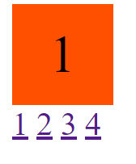

# CSS知识点梳理

## CSS是什么？

CSS是Cascading Style Sheets(层叠样式表)的简称

## CSS选择器

[CSS选择器详解](CSS选择器.md)

## 字体

### `font-family`字体族

在`font-family`中，具体字体名称中有空格，则必须加上引号，通用字体族则不能加上引号

在`font-family`中，西文字体在前，中文字体在后，效果佳的在前，效果差的在后的顺序编写，在最后必须指定一个通用字体族

五类通用字体族：

- `serif` 衬线字体
- `sans-serif` 非衬线字体
- `monospace` 等宽字体
- `cursive` 手写体
- `fantasy` 花体

注：对字体的选择是逐字进行的

### 添加自定义字体

使用`@font-face`添加自定义字体

```css
@font-face {
    font-family: "FONT_NAME"；
    src: url("URL")；
}
```

### callback机制

在对`<h1>`标签中的每一个字符进行匹配，当第一个`Helvetica Neue`字体匹配时，使用该字体渲染，未找到该字体，则尝试匹配下一个字体，当都不匹配时，找一款属于`sans-serif`通用字体族的字体渲染

```css
h1 {
    font-family: "Helvetica Neue", Arial, "Hiragino Sans GB", "WenQuanYi Micro Hei", "Microsoft YaHei", sans-serif;
}
```

## 行高 `line-height`


`line-height`是指文本行基线baseline之间的垂直距离

`line-height`只影响行内元素和其他行内内容，而不会直接影响块级元素

## 背景 `background`

### 基本使用

- 基本颜色
- url设置背景图片
- base64图片格式

### 神奇渐变色

使用`linear-gradient`设置线性渐变色

使用`radial-gradient`设置径向渐变色

[渐变色的应用](https://juejin.im/entry/589ff0be0ce46300563c2dd9)

### 雪碧图 （css sprite）

大量的网站为了减少http请求数，会将大量的图片图片合成一张雪碧图（Sprite）来使用

雪碧图的使用就是通过控制`background-position`属性值来确定图片呈现的位置

- `background` 设置背景所使用的图片
- `background-repeat` 当背景图片大小不足以撑满容器时，是否重复显示以撑满容器
- `background-position` 设置背景图片相对于x轴和y轴的偏移，px和%等可混合使用，正数表示向正方向偏移
- `background-size` 设置背景图片大小，将背景图片缩小后在移动端等高分辨率的情况下会有更好的显示

```css
background: url(test.png);
background-repeat: no-repeat;
background-position: -20px 20px;
background-size: 10px 10px;
```

## 边框 `border`

### 边框属性

- `solid` 实现
- `dotted` 点
- `dashed` 虚线

### 边框背景图

使用`border-image: url()`设置边框背景图

使用`repeat`, `round`来设置边框背景图显示样式

### 边框的衔接

任意等宽的两条边之间的衔接处是45度


通过设置两条边的宽度的不同可以使衔接处呈现任意角度，**利用此特性可以很便利的绘制梯形和三角形(将div宽度设为0)**

## `overflow`

`overflow`定义了当一个元素太大无法适应[块级格式化上下文](BFC详解.md)的情况下，元素如何显示

### 滚动

`overflow`有四个属性值：

- `visible` 显示超出部分的内容，隐藏滚动条
- `hidden` 隐藏超出部分的内容，隐藏滚动条
- `scroll` 隐藏超出部分的内容，永久显示滚动条，当内容不超出，也显示滚动条
- `auto` 隐藏超出部分的内容，按需求显示滚动条，当内容不超出，隐藏滚动条

### 滚动条的设置

滚动条默认宽度为17px(可能不同浏览器大小不同)


```css
/* 仅支持chrome */
div::-webkit-scrollbar {}
div::-webkit-scrollbar-track {}
div::::-webkit-scrollbar-thumb {}
```

### 文字折行

[三个属性视图解释](https://juejin.im/post/5b8905456fb9a01a105966b4)

#### `white-space`

控制空白字符的显示

- `normal`：默认值。空格不保留，文本会换行；不受换行符影响。
- `pre`：空格会保留，文本不换行；受换行符影响
- `nowrap`：空格不保留，文本不换行，遇`<br>`会强制换行；不受换行符影响。
- `pre-wrap`：空格会保留，文本会换行；受换行符影响。
- `pre-line`：空格不保留，文本会换行；受换行符影响。

#### `word-break`

控制单词如何被拆分换行

- `normal`：默认中英文换行规则。
- `break-all`：允许在单词内换行。对中文文本没什么影响，英文文本中单词会被拆分。
- `keep-all`：只能在半角空格或连字符处换行。对英文文本没什么影响，中文文本受影响。

#### `word-wrap` (现改名为`overflow-wrap`)

一个不能被分开的字符串太长而不能填充其包裹盒时，为防止其溢出，浏览器是否允许这样的单词中断换行

- `normal`：只在允许的断字点换行。
- `break-word`：在长单词内部进行换行。

#### 注

**`word-wrap`中的`break-word`属性也可以直接在`word-break`中使用**

#### 示例

- `normal`


- `break-all`


- `keep-all`


- `break-word`


```html
<div>
    <p>
        This is a incomprehensibilities long word.
        这 是一个不可思议的长单词
    </p>
</div>
```

```css
div {
    height: 100px;
    width: 50px;
    background: #eeeeee;
}
p {
    font-size: 10px;
    word-break: normal/ break-all/ keep-all/ break-word
}
```

### 依赖`overflow`的属性

#### `resize`

**`resize`属性要起作用，`overflow`属性值不能是`visible`**

用于拉伸元素尺寸

- `both` 水平垂直两边拉伸
- `horizontal` 只有水平方向拉伸
- `vertical` 只有垂直方向拉伸

`textarea`可拉伸的原因是`overflow: auto`

#### `text-overflow`

**`text-overflow`属性要起作用，`overflow`属性值必须是`visible`**

控制溢出内容如何显示

- `clip` 默认值，在内容区域内截断文本，可能会在字符中间发生截断
- `ellipsis` 在内容区域内截断文本，并用省略号代替被截断的文本

### 锚点定位和`overflow`选项卡

利用`overflow`的`hidden`属性将多余的选项卡暂时隐藏起来，使用锚点定位使得点击按钮后可以跳转到指定的选项卡，实现选项卡的跳转功能



```html
<div class="box">
    <div class="list" id="one">1</div>
    <div class="list" id="two">2</div>
    <div class="list" id="three">3</div>
    <div class="list" id="four">4</div>
</div>
<div class="link">
    <a href="#one" class="click">1</a>
    <a href="#two" class="click">2</a>
    <a href="#three" class="click">3</a>
    <a href="#four" class="click">4</a>
</div>
```

```css
.box {
    width: 50px;
    height: 50px;
    overflow: hidden;
}
.box .list {
    width: 50px;
    height: 50px;
    background: #ff5000;
    font-size: 26px;
}
```
