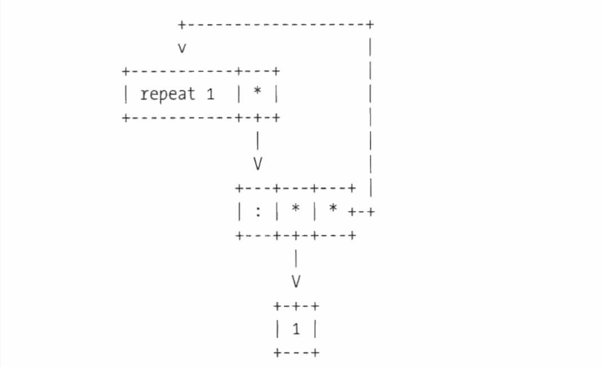
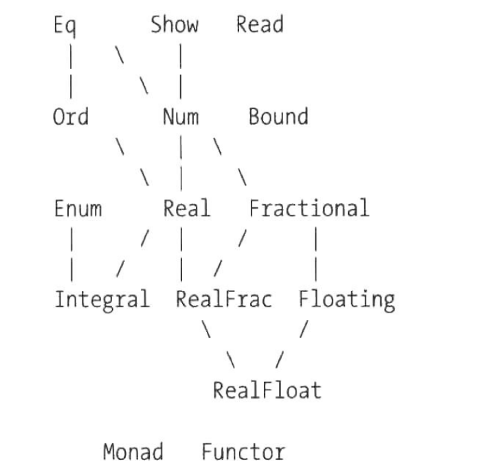
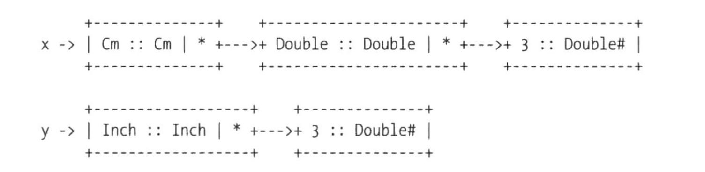

# Haskell学习笔记

## Mac安装Haskell

`brew install ghc`

## ghci

使用`ghci`进入交互式命令行

- `:info` 查看某个操作符定义，其中`infixl`表示该操作符的优先级，9为最高，1为最低
- `:set +t` 在显示返回值时显示其类型，其中`it`是haskell将最近一次结果存储在此变量中
- `:unset +t` 撤销显示返回值时显示类型
- `:m +[module]` 用于载入模块，是`:module`缩写
- `:t` 显式输出类型信息，是`:type`缩写
- `:l` 加载文件，是`:load`缩写
- `:k` 查看类型函数的类别，是`:kind`的缩写 (类别比类型高一个级别，因为它们是类型的类型)
- `:q` 退出ghci

## 变量命名

- `_` 表示不关心某个值的类型
- `x:xs` 表示列表，其中x是列表的第一个元素，xs是剩余的元素

## 中缀函数

中缀函数优先级从0-9，其中9为优先级最高，和结合性一起定义，`infix`-不结合，`infixl`-左结合，`infixr`-右结合

如果一个中缀函数没有提供优先级和结合性的说明，那么默认为`infixl 9`，即左结合，最高中缀优先级

中缀函数加括号规则：当两侧参数都存在时，不需要加括号，其余都加

## 类型推导

在没有类型说明的时候，编译器总会挑选一个满足要求的最通用的类型

例： `addOne x = x + 1 :: Int`
此时，x会被编译器类型推导为Int
而若不主动申明是Int时，会被推导为Num

## 列表

Haskell中的列表，不同于其他语言中数组的概念，其本质是单链表

```haskell
1:[2, 3]  -- [1, 2, 3]
head [1, 2, 3]  -- 1
tail [1 ,2 ,3]  -- [2, 3]
take 2 [1, 2, 3]  -- [1, 2]
drop 2 [1, 2, 3] -- [3]
replicate 3 1 -- [1, 1, 1] 构造长度为n的列表
```

### 列表在内存中的形式

由于列表的本质是单链表，`[1, 2, 3]`其本质是`1:2:3:[]`，其在内存中的表示如下图


### 为什么支持无限列表

`take 2 (repeat 1)`该函数是能够成功从无限列表中取出两个1

其中`repeat 1`在内存中存储形式如下图



在`take 2`的过程中，会以链表的形式去取两个next元素，因此可以从无限列表中成功取出元素

### 常用列表操作

- `map` 把从a到b的函数映射成了从[a]到[b]的函数，这个函数保留了元素的一一对应关系
- `filter` 把列表中所有元素进行函数运算，并将结果为True的聚合为一个列表
- `fold` 把一个列表聚合成为一个值的操作，相当于reduce操作 [fold详细说明](#折叠)

## data

使用`data`关键词创建新的数据类型

- `data` 关键字构造自定义数据类型
- `BookClass`: 类型构造器
- `BookNew`: 值构造器

```haskell
data BookClass = BookNew Int String
book = BookNew 111 "aaaa"    -- book :: BookClass
```

**其中类型构造器与只构造器名称可以相同**

其中可以为值构造器中参数设定别名

### 类型别名

- 使用`type`关键词为已存在的类型赋予一个更具描述性的别名
- 类似与C语言中的`typedef`

```haskell
type name = String
type age = Int
data Person = Person name age
```

### 代数数据类型

有一个以上的值构造器的数据类型称为袋鼠数据类型

```haskell
data Bool = True | False
data Payment = Money 
            | Alipay account
            | Wxpay account
```
     
### 元组和自定义数据类型

完全可以使用`(Int, String)`代替`Book`数据类型，但是自定义数据类型有更好的描述性

```haskell
data Book = Book Int String
```

此外，对于两个不同的数据类型，即使他们的值构造器成分相同，但是也是不同的类型

### 输出数据类型中的值

#### 1. 基础的模式匹配

```haskell
data Book = Book Int String
bookId (Book id _) = id
bookName (Book _ name) = name
```

#### 2. Record Syntax

```haskell
data Book = Book {
    bookId :: Int,
    bookName :: String
}
```

## 模式匹配

```haskell
data Color = Red
            | Yellow
color [] = []
color (x:xs) = x
```

以上两种都被称之为模式匹配，一个通过模式匹配能够正确找到其的值构造器，另一个通过模式匹配能够匹配到合适的函数

## 局部变量

### 1. `let`+`in`关键词

```haskell
hello = let word = "hello"
        in putStrLn word
```

### 2. `where`从句

```haskell
hello = putStrLn word
        where word = "hello"
```

## 递归

在haskell中由于变量的值无法改变，因此没有for等关键词来实现循序，在haskell中使用递归来实现循环

所有循环都可以用递归表示，所有递归都可以用循环表示

```haskell
-- 递归
sum1 [] = 0
sum1 (x:xs) = x + sum1 xs
-- 尾递归
sum2 acc [] = acc
sum2 acc (x:xs) = sum2 (acc + x) xs
```

## 折叠

给递归提供一种更简洁的写法 [参考资料](https://gengzhenglin.wordpress.com/2014/11/02/haskell中foldl与foldr的区别/)

### 左折叠

```haskell
foldl (+)  0            (1:2:[])
foldl (+) (0 + 1)       (2:[])
foldl (+) ((0 + 1) + 2) []
((0 + 1) + 2)
```

### 右折叠

```haskell
foldr (+) 0 (1:2:[])
1 +         foldr (+) 0 (2:[])
1 + ( 2 +   foldr (+) 0 [])
1 + (2 + 0))
```

### 左折叠和右折叠的差异

#### 1. 尾递归

由于右折叠的最后一步还是有一个和列表前一个元素计算的过程，因此无法进行尾递归优化，而左折叠是可以进行尾递归优化的

虽然foldl可以方便编译器进行尾递归优化，但以下两个式子都会出现`out of memory`的错误，因为haskell的惰性求值的原因，左递归中例如`(((0 + 1) + 2) + 3)`其并不会计算出值，而是会以表达式的形式一直保存在内存中，直到需要到这个值时，才会进行计算(因此左折叠会比较大量消耗内存以保存冗余的表达式)

```haskell
foldl (+) 0 [1..10^9]
foldr (+) 0 [1..10^9]
```

#### 2. 无穷链表

foldl: 其能明确知道展开后是一个`True&&(False...)`的形式
foldr: 其能明确知道展开后是一个`False&&(...True)`的形式

```haskell
myAndL = foldl (&&) True
> myAndL (repeat False)   -- 无法计算出结果, out of memory
```

```haskell
myAndR = foldr (&&) True
> myAndR (repeat False)   -- False
```

### 注意

由于foldl的惰性求值的原因，应该尽量避免使用foldl，如果不需要惰性求值的特效，则使用`Data.List`中的`foldl'`函数

## 匿名函数

匿名函数语法：`\parttern1 parttern2 ... -> expression`

- 整个匿名函数是一个表达式，其值是一个函数
- 匿名函数中函数签名 `(\x -> x + 1) :: Int -> Int`
- 匿名函数折行排版如下

```haskell
\x y z ->
    x + y + z
```

## 应用函数$和&

`$`和`&`函数的作用都是为其两边的表达式加上括号

- `infixr 0 $` 右结合，先计算其右边表达式的值，并将其作为参数传入左边表达式
- `infixl 1 &` 左结合，与`$`计算顺序相反

```haskell
take 2 $ repeat 1
(take 2) $ (repeat 1)  -- $作用在两边表达式加上括号
(take 2) (repeat 1)  -- 根据$定义 f $ x = f x
take 2 (repeat 1)  -- 右结合
```

## 组合函数

组合函数`.`定义

```haskell
(.) :: (b -> c) -> (a -> b) -> a -> c
f . g = \x -> f (g x)
infixr 9 .
```

## 知识点整理

- `Int` 带符号的定长整数，`Integer` 不限长度的带符号整数
- 使用`not`代替`!`作为逻辑非运算符
- 字符串是单一字符的列表
- `"c"`类型是`[Char]`，`'c'`类型是`Char`
- `"" == []` => True
- 所有类型名字都以大写字母开头，所有变量名字都以小写字母开头
- 列表可以是任意长，但只能包含类型相同的值；元组长度固定，但可以包含任意类型的值
- 当函数不是纯函数时，函数签名以`IO`开头
- 在等号右边出现的类型变量都必须在等号左侧的类型声明中出现过，但在等号左侧出现的类型变量可以不在等号右边出现

## 类型类

### 标准类型类



### 类型类声明

基本方式`instance ClassName typeVariable where method1 :: type ... method1 = default1`，以下以`Eq`举例

```haskell
class Eq a where
    (==), (/=) :: a -> a -> Bool
    x /= y = not (x == y)
    x == y = not (x /= y)
```

### 实例声明

基本形式`instance ClassName ManualType where`，以下以`Eq`举例

```haskell
instance Eq Position where
    -- 实例声明默认不允许添加函数签名，若要添加必须{-# LANGUAGE InstanceSigs #-}
    -- (==) :: Position -> Position -> Bool 
    Position x == Position y = x == y
```

### 层级和约束

每一个子类型类的实例类型也同时都是父类型类的实例

从[标准类型类图](#标准类型类)中可以看到`Eq`是`Ord`的父级类型类，因此在约束某个函数参数a满足`Ord a`之后，就不用再进一步约束`Eq a`了

Haskell支持多个类型类约束，有点类似面向对象中的多继承，但Haskell中本身不懈怠这些约束信息，因此类型类更接近面向对象中的接口

### 推导类型类

在Haskell中`Eq、Ord、Enum、Bounded、Show、Read`这些类型类是可以被自动推导(derivie)的

```haskell
data Position = Polar Double Double
                    deriving Eq
```

## type和newType和data

### type

`type`关键词用于给类型设定别名，提高代码可读性

**由于type是给类型设定别名，因此首字母必须大写**

```haskell
type Id = Int
type Name = String
data Book = Book Id Name
```

### data

`data`关键词用于创建自定义类型，详见[data](#data)

### newType

`newType`关键词只允许你定一个只包含一个只构造函数，且只构造函数中只接受一个参数的数据类型

```haskell
data Cm = Cm Double
newType Inch = Inch Double
x = Cm 3
y = Inch 4
```



在`data Cm`中可以看到其装载了一个`Double :: Double`的盒子，其本质是对底层的`Double`类型进行了次打包
而在`newType Inch`中，由于其只允许接受一个参数，因此在编译阶段可以放心的把装载`Double`的盒子替换掉，这也是**`newType`比`data`速度更快的原因**


