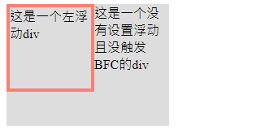
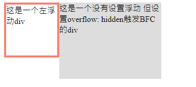

# BFC详解

## 常见定位方案

### 普通流 (normal flow)

在普通流中，元素按照其在 HTML 中的先后位置至上而下布局，在这个过程中，行内元素水平排列，直到当行被占满然后换行，块级元素则会被渲染为完整的一个新行，除非另外指定，否则所有元素默认都是普通流定位，也可以说，普通流中元素的位置由该元素在 HTML 文档中的位置决定。

### 浮动 (float)

在浮动布局中，元素首先按照普通流的位置出现，然后根据浮动的方向尽可能的向左边或右边偏移，其效果与印刷排版中的文本环绕相似。

### 绝对定位 (absolute positioning)

在绝对定位布局中，元素会整体脱离普通流，因此绝对定位元素不会对其兄弟元素造成影响，而元素具体的位置由绝对定位的坐标决定。

## 什么是BFC？

BFC 即 Block Formatting Contexts (块级格式化上下文)，它属于上述定位方案的普通流。

具有 BFC 特性的元素可以看作是隔离了的独立容器，容器里面的元素不会在布局上影响到外面的元素。

通俗一点来讲，可以把BFC理解为一个封闭的大箱子，无论内部元素如何翻江倒海(即使内部元素超出了BFC容器大小)，但都不会影响到**外部布局**。

## BFC触发条件

只要元素满足下面任一条件即可触发 BFC 特性：

- body 根元素
- 浮动元素：float 除 none 以外的值
- 绝对定位元素：position (absolute、fixed)
- display 为 inline-block、table-cells、flex
- overflow 除了 visible 以外的值 (hidden、auto、scroll)

## BFC特性

### 在同一BFC中外边距会折叠

在第一张效果图中可以看出上个div的下边距50px和下个div的上边距合并为了50px，这是因为它们都处在body根元素这个BFC内，因此下边距和上边距会合并，所以为了解决上下边距折叠问题，可以使两个div处在不同的BFC容器中，为两个div的父元素添加`overflow: hidden`属性，当两个div处在不同的BFC中，边距折叠问题解决


```html
<div class="container">
    <div class="inner"></div>
</div>
<div class="container">
    <div class="inner"></div>
</div>
```

```css
.container {
    overflow: hidden;
}
.inner {
    width: 50px;
    height: 50px;
    margin: 50px;
    background: lightblue;
}
```

### BFC可以清除浮动

为父元素添加`overflow: hidden`属性，触发BFC特性，解决float造成的父元素高度塌陷问题 [float详解](float详解.md)


```html
<div class="container">
    <div class="inner"></div>
</div>
```

```css
.container {
    overflow: hidden;
    border: 4px solid salmon;
}
.inner {
    float: left;
    width: 50px;
    height: 50px;
    background: lightblue;
}
```

### BFC可以阻止元素被浮动元素覆盖

根据float特性，脱离了文档流但没有脱离文本流，所以虽然文字会环绕float元素展示，但第二个元素会被float元素覆盖一部分，此时，设置第二个元素属性，触发BFC特性，避免第二个元素被覆盖

利用BFC此特性，还可以实现两列自适应布局(只需将第二个元素width去除)





```html
<div class="left">
    这是一个左浮动div
</div>
<div class="right">
    这是一个没有设置浮动 但设置overflow: hidden触发BFC的div
</div>
```

```css
.left {
    float: left;
    width: 100px;
    height: 100px;
    border: 4px solid salmon;
}
.right {
    overflow: hidden;
    width: 200px;
    height: 150px;
    background: #dddddd;
}
```
