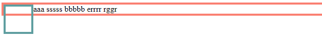
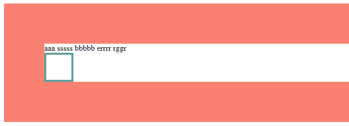
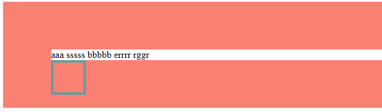
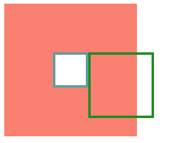

# absolute详解

## `absolute`是什么？

`absolute`是属性`position`的一个取值

### `position` ：指定一个元素在文档中的定位方式

- `static` 元素使用正常的布局行为，`top`, `right`, `bottom`, `left` 和 `z-index `属性无效
- `relative` 在相对于正常布局的位置进行偏移，因此不会改变页面布局 
- `absolute` 元素脱离文档流，相对于最近的非 static 定位祖先元素的偏移
- `fixed` 元素脱离文档流，相对于屏幕视口（viewport）的位置进行偏移

## `absolute`两大特性

`absolute`与`float`两大特性相似

### 包裹性

设置了`absolute`属性的`div`会包裹住其内部所有元素


```html
<div class="outer">
    <div class="inner">
    </div>
</div>
```

```css
.outer  {
    position: absolute;
    border: 4px solid salmon;
}
.inner  {
    width: 50px;
    height: 50px;
    border: 4px solid cadetblue;
}
```

### 破坏性(高度塌陷)

由于设置了`absolute`属性的元素脱离了文档流，因此该元素不再被包括在外部元素中，于是该元素的外部元素会忽略该元素的高度，造成高度塌陷


```html
<div class="outer">
    <div class="inner">
    </div>
</div>
```

```css
.outer  {
    border: 4px solid salmon;
}
.inner  {
    position: absolute;
    width: 50px;
    height: 50px;
    border: 4px solid cadetblue;
}
```

## `absolute`和`float`的区别

虽然两者都有包裹性和高度塌陷的特性，但是设置了`float`属性的元素脱离了文档流，但没脱离文本流，而设置了`absolute`属性的元素既脱离了文档流也脱离了文本流




## `absolute`的使用

### `absolute`定位的位置

#### 无依赖的`absolute`处于正常文档流中

当只设置了`absolute`，但未设置`left`等值时，且没有`position: static`以外的父元素，其相当于`body`定位，其位置即是该元素在未设置`absolute`时在正常文档流里的位置





```html
<div class="outer">
    <span>aaa sssss bbbbb errrr rggr </span>
    <div class="inner">
    </div>
</div>
```

```css
.outer  {
    border: 80px solid salmon;
}
.inner  {
    position: absolute;
    width: 50px;
    height: 50px;
    border: 4px solid cadetblue;
}
```

#### 设置`absolute`属性后该元素宽高为0

正常文档流情况下由于`inner1`的宽高已经占满了`outer`容器，因此`inner2`即使是`inline-block`，也应该在`inner1`的下方，但是`inner2`设置了`absolute`属性，宽高为0，在未脱离文档流的正常文档流的情况下，会贴在`inner1`之后



```html
<div class="outer">
    <div class="inner1">
    </div>
    <div class="inner2">
     </div>
</div>
```

```css
.outer {
    height: 58px;
    width: 58px;
    border: 80px solid salmon;
    font-size: 0;
}
.inner1 {
    display: inline-block;
    width: 50px;
    height: 50px;
    border: 4px solid cadetblue;
}
.inner2 {
    position: absolute;
    display: inline-block;
    width: 100px;
    height: 100px;
    border: 4px solid forestgreen;
}
```

### `absolute`如何使用？

`absolute`和`relative`不是必须一起出现的，当`absolute`元素没有`position: static`以外的父元素，那将相对`body`定位，此时称作无依赖的`absolute`，利用`absolute`在正常文档流时的定位可以更好的进行定位，**无依赖的absolute更为强大**

- 使用无依赖的`absolute`定位时，其相对于`body`定位，但若其有非`position: static`父容器，则相对于这个父容器定位
- 使用`absolute`将不需要显示的元素绝对定位到屏幕看不到的位置，代替`display: none`
- 使用无依赖的`absolute`确定位置，可以保证外容器内的容器改变时，该元素也能正确找到位置
- 但使用无依赖的`absolute`进行偏移时，可以使用`margin`值代替`left`等值
- 当多个`absolute`重叠时，后来者在上方，覆盖前者，只有特别复杂且多个的绝对定位时才需要`z-index`控制
- 绝对定位时当`left`,`right`,`top`,`bottom`相互冲突时，偏移效果会变为拉伸效果，设置`absolute`和`left`,`right`,`top`,`bottom`都为0使得元素拉伸到充满全屏，实现全屏自适应的效果
- `left`,`right`,`top`,`bottom`与`width`,`height`同时存在时，`width`和`height`优先级高
- `left`,`right`,`top`,`bottom`相互冲突且`width`,`height`存在时，使用`margin: auto`使得元素绝对居中
