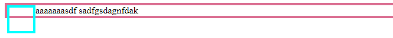

# float详解


## `float`是什么？

`Float`最初的诞生仅仅是为了解决文字与图片环绕排版的问题

设置了`Float`的元素会脱离文档流，但不会脱离文本流



蓝色框的div脱离了父`div`，即脱离了文档流

文字还是从蓝色框`div`后开始输出，即没有脱离文本流

```html
<div class="father">
    <div class="son">
    </div>
    <span>aaaaaaasdf sadfgsdagnfdak</span>
</div>
```

```css
.father {
    border: 4px solid palevioletred;
}
.son {
    float: left;
    width: 40px;
    height: 40px;
    border: 4px solid aqua;
}
```


## `float`两大特性

### 包裹性

设置了`float`属性的`div`会包裹住其内部所有元素


```html
<div class="outer">
    <div class="inner">
    </div>
</div>
```

```css
.outer {
    float: left;
    border: 4px solid palevioletred;
}
.son {
    width: 40px;
    height: 40px;
    border: 4px solid aqua;
}
```


### 破坏性(高度塌陷)

破坏性即是指**高度塌陷**

由于设置了`float`属性的元素脱离了文档流，因此该元素不再被包括在父元素中，于是该元素的父元素会忽略该元素的高度，造成高度塌陷，


```html
<div class="father">
    <div class="son">
    </div>
</div>
```

```css
.father {
    border: 4px solid palevioletred;
}
.son {
    float: left;
    width: 40px;
    height: 40px;
    border: 4px solid aqua;
}
```


## 清除浮动(解决高度塌陷问题)


### 方法一

将父元素转为BFC（块格式化上下文）[BFC详解](BFC详解.md)

设置父元素的`overflow`属性，不为`visible`即可(还有很多方法，只要转为BFC即可)

```css
.father {
    overflow: auto/ hidden;
}
```

### 方法二

在设置了float属性的元素下新增一个`class`为`fix`的`div`元素

```css
.fix {
    height: 0;
    font-size: 0;
    clear: both;
}
```

### 方法三

在父元素中添加伪元素`:after`

```css
.father::after {
    content: "";
    height: 0;
    display: block;
    clear: both;
}
```


## `clear`属性

clear 属性规定元素的哪一侧不允许其他浮动元素

- `right` 在右侧不允许浮动元素
- `left` 在左侧不允许浮动元素
- `both` 在左右两侧均不允许浮动元素