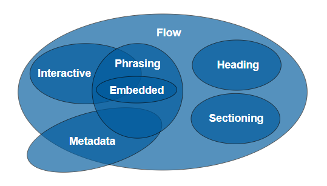

# HTML知识点梳理

## HTML是什么？

HTML是HyperText Markup Language(超级文本标记语言)的简称

HTML不代表网页，网页是一个超文本资源的节点

## HTML常见元素

[HTML元素官方详解](https://www.w3.org/TR/html5/text-level-semantics.html)

### head

- `<meta>`
- `<title>`
- `<style>`
- `<link>`
- `<script>`
- `<base>`

#### `<meta>` 详解

```html
<!-- 设置HTML编码为utf8 -->
<meta charset="utf8" />
<!-- 设置展示页面宽度与页面宽度相等，适配移动端的第一步 -->
<meta name="viewport" content="width=device-width, initial-scale=1.0, maximum-scale=1.0, user-scalable=no" />
```

### body

- `<div>` , `<section>` , `<article>` , `<aside>` , `<header>` , `<footer>`
- `<p>`
- `<span>` , `<em>` , `<strong>`
- `<table>` , `<th>` , `<tr>` , `<td>`
- `<ul>` , `<ol>` , `<li>` , `<dl>` , `<dt>` , `<dd>`
- `<a>`
- `<form>` , `<input>` ,`<select>` , `<textarea>` , `<button>`

## HTML重要属性

- `div[class, id]`
- `a[href, target]`
- `img[src, alt]`
- `table td[colspan, rowspan]`
- `form[target, method, enctype]`
- `input[type, value]`
- `button[type]`
- `select>option[value]`
- `label[for]`

### `<a>` 属性详解

```html
<!-- 在当前标签页打开链接，等效_self -->
<a href="http://baidu.com">百度</a>
<!-- 在新标签页打开链接 -->
<a href="http://baidu.com" target="_blank">百度</a>
```

### `<input>` 属性详解

```html
<!-- 当name属性相同时，代表该两个radio是一组的 -->
<input id="radio1-1" type="radio" name="radio1" />
<input id="radio1-2" type="radio" name="radio1" />
```

### `<label>` 属性详解

```html
<!-- 当label中的for属性绑定lid值时，点选label中的值也能够选择单选框 -->
<input id="radio1-1" type="radio" name="radio1" />
<label for="radio1-1">选项一</label>
```

## HTML元素分类

### 按默认样式分类

#### block 块级元素

block元素会单独占据一行，下一个block元素会新起一行

block元素宽度不设置的情况下，自动填满其父元素宽度

block元素可以设置width, height, margin, padding属性，block元素即使设置了宽度，仍独占一行

例 : `<div>` , `<form>` , `<section>` , `<p>` , `<table>` , `<h1>-<h6>`

#### inline 内联元素

inline元素不会独占一行，多个相邻的行内元素会排列在同一行里，直到一行排列不下，才会新换一行

inline元素设置width, height属性无效，水平方向上的margin和padding有效，垂直方向上的无效

例 : `<span>` , `<a>` , `<strong>` , `<em>` , `<label>` ,

#### inline-block

inline-block具有block和inline的特性，即元素能够在一行展示，并且能设置width和height

例 : `<input>` , `` , `<select>`

### 按内容分类



[W3官网动态展示](https://www.w3.org/TR/html5/dom.html#kinds-of-content)

## HTML元素的默认样式

不同浏览器会对一些元素做一定的默认样式渲染，为了防止默认样式对渲染的影响，需充值HTML默认元素样式

### 方法一：CSS Reset

将[CSS Reset文件](https://meyerweb.com/eric/tools/css/reset/)导入HTML文件中

### 方法二：在`<head>`中设置默认样式

```html
<head>
    <style>
        * {
            margin: 0;
            padding: 0;
        }
        li {
            list-style: none;
        }
        img {
            vertical-align: top;
            border: none;
        }
    </style>
</head>
```

## HTML版本

### 比较HTML4和XHTML和HTML5

- `HTML4` ：基于SGML，规范比较松
- `XHTML` ：基于XML，规范严格，需引用xmlns
- `HTML5` ：规范较松，新增标签和API

### HTML5的变化

#### 新增语义化元素

- `<header>/<footer>` 头尾
- `<section>/<srticle>` 区块
- `<nav>` 导航
- `<aside>` 不重要内容
- `<em>/<strong>` 强调，代替`<i>/<b>`
- `<i>` 由斜体转为icon

#### 表单增强

- 新的`input`类型 ：`color`, `email` , `date` , `url`...
- 新的`input`类型 ：`required` , `autofocus` , `placeholder`...
- 新的`input`元素 ：`<output>` , `<keygen>` , `<datalist>`...

#### 新的API

- 离线
- 音视频
- 图像
- 实时通信
- 本地存储
- 设备能力

## HTML中的小问题

### `<a>`元素中能嵌套`<div>`元素吗？

答案是能也不能，这取决于`<a>`元素的父亲元素

在HTML5中`<a>`元素([`<a>`元素详解](https://www.w3.org/TR/html5/text-level-semantics.html#the-a-element))是透明的，即在计算标签嵌套合法性时忽略`<a>`元素，所以只要`<a>`元素外的元素能嵌套`<div>`元素即可

#### HTML中的嵌套规则

- block元素可以包含inline元素    `<div> --> <span>`
- block元素不一定能包含block元素    `<p> -/-> <div>`
- inline元素一般不能包含block元素

### `<em>`和`<i>`有什么区别？

- `<em>`是语义化标签，表示强调
- `<i>`是纯样式标签，表示斜体
- `<em>` 和`<i>`显示效果都是斜体
- HTML5中不推荐使用`<i>`，一般用作图标

### 那些元素可以自闭合？

- 表单元素 `<input>`
- 图片 ``
- `<br>` , `<hr>`
- `<meta>` , `<link>`

### property和attribute的区别？

- property是DOM中的属性，是JavaScript里的对象
- attribute是HTML标签上的特性，它的值只能够是字符串
