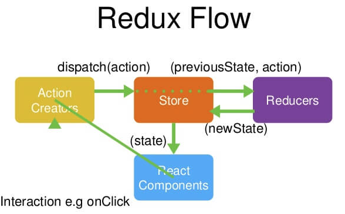
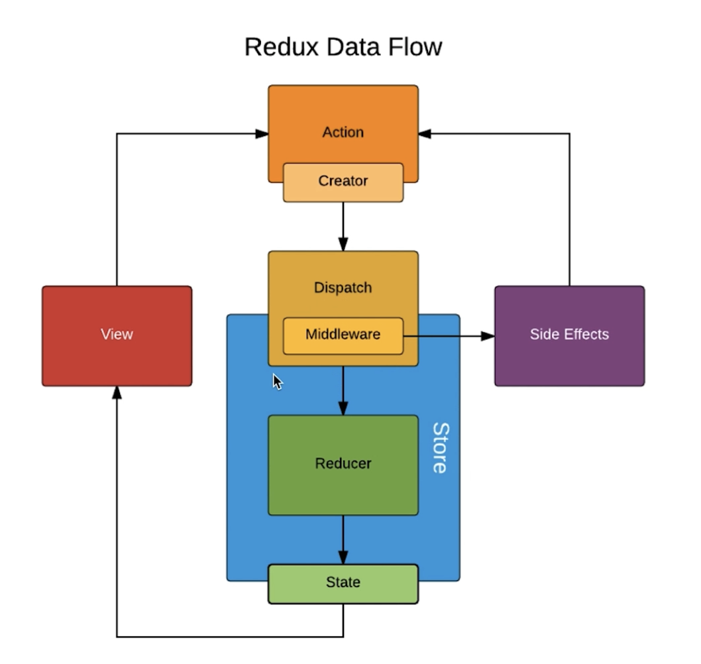

# Redux杂录

React仅仅只是一个UI层的框架，其中数据传递是单向的，因此管理数据传递等是很麻烦的

而Redux正是数据层的框架，使得React中的数据管理更简单

## Chrome中调试的插件

[Redux插件GitHub](https://github.com/zalmoxisus/redux-devtools-extension)

在`createStore()`时添加`window.__REDUX_DEVTOOLS_EXTENSION__ && window.__REDUX_DEVTOOLS_EXTENSION__()`参数以启动Redux插件

在F12中能找到Redux界面

## 图解Redux



总体流程：
- Component中的数据统一存储在Store中(Store是唯一的)
- Component中渲染时从Store中取数据
- Component中修改数据时，通过ActionCreator发送给Store
- Store将Action传递给Reducer处理
  - Reducer中必须是纯函数
  - Reducer中返回一个新的State，而不是直接在传入的State上进行修改
  - Reducer中不得修改state数据
  - 只有Store才能改变State中的值
- Store中值更新后让Component重新渲染

关键函数：
- `createStore()`创建Store
- 组件通过`store.dispatch()`发出更改数据的action
- 组件中通过`store.getState()`获取数据
- 组件通过`store.subscribe()`订阅store，即store中数据发生变化就被感知到，然后调用该方法的回调函数

## Redux中间件

如下图所示：中间件位于dispatch之后，但在store交给reducer处理之前



### redux-thunk

可以将简单的ajax异步操作交给Redux-thunk中间件处理，通过Redux-thunk不但可以在dispatch中传递action对象，还可以传递函数

```js
// 可以将如下函数交由dispatch处理
function doSomething() {
    return (dispatch) => {
        // do some async logic
        const action = getAction();
        dispatch(action)
    }
}
```

## react-redux

通过react-redux使得在react中可以更方便的使用redux

### 1. `import { Provider } from "react-redux";`

将组件用Provider包裹起来，使得被Provider包裹的组件都能够使用到state

```js
import store from "./store/index";
const App = (
  <Provider store={store}>
    <TodoList />
  </Provider>
);
```

### 2. `import { connect } from "react-redux";`

通过connect方法将组件与state和dispatch方法组合起来

```js
const mapStateToProps = state => {
  return {
    inputValue: state.inputValue,
  };
};

const mapDispatchToProps = dispatch => {
  return {
    handleInputValue(e) {
      const action = getInputValueAction(e.target.value);
      dispatch(action);
    }
  };
};

export default connect(mapStateToProps, mapDispatchToProps)(TodoList);
```


