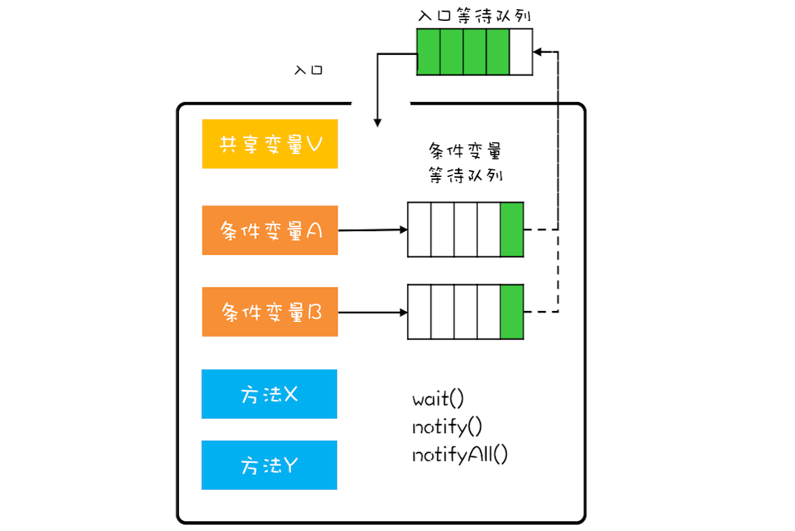

# Java并发编程实战

## 并发基础

并发的潜在的问题：
- 缓存导致的可见性问题
- 线程切换导致的原子性问题（原子性的本质：操作的中间状态对外不可见）
- 编译优化导致的有序性问题

Java内存模型：规范了JVM如何按需禁用缓存和编译优化，其中的Happens-Before规则本质是一种可见性，A Happens-Before B代表A对于B是可见的

如何避免死锁：
- 互斥：（用锁的目的就是互斥，因此这点无法避免）
- 占有且等待：一次性申请所有资源
- 不可抢占：占有了部分资源的线程申请其他资源时，如果申请不到则释放其已占有的资源
- 循环等待：给所有资源排序，申请时按资源序号顺序申请，线性化的申请就会不造成循环等待

活锁：线程虽然没有阻塞，但仍然存在无法继续执行的情况，比如两个线程互相谦让，于是就无休止的谦让下去，两个线程都无法执行下去
解决方法：谦让时随机等待一个时间，这样谦让后再次碰撞的概率就很小了

线程饥饿：线程因无法获取到所需的资源而无法继续执行下去的情况
解决方案：公平的分配资源，在并发编程中主要就是使用公平锁

### 管程

管程，对应的英文是Monitor，指的管理共享变量以及对共享变量的操作过程，让他们支持并发 

管程和信号量是等价的，就是用管程能够实现信号量，也能用信号量实现管程

Java中管程使用的是MESA模型。每个共享变量（这里指的是锁对象）都对应着一个等待队列，每个只有一个线程可以进入管程内，其他线程就必须在等待队列中等着。此外管程中还有条件变量的概念，每个条件变量都对应着个等待队列，当某个线程需要等待满足某个条件变量就会被先添加到这个条件变量对应的等待队列中，当这个条件满足后，会将这个线程移到共享变量的等待队列中，从而该线程就可以等待进入管程内了

`synchronized`、`Lock`、`Condition`都是管程技术

以`synchronized`举例，`synchronized`锁住的对象就是管程中的共享变量，每个线程执行到`synchronized`处都是进入共享变量的等待队列中等待进入管程内，`synchronized`管程内只有一个条件变量（`Lock`中创建几个`Condition`就对应有几个条件变量），当调用`wait`就将改线程加入这个条件变量的等待队列中，当调用`notify`就将该线程从条件变量的等待队列移到共享变量的等待队列等待进入管程内部，`notifyAll`则就是将条件变量的等待队列中的所有线程都移到共享变量的等待队列中

MESA模型下，`wait/await`必须放在`while`循环中调用，这是因为MESA模型下，线程调用`notify/signal`后被唤醒的线程并不会立刻执行，而是会被先加入共享变量的等待队列，等待能够执行的时机，因此在此期间很可能本来满足的条件现在又不满足了，因此需要使用循环校验的方法

### 线程状态

JVM层面并不关心操作系统的调度状态，所以无论是等待CPU使用权还是IO阻塞都没区别，都算RUNNABLE状态

### 线程数量

- 不要过分相信线程数计算公式，尽可能将线程池参数动态化可配置
- 估算IO耗时和CPU耗时，估算出参数后进行压测，以验证估算值是否合适
- 不要盲目增加线程数，线程数增加是会增加内存和CPU的消耗的，找出当前的性能瓶颈针对性优化

### 最佳实践

1. `synchronized`锁的对象应是私有的、不可变的、不可重用的，因此锁对象最好加上`final`关键词
1. 不要使用Integer、String、Boolean等这种包装类型作为锁对象，因为JVM中对这些类型有缓存对象，即可能预期锁的是不同的Integer对象，但实质上它们指向的是同一个对象
2. 原子操作 + 原子操作并不等于原子操作
3. 在触发`InterruptedException`异常的同时，JVM会把线程的中断标志位清除，也就是`isInterrupted`返回的是false，而像`sleep`、`wait`等方法都是会显式抛出`InterruptedException`异常的，正确的做法是在捕获中断异常后再次调用`interrupt()`重新设置中断位标识

## 线程池

Java中的线程池和一般的池化资源不同，一般的池化资源往往通过acquire来获取资源和release来释放资源，然而Java中的线程池并没有提供这样的方法，Java中的线程池更类似于生产者-消费者的模式，线程池的使用者就是生产者，线程池本身就是消费者，线程池对外提供execute方法来提交Runnable对象

线程池最佳实践：
- 不要使用无界的LinkedBlockingQueue，高负载下无界队列很容易导致OOM，而OOM会导致所有的请求都无法处理
- 不要使用线程池默认的拒绝策略，默认的拒绝策略会抛出异常然后直接丢弃，对于重要的任务可以降级处理，写入数据库或发到消息队列，由别的线程进行补偿
- execute提交的业务代码用try/catch包裹起来，显式处理异常，因为线程池中提交的任务如果出现运行时异常会导致执行任务的线程直接终止，也就是任务出现了异常但却获取不到任何通知，会让人误以为任务都正常执行
- 通过实现ThreadFactory为线程池中的线程名字赋予业务含义
- 不同业务间的线程池应当隔离，而不是整个项目共用一个线程池

异步相关：
- Runnable：不能返回任务的执行结果
- Callable：可以返回任务的执行结果
- Future：用于获取任务的执行结果，Future就类似于Js中的Promise，就是一个保证，保证说从这里可以拿到异步线程中的执行结果
- FutureTask：其实现了Runnable和Future接口，因此可以当做Runnable传入，但可以通过get获取到执行结果
- CompletableFuture：支持回调函数，通过`thenApply/thenSupply`等方法链式将回调函数串联起来
- CompletionService：管理批量异步任务，让异步任务的执行结果有序化，比如可以处理多个异步任务中最先执行完成的任务结果

### ForkJoinPool

Fork/Join是一个并行计算框架，核心就是分而治之，在Java中分治任务为ForkJoinTask，分支任务的线程池为ForkJoinTask

普通的线程池内部只有一个任务队列，而ForkJoinPool内部则有多个任务队列，当提交任务后ForkJoinPool会根据路由规则提交到一个任务队列中，如果在ForkJoinPool执行过程中创建出来的子任务则会提交到当前线程对应的任务队列中，并且当线程对应的任务队列空了后，该线程会去别的任务队列中窃取出任务来执行（ForkJoinPool内部队列采用的是双端队列，正常获取任务和窃取任务分别在队列两端获取，以避免不必要的数据竞争）

Java中Stream的并行流使用的是ForkJoinPool，默认情况下所有并行流计算都是共享一个ForkJoinPool，这个共享的ForkJoinPool默认的线程数是CPU核数，如果都是CPU密集型计算的话没有问题，但如果是IO密集型的话就很可能因为某个慢IO拖慢了整个系统的性能，所以建议用不同的ForkJoinPool执行不同类型的计算任务

此外CompletableFuture默认使用的线程池也是ForkJoinPool，所以建议根据不同的业务为CompletableFuture设置不同的线程池

## 并发工具类

### Semaphore

信号量模型：计数器 + 等待队列
- `init()`：设置计数器初始值
- `down()`：计数器值减1，如果此时计数器值小于0，则当前线程将被阻塞，反之则可以继续运行
- `up()`：计数器值加1，如果此时计数器值小于等于0，则唤醒等待队列中的一个线程并将其移出等待队列（为什么此处计数器等于0也要唤醒，因为如果计数器为0时某个线程down()，这个线程就会被阻塞，而别的线程up()，此时计数器值为0，但等待队列中还是有阻塞的线程的）

init、down、up三个方法都需要是原子性的，Java中Semaphore这个类实现了信号量模型并保证了这三个方法都是原子性的

注：信号量模型中必须保证down的次数必须等于up的次数，否则就会导致计数器的值越来越小，直到线程永久阻塞

Semaphore相较于Lock除了一个是信号量另一个互斥锁（管程），最大的不同是Semaphore允许多个线程访问一个临界区，因此Semaphore非常适合用来实现一个限流器

### ReadWriteLock

读写锁模型：
- 允许多个线程同时读共享变量
- 只允许一个线程写共享变量
- 如果写线程正在执行写操作，此时禁止读线程执行读操作

ReadWriteLock是Java中读写锁的实现

读写锁和互斥锁：读写锁允许同时多个线程读共享变量，而互斥锁是不允许的，因此读写锁在读多写少的场景下性能优于互斥锁

读写锁应用场景：不希望读操作读取到写操作执行到一半的数据，如果用互斥锁就必须读和写操作都加上锁，那么读操作间也会互斥
不是读写锁应用场景：读操作必须读到最新的数据，写操作加互斥锁，共享变量加`volatile`即可

ReadWriteLock的锁的升降级策略
- 读锁无法升级成写锁（如果两个读锁同时申请写锁，那么都要等待另一个释放读锁，这就造成了死锁）
- 写锁可以降级为读锁

### CountDownLatch和CyclicBarrier

CountDownLatch：一个线程等待多个线程的场景，或多个线程等待一个线程的场景

注：CountDownLatch中countDown一旦到0后，再await就没有意义了，是不会被阻塞的，需要新建一个CountDownLatch对象

CyclicBarrier：与CountDownLatch基本相同，但其的计数器是可以循环利用的

此外CyclicBarrier可以设置回调函数，即当计数器每次到0后回自动执行，但要注意CyclicBarrier会在执行完回调函数后再唤醒等待的线程，因此如果希望回调函数也能并行执行的话就需要将回调函数包在新线程中执行（当遇到回调函数时都需要关注回调函数是在哪个线程中执行的，这至关重要）

### 同步容器和并发容器

如何将非线程安全的容器变成线程安全的容器？最简单的方法就是将非线程安全的容器封装在对象内部，然后控制对象的对外的方法即可

Java在Collections中提供了一系列方法`Collections.synchronziedList()/synchronizedSet()/synchronizedMap()`将非线程安全的容器转化成线程安全的容器

同步容器的坑：
- 原子操作 + 原子操作 不等于 原子操作
- 使用迭代器遍历容器不是原子性，如果要求原子性，可以通过`synchronzied`所在该容器对象再遍历

通过`synchronzied`实现的线程安全的容器称为同步容器，性能比较差，因此JDK中还提供性能更高的容器，称为并发容器

List：CopyOnWriteArrayList，其写操作时将共享变量复制出来一份进行修改，好处就是读操作完全无锁，其适用于读多写少的场景，并且存在短暂的读写不一致

Map：ConcurrentHashMap

Set：ConcurrentHashSet

Queue：分为阻塞和非阻塞、单端和双端，阻塞队列都有Blocking标识，单端使用Queue标识，双端使用Dequeu标识

### 原子类

原子类采用的是无锁的方案，相较于互斥锁的方案，最大的好处就是性能，无锁就不需要执行加锁、解锁、也不会存在因拿不到锁而进入阻塞状态，进而触发线程切换

无锁的核心就是CAS（Compare And Swap），而CAS的原子性是直接由硬件支持的，CAS直接作为一条CPU指令以保证原子性

CAS会存在ABA问题，但通过增加版本号即可，`AtomicStampedReference`和`AtomicMarkableReference`这两个原子类就是通过加版本号的方式解决了ABA问题

### ThreadLocal

ThreadLocal与内存泄漏：
- ThreadLocalMap对象在Thread中而不是ThreadLocal中，因为这样不容易产生内存泄漏，因为如果ThreadLocalMap在ThreadLocal中，只要ThreadLocal对象存在Map中的Thread对象就无法被回收
- ThreadLocalMap中key是对ThreadLocal的弱引用，因此只要ThreadLocal不再被其他地方强引用，那么该key就可以被回收，避免内存泄漏
- ThreadLocalMap中value是强引用，当key被回收后value因为还是强引用因此无法被回收，就会造成内存泄漏（根本原因是线程往往生命周期很长，和整个程序共生死，所以过程中如果大量value没有被回收造成内存泄漏会有较大影响），因此最佳实践是在`finally`中显式将资源手动释放

## 并发设计模式

- Immutability模式：通过对象的不可变性来解决并发问题，本质是避免了共享
- CopyOnWrite模式：CopyOnWrite其实就是一种不可变性的实现，其是一种延迟策略，在真正需要复制的时候才复制
- 线程本地存储模式：每个线程本地保存一份对象，对象无需共享也就解决了线程安全问题
- Guarded Suspension模式：通过等待-通知机制来实现多线程下if的正确性，内部通过一个Map将ID值和对应的锁对象/Future关联起来，从而使得其他线程能够找到对应的线程并唤醒
- Balking模式：通过互斥锁来实现多线程下if的正确性
- Thread-Per-Message模式：为每个消息/任务分配一个线程处理，但在Java中创建一个线程成本太高，频繁创建线程很容易造成OOM，可以选择像Go一样提供用户级别的轻量级线程（协程）
- Worker Thread模式：将每个任务都塞到队列中等待线程自行取出来执行，这其实就是线程池，可以避免线程频繁的创建、销毁问题，还可以限制线程数的最大数量
- 两阶段终止模式：检测线程的中断状态 + 检测自定义的终止标记位，如果仅检测线程的中断状态，可能调用的第三方库中对中断异常进行了处理（触发InterruptedException后interrupted标记位会被置回false），而如果仅检测自定义终止标记位，可能线程处在休眠状态
- Consumer-Producer模式：基本和Worker Thread模式相同，但其支持多个任务一起消费（一次性取出多个任务后再处理），而Worker Thread模式则必须一个一个任务进行处理（Consumer-Producer模式下可以通过毒丸方式优雅的终止线程，即生产者发送一条特殊的任务，消费者线程消费到这个特殊的任务就明白要终止线程）

## 案例分析

### Guava RateLimiter

令牌桶算法：定时向令牌桶发送令牌，请求能够从令牌桶中拿到令牌，然后才能通过限流器
漏桶算法：当漏桶还未满时请求可以注入漏桶中，漏桶会按照一定的速率将桶内的请求漏掉

Guava RateLimiter采用的是令牌桶算法，但其并不是通过定时器定时像桶内添加令牌的方式实现的，因为当并发量很大时，系统压力接近极限，此时定时器的误差就会非常大，使得令牌不能及时添加到桶内，此外定时器本身就会创建调度线程，也会对系统性能有一定损耗，因此Guava采用的是记录并动态计算下一令牌的发放时间的实现方式

实现原理：
- 线程在下一令牌产生时间之前请求令牌：比如限流速率为1个请求/秒，此时时间为第1秒，有一个线程请求令牌，就占用掉第1秒的令牌然后立即返回，同时再有一个线程请求令牌，就占用掉第2秒的令牌，因此这个线程请求令牌就被阻塞等待1秒
- 线程在下一令牌产生时间之后请求令牌：比如限流速率为1个请求/秒，桶大小为2，从第1秒开始产生的令牌就没有被使用，在第4秒时一个线程请求令牌，就可以使用第1秒产生的令牌然后立即返回，同时再有一个线程请求令牌，就使用第2秒产生的令牌然后立即返回，同时如果还有个线程请求令牌，因为桶大小为2，第1秒和第2秒的产生的令牌可以放在桶内，但第3秒和第4秒产生的令牌因为超过桶的大小就被丢弃了（也可以理解为桶内放的是第3秒和第4秒的令牌，第1秒和第2秒的令牌被丢弃了），此时这个线程就得占用第5秒的令牌，也就是得阻塞等待1秒后才能返回

### Disruptor

由于ArrayBlockingQueue和LinkedBlockingQueue都是基于ReentrantLock实现的，在高并发场景下锁的效率并不高，而Disruptor则是款高性能的有界内存队列

1. 使用RingBuffer作为数据存储，其本质就是个收尾相连的数组，在RingBuffer初始化时就会把这个数组中的所有元素一起初始化，其好处就是大概率这些元素在内存上都是连续的（数组本身的一定是连续的，这里指的连续是指数组中的元素是指针，指向的真正对象是连续的），根据局部性原则消费了第一个元素很可能就要消费第2个元素，此时第2个元素很可能就在cache中了，这样就不需要从内存中加载了
2. 通过缓存行填充避免伪共享，伪共享指的是两个变量被放在同一个缓存行内，当其中一个变量被修改后该缓存行就会失效，从而就导致了另一个变量的缓存失效
3. 向RingBuffer中新增元素并不会创建一个新元素，而是覆盖替换索引出所在的元素，也就是RingBuffer中的元素是可以循环利用的，不像链表每次都需要创建个新节点（需要指向前一个节点和指向后一个节点的指针）
4. RingBuffer中只维护了入队索引，而没有维护出队索引，因为Disruptor中多个消费者可以同时消费，每个消费者都会有一个出队索引，此外因为出队是不会删除RingBuffer中的元素的，也就不需要出队索引
5. 入队操作时通过对入队索引的CAS操作实现无锁

时间局部性：程序中某条指令一旦被执行，不久之后这条指令很可能再次被执行
空间局部性：某块内存一旦被访问，不久之后这块内存附近的内存很可能也被访问

## 并发模型

### Actor

- 所有计算都是在Actor中执行的
- Actor内部是单线程执行的，并且Actor和Actor间的内部状态是完全隔离的，因此Actor内部计算就不会存在并发问题
- Actor间通过消息通信，消息通信其实可以理解为对象调用方法，整个消息通信机制完全是异步的，而对象调用方法则是同步的
- 发消息和接受消息的Actor可以不在一个进程内，也可以不在同一机器上，因此Actor不但适用于并发计算，还适用于分布式计算
- Actor理论上不能保证消息百分百送达，也不能保证消息的接受顺序和发送顺序是一致的

### 软件事务内存

软件事务内存（Software Transactional Memory），简称STM，简单来说就是业务代码层面包成一个事务，然后提交这个事务，其实现可以借鉴数据库MVCC的经验，但相较于数据库只有数据存储，业务代码层面还会有不少IO操作，这些是很难支持回滚的

### 协程

线程是在内核态中调度的，而协程是在用户态调度的，所以相对于线程来说，协程的切换成本更低

### CSP

Golang中的CSP模型可以类比为生产者-消费者模式，channel就是生产者-消费者中的阻塞队列，在Golang中分为有缓冲的channel和无缓冲的channel

CSP和Actor区别：
- Actor中没有channel，虽然Actor中也有mailbox非常类似于channel，看上去都是个队列，但Actor中这个队列对用户是透明的，是Actor的内部机制，用户无感知，而CSP中消息的传递必须显式通过channel进行
- Actor中发送消息是非阻塞，而CSP中是阻塞的，channel是一个阻塞队列，当这个阻塞队列已满时，向channel中发送数据会导致发消息的协程阻塞
- Actor中不能保证消息百分百送达，而CSP中是可以保证消息百分百送达的，其代价就是阻塞，因此也就可能导致死锁

