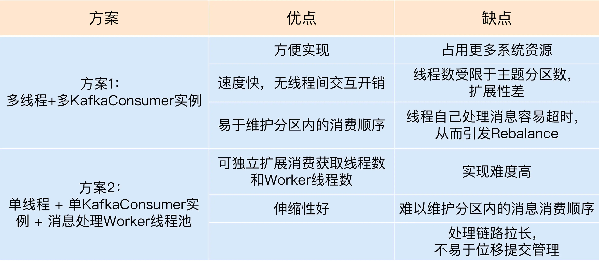

# Kafka核心技术与实战

- Broker：负责接受和处理客户端的请求，多个broker组成一个Kafka集群，虽然多个broker可以部署在一台机器上，但更多的是将broker部署在不同的机器上
- Topic（主题）：承载消息的逻辑容器，可以用来区分不同业务
- Partition（分区）：一个有序不变的消息队列，每个topic下有多个partition
- Offset（消息位移）：表示消息在partition中所在的位置，是个单调递增且不变的值
- Replica（副本）：每条消息会被拷贝到多个地方以提供数据冗余，副本分为领导者副本（leader replica）和追随者副本（follower replica），领导者副本向外提供服务，而追随者副本仅仅追随领导者副本，进行数据复制
- Producer（生产者）：向topic发送消息
- Consumer（消费者）：从topic中消费消息
- Consumer Offset（消费者位移）：表示consumer的消费进度，每个consumer都有自己的consumer offset
- Consumer Group（消费组）：多个consumer组成一个consumer group，consumer group下的各个consumer负责消费不同的partition以实现高吞吐
- Rebalance（重平衡）：consumer group中某个consumer挂了后，其他consumer会自动重新分配消费该topic下的partition

为什么Kafak不像MySQL一样允许副本（从库）对外提供读服务：
- 天然支持负载均衡：kafka本身已经将数据分散到多个partition上，partition又是分散在不同的broker上的，即本身就已经做到了负载均衡，而不是像MySQL压力都在主库上
- 场景不匹配：Kafka有频繁的消息写入，不同于MySQL，并不是典型的读多写少的场景，不适合读写分离

尽量保证服务端版本和客户端版本一致，否则会损失很多Kafka提供的性能优化的收益，因为版本差异会导致消息格式需要转换，格式转化会导致丧失Zero Copy

## Kafka集群

- 操作系统：Linux支持epoll和zero copy
- 磁盘：都是顺序写入，使用普通磁盘即可，RAID按需使用（RAID会有一定的性能损耗）
- 磁盘容量：根据消息数、留存时间、消息大小、备份数、是否开启压缩预估磁盘容量，实际使用中预留20%~30%的磁盘空间
- 带宽：按带宽的70%计算，避免大流量下的丢包，此外还要预留一些带宽服务于follower节点拉取数据用

Kafka通常情况下不太占用CPU，除了下述特殊情况：
- server和client使用了不同的压缩算法
- server和client版本不一致导致消息格式转化
- broker端解压缩校验

Broker参数：
- `log.dirs`：指定Broker使用的文件目录路径，配置多个路径的好处在于可以提升读写性能，并且可以实现故障转移即failover（旧版本kafka broker使用的任何一块磁盘挂了，整个broker都会停止，在1.1开，挂了的磁盘上的数据会自动转移到正常的磁盘上，这也就是为什么kafka不太需要RAID的原因）
- `zookeeper.connect`：用于指定kafka使用的zookeeper集群
- `listeners`：表示外部通过什么协议、主机名、端口号访问kafka服务，格式为`<协议名，主机名，端口号>`，协议比如PLAINTEXT表示明文传输，SSL表示SSL/TLS加密传输

Topic参数：
- `auto.create.topics.enable`：是否允许自动创建topic，当设置为true如果发消息的topic不存在就会自动创建，建议设置为false
- `unclean.leader.election.enable`：是否关闭unclean leader选举，当设置为true如果leader挂了，并且那些同步数据比较多的副本也都挂了，那么就会允许从落后很多的副本中选出leader，建议设置为true
- `auto.leader.rebalance.enable`：是否允许kafka定期对一些topic的partition进行leader重选举，换一次leader的成本很高，所有客户端都要改向新的leader发送请求，而且这种换leader本质上没有任何性能收益，因此建议设置为false
- `log.retention.{hours|minutes|ms}`：控制一条消息数据被保存多长时间
- `log.retention.bytes`：指定broker用于保存消息的最大磁盘容量
- `message.max.bytes`：broker能接收到的最大消息大小

相关操作系统参数：
- 文件描述符限制：文件描述符资源并不像我们想象中的昂贵，但如果设置的过小会导致too many open files报错，所以将他设置成一个超大的值是个较为合适的做法
- 文件系统类型：XFS性能好于ext4
- swap调优：不建议设置为0，因为一旦设置为0后当物理内存耗尽就会触发OOM，然后操作系统会随机kill调一个进程，根本不给用户任何的预警，建议设置成一个较小的值，当开始使用swap时可以观察到broker的性能开始急剧下降，进而留出进一步调优和处理的时间
- fsync时间：kafka并不是等到数据真正落盘才认为操作成功，而是只要写入page cache即可，随后操作系统会定期根据lru算法定期将page cache上脏页刷盘，定期的默认时间为5s，一般情况下认为这个时间间隔过于频繁，可以适当增加时间间隔来降低磁盘压力，因为kafka在软件层面提供了多副本冗余机制，所以这里不需要像MySQL、Redis那样在意fsync时间间隔
- JVM堆内存：默认1GB太小，建议6GB，因为kafka和客户端交互时会创建大量ByteBuffer，堆内存不能太小，此外堆内存也不宜过大，不然一次full gc就要花更长时间

Kafka限流：会在user(租户) + client id纬度上进行限流，可以在带宽和CPU上进行限制
- 限制follower副本拉取leader副本消息的速率
- 限制producer的生产速率
- 限制consumer的消费速率
当Kafak检测出需要进行限流时，broker不会直接返回错误，而是直接对需要限流的client进行强制sleep，这种限流方式对client完全透明，并且client也无需实现任何特殊的侧策略来应对，但要注意这样在broker端强制sleep的限流方式会导致client端的请求超时，故在使用时要适当调大请求的超时时间，防止client因为请求超时而不停重试，这反而会加剧问题

## 分区策略

- 轮询策略：即第一条消息发给分区0，第二条发给分区1，以此类推，轮询策略有着非常优秀的负载均衡的表现，总能保证消息最大限度被平均分配到所有分区上，避免数据倾斜，这也是kafka的默认分区策略
- 随机策略：将消息随机发送到一个分区上，其负载均衡表现不如轮询
- 按消息键Hash策略：kafka允许为每条消息定义消息key，然后根据key的hash值发送到指定分区，通过指定消息key可以保证消息被发送到指定分区，而同分区上的消息处理是保证先后顺序的，从而保证消息的顺序消费（因为kafka不同的分区之间是不保证顺序的），
- 地理位置策略：当kafka集群跨地域时，可以让国内的消费国内的partition，国外的消费国外的partition

注：
1. kafka的消息重试仅仅只是将消息重新发送到之前的分区，也就是消息重试不会改变分区
2. 当消费者出现rebalance时，即使选择了按消息键hash的策略，也无法保证同key消息发送到同分区上，即无法保证消息的顺序性了，此时只能选择单分区的方式来保证顺序性

## 压缩算法

Kafka中压缩和解压缩：producer端压缩，broker端保持，consumer解压缩

大部分情况下broker接收到producer的消息后仅仅是原封不动的保存而不会进行任何任何修改，除非：
1. broker和producer指定了不同的压缩算法，此时当broker收到消息后就不得不先解压缩，再用broker端的压缩算法压缩后保存
2. broker和consumer消息格式不同，为了兼容老版本的格式，broker会对新版本的消息进行转换，这里的转换不但需要解压缩，还使得kafka丧失了zero copy的能力，对性能有很大影响（producer到broker阶段不会使用到zero copy）

在producer到broker后，broker会对压缩过的消息集合进行解压缩操作，目的是进行验证，但毫无疑问会对broker端性能造成影响，尤其是CPU

kafka中消息格式分为V1和V2版本，在V1中会对每条信息进行CRC校验，而在V2中则是对消息集合这一层进行CRC校验，性能更佳，此外V1是针对每条消息进行压缩然后保存到消息集合中，而V2则是直接对整个消息集合进行压缩，V2的压缩效果更佳

消息：V1中叫message，V2中叫record
消息集合：V1中叫message set，V2中叫record batch
kafka中读写都是以批(patch)为单位的

吞吐量：LZ4最佳
压缩比：zstd最佳

## 防止消息丢失最佳实践

- 不要使用`producer.send(msg)`，要使用带有回调方法的`producer.send(msg, callback)`，因为kafka的send是异步的，也就是调用完send就立即返回了，但此时不能判断消息是否成功发送
- 设置`ack = all`，表示必须所有副本都接收到该消息，该消息才算是已提交
- 设置retries一个较大值，当网络抖动时消息发送失败，配置了retries的producer会自动重试发送消息（和callback不冲突，callback代表回调结果，而重试是自动的）
- 设置`unclean.leader.election.enable = false`，避免一个落后leader太多的follower可以成为新leader，因为其成为新leader必然会造成消息丢失
- 设置`replication.factor >= 3`，即将消息多保存几份副本，防止消息丢失的最好方法就是冗余
- 设置`min.insync.replicas > 1`，控制消息至少要被写入到多少个副本才算已提交，实际环境避免使用默认值1
- 确保`replication.factor > min.insync.replicas`，如果两者相等，那么只要有一个副本挂了整个partition都无法正常工作
- 确保消息消费完再提交，关闭`enable.auto.commit`自动提交，采用手动提交的方式

## 生产者TCP连接

何时创建TCP连接：
1. 在创建KafkaProducer实例后，会在后台创建一个Sender线程，和`bootstrap.servers`参数中配置的broker进行连接
2. 当producer给一个不存在的topic发消息时，broker会告诉producer该topic不存在，此时producer会发送METADATA请求给broker去获取最新的元数据
3. producer会定期去更新元数据信息，间隔时间通过`metadata.max.age.ms`控制，默认值3000，即5分钟

注：producer在所有获取到元数据需要和元数据中所有broker进行连接，但往往一个producer只会和固定几个broker进行数据请求，那么在一定时间后大部分连接又会被关闭，这无疑是非常浪费连接池资源的

何时关闭TCP连接：
1. 调用producer.close()关闭或`kill -9`暴力关闭
2. kafka自动关闭，当这个连接在一定时间内没有任何请求，那么就会被自动关闭，这个时间由`connection.max.idles.ms`控制，默认9分钟

## 幂等和事务

- 最多一次（at most once）：消息可能会丢失，但绝不会被重复发送
- 至少一次（at least once）：消息不会丢失，但有可能被重复发送
- 精确一次（exactly once）：消息不会丢失，也不会被重复发送

Kafka默认提供的交付可靠性保障是第二种，即至少一次，因为producer在提交消息后需要收到broker的应答才会认为该消息发送成功，但若网络抖动导致producer未能收到broker的应答消息，那producer就会进行重试，也就是再次发送相同的消息

Kafka通过幂等性和事务达到准确一次

幂等性producer：为producer设置`enable.idempotence=true`，该producer就会自动升级成幂等性producer，Kafka会自动完成消息的去重

原理：producer每次启动后首先向producer申请一个全局唯一的producerID，然后producer每发一条消息后就将消息体中的sequence number + 1，在broker的内存中维护着producerID和sequence number的映射，broker收到消息后检查消息体中的seq，如果：
- new_seq = old_seq+1: 正常消息
- new_seq <= old_seq : 重复消息
- new_seq > old_seq+1: 消息丢失

存在的问题：
- 其只能保证单分区上的幂等性，即一个幂等性producer只能保证某个topic下的一个分区上不出现重复消息，而无法实现多个分区的幂等
- 其只能实现单会话上的幂等性，当producer重启后，因为producerID变了，这种幂等性就丧失了

事务型producer：为producer设置`enable.idempotence=true`并设置参数`transactional.id`，此外在代码中需要显式调用`beginTransaction()`和`commitTransaction()`，并且在写入时即使事务执行失败，但Kafka并不会将已经写入底层日志中的消息删除，因此consumer还是会看到这些消息，因此需要在consumer端设置`isolation.level`参数为`read_committed`表示consumer只会读取成功提交的事务的消息

## 消费组

Consumer Group：Kafka提供的可扩展且具有容错性的消息者机制

传统消息引擎模型：
- 点对点模型：消息一旦被消费就会从队列中删除，并且下游多个consumer都要抢着消费消息，伸缩性很差
- 发布订阅模型：虽然允许消息被多个consumer消费，但每个consumer必须消费订阅的主题下的所有分区，可扩展性很差

而Consumer Group可以同时实现点对点模型和发布订阅模型，如果一个topic只有一个consumer group消费那就是点对点模式，如果消费组内只有一个消费组就是发布订阅模型

消费组特点：
- 一个消费组内可以由多个消费者
- 消费组的唯一标识称为GroupID，组内的消费者共享这个ID
- 主题的每个分区只能被组内的一个消费者消费，因此消费组中消费者的个数最好和主题的分区数相同，否则多出来的消费者会被闲置
- 老版本Kafka将消费组的位移offset保存在zookeeper中，好处是broker端不用保存消费组的状态，但zookeeper不适合频繁进行写操作，而更新消费组位移这种大吞吐量的操作会极大拖慢zookeeper集群的性能，在新版本Kafka中将消费组位移保存在Kafka内部`__consumer_offsets`主题中

消费组重平衡：

触发条件：
- 消费组内消费者数量发生变更
- 订阅的主题数发现变更
- 订阅的主题的分区数发生变更

影响：在Rebalance过程中，所有Consumer实例都会停止消费，等待Rebalance完成，类似于JVM中的Stop The World

### 位移主题

老版本Kafka将位移信息保存在zookeeper中，当consumer重启后自动从zookeeper中读取位移信息即可，这种设计使得broker不需要保存位移信息，可以减少broker端需要持有的状态空间，有利于实现高伸缩性，但因为zookeeper本身不适用于频繁的写操作，而更新位移信息是高频的操作，这会导致zookeeper集群性能严重下降，因此新版本Kafka中将消费组的位移信息作为一条普通的消息提交到内部主题`__consumer_offsets`中保存

为什么将位移信息写入内部topic：因为位移信息的写入要求可持久化和高吞吐量，而Kafka天然就支持可持久化和高吞吐量，那么自然无需借助外部服务，用Kafka自己解决即可

- 位移主题是一个普通的主题，同样可以被手动创建，修改，删除
- 位移主题的消息格式是kafka定义的，不可以被手动修改，若修改格式不正确，kafka将会崩溃
- 位移主题中消息类似于KV结构，key是`<Group ID，主题名，分区号>`形式的三元组（位移信息其实是针对于消费组的，又因为一个分区只能被消费组下的一个消费者消费，因此位移信息无需包含消费者的标识），value可以理解为offset值

当Kafka集群中的第一个Consumer程序启动时，Kafka会自动创建位移主题（也可以手动创建），分区数依赖于broker端的`offsets.topic.num.partitions`，默认50，副本数依赖于broker端的`offsets.topic.replication.factor`，默认为3

提交位移分为手动提交和自动提交，通过`enable.auto.commit`控制，推荐使用手动提交位移（大部分大数据框架都是禁止自动提交的），因为自动提交下只要consumer一直启动着就会不停向位移主题写入消息（比如这个consumer已经没有消息消费了，但因为自动提交，还是会不停提交相同的位移信息到位移主题）

Kafka使用Compact策略来删除位移主题中的过期消息，避免位移主题无限膨胀，比如位移主题下同一个key的两条消息，发送时间靠前的那条消息就可以被清除


Kafka中有个后台线程Log Cleaner，会定期巡查待Compact的主题，找出满足条件可以删除的消息（如果发现位移主题无限膨胀占用过多磁盘空间，可以检查下Log Cleaner线程的工作状态）

### 重平衡

Rebalance过程中Consumer Group中所有Consumer实例共同参与，在协调者Coordinator帮助下，完成订阅topic的partition的分配

Coordinator（协调者）：其专门为Consumer Group服务，负责为Consumer Group执行rebalance以及提供位移管理和组成员管理等，比如consumer端提交位移其实就是向Coordinator所在的broker提交位移。所有broker启动时都会创建和开启相应的Coordinator组件，也就是所有broker都有各自的Coordinator

Consumer Group如何找到为其服务的Coordinator？
第一步：将GroupID的哈希值和`__consumer_offsets`主题的分区数取模后的绝对值，此时计算出的就是`__consumer_offsets`中的哪一个分区负责保存该Consumer Group的位移信息
第二步：找出上一步计算出的分区号所在的分区的Leader副本所在的broker，该broker就是要找的Coordinator

Rebalance存在的问题：
- rebalance影响consumer端TPS，因为在rebalance期间所有consumer都无法消费消息，还会造成消息积压
- rebalance很慢，尤其是consumer group下存在很多个consumer时
- rebalance效率不高，rebalance过程通常不会考虑局部性原理，也就是在rebalance过程中很可能将原本属于某个consumer消费的分区重新分配给其他consumer消费

针对上面这三个问题，Kafka对此无能为力，因此最好的方法就是尽可能避免重平衡

Rebalance发生的三个时机：
- 消费组内消费者数量发生变化
- 消费组订阅的主题数量发生变化
- 消费组订阅的主题的分区数发生变化

而这三个时机大部分其实都是合理的，属于Kafka的高伸缩性的一部分，我们要避免的是那些不必要的Rebalance
- 避免因consumer未能及时和Coordinator发送心跳导致的rebalance：当consumer group完成rebalance后每个consumer会定期向coordinator发送心跳，表示自己还存活着，如果consumer未能及时和coordinator发送心跳那么coordinator就会将其踢出consumer group，从而导致rebalance，可以通过设置`session.timeout.ms`（consumer和coordinator间超时的时间间隔）和`heartbeat.interval.ms`（心跳发送频率间隔）来避免
- 避免因consumer消费时间过长导致Rebalance：如果业务处理比较耗时，那就需要将`max.poll.interval.ms`（consumer端两次调用poll方法的最大时间间隔）适当调大些，为业务处理留下足够时间
- 避免因consumer端频繁GC导致Rebalance：比如consumer端频繁Full GC导致长时间停顿

此外rebalance还可能造成消息重复消费的问题，比如当consumer端poll了其分区下的一条消息进行消费，但还未提交位移信息，此时发生了rebalance，那么在rebalance后一个新的consumer继续负责消费这个分区下的消息，那么那条在旧consumer上未提交位移信息的消息就会被新consumer再次消费（无论自动提交还是手动提交位移信息都无法避免）

### 位移提交

consumer会向kafak提交分配给他的每个分区各自的位移数据，这样当consumer发生故障重启后就能从kafka中读取之前提交的位移值，然后从相应的位移处继续消费

注：只要consumer没有重启，其就不会依赖提交的位移值，因为consumer在运行过程中会记录已获取的消息位移，从而保证只要consumer没有重启就不会重复消费

位移提交分为自动提交和手动提交

自动提交：`enable.auto.commit`设置为true时consumer就会自动提交，在每`auto.commit.interval.ms`时间间隔后自动提交位移，此外还会保证的是在调用poll方法时提交上一次poll返回的消息位移，因此其不能保证已消费的位移一定提交到kafka，当在`auto.commit.interval.ms`期间发生重平衡，重平衡后consumer从上一次提交的位移处继续消费，此时就会发生重复消费的问题

手动提交：
- `commitSycn()`：同步调用，程序会被阻塞直到broker返回提交结果，会降低程序的TPS
- `commitAsync()`：异步调用，不会阻塞程序，`commitAsync()`出现异常时不能重试，因为其是异步的，假如提交失败后重试的值很可能不是最新的值了，会导致覆盖了最新的位移值

`commitSync()`和`commitAsync()`需要组合使用，对于阶段性提交使用异步提交，当consumer要关闭时使用同步提交确保能够正确提交位移值

```java
try {
    while (true) {
        ConsumerRecords records = consumer.poll(Duration.ofSeconds(1));
        process(records);   // 处理消息
        commitAsync();
    }
} catch (Exception e) {
    handle(e);
} finally {
    try {
        consumer.commitSync();
    } finally {
        consumer.close();
    }
}
```

此外还可以通过`commitSync/commitAsync(Map<TopicPartiton, OffsetAndMetadata>)`指定分区和对应的位移值进行提交，这样就可以随时提交位移信息，而不再受poll拉取的消息数量限制了

### CommitFailedException

`max.poll.interval.ms`指的是两次poll间的最大时间间隔，当poll后数据处理时间超过`max.poll.interval.ms`后kafka就会认为该consumer掉线了，会将其剔除然后进行重平衡，此时原来的consumer就无法提交位移信息，抛出`CommitFailedException`，因为原先分配给它的分区已经被分配给别的了（只有手动提交会显式抛出`CommitFailedException`，自动提交抛出的异常由kafka内部处理了）

避免抛出`CommitFailedException`的方法：
- 缩短单条消息处理时间，使得每次poll的数据都能在`max.poll.interval.ms`中处理完成
- 增加`max.poll.interval.ms`值
- 减少consumer每次poll的消息条数
- consumer中通过多线程来加速消费，多数主流的大数据框架都是用的该方法，但实现复杂且容易出错

此外，当同时出现了设置了相同group.id值的消费者组和独立消费者，那么当独立消费者手动提交位移时，kafka也会抛出`CommitFailedException`（独立消费者也需要group.id进行提交位移）

### 消费者多线程消费

方案一：消费者程序启动多个线程，每个线程维护单独的一个KafkaConsumer实例，负责完整的消息获取、消息处理流程

方案二：消费者程序使用单或多线程获取消息，同时创建多个线程执行具体的消息处理



### 消费者TCP连接

创建时机：在调用`KafakConsumer.poll()`是被创建，在poll内部有3个时机可以创建TCP连接
- 发起FindCoordinator请求时，消费者请求任意一个broker询问其coordinator在哪个broker上
- 连接coordinator时
- 消费数据时，和该消费者被分配到的分区所在的所有broker进行连接

创建个数：
1. FindCoordinator请求，这是消费者创建的第一个连接，因为此时还不知道kafka集群的元数据，因此请求的brokerId为-1，然后通过该连接获取到集群元数据，然后就会被废弃，因为这个连接连接的是brokerId=-1，因此也就不能复用
2. 和其coordinator创建的连接
3. 和被分配到的分区所在的所有broker创建连接

何时关闭：
- 手动调用`KafkaConsumer.close()`或执行kill命令
- 超过`connection.max.idle.ms`后由Kafka自动关闭，但该值可能被设置成-1表示禁用定时关闭，就会导致消费者创建的第一个连接无法被关闭，成为永久的僵尸连接

### 监控消费进度

Lag：消费者当前滞后于生产者的消息条数，Kafka监控分区上的Lag，最后汇总到topic纬度上
Lead：消费者最新的消费消息的位移和分区当前最早一条消息位移的差值

Lag过大会导致消费者消费的消息已经不在操作系统的缓存页中，此时消费者就不得不从磁盘上读取消息，这会进一步拉大消费者和生产者之间的差距
Lead过小表示消费者可能要丢消息了，因为kafka中消息是有留存时间的，kafka会默认删除某一时间前的数据，当Lead接近0时，就说明此时消费者可能消费的数据即将被kafka删除，当要消费的消息被删除后会导致消费者程序重新调整位移，即可能消费者从头再消费一遍数据或直接从最新的消息位移处开始消费

监控方式：
- kafka-consumer-groups脚本
- Kafka Java Consumer API
- Kafka自带的JMX监控指标

## 副本

副本的好处：
- 提供数据冗余：提高整体可用性以及数据持久性
- 提供高伸缩性：支持横向扩展，通过增加机器以提高读吞吐量
- 改善数据局部性：将数据放到离用户地理位置相近的地方，从而降低时延

Kafka中的副本本质是一个只能追加写消息的提交日志，其只带来了数据冗余的好处

Kafka中副本分为领导者副本（Leader Replica）和追随者副本（Follower Replica），每个分区在创建时会选举出一个领导者副本，其余自动成为追随者副本

Kafka中追随者副本是不对外提供服务的，所有读写请求都需要发往领导者副本做在的broker，追随者副本唯一的任务就是从领导者副本异步拉取消息
追随者副本不对外提供服务的好处：
- 保证消费者可以消费到最新写入的数据
- 保证单调读，也就是消费不同的副本导致消费到的数据不一致

ISR（In-sync Replicas）：当追随者副本落后于领导者副本时间间隔大于`replica.lag.time.max.ms`后，该副本就会被从ISR副本集合中删除，也就是认为该副本不能和领导者副本正常同步。其中，领导者副本必然在ISR副本集合中，当追随者副本赶上进度后也可以再次被加入到ISR副本集合中

Unclean领导者选举（Unclean Leader Election）：允许选举不在ISR集合中的副本作为领导者副本，但因为不再ISR集合中的副本表明已经落后领导者副本很多了，选举其作为领导者就会造成数据丢失，但保证了服务的高可用性，但不建议开启，因为高可用可以通过添加副本数实现，而这会造成数据不一致

## 重平衡

重平衡的通知是通过心跳线程来完成的，当协调者决定开启新一轮重平衡后，会将`REBALANCE_IN_PROGRESS`封装进心跳请求的响应中


消费组启动时的状态流转：消费组最开始是Empty状态，当重平衡开启后，它会被置于PreparingRebalance状态等待成员加入，之后变更到CompletingRebalance状态等待分配消费方案，最后流转到Stable完成重平衡

当成员加入或退出消费组时：消费组从Stable变为PreparingRebalance状态，此时所有现存成员就必须重新申请加入组

消费者端重平衡流程：
- JoinGroup请求：当成员加入组时，会向协调者发送JoinGroup请求，在该请求中会将自己订阅的主题上报，当协调者收集了全部成员的JoinGroup请求后，协调者会从中选择一个担当这个消费者组的领导者
- SyncGroup请求：领导者向协调者发送SyncGroup请求，将其做出的分配方案发给协调者，其他成员也会向协调者发送SyncGroup请求，但请求体中没有实际内容，然后协调者统一以SyncGroup响应方式将分配方案发送给所有成员，这样成员就都知道自己该消费哪些分区了

消费者的领导者不同于领导者副本，其作用是负责收集所有成员的订阅信息，然后制定具体分区的消费分配方案（分配方案就是哪个消费者消费该topic下的哪个分区）

Broker端重平衡流程：
- 新成员入组：新成员发送JoinGroup请求，协调者收到后向组内成员通过心跳响应返回要求重平衡
- 成员主动离组：离组成员发送LeaveGroup请求，协调者收到后要求组内其他成员进行重平衡
- 成员崩溃离组：协调者在收到心跳后会根据`session.timeout.ms`算出下次deadline时间，超过该时间就认定该成员崩溃，要求组内其他成员进行重平衡
- 重平衡时提交位移：重平衡时协调者会给予成员一段缓冲时间，要求成员在这段时间内快速上报自己的位移信息，然后开启JoinGroup/SyncGroup请求进行重平衡

## 控制器

控制器主要是在ZooKeeper帮助下管理和协调整个Kafka集群

在Broker启动时会去ZooKeeper中创建`/controller`节点，第一个成功创建`/controller`节点的Broker会被指定为控制器

控制器的作用：
- 主题管理以及分区管理
- 分区重分配
- Preferred领导者选举，主要更换Leader以避免部分Broker负载过重
- 集群成员管理（Broker新增关闭和宕机），通过watch机制检查ZooKeeper的`/brokers/ids`节点下
- 向其他Broker提供数据服务，在控制器上保存了最全的集群元数据信息，其他Broker会定期接受控制器发来的元数据更新请求，从而更新其内存中的缓存数据。控制器保存了所有主题信息、所有Broker信息、所有运维任务信息（这些数据在ZooKeeper中也保存了一份，当控制器初始化时都会从ZooKeeper中读取对应元数据保存到缓存中）

控制器故障转移（Failover）：当控制器突然宕机，其他Broker通过watch机制感知到ZooKeeper上的`/controller`临时节点被删除了，于是所有存活的Broker开始竞争向ZooKeeper创建`/controller`节点，创建成功的就是新控制器（此时`/controller`节点epoch会+1，防止宕机的控制器因恢复导致同时存在两个控制器，即脑裂问题）

## 高水位

HW（高水位）：高水位之前的所有消息都是可以被消费的
LEO（Log End Offset）：副本写入下一条消息的位移值

Leader副本中会保存自身HW和LEO，以及所有Follower副本的LEO
Follower副本会保存自身HW和LEO

Leader副本：
- 处理生产者请求：消息写入磁盘，计算HW = max(HW, min(Leader副本保存的所有远程副本的LEO))
- 处理Follower副本拉取消息请求：读取消息返回，将Follower副本请求的位移值更新到远程副本LEO值，并计算HW

Follower副本：
- 处理从Leader拉取的消息：消息写入磁盘，更新LEO，计算HW = min(LEO, Leader副本发送的其HW)

可以看到，Leader副本更新远程副本LEO值是有延迟的，必须在Follower副本下一次拉取请求时才能更新LEO值，因此Leader副本的HW和Follower副本的HW的更新时间上是存在错配的，错配也就是导致数据丢失和不一致的根源

Leader Epoch：`<ephoch, offset>`
- epoch：单调递增的版本号，当领导者副本变更时会增加该版本号
- offset：Leader副本在该Epoch值上写入的首条消息位移，并会随着消息不断写入而更新该值
当副本恢复时，向Leader副本请求自己原先的ephoch值对应的offset，然后针对该offset进行截断，然后再向Leader副本进行数据同步，从而解决数据不一致性问题

日志截断：因为Broker崩溃前可能写入部分不完整的消息，因此恢复后需要执行截断操作，恢复的副本会向Leader副本请求Leader的LEO，如果自己的LEO小于Leader的LEO就不需要截断，反之就需要截断


