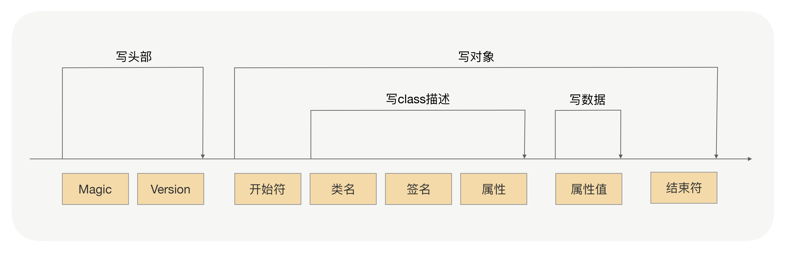
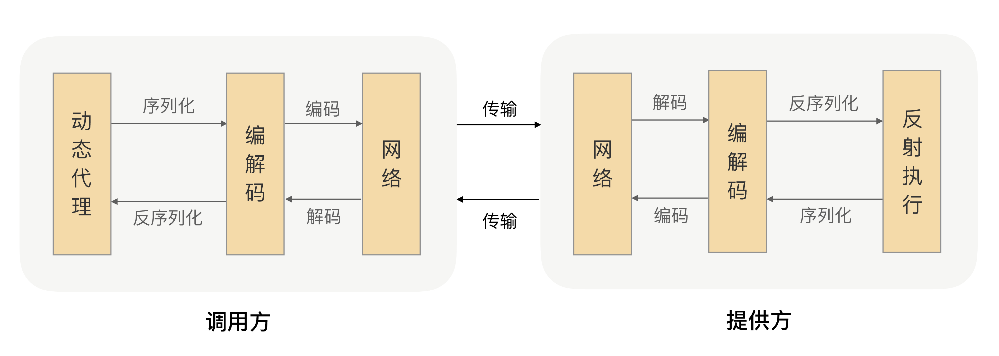
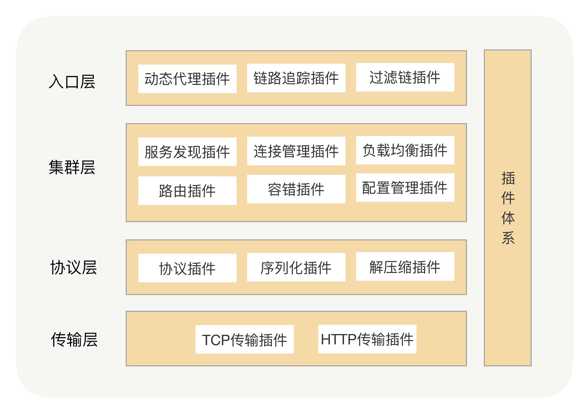
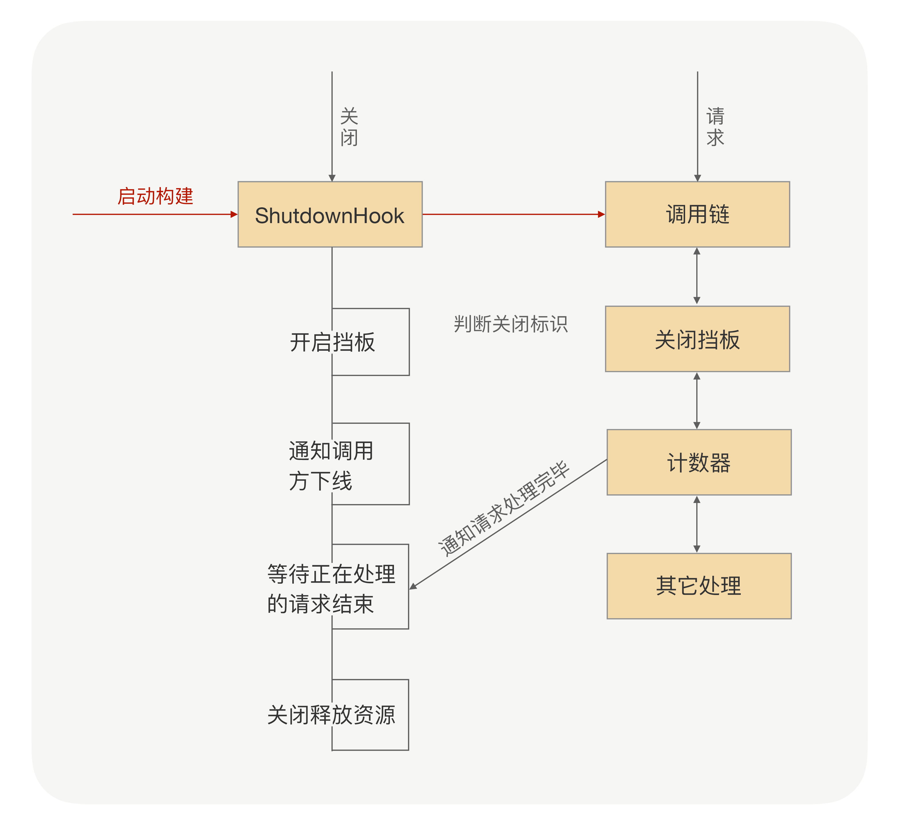

# RPC实战与核心原理

## rpc基础

如何设计一个协议：

- 魔术位：表明这是什么协议
- 整体长度
- 协议头长度：为了保证协议的可扩展性，协议头长度不能固定死
- 协议版本
- 消息ID：用于关联请求和对应的响应
- 序列换方式：报文payload采用的序列化方式
- 消息体

为什么rpc不直接使用http协议：

http协议无法实现请求和响应的关联，http协议本身是无状态的，http1.1虽然支持长连接，但服务端返回的多个请求很可能乱序抵达客户端的，此时如果客户端是同步阻塞等待着返回的那是没有问题的，但如果是异步的，那客户端就无法知道返回的响应对应的是哪个请求，因此rpc使用私有协议(rpc中通过在协议中带上一个消息id来保证请求和响应一一对应)

序列化方式：

- JDK原生: `ObjectOutputStream`和`ObjectInputStream`



- json: 进行序列化时占用较大的额外空间，json本身没有类型，像java强类型语言就必须通过反射解决
- hessian: 动态类型的(不需要手动指定类型)，二进制的，因此更加紧凑，生成的字节数更少，性能也更好
- protobuf: 需要定义IDL(Interface description language)，因为在IDL中定义了类型，所以序列化和反序列化速度很快，无需通过反射去获取类型，序列化后字节数很少

序列化协议权衡：性能，字节数(网络传输数据量)，通用性和兼容性(跨平台，跨语言，支持各种对象类型)，安全性(最为重要)



## rpc架构



### 服务发现

服务发现简要流程：服务提供方向注册中心上报节点信息 -> 服务调用方从注册中心拉取节点信息并缓存本地

为什么不通过dns实现服务发现：

因为为了提升性能和降低dns服务压力，dns采用多级缓存，一般配置的缓存时间较长，当某个服务节点下线或新服务节点扩容上线，其他服务是很难及时感知到的

即使设计成通过dns拿到负载均衡机器的ip，然后由负载均衡服务完成流量路由，也是不合适的，因为首先经过负载均衡就多了一次网络传输，此外负载均衡进行添加或移除节点一般都需要手动操作，会有延迟

为什么不直接使用zookeeper：

直接使用zookeeper本身没有什么问题，首先在zookeeper创建服务目录，然后服务提供者注册节点信息，再然后服务调用者订阅该服务目录并从zookeeper这获取到服务节点信息，并且当服务目录下节点信息发生变更后zookeeper会通知订阅的服务方

当zookeeper本身性能不佳，当连接到zookeeper节点数特别多，对zookeeper读写非常频繁，且存储的目录达到一定数量后，zookeeper会不再稳定，cpu飙升最终宕机

CAP: 一致性(Consistency)，可用性(Availability)，分区容错性(Partition tolerance)

zookeeper实现的服务发现是强一致的，zookeeper集群中任何节点数据发生更新都需要通知到其他zookeeper节点同步更新，以保证每个节点数据的强一致，但也造成了zookeeper性能下降

在服务发现中并不真正需要强一致(CP)，最终一致性(AP)是更好的选择，因为新服务刚上线没有流量立刻打过来也没啥问题，而服务下线rpc本身也会做重试，因此最终一致性更优

采用消息总线机制实现最终一致性
- 注册数据全量缓存在每个注册中心内存中，通过消息总线完成数据同步
- 当一个注册中心节点收到服务节点注册时，会生成一个消息推送给消息总线，每个消息都有个递增的版本号
- 消息总线会主动推送消息给每个注册中心，注册中心自己也可以定时去拉去消息，注册中心只接受版本号大于本地的版本号的消息，小于的直接丢弃，从而实现最终一致性
- 服务调用者可以从注册中心拿到指定服务的所有注册信息，并可以缓存在本地内存中
- 采用推拉模式，服务调用者可以及时从注册中心拿到服务注册信息的变化情况，并和内存中的缓冲数据合并

### 服务调用端流程

```txt
rpc调用流程：
调用端 -> 从注册中心获取所有注册节点信息和路由规则 -> 容错策略 -> 路由策略 -> 负载均衡 -> ...
```

### 健康监测

机器纬度 + 应用纬度

机器纬度：可以通过定时心跳请求来判断节点是否可用，心跳请求频率不宜过高，不然会给服务器造成压力，但也不宜过低，会导致不能及时发现问题机器，注意，心跳请求的节点不能和目标节点在同一物理机上，否则如果机器挂了，那么心跳也挂了，就无法感知到了

应用纬度：通过可用率判断该节点是否健康，可用率 = 某一时间段内 (成功次数 / 总次数)

### 路由策略

路由策略不适合放在注册中心，因为注册中心负责的是数据一致性，如果把大量复杂逻辑计算也放在注册中心后，当连接的节点数变多后就会导致注册中心压力很大

因此路由策略更适合放在服务调用端中计算，注册中心将路由规则下发给调用端，调用端在从注册中心这拿到所有注册节点信息后，根据规则(比如IP路由，参数路由：根据不同用户id)计算出可以请求的路由节点

因为路由本质上是节点分组(不同节点分到不同的set中)，流量隔离(泳道)，因此不论是打标签还是分流都天然适合在路由策略中做

此外，虽然路由策略是在调用方(上游)做的选择出服务提供方(下游)，这是符合rpc调用机制的，但不符合团队协作，比如下游服务希望修改路由策略或者新增路由策略，这就要求所有上游同时修改，并且必须先于下游服务先上线，一般来说是很难推动上游配合的，因为这对于上游不但没有收益还会面临风险，所以路由策略要么在初期就能够考虑周全，要么抽象成可配置的信息，动态下发

### 负载均衡

负载均衡也是在服务调用端这完成的，因为如果单独走一个负载均衡服务器的话，会存在如下问题：
- 搭建单独负载均衡服务器有额外成本
- 请求会多一次网络传输，浪费性能
- 负载均衡进行添加节点或摘除节点都需要手动操作
- 负载均衡是要可配置的，针对不同服务不同接口使用不同策略

rpc负载均衡策略一般包括：
- 随机权重
- 轮训权重
- hash：将一些请求固定打在一些节点上

自适应的负载均衡策略核心就是为每个节点进行打分(也就是权重)，打分的评断标准就是这个节点的处理能力：
- 运行时状态指标收集器：服务节点CPU核数，CPU负载，内存指标，这些通过调用端和服务端的心跳数据获取
- 请求耗时指标收集器：请求平均耗时，TP99，TP999等

服务调用端为每个节点打完分后，根据打分和每个节点配置的权重得出最终权重，再之后按负载均衡策略，比如随机权重/轮训权重等选出节点发起请求

路由策略一半是用于流量隔离，比如灰度验证，而负载均衡则是请求的智能调度，用于选择最合适的节点进行请求

### 容错机制(异常重试)

- 服务提供方的业务逻辑尽可能使幂等的，因为调用端因网络抖动导致超时后，很可能这个请求是成功到达服务端的，那么这个请求就会去执行业务逻辑，此时调用端重试后又发了次请求，等于执行了该业务逻辑两次，如果是插入这种不幂等的操作就会出现问题(可以在每个请求上带上唯一id来保证幂等)
- 重试时需要重置前一次时间，否则会导致重试次数累计时间用作超时时间(核心就是配置的超时时间是针对一次请求的，重试是另一次请求，不应该共用超时时间)
- 确保重试时负载均衡过滤到重试前调用失败的节点

### 优雅关闭

rpc服务本身迭代是非常快的，也就是频繁的部署，在部署过程中该节点是无法对外提供服务的，因此如何及时通知到调用方该节点已经下线了是非常重要的

通过注册中心通知：注册中心通知是异步的，存在延迟，因此部署中的节点很可能还在负载均衡的列表中，不可取
通过服务节点直接向调用节点通知：rpc中服务节点和调用节点间是长连接，当服务节点下线时就主动去通知所有调用节点，但如果这个主动通知的时间点非常接近真正关机的时间，就还是会造成请求失败，不可取

优雅关闭：当服务提供节点进入关闭流程时启动一个挡板程序，当此时该节点还收到请求后可以显示抛出ShutdownException给调用方，然后调用方就知道了该服务提供节点要下线了，调用方可以从负载均衡列表中去掉这个节点然后重试请求别的节点，当然，如果调用方一直没有请求服务节点，服务节点也可以主动通知调用方节点



关闭流程：由外到内
- 启动挡板程序，拒绝调用方的请求，返回显式异常告知调用方当前节点下线(挡板程序通过注册到Runtime.addShutdownHook中，该方法会捕获操作系统进程信号，并在进程关闭时调用注册的钩子)
- 服务提供节点主动通知所有调用节点
- 处理还在流程中的请求：每来一个请求都将引用计数器加一，处理完一个请求都将引用计数器减一，直到引用计数器减为0后才关闭释放资源

### 优雅启动

- 启动预热：jvm都有jit机制，可以将热点代码编译成机器码，因此当服务启动后可以先内部调用一些方法完成预热，并完成缓存等加载
- 延时暴露：在服务完全启动完后，才向注册中心注册自己，而不是rpc接口的这个bean创建的时候就向注册中心注册
- 新服务设置权重：向注册中心注册时可以带上自己的启动时间，然后调用方获取时拿到启动时间，根据启动时间计算出权重，启动时间越接近现在的权重越低，防止服务刚上线，还未预热完成就遭大量请求

启动预热和延时暴露都可以通过在服务中设立hook，让用户自行实现，然后再服务启动后调用hook完成预热和延时注册

### 服务保护

rpc服务的自我保护，即需要考虑到上游大量请求打来的情况，也要考虑下游严重超时的情况

限流(限流时要考虑应用级别和IP级别，针对性限流)：
- 单机配置限流：即给服务提供方的每个节点设置单独的限流阈值，配置方便，但当服务扩容时限流配置更新并不方便
- 注册中心或配置中心下发限流阈值：配置总限流阈值，下发时并下发总节点数，交给服务提供方的rpc框架自行计算限流阈值，服务扩容时方便更新限流阈值
- 调用端限流：在调用端的rpc框架中依赖一个单独的限流服务，每次发起请求时都主动请求限流服务，这样可以精确控制限流阈值，但多了次网络通信，损耗性能

限流方式：最简单的计数器，平滑限流的滑动窗口，漏斗算法以及令牌桶算法

熔断：

当服务端中某个接口调用的其他服务性能很差，一直超时，那么如果服务端这个接口被频繁调用，就会导致整个服务端积压大量请求而宕机，因此服务端就需要自我保护，即熔断

熔断工作机制：熔断器在关闭，打开和半打开三个状态间切换，正常情况下熔断器是关闭的，当调用下游服务出现异常后，熔断器会收集异常指标信息进行计算，当达到熔断条件后熔断器打开，只时再发起请求会直接被熔断器拦截，并返回失败逻辑，当熔断器打开一段时间后会转为半打开状态，这时熔断器会允许发起一个请求，如果这个请求能够正常得到服务端响应则状态置为关闭，反之状态仍为打开

在rpc框架中，发起请求前就先经过熔断器，如果熔断器状态为关闭则正常请求，如果为打开则直接执行熔断的失败策略

降级：

降级就是讲不怎么重要的业务逻辑降低优先级，先不处理，将资源竟可能让个优先级高，重要的业务逻辑先执行

分组：

如果不分组，所有调用方都能够请求所有节点，那么当某个下游调用量急速上升，就可能导致服务提供方宕机，使得所有下游都无法完成调用，通过分组使得应用间不会互相影响

非核心应用不要和核心应用分在同一组，核心应用间应该做好隔离，重要的原则就是保证核心应用不会受影响

当调用端去注册中心获取服务节点信息时，带上要调用的接口名 + 分组信息，注册中心会根据分组信息返回给调用端该分组下的节点信息

分组的高可用：
- 节点分组必然会导致某个调用端能够请求的节点数变少，那么此时需要给配置主分组和次分组，当主分组中所有节点都不可用时切换到次分组
- 请求注册中心时带上分组信息，注册中心直接根据分组下发节点信息，那么扩容时可以直接在注册中心修改该分组下的节点数量

分组不太适合用于隔离开发和测试环境，测试和开发环境的隔离最好还是通过部署不同的注册中心实现

- 压测：进行性能优化及容量规划
- 限流：防止服务端被流量高峰压垮
- 降级：优先保证核心服务高可用
- 熔断：防止当前服务被下游慢服务拖垮
- 自动扩缩容：可以扛住流量洪峰，需要资源冗余

### 提升吞吐量

影响到rpc调用的吞吐量的主要原因就是服务端业务耗时，使得cpu大量时间在等待而不是在计算，因此最好的提升吞吐量的办法就是异步

调用端异步：

调用端在发起rpc请求后就创建了个Future，这个Future和调用端发起请求中带的唯一消息ID一一对应，当服务端返回响应后，会根据响应中的消息ID找到对应的Future，将结果塞到Future中，调用端可以通过Futrue.get()获取到返回值

调用端所有请求都是异步的，所谓的同步调用只是在rpc框架中隐式调用了Future.get()后然后返回

服务端异步：

调用端发起rpc请求后直接返回一个CompletableFuture，然后不需要任何操作(比如通过唯一消息ID做映射)，服务端收到请求后创建一个CompletableFuture，然后真正的业务逻辑交给服务端的线程池异步执行，最后完成业务逻辑后将结果通过CompletableFuture.complete()塞进去并完成异步通知，最后服务端将这个CompletableFuture返回给客户端就可以了

### 安全

服务鉴权交给服务提供方，在服务提供方应用里放一个HMAC签名(不可逆的加密算法)的私钥，然后调用方去授权平台上用这个私钥生成调用方自己的唯一签名，然后调用请求时带上这个唯一签名，这样就能表明身份了

相较于通过统一的授权平台，每次调用前都去授权平台上确认，通过签名的实现方式更简单，性能更好

服务发现鉴权，主要就是防止其他恶意节点到注册中心上注册

### 快速定位问题

- 合理封装异常信息：异常上带上服务名，ip等信息
- 分布式链路跟踪：链路的核心就是埋点和传递，埋点就是对rpc调用进行数据采集，获取完整的链路信息，传递就是将Trace信息传递给下游，串联起一条完成链路

### 定时任务

调用端请求超时处理，服务启动超时处理，定时心跳都需要用到定时任务

- 定时轮询：空耗大量CPU
- 时钟轮：时钟轮有多层，每一层都是一个圆盘，每个圆盘被分为多个槽，比如第一层如果被分为10个槽，每个槽单位时间为1s，那么整个圆盘转一圈就是10s，因此第二层的槽单位时间就是10s，以此类推，当一个任务延时时间为2s，则放到第一层的第2个槽里，延时时间如果是12秒，则放到第二层的第一个槽里，有个指针在不断遍历圆盘，每过一个槽的单位时间后就会读取下一个槽内的数据，下个槽里的数据就是等待延时执行的任务，当第一层执行完后，就将第二层的第一个槽放到第一层中(第二层的槽的单位时间为10s，而第一层整个遍历周期为10s，刚好)，继续遍历

时钟轮解决的是定时触发的能力，而不保证实时性，当然，如果每个槽的单位时间越小那么也就是触发的时间越准确

时钟轮的优势就是每次只需要轮询第一层的一个槽内的任务，而这些任务都是一个槽的时间单位内的任务，任务非常少，有效减少CPU空轮询

时钟轮时间复杂度是O(1)，而优先队列时间复杂度是O(logn)

### 流量回放

可以在网关层，也可以在rpc框架的调用端进行镜像存储请求，如果再rpc框架中实现的话还可以镜像存储请求的响应

流量回放可以应用在代码重构后的验证，将请求的结果和存下来的作比对(幂等的接口做流量回放是最方便的，如果不幂等需要将数据资源也做一份镜像)，还可以用做将生产环境的流量作为压测流量

### 泛化调用

测试平台：传入接口名，方法名，参数等信息，测试平台将他们转化成rpc请求请求对应的服务
轻量级网关：将http请求转成对应的rpc请求

泛化调用的核心就是，rpc请求实质上就是个网络请求，因此也就是一段数据序列化进行传输，因此泛化调用也就是根据传进来的接口名，函数名，参数名等自行组装出序列化后进行网络传输的数据，完成调用

idl仅仅是用于生成用于序列化和反序列化的代码，这种生成序列化和反序列化代码的形式好处就是无需利用反射判断参数类型，提升性能，并且也规范了用户传入的参数类型，保证了安全，但它并不是必须的，所以也可以说没有idl文件也可以完成对应参数的序列化或反序列化
