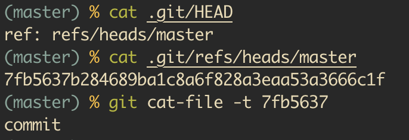
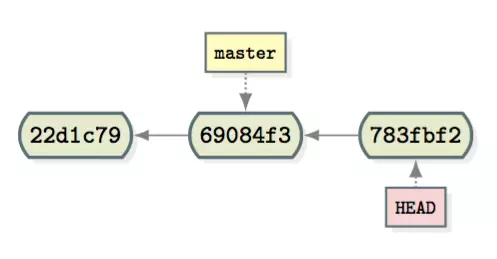

# HEAD头指针

## HEAD头指针是什么

git官网：`HEAD`是当前分支引用的指针，它总是指向该分支上的最后一次提交

`HEAD`就是当前活跃分支的游标，即现在处在那个分支中（`git branch`中带星号的分支），当然将`HEAD`指向一个`commit`时就会造成上述的分离头指针

当`HEAD`指向分支时，在提交后`HEAD`会随着`branch`指针一起移动，当`HEAD`指向`commit`时，只有`HEAD`会随着提交移动，而`branch`指针是不会移动的

可能某处的`commit`处在两个分支中，但是git是怎么知道你是处在哪一个分支中的呢，`HEAD`就告诉了git当前处在那个分支中

**`HEAD`是指向分支的（如`master`分支），而`master`才是指向提交的**

## HEAD中`~`和`^`的区别

- `HEAD~N`作用是查找HEAD的第N个祖先节点，当N为空时默认为1
- `HEAD~N`作用是查找HEAD的所有父亲节点中第N个节(某些节点可能存在多个父亲节点，例如merge后的commit)，当N为空时默认为1

```txt
* 7a3fb3d D HEAD
|\
| * 07b920c C
|/
* 71bd2cf B
|
* 8db4afb A
```

上图中的`commit D`存在`commit C`和`commit B`两个父亲节点

以`commit D`作为HEAD
- `HEAD~1` -> `commit B`
- `HEAD~2` -> `commit A`
- `HEAD^1` -> `commit B`
- `HEAD^2` -> `commit C`

## `.git`目录下的HEAD

`HEAD`头指针存储在`.git`目录下的`HEAD`文件中，而`HEAD`中存储了指向所在分支的引用

当`HEAD`处在分离头指针的状态时，即`HEAD`指向提交时，`.git`中的`HEAD`指向的就是`commit id`

从图片中可以看出HEAD是指向分支的，而分支是指向提交的



## 分离头指针(Detached HEAD)

`HEAD`通常指向目前所在分支，但是并不是一定要指向分支的，当使用`checkout`切换到其他`commit`点的时候，即脱离了分支，当然我们可以使用`git branch`新建一个分支，但如果不选择新建分支，则进入了分离头指针的状态

当处于分离头指针状态时，所做的`commit`是不安全的，一旦我们切换会别的分支，git会忽略这些没有分支的`commit`，并在一定时间后被git丢弃，因此如果我们需要保存这些`commit`，则需要在切换回别的分支时，为这些`commit`新建一个分支



### 使用分离头指针

如果临时想基于某个`commit`做变更，试试新方案是否可行，就可以采用分离头指针的方式。测试后发现新方案不成熟，直接`reset`回其他分支即可，git会忽略管理没有分支的`commit`