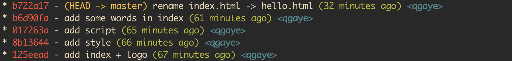

# Log指南

使用`git log`查看提交的日志信息

## `Git Log`参数选择

- `git log --oneline` 将每条日志的输出为一行
- `git log --all` 查看所有分支的日志
- `git log [branch]` 展示`branch`分支的日志
- `git log -[length]` 指定显示`length`条日志
- `git log --skip=[skip]` 跳过前`skip`条日志
- `git log -p` 显示更多的信息，相当于多次使用`git show [commit_id]`的结果
- `git log --graph` 绘制提交的线索，如果有合并的话，也会更清晰地显示出来
- `git log --decorate` 显示HEAD、分支名、tag名等信息
- `git log -g` 查看所有历史操作记录
- `git log --pretty=format:" "` 控制显示日志的格式

### `pretty=format`中参数选择

- `%H` 提交对象（commit）的完整哈希字串
- `%h` 提交对象的简短哈希字串
- `%T` 树对象（tree）的完整哈希字串
- `%t` 树对象的简短哈希字串
- `%P` 父对象（parent）的完整哈希字串
- `%p` 父对象的简短哈希字串
- `%an` 作者（author）的名字
- `%ae` 作者的电子邮件地址
- `%ad` 作者修订日期（可以用 -date= 选项定制格式）
- `%ar` 作者修订日期，按多久以前的方式显示
- `%cn` 提交者(committer)的名字
- `%ce` 提交者的电子邮件地址
- `%cd` 提交日期
- `%cr` 提交日期，按多久以前的方式显示
- `%s` 提交说明

## 搜索`Git`日志

- `git log --author [author]` 筛选出提交者为`author`的日志
- `git log --grep [keywords]` 筛选出`commit`中包含`keywords`的日志
- `git log -p -- [file]` 筛选只与`file`文件相关的提交日志
- `git log --after [aftertime] --before [beforetime]` 筛选指定时间内的提交日志

## 美化`log`显示

```bash
# 配置git的alias
git config --global alias.lg "log --color --graph --pretty=format:'%Cred%h%Creset -%C(yellow)%d%Creset %s %Cgreen(%cr) %C(bold blue)<%an>%Creset' --abbrev-commit"  
# 使用lg缩写
git lg
```



## Reflog命令

`git reflog`记录了本地所有git的操作记录，包括了所有被删除的提交记录

当使用`git reset`命令后希望恢复到最新的提交时，可以使用`git reflog`找到最新的提交id，`git log -g`也提供类似功能

```bash
git reflog    # 参数使用与log命令相似
```

## 参考

- [git查看提交历史](https://git-scm.com/book/zh/v1/Git-%E5%9F%BA%E7%A1%80-%E6%9F%A5%E7%9C%8B%E6%8F%90%E4%BA%A4%E5%8E%86%E5%8F%B2)
