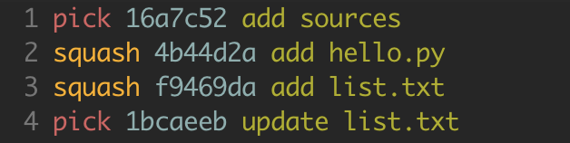

# Rebase指南

`git rebase`又称作变基操作

`git rebase`本质是使用了分离头指针，在处理变更时，`rebase`会先将`HEAD`指向指定的`commit`，此时`HEAD`不在分支中，即处于分离头指针的状态。当修改了指定`commit`的孩子提交下的信息后，会重新生成一次新的`commit`，当`rebase`创建完最后一个`commit`后，结束分离头指针状态，使`HEAD`再次指向变更前的分支。

## `rebase`特点

- `rebase`命令中的`[commit]`指的是带修改的父提交，即当需要修改的是`HEAD^`的提交信息，则`[commit]`中需是其父提交`HEAD^^`
- 当在`rebase`中需要使用到第一次的`commit`，需要在进入编辑模式后，在第一行自行添加`pick [first commit]`
- 在指定`commit`的所有孩子提交中，即使没有修改他们的信息，依旧也会生成新的`commit`代替原先的提交，并且所有新生成的`commit`只对当前分支有效，其他分支依旧沿用以前的`commit`
- `git rebase`命令打开的文本编辑器中的`commit`顺序跟`git log`查看的顺序是相反的，也就是最近的提交在下面，老旧的提交在上面

## 交互式的`rebase`

使用`git rebase -i [commit]`进行交互式的`rebase`操作

### 交互式`rebase`下的一些编辑命令

```text
p, pick = use commit
r, reword = 修改commit信息
s, squash = 合并多个commit
f, fixup = 与squash相似，但是合并时丢弃commit信息
```

### 1. 使用`rebase`修改`commit`中的信息

#### 修改最近一次的`commit`

```bash
git commmit -amend
```

#### 修改过往的`commit`

1. 将待修改信息的`commit`的`pick`修改为`reword`，保存退出
2. 修改`message`信息，若`reword`了多个`commit`，则挨个修改

### 2. 使用`rebase`合并多个`commit`

#### 合并连续的多个`commit`

1. 将待修改的多个`commit`的`pick`修改为`squash`，保存退出
2. 所有`squash`选项的`commit`必须被`pick`的`commit`包裹，即头和尾必须是`pick`的
3. 编辑合并多个`commit`的注释，也可省略

#### 合并间隔的多个`commit`

1. 将待修改的多个`commit`的`pick`修改为`squash`，保存退出
2. 移动`squash`选项的`commit`，将原先间隔的待合并的`commit`移动到一起，紧密排列
3. 使用`git rebase --continue`继续



### 其他适用于交互式`rebase`的命令

- `git rebase --abort` 放弃此次`rebase`操作
- `git rebase --continue` 进行下一步执行
- `git rebase --edit-todo` 继续进入编辑模式
