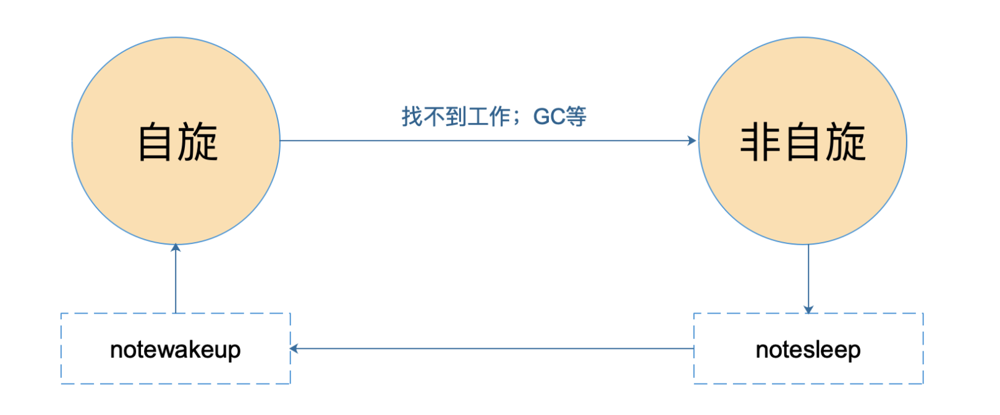
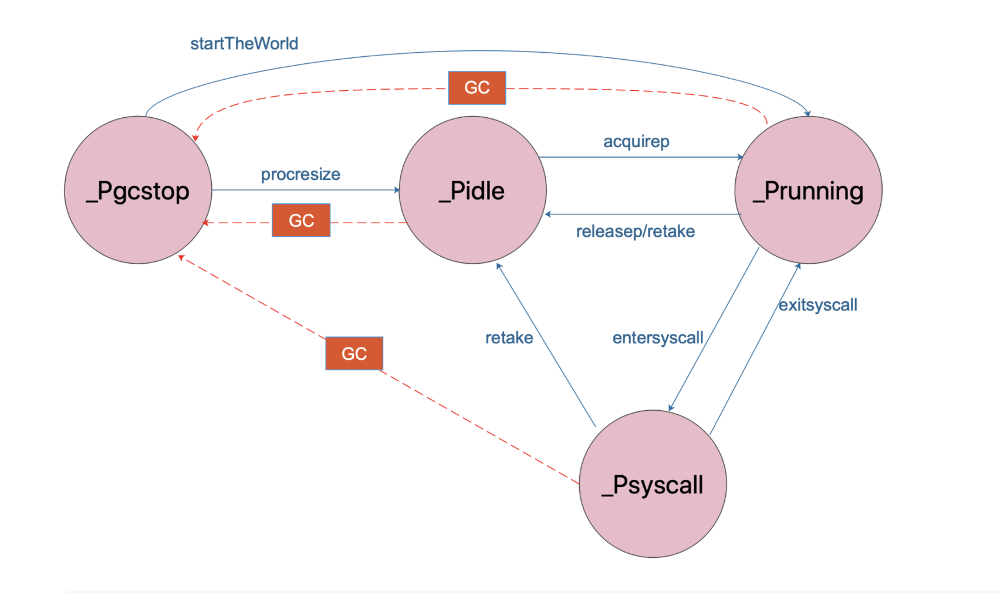
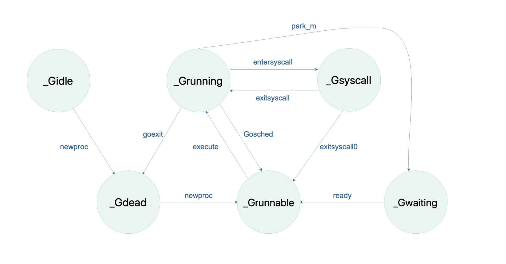
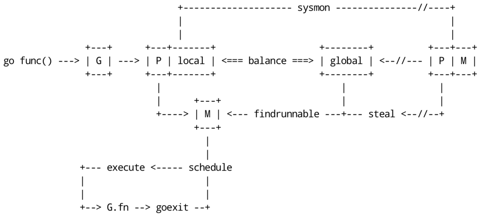

# goroutine和channel原理

## goroutine

### Go程序初始化过程

1. 首先调整SP寄存器位置为16的倍数，接着初始化g0，为他分配栈空间，然后设置本地线程存储(即全局变量，但每个goroutine拿到的都是相对应线程的G)，并测试一下本地线程存储
2. 初始化m0，并将m0挂载到全局变量allm上，call osinit，schedinit，通过newproc创建新的g并在该g上运行runtime.main函数，最后runtime·mstart启动schedule函数，
   1. osinit 获取cpu核心数
   2. schedinit 以osinit中获取到的核心数的数量初始化p，放到allp中，最后acquirep函数将m0和p0关联起来
3. newm函数初始化后台任务sysmon，该任务是跑在物理线程上的，主要负责网络的epoll和抢占式调度检测
4. newproc函数初始化goroutine跑后台任务scavenger，该后台任务执行runtime·MHeap_Scavenger函数，负责垃圾回收
5. 执行main.init，每个包的init函数会在包使用之前先执行
6. 在前面的newproc的新goroutine上运行的runtime.main最后会运行到我们自己写的main.main，执行我们的逻辑

### GPM结构体

G是goroutine的缩写，是Go用来调度的协程

该结构体中包括goid(这个goroutine的id)，status(这个goroutine的状态)，stackbase/stackguard(栈的信息)，fnstart(这个goroutine运行的函数信息)，m(这个goroutine所在的M)，lockedm(这个goroutine只能在这个M上运行)，goroutine切换时，上下文保存在sched中，sched是个Gobuf结构体，Gobuf中有pc(程序计数器)，sp(当前栈指针)和goroutine自身

M是machine的缩写，其对应的是操作系统中物理的线程

该结构体中包括p(这个M关联的P)，curg(这个M当前运行的G)，mcache(这个M的内存缓存，早起Go是没有P的，因此mcache是在M中，但后来有了P，mcache被移到了P中，但M中mcache并没有被去掉)，g0(带有调度栈的goroutine，g0的栈是M对应的线程的栈，所有调度相关的代码会切换到g0的栈中执行)

P是Processor的缩写，代表了Go代码执行时需要的资源，其默认数量为CPU核心数

该结构体中包括status(这个P的状态)，m(这个P关联的M)，mcache(M中移过来的内存缓存)，runq(本地的Grunnable的goroutine队列，从本地队列中获取是不需要加锁的)，gfree(先前创建的但执行完的goroutine，可以重复使用，免去重复创建)

Sched是调度实现的结构体

结构体主要是pidle(空闲的P)，midle(空闲的M)，runqhead/runqtail(全局的Grunnable的goroutine队列)，Lock(锁，对Sched的操作往往都要加锁)

### GPM状态





### GPM关系



每个M对应的是真是的物理线程，G就是goroutine，代表这一个个任务，而M需要P才能执行G，当P和M关联后，P就将自己本地的G队列中的G给M执行，(为什么P要有本地G队列，因为早起没有本地队列，都是在Sched中的全局队列，那么每个M获取G时都要加锁，性能损耗大，且一个G中开的一个G，如果继续在该M上执行缓存利用率高，但全局队列的还就无法保证这个G还在原先的G的M上运行)，如果这个G执行系统调用/网络IO操作，同步模式下那这个P就会脱离M，M带着G继续执行，而P调度一个M来继续执行本地队列G，G执行完后会加到原先的P的队列上，M尝试获取别的P做关联，如果没有别的P就被Sched管理空闲，异步模式下G会直接脱离，给Net Poller管理，P和M不用动，当G执行完就加回原先P的队列中。当P的本地队列空了，那就到全局队列中拿G(调度时每62次就会到全局队列中拿取，即使本地队列还有G)，如果全局队列也空了，那就取别的P上偷取一半的G来运行(无论是到全局队列还是偷取别的P上的G，都是要加锁的)

## channel

有两种channel，以`make(chan int)`形式创建的channel称为阻塞channel，以`make(chan int, 1)`形式创建的称为缓冲channel，channel在底层是个hchan结构体

channel底层中有两个队列，分别为sendq和recvq，所有阻塞在该channel的想发送消息的协程会被放在sendq这个队列中，而所有阻塞在该channel的想接受消息的协程会被放在recvq中

缓冲channel中还有个环形数组，用于缓冲协程发来的消息，大小由make的时候确定，而阻塞channel这个数组就是空的，即无法缓存任何消息

阻塞channel：没有缓冲的数组，因此当发消息的协程来的时候如果recvq队列中没有被阻塞的协程，那么其就会被阻塞，放入sendq队列中，当接受消息的协程来的时候，会唤醒sendq中的第一个协程，唤醒的发消息的协程把消息直接传递给接受消息的协程，因此阻塞channel中是同一协程中即发送消息又接受消息，那么就会发生死锁

```go
ch := make(chan int)
ch <- 1
fmt.Println(<- ch)  // 会发生deadlock，但如果make(chan int, 1)给了缓冲大小，那就不会发生deadlock
```

缓冲channel：当发消息的协程来的时候先检查缓冲数组是否满了，如果没满直接将消息拷贝到缓冲数组中，直接返回，如果满了那就被阻塞，放入sendq队列中，当接受消息的协程来的时候，先检查缓冲数组中是否有消息，如果有消息就获取并直接返回，如果数组为空那就被阻塞，放入recvq队列中等待(无论发生消息的协程还是接受消息的协程，在对缓冲数组操作时都必须进行加锁，锁的是channel的结构体中的mutex lock)

## 参考

- [深入解析Go](https://tiancaiamao.gitbooks.io/go-internals/content/zh/04.1.html)
- [Go scheduler 源码阅读](https://qcrao.com/ishare/go-scheduler/#truego-%E8%B0%83%E5%BA%A6%E5%99%A8)
- [Golang 的 goroutine 是如何实现的？](https://www.zhihu.com/question/20862617/answer/27964865)

- [深入理解Golang Channel](https://zhuanlan.zhihu.com/p/27917262)
- [Go Channel最佳实践之基本规则](https://zhuanlan.zhihu.com/p/32521576)
