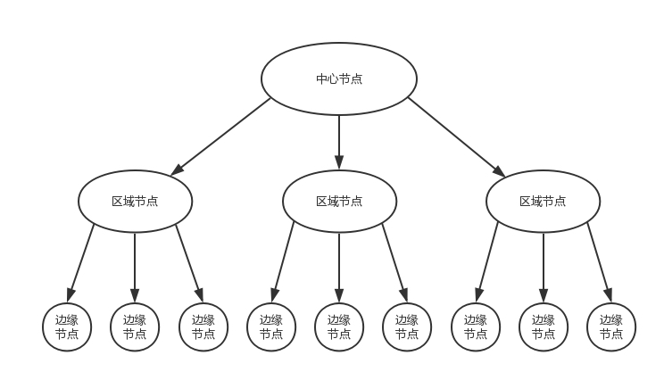

# 计算机网络

## 网络模型

OSI七层模型：物理层/数据链路层/网络层/传输层/会话层/表示层/应用层
TCP/IP四层模型：数据链路层/网络层/传输层/应用层
五层模型：物理层/数据链路层/网络层/传输层/应用层

## IP

IPV4(Internet Protocol version 4)使用32位(4字节)地址，因此总计只有42亿个地址

早期对IPV4的分类不合理，本身地址数就紧张还被分成5类，C类的私有IP地址量过少而B类私有IP地址量有过多，于是就有了CIDR(无类型域间选路)，其将IP地址一分为二，前者网络号后者主机号，因此也就有了子网掩码(用来区分网络号和主机号，1的数目代表网络号，0的数目代表主机号)，广播地址(主机号全为1的IP地址)

IP分为共有IP和私有IP，192.168.0.x是最常用的私有IP地址，192.169.0是网络号，192.168.0.1通常是私有网络的出口ip，192.168.0.255是广播地址

因为IPV4设计的问题，于是有了IPV6，其使用128位(16字节)，并且还取消了广播地址，由多目地址代替，此外在报文头中删除了部分域(比如CRC校验域，分段域)，IPV6还要求数据包分段只能由源主机进行，禁止路由器进行分段，IPV6的局域网中MTU(最大传输单元)必须大于等于1280字节，从而减少分段可能性

IPV6有着诸多好处，并且自1998年发布后也有了一定时间，那么为什么IPV6没能取代IPV4？
- NAT(网络地址转换)技术缓解了IPV4的地址短缺问题
- IPV4和IPV6协议完全不兼容，因此需要双协议栈，隧道技术或NAT64实现协议的过渡
- CIDR(无类型域间选路)的对地址的细粒度管控从而延缓了IP地址耗尽的时间

## MAC

MAC地址(Media access control address)是分配给网络控制器的唯一标识符，所有具有网卡的主机都有单独的MAC地址，该地址共48位

因为MAC地址需要保证唯一，因此IEEE会根据设备的制造商分配地址段，48位MAC地址的前24为设备制造商的唯一标识符(OUI)，后24位是序列号(NIC)

但在实际现实中，MAC地址的全球唯一是无法保证的也并不需要一定全球唯一：
- 在不同操作系统上，我们都可以通过软件直接修改网卡的MAC地址
- 只需要保证一个局域网内的MAC地址不重复，网络就可以正常工作

当局域网中设备向其他设备发送以太网帧时，就需要MAC地址(因为以太网帧中需要目标MAC地址)。在网络层进行数据包发送时，往往只知道目标地址的IP，因此到局域网中(数据链路层)，就需要ARP(Address Resolution Protocol)地址解析协议来获取目标IP对应的MAC地址。ARP请求流程：
- 源主机向局域网中发送ARP请求，目标MAC地址为FF-FF-FF-FF-FF-FF，即这是个广播请求，局域网着所有设备都会收到
- 收到ARP请求的主机会检查目标IP和自己的IP地址是否一致，一致则向源主机发送ARP响应，否则忽略该请求
- 源主机在收到ARP响应后，会更新本地缓存表并向目的主机发送请求

当局域网中出现相同MAC地址的设备后，如果使用的是集线器(Hub)，那么不会出现什么问题，因为所有请求都会被广播给局域网内所有主机，但如果是交换机(Switch)，因为交换机有记忆功能，而同一个MAC地址又只会记录一次，于是乎就无法感知到存在相同的MAC地址

MAC地址和IP地址：

一个网络包要从一个地方传到另一个地方，除了要有确定的地址，还需要有定位功能

举例来说MAC地址就像你的身份证号，身份证号是唯一的但是别人无法通过身份证号直接找到你，此时别人就可以根据ip地址来定位到你的位置，比如你在互金，别人就知道先坐地铁12号线，再坐地铁4号线(这个过程就相当于路由器路由，用的是IP地址)，当到了互金后，大喊你的身份证号码就能找到你了(这个过程相当于交换机转发，用的是MAC地址)

总结：MAC地址用于数据链路层，在同一个局域网内通信，而IP地址用于网络层，当需要跨网段通信时就需要IP地址

## DHCP

IP地址可以随意配置，但用户自行配置往往会出现问题。比如你想接入的机器都是192.168.1.x，但自己配置了个16.158.23.6的ip地址，即使你想ping的地址192.168.1.6就在你旁边，但是Linux系统可不会如你所愿直接发给旁边的192.168.1.6

在网络上的包必须是完整的，不能有上层没下层，意思就是有ip没用，还得有MAC地址才能把包发出去，因此Linux首先会去获取目标地址的MAC地址，但是当目标地址和本机地址是同一个网段，才会发送ARP请求来获取目标地址的MAC地址，很显然现在目的ip和本机ip不在一个网段，此时Linux认为这是一个跨网段调用，就会直接发给网关。如果配置了网关Linux就回去获取网关的MAC地址，然后将包发给网关，网关那能不能成功发送到192.168.1.6就得看网关上有没有做过配置了。如果没有配置网关，那么包压根发不出去。如果想把网关配成192.168.1.6，对不起，Linux不会让你配置成功的，因为网关至少和一个网卡在同一网段中的

DHCP(动态主机配置协议)就是帮助新接入的机器自动配置CIDR、子网掩码、广播地址和网关地址这些信息的

1. 新接入的机器会发送广播包(UDP封装的BOOTP)，其中带上自己的MAC地址请求个ip地址，这个称为DHCP Discover
2. 网络中的DHCP Server会感知到新接入的机器，此时会从地址池中分配一个未使用的ip地址给它给，并将子网掩码、网关和IP地址租用期等信息广播发送给新机器，这个称为DHCP Offer
3. 新机器此时可能会接收到多个DHCP Offer，一般会选取第一个到达的，并将MAC地址，接受的ip地址，提供该地址的DHCP服务器地址等信息通过广播的方式发送，主要为了告诉其他的DHCP服务器可以撤销提供给他的ip，这个称为DHCP Request
4. DHCP接收到新机器的DHCP Request后，会广播给新机器DHCP ACK包，表明已接受新机器的选择，并让网络中其他机器也感知到

DHCP还可以通过PXE(预启动执行环境)可以自动为新来的机器配置操作系统

## 交换机和集线器

当只有两台机器的时候可以通过网线直连，但当机器数大于两台时，就需要集线器或者交换机

集线器(Hub)是完全工作在物理层的，它将收到的所有字节全部复制到其他端口上，即广播模式

多路访问用于控制谁先发，谁后发，来防止混乱，主要有以下三种方式
- 信道划分：分成多个道，你走你的，我走我的
- 轮流协议：先你发，再我发，轮着来
- 随机接入协议：都直接发出去，遇到堵塞再退回来等空闲再发，以太网用的就是这个协议

交换机(Switch)是具有MAC地址记忆能力的，当第一次请求MAC地址的端口不知道时，它会先广播给所有端口，接着它会记录MAC地址和端口的映射关系，并带上一个过期时间，这个称作转发表

集线器是共享带宽，而交换机是独占带宽

当多台交换机连接起来时会存在环路问题，简单来说就是询问机器2的MAC地址的ARP请求到达交换机A的时，交换机A不清楚于是就广播给LAN2，接着交换机B纠结收到了交换机A在LAN2中广播，于是交换机B发现自己也不清楚，于是又转发给LAN1，接着交换机A又会接收到来自交换机B的广播，于是开始了周而复始的循环

计算机网络中使用STP协议来解决环路问题，其原理就是打破环构成的图，通过节点间的比较，选择一个为父一个为子来打破环，构成最小生成树

当机器和交换机越来越多，网络也越来越大，此时广播的性能毫无疑问会急剧下降，并且隐私性也无法保障，此时可以通过虚拟隔离(VLAN，虚拟局域网)来将机器隔离在不同的局域网中

此时需要将数据链路层的数据包的头上加一个TAG，里面有一个VLAN ID，这个VLAN ID共12位，因此最多只能划分4096个VLAN

如果交换机支持VLAN，那么就可以配置每个端口所属的VLAN，当数据包来时，交换机会识别出VLAN ID，并转发给相同VLAN的端口，即只有相同VLAN的包才会互相转发

对于支持VLAN的交换机有一种Trunk的接口，它可以转发任何VLAN的包，因此交换机之间可以通过这个接口连接

## ICMP

ICMP(Internet Control Message Protocol)：互联网控制报文协议，ICMP报文是封装在IP包里的

ICMP有很多不同类型，不同类型使用不同的代码，最常用的类型是主动请求为8，主动请求的应答为0

查询报文类型：

ping就是查询报文，ping的主动请求称为ICMP ECHO REQUEST，主动请求的回复称为ICMP ECHO REPLY

比起原生的ICMP其中多了两个字段，一个是标识符，另一个是序号

ping命令执行时会首先构建一个ICMP请求包，类型字段为8，序号(顺序号)在每发出一个请求包后加1，并会插入发送时间用于计算往返时间RTT，接着交给网络层和数据链路层构建数据包，最后发出数据包，如果没有接收到ICMP应答包，就说明目标地址不可达，如果接收到就表示可达

差错报文类型：

差错报文主要就是报告出现问题的原因，不同类型字段代表不同的错误状态，比如终点不可达为3，源抑制为4，超时为11，重定向为5

traceroute就是故意制造一些错误的场景，来获取差错报文以分析信息，比如traceroute会发送一份UDP数据包给目标地址，但目标端口设成超出范围的值，当目标主机生成返回一个端口不可达的ICMP差错报文，你就知道了数据包是送达的，如果差错报文是超时，那就说明数据包未达到目标地址(主要原因是UDP是无连接的，即收不到回复的)

## 网关

当Linux发现目标ip地址和本机ip地址不在同一网段时，就会发送给网关，网关往往是个路由器，但不一定是路由器，其本质是个处在网络层的转发设备，它会解给别的设备析MAC头和IP头，并决定转发 

静态路由：

静态路由就是在路由器上自行配置一条条转发规则，比如目标网段192.169.3.x转发到3号口，其中具体分为转发网关和NAT网关

转发网关：不改变ip地址的网关，路由器只会在转发时修改目标MAC地址

NAT网关：改变ip地址的网关，目标地址不在同一局域网中但网段却相同，因此就要暴露一个公网ip供使用，路由器在转发公网ip到内网ip时不但会修改目标MAC地址，还会修改目标ip

NAT(Network Address Translation)：网络地址转换

除了根据目标ip配置路由外，还可以通过参数来配置路由，比如让指定源ip走指定网口转发

动态路由：

动态路由的核心就是如何在两个路由间找到最短路径，图中有两种方法Bellman-Ford算法和Dijkstra算法

距离矢量路由算法：

距离矢量路由算法是基于Bellman-Ford算法的，基本思想就是每个路由器中保存着一个路由表，其包含多行，每行包含两部分信息，一个是目标路由器，另一个就是到目标路由器的距离

每个路由器都是知道自己和邻居间的距离的，每过几秒，路由器就会将自己知道的目标路由器和距离告诉邻居，邻居路由器只需要将距离+1就能更新自己的路由表了

其存在两个问题：
1. 坏消息传的慢：比如A路由器记录到X路由器距离1，邻居B路由器记录到X路由器距离2，此时X路由器挂了，A路由器连不上X路由器了，但他发现它邻居B路由器到X路由器距离是2，因此他就更新自己到X路由器距离为3，接着C路由器也连不上X路由器了，但他发现邻居A路由器到X路由器距离为3，于是也更新了自己距离，往复循环，直到他们到X路由器的距离更新到了阈值，他们才正真明白X路由器原来挂了
2. 每次发送时都要发送自己整个路由表：当网络大了，这个路由表就会非常大，传输效率就会很低，因此小型网络(小于15跳)使用的路由协议RIP才会使用该算法

链路状态路由算法：

链路状态路由算法是基于基于Dijkstra算法的，基本思想就是路由器启动时会向say hello，得到邻居回复后就能计算出之间的距离了，接着将自己和邻居间的链路状态广播给整个网络，这样整个网络中的路由器都知道了这个关系，每个路由器都能够在本地构建一个完整的图，接着在这个图上使用Dijkstra算法找出两点间的最短路径

其只需要广播两两之间的关系而不用广播整个路由表，因此数据包很小，其次一旦有路由器挂了，邻居路由器就会广播这个消息，从而使得坏消息也能及时更新

动态路由协议：

OSPF：

OSPF(Open Shortest Path First)：开放式最短路径优先，其基于链路状态路由协议，由于主要用于数据中心中的协议，因此被称为IGP(Interior Gateway Protocol，内部网关协议)

OSPF能够发现图中存在的多个最短的路径，并在这些路径中进行负载均衡

BGP：

BGP(Border Gateway Protocol)：外网路由协议，其基于增强版的路径矢量路由协议，在外网中虽然存在更短的路径，但是这条路径不一定允许你使用

因此会将网络分为一个个自治系统AS(Autonomous System)
- Stub AS：对外只有一个连接，这类AS不会传输其他AS的包，比如个人或者小公司的网络
- Multihomed AS：可能有多个连接连到其他的AS，但是大多拒绝帮其他的AS传输包，比如一些大公司的网络
- Transit AS：有多个连接连到其他的AS，并且可以帮助其他的AS传输包，比如主干网

BGP分为两类，eBGP和iBGP，边界路由器(AS间相连的)使用eBGP广播路由，AS内部使用iBGP找到最短路径的边界路由器来到达外网

在BGP中相较于距离矢量路由算法除了下一跳距离外，还会带上AS路径，因此A是知道B是通过自己知道的X，因此当A连不上X后，不会再通过B来更新，解决坏消息传递慢的问题，其次整个网络中将AS看作整体，而不再关注AS中一个个具体的路由器，因此即使共享整个表问题也不大

## NAT

NAT(Network Address Translation)也称网络地址转换，是一种修改IP数据包中网络地址的技术(不只路由器，虚拟机/容器也会使用NAT技术)，通过NAT这个中间层，可以有效保护私有网络，也可以缓解IP地址短缺的问题

比如内网中都是192.160.0.x的IP地址，在对外请求时源IP地址必然是不能填192.168.0.x(因为这是私有IP地址)，于是在NAT技术下，路由器负责将IP数据包中源IP地址修改为公网IP使得请求数据包能够正常发送并接收到回复，从而达成了对外网只有一个公有IP的情况下服务整个局域网中所有主机请求(像现实生活中一个小区的所有请求ISP(互联网服务提供商)可能会提供公网IP或者再嵌套在另一个NAT中)

当IP数据包从内网访问外网时，NAT会为当前请求分配一个端口，然后修改IP数据包中的源IP地址和端口，并将这些信息写入本地转换表中(表中记录：`广域网 218.1.158.176:7891 | 局域网 192.169.0.1:8080`)。当IP数据包从外部进入内网时NAT会根据IP数据包中的目标IP地址和端口从本地转换表中查找出内网中对应的IP地址和端口，接着将内网IP地址和端口重写到IP数据包中的目标地址

NAT存在的问题：
- NAT中端口号不再有意义，本身端口号用于标识主机进程的，但NAT下内网中代表主机进程的端口号被替换为NAT用于表示主机的端口号
- NAT处在网络层，因此只能对IP数据包进行修改
- NAT违反了主机间应当直接对话的原则

## TCP/UDP

数据包是UDP还是TCP通过IP头中的8位协议判断

对于UDP协议，数据包最大长度为65535字节，对于TCP协议，数据包最大长度由MSS(Maxitum Segment Size)最大传输大小决定

### UDP

UDP(User Datagram Protocol)：用户数据包协议，UDP是无连接的，不能保证可靠的交付数据，没有拥塞控制

UDP将应用层的数据直接加上UDP的首部信息发送出去，即面向报文传输的协议，UDP首部开销小，只有8个字节

因为UDP首部开销小，无连接等特性，其适用于三种场景：
- 对丢包不敏感的应用：DHCP
- 无需建立连接的广播应用：DHCP
- 需要处理速度快，时延低，容忍少量丢包，即使网络拥塞也要尽快送达：流媒体协议，实时游戏

### TCP

TCP(Transmission Control Protocol)：传输控制协，TCP提供一种面向连接的、可靠的字节流服务

所谓面向字节流就是指TCP会将用户的数据块进行合并或分拆，然后进行传输(IP包本身不是流，而是一个个数据包)

重要的是SYN置1表示该请求在请求连接，ACK置1表示此时请求中确认号是有效的，FIN置1表示该请求在释放连接

TCP首部20个字节，带上可选的最多60个字节

TCP的可靠传输是基于滑动窗口实现的，对于发送端来说存在滑动窗口分为四段：发送且确认的，发送但未确认的，未发送但可发送的(Advertised Window)和未发送且不可发送的

TCP采用累计确认的方式，当发送端接收到ACK表示这个ACK序号前的所有报文都接收到了，相对于单停等协议来说减少了ACK的传输并且可以一次性发送连续的多个报文

确认和重传机制：每个数据包发送后都必须收到个ACK包，当数据包发送后会启动个定时器，当超过一定时间(就是超时时间，通过采样RTT平均时间和波动范围确定，称为自适应重传算法)，就会重传，且每次超时重传后都会将超时时间设为原先的两倍，因为屡次超时就说明网络拥塞，不宜频繁发送

超时触发重传存在超时周期过长问题，因此快重传机制(也是拥塞控制的机制)，一旦发现一个失序报文，就立刻发送三个冗余的ACK(序号为失序的前一个)，发送端接收到后就不等超时立刻重传

### TCP快启

TCP快启(TCP Fast Open, TFO)，可以在某些场景下通过一次握手建立TCP连接

TCP连接的客户端向服务端请求时带上快启选项，服务端会生成一个TFO cookie并发送给客户端，客户端缓存该cookie，当客户端与服务端重新建立连接时，客户端将缓存的cookie发送给服务端，服务端验证cookie后会向客户端发送SYN和ACK并开始传输数据(相当于已经成功建立连接)，从而实现一次通信建立连接(快启不适用与客户端与服务端第一次建立连接，必须在三次握手建立连接后才能将TFO cookie发送给客户端用于后续重新建立连接时使用)

### TCP是如何数据可靠传输

- 校验和
- 确认应答 + 序列号 
- 超时重传 
- 流量控制 
- 拥塞控制

### TCP流量控制

流量控制的作用是让发送方感知到我这能接受的能力，就是不要发送的太快

流量控制是通过滑动窗口实现的，TCP首部里有窗口字段(Advertised Window)，可以用来告诉发送方我这里现在可容纳的窗口大小，当接收方告诉发送方窗口大小为0时，此时发送方会启用一个坚持定时器，来定时探测接收方的窗口大小，这是为了解决接收方传递可用的窗口大小时丢失造成死锁的情况

### TCP拥塞控制

流量控制考虑的是接收方，拥塞控制考虑的是整个网络，拥塞控制主要为了避免两种现象：包丢失和超时重传

慢启动算法：

拥塞窗口由小到大 1，2，4，8指数级扩大，当到达慢启动阈值时，启用拥塞避免算法

拥塞避免算法：

只要网络不拥塞就试探调大拥塞窗口(每次 + 1)，旦发现拥塞(即超时了)，那么就将慢启动阈值设为原来的一半，从1开始重新慢启动算法

快重传：

快重传要求接收方一旦发现一个失序报文，就立刻发送三个冗余的ACK(序号为失序的前一个)，发送端接收到后就不等超时立刻重传认，随后进入快恢复算法

快恢复：

在接收到3个以上的重复ACK后将慢启动阈值设为原来一半，并从一半的位置开始执行拥塞避免算法

BBR(Bottleneck Bandwidth and Round-trip propagation time)：

TCP拥塞控制的目标是最大化利用网络上链路的带宽，一条网络链路就像一条水管，水管中水越满就说明带宽用得越充分
水管内的水的数量 = 水管的容积 = 水管粗细 x 水管长度
网络内尚未被确认收到的数据包数量 = 网络链路上能容纳的数据包数量 = 链路带宽 x 往返延迟

上述的都是基于丢包的拥塞避免算法(不断增加发送窗口，直到发现开始丢包)，但是在实际中，丢包并不一定代表通道拥塞了，公网上存在着一定比例的丢包率，而上述的拥塞避免算法一旦发现丢包，就认定网络拥塞了，这毫无疑问是错误的选择。其次网络中会有一些buffer，上述的拥塞避免算法是通过灌水进水管的方式测试网络可接受的最大数据包量(不断增加发送窗口，直到发现开始丢包)，这毫无疑问会将buffer空间也计算进去，虽然看似网络中能接受的数据包量变多了，但buffer中的包是必须等待着被传输的，因此时延增长，此外如果连接较多时，可能会导致缓冲区被填满而丢包，这个问题被称为bufferbloat(缓冲区膨胀)

综上所述，BBR致力于解决两个问题：
1. 在有一定丢包率的网络链路上充分利用带宽
2. 降低网络链路上的buffer占用率，从而降低延迟

BRR解决策略：
1. 既然不容易区分拥塞丢包和错误丢包，BBR就干脆不考虑丢包
2. 既然灌满水管的方式容易造成缓冲区膨胀，BBR就分别估计带宽和延时，而不是直接估计水管的容积

但是带宽和延时是无法同时测准的，因为带宽最大时缓冲区会被占用，从而延时较大，当延时最小时，就要求缓冲区为空，那么带宽就较小，因此只能交替测量来得到带宽的最大值和延时的最小值

BBR流程：
1. 慢启动：指数级增加发包速率，直到将整个网络填满，包括缓冲区(而上述算法在有一个丢包时就会进行拥塞控制)，当有效带宽不再变化时就说明塞满了，于是进入拥塞避免
2. 排空阶段：指数级降低发包速率，直到延时不再降低时，就说明整个网络中buffer被排空了

慢启动的最后带宽用作计算，因为此时带宽值最大，慢启动的最开始延时用作计算，因为此时延时最小

### TCP三次握手

为什么需要第三次握手，事实上第二次握手的时候客户端已经处在连接建立的状态(第三次握手SYN不等于1了)，但是存在一种客户端第一次建立连接请求在网络中过了很久才到达服务端，客户端以为超时重传了，而重传的很快服务端就回应了，而后客户端第一次的请求到了服务端，服务端不知道这个请求已经被重传过了，因此也回应了，如果此时是两次握手建立连接，那么两个连接就会被建立，而其中一个是平白无故占用服务端资源的，因此第三次握手就是来解决这种情况

为什么不是四次握手，毫无疑问第三次客户端向服务端挥手后也是没法感知到服务端有没有收到的，因此第四次挥手是可以的，但是客户端怎么保证第四次挥手服务端一定收到了呢，那是不是就要第五次挥手了，从而就变成无止境的相互挥手了(究其原因是因为客户端和服务端之间永远没有办法确切感知到对方的存在)，因此第四次挥手是可以的，但四万次挥手都没法保证连接一定可靠，只要消息有来有回，就认定是成功建立连接了

### TCP四次挥手

在客户端进行最后一次挥手后会启动一个等待定时器，在等待2MSL(MSL为最长报文段寿命，通常为2分钟)，其作用是因为最后一次挥手后服务端是没有确认回复的，因此客户端需要确认服务器接收到了客户端的挥手，服务端在发起断开连接后在2MSL中如果没有收到确认，会重传，此时客户端处在等待2MSL中，因此就能回答。此外等待2MSL还能保证整个连接中的报文段都过期了，这样上一个连接中的迷失的报文段就不会影响到后一次的连接了

注：MSL(Maximum Segment Lifetime)和TTL(Time to Live)都和报文生存有关，只是前者是时间维度而后者是经过路由跳数，不是时间单位，而RTT(Round-Trip Time)是往返时延

出现大量time_wait原因：即你是主动释放连接的一方，也可以设置快速回收time_wait的连接或允许将time_wait的连接应用于新的TCP连接

出现大量close_wait原因：代码中建立的连接没去close

### 粘包和拆包

不同的协议层对数据包有不同的名称，传输层叫做数据段(segment)，网络层叫做数据报(package)，数据链路层叫做数据帧(frame)

#### 拆包

IP协议位于网络层，它会将数据包交给数据链路层传输，在数据链路层上存在多台设备，而每台设备的MTU(Maximum transmission unit)最大传输单元都是不同的，整个链路上的MTU由最小的那台设备决定，而IP数据包的数据上限因而也由MTU决定，以太网上MTU一般为1500字节，1500 - 20(IP报文头部)即代表IP数据包的最大负载，当IP数据包大于MTU时就会发生拆包

探测两台主机间传输链路的MTU原理：
1. 向目标主机发送IP数据包，其中DF控制位(Don’t Fragment，即不分片的意思)为1
2. 链路上的网络设备根据发送的数据包大小和自身的MTU决定，当数据包大于自身MTU时，就会丢弃数据包并返回个包含该设备MTU的ICMP报文，反之则继续向目标主机发送
3. 源主机收到ICMP报文后会不断用返回的MTU作为新的MTU发送IP数据包来探测链路间的MTU，直到IP数据包到达目标主机

UDP协议最大长度为65535字节，当大于这个长度后sendto函数会返回错误，因为UDP是面向报文的，因此在传输层UDP不会发生拆包，只会在网络层进行拆包。因为是在网络层进行拆包，因此IP协议直接按照链路上的MTU(最大传输单元)大小进行拆包，并且被新拆出来的包是不会带上UDP头部信息的(可以理解为一个数据包直接被劈成两段)，接收方在收到数据后对分片的数据包进行重组，但因为被拆分出来的新的数据包中不包含UDP头部信息，因此一旦丢包整个UDP数据包就无法重组

因此UDP协议中一个数据包需要传输的数据过多时，在网络层就会被IP协议大量分片，增加不稳定性，为了UDP的传输稳定性，还是建议UDP数据包大小在MTU - 20字节(IP头部)之内，可以避免被拆包

TCP是面向字节流的，并且还要保证可靠传输，固然不能像UDP那样让数据包直接给IP协议来拆包(因为IP协议拆包不会在意数据包中传输层的信息，只会简单粗暴的切分)，于是TCP就引入了MSS(Maximum segment size)最大分段大小来规定TCP数据段的最大长度，MSS为MTU - 20字节(IP头部) - 20字节(TCP头部)，在以太网中也就是1500 - 20 - 20字节

IP协议上的MTU是物理设备上的限制，而TCP协议的MSS是操作系统内核层面的限制，通信双方会在三次握手时确定这次连接的MSS，一旦确定MSS后TCP协议就会对应用层上的数据按MSS大小进行拆分，分成多个数据段传输(此时IP协议就不再需要拆包了，因为在MSS的限定下，IP数据包大小是一定小于MTU的)

当应用层数据大于MSS大小后，TCP协议就会对其进行分段，并且新分出来的段也会带上TCP头部，于是每个TCP数据段在加上IP头部后成为的IP数据包是一定小于MTU的，也就无需被IP协议拆包了，从而保证了TCP的可靠传输，并且在丢包的情况下，只需要重传指定的TCP包即可，而如果直接给IP协议拆包的话，被拆出来的新的数据包中不包含TCP头信息，于是在一个IP数据包丢包后就必须将整个TCP数据段(也就是好多个IP数据包)进行重传

总结：IP协议拆包的原因是受限于下一层数据链路层上的物理设备MTU的限制，TCP协议拆包的原因是其为了保证数据传输的可靠性，因此不能让IP协议进行拆包，因此就需要自行进行拆包

#### 粘包

粘包只会发生在TCP中，而不存在于UDP中，因为UDP是面向报文的，因此应用层将数据包发来后直接加上UDP头部就交给IP层发送，因此不存在粘包的问题，而TCP中是面向字节流的，因而某些情况下会将多个数据段组合后发送

Nagle算法就是一种通过减少数据包的方式提高TCP传输性能的算法，当应用层协议通过TCP传输时，应用层的数据先被写入TCP协议缓冲区，当开启了Nagle算法后，那么TCP协议不会立即发送写入的数据，其会等待缓冲区中数据超过MSS(最大数据段)或上一个数据段被ACK时才会发送缓冲区中数据

虽然Nagle算法能够在数据包较小时提高网络带宽，但现在网络带宽往往不再是问题，因此在Linux中默认也是关闭Nagle算法的，另外，Nagle算法将较小的数据包合并发送就要求应用层协议要自行划分数据包的边界，在应用层协议中最常见的两个解决方法就是基于长度或基于终结符
- 基于长度：HTTP协议中协议头中`Content-Length`字段标明了该HTTP消息的负载大小，当应用层协议解析到足够字节数后就可以分离出完整的HTTP数据包
- 基于终结符：当HTTP协议使用块传输(Chunked Transfer)机制时，HTTP使用终结符表示消息的边界(比如`\0`)
- 基于特定规则：比如TCP协议发送json数据，可以通过判断数据能否解析成合法json来判断消息是否终结

总结粘包的原因：
- TCP基于字节流的而不是基于消息或数据包的，因此存在将多个应用层数据放在同一个TCP数据包中的情况
- 当应用层协议没有确定的方式来划分应用层数据包边界，因此就产生了粘包的问题

通常来说的粘包拆包其实指的是相对于应用层来说发出去的一个包而传到另一个应用层变成两个包(拆包)或者一个包中还包含了其他的数据(粘包)，我们要解决的问题就是在传到另一个应用层后如何化去拆包粘包的影响而让应用层直接就能读到完整的数据，让粘包拆包这个动作对应用层无感知，而具体粘包拆包发生在那一层其实不是重点

## Socket

`{源IP, 源Port, 目标IP, 目标Port, 协议号}`来标识不同的Socket，五元组中任意一个不同就不是同一个Socket

Socket在Linux中是以文件的形式存在的，还存在文件描述符，写和读都是通过文件描述符的

基于TCP的Socket编程：

通过bind函数指定ip和端口，ip用于指定监听机器上的网卡，端口用于让内核能将数据包发给应用程序
调用listen函数开始监听，此时客户端就可以发起连接了，叫作监听Socket
客户端通过connect函数发起连接，内核会分配一个临时端口给它建立连接，这是由监听Socket完成的
服务端通过accept函数会获得一个新的Socket连接，叫作已连接Socket，用于read/write

基于UDP的Socket编程：

通过bind函数指定ip和端口即可，无需listen和connect，因为UDP是无状态的，无需每对连接建立个新的Socket，每次通过sendto和recvfrom即可

处理大量Socket：

// TODO: 
1. 多进程/多线程
2. IO多路复用 select
3. IO多路复用 epoll

因为TCP是要创建连接的，因此同一个端口只能由一个TCP服务监听，但UDP是无需连接的，因此同一个端口可以由多个UDP服务监听

同一个端口上可以同时被TCP和UDP监听，因为TCP/UDP底层都是IP层，只是通过标识符区分了TCP/UDP，因此监听同一个端口号不冲突

## HTTP

HTTP是个应用层的协议，其特点是无连接，无状态的

无连接：HTTP协议限制每次连接只处理一个请求，当客户端收到应答后就立即断开连接，从而将资源释放来服务其他客户端，但到了后期网页越来越复杂，每次请求都建立个TCP连接就很低效，于是在HTTP1.1中使用Connection:keep-alive方式来复用TCP连接 (总结就是早期的HTTP是无连接的，但在HTTP1.1后是可以保持连接的)

无状态：HTTP对请求没有记忆功能，即每个请求都是独立的，因此就需要通过cookie和session来维护状态

HTTP请求报文分为三大部分：请求行(请求方法，URI，HTTP版本)，首部字段，报文主体

HTTP返回报文也分为三大部分：状态行(状态码，HTTP版本)，首部字段，报文主体

首部字段：Accept-Charset表示客户端可以接受的字符集，Content-Type表示报文主体格式，Cache-Control表示采用的缓存策略

### HTTP缓存：

服务器可以通过设置Cache-Control来指示代理服务器或浏览器采用何种缓存策略，并且可以设置缓存时间来表示在缓存时间内浏览器可直接使用缓存

但是如果资源是会变换的，那么Cache-Control会使得用户页面无法即使刷新，因此服务器在返回资源时会带上ETAG来表示该资源版本，然后浏览器再次请求时会带上If-None-Match字段来询问服务器该资源是否继续可用，如果服务器发现该版本资源依旧是最新的资源，就返回304状态码

Last-Modified与ETAG相似，只是不再表示版本而是修改时间，对应的请求字段If-Modified-Since，只要服务器发现在这个时间后该资源没被更新过，就返回304状态码

只有从新标签页打开或超链接打开的情况下浏览器会直接根据Cache-Control缓存头字段来判断是否直接使用磁盘缓存

如果是正常的刷新或在标签栏重新回车访问，此时浏览器会将Cache-Control设为max-age=0即失效，然后带上If-None-Match或If-Modified-Since访问服务器

如果是强制刷新，浏览器不会使用任何缓存且在访问服务器时也不带任何条件字段

### HTTP版本

HTTP1.1:

- 默认使用Connection: keep-alive，使得TCP连接建立后可以被复用，长连接的优点：
  - 减少TCP请求次数，减少CPU和内存消耗，和减少请求响应时间
  - 允许http pipelining的请求响应模式，即客户端可以一次性发出多个请求，而不必等到一个请求响应完成后再发下一个请求
- 可以在头部传一个range，请求部分内容，实现断点续传

HTTP1.1中支持了长连接，因此即支持了管道网络(pipeline)，即允许客户端同时发出多个请求，但是服务器还是按照顺序依次返回，因此如果前面的请求响应很慢就会导致后面的请求被阻塞无法返回，即队首阻塞问题

HTTP2.0:

HTTP1.1在应用层以纯文本形式进行通信，且每次通信都要带上完整的HTTP头
- 对HTTP头进行压缩，将每次携带的kv在两端建立个索引表，对相同的头只需要发送索引表中索引即可
- 将一个TCP连接切分为多个流，每个流都有自己的ID，流其实就是个虚拟的通道
- 将传输的信息分割为帧，并采用二进制进行编码，二进制编码使得计算机无需对报文中比如换行符进行解析
- 以上两种特质使得在HTTP2.0中可以将多个请求分到不同的流中，然后拆分成帧以二进制形式乱序发送(乱序是指不同ID的流是乱序的，但同一个ID的流上的数据包还是顺序发送接收的)

HTTP2.0解决了1.1中队首阻塞问题，也无需使用HTTP1.1中pipline机制创建多条TCP(Chrome中默认同时创建6条，6条是因为浏览器对同一域名下的请求连接有条数限制)来实现并行请求(因为HTTP2.0中流的概念即达到了同时开多条TCP连接的作用)，减少了TCP连接数从而降低了对服务器性能的影响

HTTP3.0:

HTTP2.0中虽然通过流的方式增加了并发性，但是HTTP2.0本身还是基于TCP协议的，所有所有数据包必须顺序的被接受，因此流的并行并不是真正意义上的并行，存在stream1的帧丢失后，需要重传导致阻塞了stream2的发送问题

HTTP3.0中将TCP切换到了UDP，这就是谷歌的QUIC

自定义连接机制：

TCP由源ip，源端口，目标ip，目标端口四个元素来确定，一旦一个元素发生变化，比如网络不稳定时，就需要断开重连，进行三次握手

QUIC在自己的逻辑中使用64位随机数作为ID来标示来维护连接，因为UDP是无状态的，因此即使ip和端口发生变化，只要ID不变就无需重新建立连接

自定义重传机制：

TCP中数据包通过自适应重传算法，采样往返时间RTT来调整超时时间以完成超时重传，但是TCP中重传的SYN和原先的SYN是相同的，那么收到的ACK是无法知晓是重传的ACK还是之前正常的ACK，既而无法准确计算采样往返时间RTT来设置超时时间

QUIC中也使用了序号的机制，但是这个序号是不断递增的，即任何一个序号发送后就需要+1，从而就能正确感知到是重传的ACK还是正常发送的ACK了，因为重传的序号会+1，因此需要个offset来表示发送的数据在整个数据流中的偏移量，从而保证客户端能正确舍弃重复的数据包

无阻塞的多路复用：

同HTTP2.0中一样，一条QUIC上也可以创建多个流来并行发送不同的HTTP请求，并且由于UDP是无连接的，因此流和流之间是没有依赖关系的，从而即使stream1流上的包丢失，需要重传，也不会阻塞接受stream2包的发送

自定义流量控制：

QUIC和TCP相同，也是通过窗口大小来告诉对端自己能接受的字节数，但TCP的累计确认的机制导致一旦一个ACK未收到，就要重传所有未确认的包(因为TCP是串行发送的，所以一个一个ACK会阻塞发送且耗时)，浪费带宽

QUIC的ACK则是基于offset的，每个offset的ACK进来都即表示这段已经收到了，因此重传时只需要重传没能收到ACK的即可，并且滑动窗口的起始位置是从当前收到ACK的最大offset开始，此时窗口范围才是真正表示流中能容纳的最大容量(TCP的起始位置是未收到ACK的序号，因此很可能窗口中大量需要已经被客户端收到了，而只是服务端没有收到ACK而已，容量不够准确)

### Cookie/Session

HTTP本身是无状态的，因此Cookie和Session是用来保存状态(比如是否登陆，用户自定义的设置等)

- Cookie保存在浏览器中，容易被获取，Session保存在服务器，相对安全
- Cookie可以设置保留时间，而Session在服务器处超时或重启后失效，如果浏览器不共享进程内存cookie，那么是会存在登陆后换个窗口又要重新登陆
- Cookie保存数据不得超过4K，而Session没有限制

设置HttpOnly=true来使得Cookie不能改够被js获取到，只能够通过AJAX传递

当使用Session时也依赖于Cookie，当用户第一次请求服务器时，服务器会创建对应的Session，并生成SessionId返回给浏览器，而浏览器会将这个SessionID记入Cookie中，在下一次访问中浏览器会带上这个域名下的Cookie，即对应的SessionID，服务器再通过SessionID找到对应的Session，从而达到保存状态的作用

如果浏览器端禁用了Cookie，那么可以通过重写URL，如以`?sid=SessionID`的形式将SessionID拼接到URL中，或者改用Token/JWT

分布式Session解决方案：
- Nginx ip_hash 策略：通过Nginx来保证相同IP一定访问到相同的服务器
- Session复制：每个服务器上Session增删改后，会把这个Session序列化后发送给所有其他服务器上
- 共享Session：服务器无状态，将Session统一使用缓存中间件管理

### JWT

通过session模式的用户认证存在扩展性问题，即当服务是集群时，就要求session在服务集群中共享，从而保证每台服务器都能通过session id找到对应的session，而session同步就比较复杂，并且有些情况下集群可能是多个不同服务，无法直接同步session，还得持久化层面去做同步

而JWT(JSON Web Tokens)则是目前最流行的跨域认证解决方案

JWT数据结构(`Header.Payload.Signature`)：
- Header(头部)：alg表示签名算法，typ表示token类型，jwt就是jwt
- Payload(负载)：iss表示签发人，exp表示过期时间，nbf表示生效时间，iat表示签发时间
- Signature(签名)：通过密钥(只有服务器知道，不能泄露给用户)，通过Header中指定的算法将Header和Payload计算得出签名
Header，Payload，Signature都是通过Base64URL算法进行转化，Base64URL相较于Base64对URL中敏感的符号(`=+/`)进行替换

客户端在与服务端通信时都必须带上JWT，可以将它放在cookie里自动发送，但最好显式的放在HTTP的Header中`Authorization: Bearer <token>`

JWT特点：
- JWT除了可以用作认证外，还可以用于交换信息，降低服务器查询数据库次数
- JWT本身不加密，如果需要交换密码信息，则需要对JWT进行额外加密
- JWT不同于session，服务器会保存session状态，因此一旦JWT签发后，除非JWT到了过期时间，否则无法在过程中废除该JWT(如果要求废除，需要自行建立一个JWT过期库，将废除的JWT存入其中，每个JWT都和这个库中做比较)
- JWT被获取后，任何客户端都可以通过该JWT完成认证功能，因此为了保证JWT不被盗用，使用HTTPS代替HTTP

### HTTP状态码

- 200 服务器成功处理了请求
- 204 服务器成功处理请求，但没有返回任何内容(CROS和RESTful的create里用到)
- 206 服务器处理了部分GET请求(HTTP1.1断点续传)

- 301 资源永久移动
- 302 资源临时移动
- 303 POST请求(非幂等)在重定向后会变为GET请求对重定向地址发起请求(规范上说明POST请求返回302需要浏览器弹窗让用户选择是否重定向，而浏览器却都直接以GET方法请求重定向地址，因此HTTP1.1中直接新增了这个状态码)
- 304 客户端缓存的资源继续可用

- 400 错误请求，请求的语法有问题
- 401 未授权，该请求要求身份验证
- 403 禁止，服务器拒绝了请求
- 404 资源未找到

- 500 服务器内部错误，无法完成请求
- 502 网关错误，服务器作为网关或代理，从上游服务器收到无效响应，比如通过Nginx发现后端服务没启动
- 503 服务器不可用，可能处于停机或维护状态，通常是暂时的
- 504 网关超时，比如Nginx迟迟收不到服务器的回答

### HTTP方法

- GET 幂等 获取数据
- POST 非幂等 创建数据
- PUT 幂等 更新数据
- DELETE 幂等 删除数据
- PATCH 非幂等 更新一部分数据，不存在时会创建

GET和POST方法没有实质区别，只是报文格式不同

- GET：用于获取数据，是无副作用的，具有幂等性，且可缓存
- POST：用于修改数据，有副作用，非幂等，不可缓存

GET使用URL/Cookie传参，而POST将数据放在Body里：这是HTTP协议的约定，事实上GET也可以设置Body

GET方式提交的数据有长度限制，而POST的数据则可以非常大：HTTP协议明确对HTTP头和Body不限制大小，而大小限制往往是服务器为了性能设定的

POST比GET安全，因为数据在地址栏上不可见，但究其实质都是不安全的，因为HTTP本身都是明文传输的

POST会产生两个TCP数据包？关于会产生两个还是一个TCP数据包事实上是由发送方自己实现的，如Chrome/curl等，HTTP协议中没有做限定。有些客户端在POST请求时会先将header带上`Expect: 100-continue`发出，在收到服务器100的响应码后再将发送data

当客户端有个HTTP实体部分要发送给服务器但又不清楚服务器是否接受这个实体，于是就通过`Expect: 100-continue`方式在HTTP实体发送前先发一个请求进行确认，如果服务端接受这个实体，就会返回100的状态码

### URI/URL

URI：统一资源标识符，用来唯一的标识一个资源
URL：统一资源定位器，它是一种具体的URI，即URL可以用来标识一个资源，而且还指明了如何locate这个资源

### SYN泛洪攻击

建立连接时SYN超时：当server接收到client的SYN后返回SYN+ACK，但此时client掉线了，那么server就永远收不到client的SYN+ACK了，因此server在一定时间内没有收到client的SYN+ACK会重发，在linux下是5次，重发的时间间隔为1s，2s，4s，8s，16s共31s，但第5次重发后还需要32s才能知道第5次也超时了，因此总共为31s+32s=63s，server才会断开这个连接

当大量恶意请求发起三次握手发送SYN包给server，server返回SYN+ACK并将它们放入半连接队列，但恶意请求往往是个虚假ip，因此ACK回复相当于无效的，因此就会将成半连接队列耗尽，使得真正的请求无法得到连接(默认会被直接丢弃)

解决方法：
- 减少SYN+ACK重发次数，从而尽快空出半连接队列
- 增大半连接队列大小
- 开启tcp_syncookies：当`syncookies=1`时，半连接队列满后，接下来的请求不再会继续存放到半连接队列中，而是在第二次握手时server会根据源地址端口，目标地址端口和时间戳生成生成一个cookie，放入SYN+ACK中返回client，这个连接不会放入半连接队列而是被放到本地缓存中，接着如果客户端收到后根据ACK校验连接是否合法，合法就直接放入全连接队列中

## HTTPS

HTTP使用明文传输，内容会被窃听，并且无法校验对方身份，因此可能遭遇伪装

HTTPS其实是HTTP over SSL/TLS，即在应用层HTTP和传输层TCP中加了个安全层SSL/TLS，SSL(Secure Sockets Layer)叫作安全套接层，SSL广泛使用后被标准化，改名为TSL(Transport Layer Security)叫作传输层安全协议

非对称加密 + 对称加密 + CA证书

所谓CA证书是包含了服务商(网站)的公钥，组织信息，域名信息等，然后对这些信息进行一个数字签名(hash)，最后再将签名用CA服务商私钥加密，传到客户端这，客户端用系统内置的CA服务商的公钥解密后得到数字签名，对明文信息进行hash后和解密出的内容做对比，相符就代表正确(传输途中未被篡改，但还需要校验证书内部有效期等信息)

1. C -> S ClientHello消息：支持的SSL版本，支持的加密算法，客户端生成的随机数1
2. S -> C ServerHello消息：确认SSL版本，确认加密算法，服务端生成的随机数2；Certificate消息：CA证书(证书链，CA签发给网站的是用户证书，上面有中间证书和根证书(为什么用户证书上不是直接根证书，因为一旦根证书私钥泄漏，所有操作系统都会将这个根证书移出，损失惨重，因此往往用根证书签发中间证书，在私钥泄漏时只需要吊销中间证书即可))；Server Key Exchange消息：Diffie-Hellman算法的公钥(下一步生成PreMaster Secret使用，并不是必须的，也可以使用CA证书中公钥)，此外还可以向客户端发送CertificateRequest消息要求校验客户端证书，最后发送Server Hello Done消息通知服务端已发送完相关消息
3. C 校验CA证书(证书链校验：通过Issuer和Subject一级级向上查询，直到Issuer等于Subject代表到了根证书为止；校验证书中的地址和访问地址是否相同和有效期等)，此时C端就确认了S端的公钥
4. C -> S Client Key Exchange消息：随机数PreMaster Secret并用服务端的公钥进行加密(PreSecret Master前两个字节为TLS版本号，攻击者可能篡改数据包使用安全性较低的加密套件，因此服务端会对PreMaster Secret中的TLS版本号和ClientHello中确定的版本号进行判断，如果版本号变低就立刻停止发送)；Change Cipher Spec消息：通知服务端后面的数据会加密传输
5. 此时客户端和服务端都有随机数1，随机数2和PreMaster Secret，然后将这些根据商议的算法生成对称加密时用的密钥
6. S -> C Change Cipher Spec消息：通知客户端后面的数据会加密传输，此时就完成了TLS的四次握手

为什么最后通信选择的是对称加密，因为对称加密性能比非对称加密好

HTTPS请求分为TCP三次握手(1.5RTT)，TLS四次握手(2RTT)和HTTP发送请求和接收响应(1RTT)，总计9倍的时延，还是非常耗时的。在HTTP3.0中，基于QUIC将TCP和TLS的握手结合起来从7次握手减少为3次，从而降低时延

为了让多个域名复用同一个ip地址，在HTTP服务器上引入了虚拟主机的概念，即服务器会根据HTTP请求头中的Host(Host中存放着域名)来分配给不同的域名(虚拟主机)来处理，但在HTTPS服务器上，因为HTTPS协议需要客户端首先与服务器建立SSL连接，建立SSL连接是需要请求服务器证书的，而证书又是颁发给域名的，在客服端请求服务器时服务器无法知晓客户端所请求的域名，因此也就无法根据不同的域名返回不同的证书
SNI(Server Name Indication)扩展解决了这个问题，在SSL建立前的ClientHello请求中在Server Name Indication extension中会带上请求的域名明文，于是服务器就能够根据这个域名返回对应的证书了，SNI是需要客户端和服务端同时支持的

## FTP

FTP(File Transfer Protocol)叫作文件传输协议，处在TCP之上的应用层协议

TCP主要有两个端口：
- 21：控制连接，主要用于FTP协议控制信号的传送
- 20：数据连接，主要用于实现应用数据传送

### FTP建立连接方式

主动连接：

客户端首先向服务端21端口发起连接，并随机开启一个临时端口，通过PORT命令将临时端口告知服务端，接着服务端20端口会和客户端的临时端口发起连接来传送数据

在建立数据连接过程中是由服务端发起的，因此叫作主动连接

被动连接：

客户端首先向服务端21端口发起连接，并发送PASV命令告知服务端进入被动状态，服务端会选择个临时端口告知客户端，接着客户端会自己和这个临时端口发起连接，完成数据传输

在建立数据连接过程中是由客户端发起的，因此叫作被动连接

## P2P

P2P(peer-to-peer)，资源不再集中存储在某些设备上，而是分散的存储在多台设备上，这些设备就能理解为peer

### 种子文件(.torrent)

种子文件用来描述你想下载的文件在哪些peer上，其中.torrent文件分为两部分：announce(tracker URL)和文件信息，文件信息中包括了该种子中有哪些文件，文件目录结构，文件被分为段的信息，每个段的哈希值

下载时，BT客户端首先解析.torrent文件，得到tracker地址，连接到tracker服务器后会返回其他peer的ip，然后客户端再和每个peer交换自己有的块和对方有的块，然后客户端每交换到一个块后就会和.torrent中的哈希值做比较已确定下载内容的准确性

整个交换块(即下载数据)的过程中是无需tracker服务器介入的，只有当客户端刚加入网络时才需要tracker服务器来告知其他peer，但是存在一个问题，即每个客户端加入都强依赖于tracker服务器，因此一旦tracker挂了，整个服务就无法运行了

### 去中心化网络(DHT)

DHT(Distributed Hash Table)实现了去中心化网络，每个加入DHT网络的人都要负责存储网络中的资源信息和互相之间的联系信息，相当于所有人一起构成了庞大的分布式存储数据库

Kademlia协议是一个著名的DHT协议，接下来就主要介绍Kademlia协议

任何一个客户端启动后都有两个角色，一个是peer，监听一个TCP端口来上传和下载文件，另一个是DHT node，监听一个UDP的端口来表示这个peer加入到了DHT网络中

每个DHT node上有一个ID，是随机的160位，而文件的哈希也是哈希为了160位。每个DHT node无需保存网络中的所有信息，但必须知道与其的ID相同的文件(文件会哈希成160位)在哪能下载，即使其本身没有保存这个文件。当然整个网络中很难找到文件哈希值和DHT node ID完全相同的一对，因此还要求与这个文件哈希值接近的DHT node也需要知道该文件的下载地址，这里接近的意思就是文件的哈希值和DHT node的ID不同的位数，不同的位数越少就表示越接近(而不是物理上的接近)。

当一个新的DHT node上线时，首先从.torrent文件中获取出node list(不再是tracker URL)，接着尝试和node list中的DHT node进行连接，只要能连接上任意一个就代表成功加入了该DHT网络，接着计算自己想要下载的文件的哈希值，找到该哈希值所对应的DHT node，但这个node很可能自己是不知道在哪的，因此就要通过已知的node来找到所需的node的地址(所有node就像个社交关系网，而有个理论就是关系网中任意两个人之间的距离是不超过六度的，因此是一定能找到node的)，当找到哈希值的DHT node后就知道具体到哪能下载到对应的文件，接着找到文件所在的node连接进行下载。当下载完后，这个新DHT node也就持有了这个文件，接着就可以告诉这个文件哈希值对应的node(不止相同，还有接近的)，即这个新node也可以负责这个文件的下载了，此时一切都分布式了

DHT网络中，ID接近的距离是通过两个ID计算XOR得出的，即高位不同的表示越一些，低位不同表示近一些，当只有最后一位不同时，距离为1，归为k-bucket 1，节点数为2^1，当最后两位不同时，距离为2，归为k-bucket 2，节点数为2^2，以此类推，距离越远，这一层中node也越多

DHT中查找node时，比如目标node的ID和自身距离为5位，首先会去k-bucket 5中查找(k-bucket 5中可能的节点数为2^5，往往这2^5不会全存，而是每一层都只会存配置参数的k个)，如果没能找到，那就从k-bucket 5中任意挑一个node，到它的k-bucket 4继续查找，这样每次搜索的范围都能折半，最坏情况找到k-bucket 1就一定能找到

Kademlia算法中，每个节点只有4个指令：
- PING：测试一个node是否在线
- STORE：要求一个node存储一份数据
- FIND_NODE：根据node ID查找该node
- FIND_VALUE：根据文件计算出的哈希值查找知道该文件信息的node

## DNS

DNS(Domain Name System)称作域名解析系统，负责将域名解析为ip地址

DNS监听53端口上TCP和UDP的数据包，虽然绝大部分走的是UDP，但是当数据包长度过长时，会选择使用TCP来传输，当然只有少部分DNS服务实现了TCP传输

### DNS请求过程

1. 首先在本地DNS缓存中查找`/etc/host`，如果本地缓存中有就直接返回
2. 请求本地DNS服务器，如果本地DNS服务器上有缓存，直接返回，如果通过DHCP方式会自动配置本地DNS服务器
3. 如果本地DNS服务器也没有，就会请求根DNS服务器，全球共13台(`www.google.com.`所有域名最后都有一个`.`，即代表着根域名，只是在显示时往往不显示)
   - 递归：上级DNS服务器自行请求下一级DNS服务器，最后拿到域名对应的ip后返回给本地DNS服务器
   - 迭代：上级DNS服务器直接返回下一级DNS服务器ip，由本地DNS服务器自行请求下一级DNS服务器，直到请求的DNS服务器返回了该域名的ip

### DNS记录类型

- A(Address)：指定域名对应的ip地址
- NS(Name Server)：指定域名的下一级由哪个DNS服务器来解析，NS只允许配置域名，不允许配置ip
- CNAME(Canonical Name)：为域名设置别名，从而使得多个域名映射到同一个域名上。当一个域名设置了CNAME后就不允许设置其他记录了

### DNS的负载均衡

负载均衡：
- DNS服务器将域名解析为多个ip地址(需要配置)，接着客户端在多个ip间循环请求来实现简单的负载均衡
- DNS服务器上通过CNAME配置的方式返回一个域名，接着本地DNS服务器请求这个域名，最终会请求到GSLB(全局负载均衡器)上，在GSLB上可以通过策略来实现负载均衡返回不同的ip，GSLB也可以再返回配置的CNAME，本地DNS服务器接着请求返回的域名，直到最后拿到ip地址
注：负载均衡主要依据请求来自的运营商和请求用户的地理位置

虽然实现了负载均衡，但也存在着如下的问题：
- 域名缓存：因为本地DNS缓存的原因导致无法实时更新到最新的DNS上的数据
- 域名转发：有些服务商会将DNS请求转发给别的服务来实现DNS请求，负载均衡的结果就变成针对别的服务了
- 出口NAT：由于NAT做了地址转化，会导致无法判断请求确切的地址来源
总结：DNS在请求过程中存在大量可能导致DNS服务器无法确切直到请求的来源，因此无法给予有效的负载均衡

为了解决以上问题，就有了HTTPDNS，HTTPDNS不走传统的DNS解析，而是自己搭建基于HTTP协议的DNS服务器集群，分布在多个地点和多个运营商。当客户端需要DNS解析的时候，调用客户端中的SDK直接通过HTTP协议进行请求这个服务器集群(这个请求中会带上确切的自身ip地址，所在运营商等信息)，得到就近的ip地址。此外客户端可以自行配置DNS缓存过期时间，更新时间等配置

HTTPDNS解析中当缓存过期后支持同步更新和异步更新两种方式：
- 同步更新：当发现某个DNS缓存过期后立刻调用HTTPSDNS，实时性比较好，但是当多个缓存同时过期后就需要HTTPDNS请求多次
- 异步更新：将多个缓存过期的请求合并成一个HTTPDNS请求，只用请求一次，但无法保证实时性

## CDN

CDN(Content Delivery Network)称作内容分发网络，下图展示的是CDN的分发系统的架构，客户端寻找边缘节点进行访问，当边缘节点上资源不存在时，会向上一层层请求资源，直到追溯到源服务器(中心节点)将资源拉到本地

当配置CDN后，DNS服务器上的域名会配置相应的CNAME，本地DNS请求后会返回对应的CNAME，接着本地DNS服务器会请求返回的域名，这会访问到CDN自己的DNS服务器，在这个DNS服务器上还是会返回CNAME，接着本地DNS通过这个CNAME请求最终访问到CDN网络的全局负载均衡器上

在CDN网络的全局负载均衡器上，通过所属运营商，请求的资源等信息分析后返回最近的边缘节点的ip，客户端访问这个边缘节点来下载资源

- 对于静态页面这类资源，采用拉取的内容分发方式，即发现未命中再去上一级拉取
- 对于流媒体这类资源，采用主动推送的内容分发方式，即上一级主动将热点资源推送给下一级。此外针对流媒体，CDN还会进行预处理，比如将视频预先分为不同清晰度，不同码流来适应不同用户请求

此外，为了防止CDN上资源被盗走，除了简单的HTTP头的refer字段判断外，还有通过时间戳防盗链来实现身份认证的

对于动态数据，CDN有两种模式：
- 边缘计算模式：将数据的逻辑计算和存储都放在边缘节点，即数据在边缘节点动态生成
- 路径优化模式：数据在源服务器(中心节点)上计算动态生成，但数据下发通过CDN网络来找到离用户最近的边缘节点

## VPN

VPN(Virtual Private Network)称作虚拟专用网，就是利用开放的公共网络，建立数据传输通道。最常用的场景就是员工需要在外访问企业内部的地址，如果使用专线将员工连接到内网中毫无疑问成本是昂贵的，有了VPN就可以在公共网络上建立虚拟的隧道，模拟成专线，此外还有比如异地的企业分部需要和总部企业建立互联访问等情况

VPN的隧道协议主要有四种，PPTP，L2TP，IPSec和SSL，其中PPTP和L2TP协议工作在数据链路层，又称为二层隧道协议，IPSec工作在网络层即称第三层隧道协议，而SSL是工作在会话层之上

PPTP(点到点隧道协议)，L2TP(二层隧道协议)，SSL VPN(安全会话层VPN)：这是三个技术都主要用于异地PC向总部建立VPN，但PPTP和L2TP不支持加密，所以渐渐被必须要求加密的SSL VPN取代。三者都有很灵活的动态身份认证机制，因此适用于大量异地PC向总部建立连接。SSL VPN是以HTTPS为基础技术的VPN，充分利用了SSL协议提供的基于证书的身份认证，数据加密和消息完整性验证机制来为应用层之间的通信建立安全连接

IPSec：通用性最强的VPN安全技术，既能适用于异地分部和总部互联，也适用于异地PC向总部建立连接。可以单独使用也可以和L2TP结合来保证L2TP的数据安全，但IPSec的动态身份认证功能较弱并且功能配置复杂，因此不太适用于大量异地PC向总部的连接，而更适用于接入数比较稳定的场景比如异地分部和总部建立连接

## GFW

GFW(Great Firewall)主要封锁技术：

DNS域名污染：DNS监听53端口上TCP和UDP流量
- UDP：因为UDP是无连接不可靠的，因此GFW在正确DNS数据包返回前插入污染包，使得客户端得到被污染的解析结果，也就是错误的ip地址
- TCP：当三次握手成功后发出DNS请求，但很快会收到RST回应，RST回应本身是用来告知客户端服务器发送故障从而让客户端认为服务器已断开连接不再接受数据包，而GFW就在客户端和DNS服务器之间给双方发送RST请求，从而使得双方都认为对方断开了连接
IP封锁：GFW对于访问被封锁的ip直接截断，此时，唯一的解决办法就是将访问被封锁的请求代理给没被GFW封锁的国外服务器

广义上的VPN指的是翻墙，VPN本身诞生就比墙早且本身的目的也不是用来翻墙，但确实可以通过VPN实现翻墙的功能，并且VPN工作在数据链路层/传输层因此基于VPN的翻墙可以直接代理TCP/UDP/ICMP等包而Socks5等则是工作在会话层因此只能代理更上层的HTTP/FTP协议的包，但是VPN协议本身的握手协议特征太过明显(建立连接前是需要协商加密算法的，因此握手的过程是明文的)，因而很容易被GFW察觉而截断，但VPN也渐渐成了翻墙的代名词(当然现在还有很多知名厂商使用VPN提供翻墙服务，比如ExpressVPN，这些大公司IP足够多不怕被封IP自然不成问题)

翻墙技术：
- HTTP/HTTPS代理：HTTP代理是明文传输，容易被截断，HTTPS代理虽然包加密了，但部署复杂了，并且HTTP和HTTPS代理都只能代理HTTP协议
  - HTTP：客户端与代理服务器连接，代理服务器将客户端的请求包直接转发给目标地址
  - HTTPS：因为HTTPS是加密的，因此代理服务器无法直到转发到的目标地址，因此客户端需要先发起connect请求要求代理服务器与目标地址建立TCP连接，然后通过隧道的方式将请求包发给代理服务器，代理服务器再直接转发给目标地址
- Socks5：位于传输层和应用层之间的协议，Socks代理只是简单的传递数据包，而不在乎应用的协议(如HTTP，FTP等)，其是明文传输的。客户端首先和Socks代理服务器(VPS)进行身份认证，接着客户端将数据包发送给代理服务器来转发给目标地址
- ShadowSocks：加密的Socks5。首先在本地通过Socks5协议与sslocal(本地)连接，接着sslocal(本地)将数据包加密后发送给ssserver(VPS)来转发给目标地址
- ShadowSocksR：混淆增强，比如HTTP和HTTPS混淆，将流量伪装成HTTP/HTTPS的流量，但事实上伪装的HTTP是假的，只有在代理服务器上真正启动个HTTP服务，否则GFW一请求代理服务器就会发现问题
- VMess：V2Ray定义的加密协议。VMess是一个无状态协议，即客户端和服务端无需握手即可直接传输数据。VMess的客户端发起一次请求，服务器会验证并且判断该请求是否来自一个合法的客户端，如果合法则会转发该请求，并把获取的响应返回给客户端

上面两张图分别表示了Socks5的结构和ShadowSocks的结构

V2Ray和ShadowSocks区别：
- ShadowSocks是代理工具，提供了图形化界面，而V2Ray是个内核，第三方图形化界面通过调用V2Ray内核api
- 都不支持PAC(代理自动配置)，ShadowSocks通过ACL分流，V2Ray则使用自实现的路由功能
- VMess加密方式由客户端指定，服务器自适应，而ShadowSocks需要配置好加密方法
- VMess使用id(UUID)来代表身份，也就是ShadowSocks的密码的作用
- ShadowSocks直接支持UDP代理，而VMess将UDP转为TCP后进行传输代理 

其实ShadowSocks和V2ray本质上是差不多的，就是在本机和代理服务器上分别启动一个程序进行连接，这个连接上的数据包都是加密过的，也就不存在明文协商加密算法的过程，然后本机上将上层应用中需要代理的流量通过这个代理程序加密后发给代理服务器，代理服务器解密后去访问真正的需要访问的地址，然后将访问到的数据加密后再传回来，本机的代理程序解密后返回给上层软件

为什么翻墙软件打开了全局代理但依旧存在某些流量访问失败的现象？因为所谓的全局代理是指所有被翻墙软件代理的流量都走了代理服务器，但是翻墙软件并不能代理系统中所有的的流量，比如翻墙软件所在比较高的会话层，对于较低的网络层上的流量自然无法代理(ICMP等流量无法被代理)，此外还有些软件不遵守操作系统的代理规则(即不识别系统变量`http_proxy/https_proxy`)因而这些软件内的流量自然也就无法被代理。当然有些翻墙软件比较强大，可以在硬件层模拟出一个虚拟网卡从而强制接管所有出口流量从而实现正真的全局代理

总而言之，软件代理翻墙在代理流量上存在着一些问题，并且还需要为每台设备配置各自的翻墙代理软件，于是就有了路由器翻墙，其原理基本就是把翻墙软件跑在路由器里，因为路由器是独立于电脑的因此可以代理任何网络层中的流量并且可以为所有接入该路由器中的设备提供翻墙能力，但是管理起来比较烦并且路由器本身设计来是进行路由的，所以芯片算力是比较弱的往往无法负担多台设备同时的加密解密任务使得最后造成带宽无法跑满的问题。因为路由器自身的算力不足于是就可以让一台电脑模拟路由器从而解决加密解密的性能瓶颈，这就是软路由翻墙，此外还有网关翻墙，比如一些翻墙软件clash和surge，提供允许局域网连接的选项，在其他设备上连接到同一wifi下然后配置代理地址为clash所在主机ip，然后这些设备上的流量路由器会转发给clash处理，从而实现翻墙

最后还有最直接的一种翻墙方法：国际专线IPLC IEPL，它们就相当于在国内和国外直接通过一条专线连接成个内网，因此通过专线是不过GFW的也就不存在需要翻墙的问题，但是在进入这条专线前你的流量请求是否被GFW监控就不能确定了，此外国际专线固然快，但快的是内网中即物理专线的那段，但流量进入内网后和流量出了内网后的延迟才是真正影响这个翻墙延迟的关键
