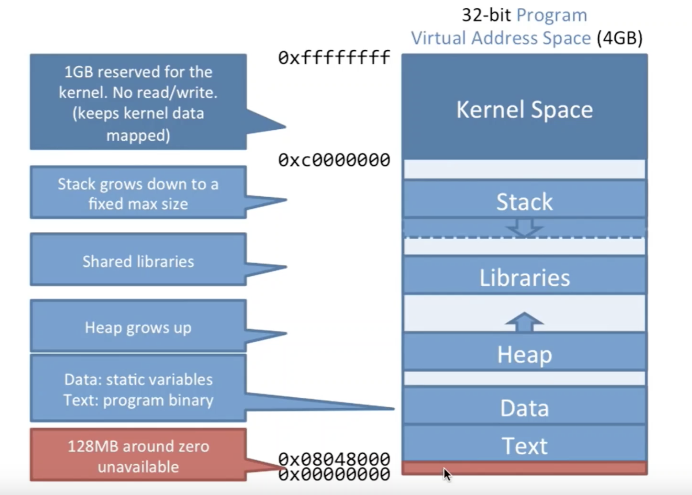
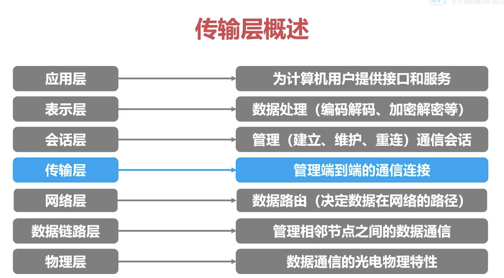

# interview

## 计算机基础

### 大端小端

### 并发/并行

并发：支持多个任务同时存在，即是并发
并行：支持多个任务同时执行，即是并行

### 进程/线程/协程

进程：资源分配的基本单位
线程：CPU调度的基本单位

进程如果挂了，那么是不会影响到别的进程的，而线程如果挂了，那么这个进程也挂了

在Linux中进程和线程都用`task_struct`来表示，唯一的区别就是进程的mm(指向的内存区域)和files(输入流/输出流)是不同的，而线程是相同的

协程：无论线程还是进程的切换都需要由用户态切换到内核态由操作系统完成，而协程则完全由编程语言来实现和调度，且切换在用户态完成

进程线程上下文切换：

上下文切换指的是将该进程的CPU寄存器/程序计数器中的值保存到内存中，下次使用时再恢复到CPU寄存器/程序计数器中

耗时原因：内核态到用户态间的切换耗时和寄存器的状态保存耗时

因为线程间共享内存，所以在线程切换时是无需切换虚拟内存的，此外，进程间的切换往往会导致CPU缓存失效，CPU中的快表TLB无法命中

### 临界资源/临界区

临界资源：一次只允许一个进程使用的共享资源，使用互斥的方法
临界区：每个进程访问临界资源的那段代码成为临界区

### 进程状态

- 创建：进程在申请资源，
- 就绪：进程已经分配到了除CPU外的所有资源
- 运行：进程在执行
- 阻塞：正在执行的进程因某些事件例如IO请求而暂时无法执行，进程受到阻塞，在满足请求后就进入就绪状态
- 终止：进程结束/发送错误

### 进程/线程通信方式

进程：

- 管道：linux中`|`就是个匿名管道，管道的通信是单向的，并且传输数据的进程必须等接受数据的进程接受完数据后才能返回，效率低下
- 消息队列：进程需要传输的消息放到消息队列中，获取数据的进程去消息队列中拿，从而使得传输数据的进程可以立即返回，但发送数据到消息队列是需要拷贝到消息队列中的
- 共享内存：两个进程虚拟地址映射到同一块物理地址上，两个进程有着独立的虚拟内存空间，却映射到了相同的物理内存上
- 信号量：类似Java中Semaphore，和共享内存配合使用来控制共享内存并发访问问题
- Socket：套接字通信，可以解决不同机器上的进程间通信

信号和信号量：

信号：是进程间传递消息，比如kill
信号量：保护临界资源，共享资源的并发操作

线程：

- 互斥量：只有拥有互斥量的线程 才有访问公共资源的权限，类似于锁
- 信号量：控制同时访问同一资源的线程数量
- 事件(信号)：线程通知其他线程

### 进程调度算法

- FCFS：先来先服务，先进先出，但会导致短进程耗时过长
- SPF：短进程优先，但会导致长进程一直得不到CPU资源
- HRRN：高响应比优先算法，短进程和长进程都能考虑到，响应比 = (等待时间 + 执行时间) / 执行时间，响应比高的先执行
- 时间片轮转法：进程在时间片用完后被中断放入队尾，让下一个进程执行时间片时间，但进程切换是消耗CPU的，因此时间片大小需要特别注意
- 优先级调度算法：按进程的优先级选择执行顺序
- 多级反馈队列调度算法：设置多个辅助队列，每个队列优先级不同，且优先级高的时间片越小，当一个进程到来时先进第一队列(先进先出)，在时间片内如果无法执行完就到第二队列(先进先出)，以此类推，且只有当第一队列中没有进程后第二队列才能执行，这样无需提前知道进程的运行时间还能满足各类型进程的需求

### 堆和栈

堆：按需申请、动态分配，当程序申请后会从堆中找出一块可用内存标记空间占用等信息后将起始地址返回，程序结束后操作系统不会删除申请的内存，只有程序自己delete，因此会造成内存泄漏
栈：程序运行时自动拥有的一小块内存，大小在编译期时由编译器参数决定，用户保存局部变量和函数调用栈，当超出大小后会导致栈溢出

### IO模型 


阻塞IO：同步阻塞，使用系统调用，并一直阻塞直到内核将数据准备好，之后再由内核缓冲区复制到用户态，在等待内核准备的这段时间什么也干不了
非阻塞IO：同步非阻塞，内核在没有准备好数据的时候会返回错误码，而调用程序不会休眠，而是不断轮询询问内核数据是否准备好
IO多路复用：同步阻塞，类似与非阻塞，只不过轮询不是由用户线程去执行，而是由内核去轮询，内核监听程序监听到数据准备好后，调用内核函数复制数据到用户态，但可以同时监听多个文件信息
信号驱动式IO：内核在数据准备就绪时通过信号通知
异步IO：异步非阻塞，等待数据和读取数据都由内核完成了

### select/poll/epoll

select/poll/epoll都是IO多路复用的具体实现，好处就是单个process就可以同时处理多个网络连接的IO

select：

首先会维护一个1024的bitmap来标记FD，然后将这个bitmap拷贝到内核空间，然后系统发现置位的数据来了，那么就会在bitmap中标记并返回(用户调用select阻塞直到内核返回)，接着用户for循环O(n)找出系统说的来数据的FD，读取，然后重新标记一次bitmap，再拷贝到内核空间，周而复始

select存在的问题：

- bitmap最大1024
- 每次拷贝到内核空间的bitmap不可重用，返回后要新建一个再拷贝
- 有每次拷贝到内核空间的消耗
- O(n)次遍历，每次select返回后都需要for循环所有FD

poll：

相较于select，poll有了自己的一个数据结构pollfd，其中fd表示fd对象，events表示这个fd是要读还是写，revent表示系统这里数据的情况，每次内核返回后，在for循环遍历O(n)后重置一下revent即可

poll解决了select中1，2问题，但3，4问题依然存在

epoll：

epoll是基于事件的，通过epoll_ctl()来注册文件描述符，并通过一次拷贝到内核空间中的红黑树上，一旦文件描述符中有事件发现，内核就会将它插入到就绪列表中，当用户调用epoll_wait就会通知到

### 虚拟内存/物理内存

对虚拟内存和物理内存都进行了分页，地址中一部分是页内的偏移量，另外的部分是页号，通过进程维护的页表来记录虚拟内存地址和物理内存地址的映射关系

当出现虚拟内存大于物理内存时，其实就是虚拟地址在页表中映射到了disk硬盘上，这时会发生缺页中断，此时切换到内核态，内核从磁盘中找到数据加载到内存中，并将物理地址重新填写到页表中，再重新寻址

分页的方式使不同的进程间的内存进行了隔离，也减少内存碎片的问题

在CPU缓存中维护了个TLB快表，当查询虚拟内存映射前会先查快表，没有再去内存中查页表，从而加快速度



### 用户态/内核态

在CPU的所有指令中有一些指令是很危险的，比如清内存等，因此不能允许所有程序都能使用这些指令

运行于用户态的进程可以执行的操作和访问的资源都会受到极大的限制，而运行在内核态的进程则可以执行任何操作并且在资源的使用上没有限制

大部分程序开始运行时处在用户态，但在执行过程中需要执行一些内核权限下的指令，比如开辟内存，这就涉及到了用户态到内核态的切换

发生用户态到内核态切换的三种情况：

1. 系统调用：用户态进程申请执行操作系统提供的指令
2. 异常事件：在用户态下发生了事先不可知的异常，这就会触发由当前运行的进程切换到处理该异常的内核相关程序中
3. 外设中断：当外围设备完成用户的请求操作后，会像CPU发出中断信号，此时CPU就会暂停执行下一条即将要执行的指令，转而去执行中断信号对应的处理程序，如果先前执行的指令是在用户态下，则自然就发生从用户态到内核态的转换

## 网络

### ICMP

ICMP称为互联网控制报文协议，其功能包括确认IP包是否成功送达目标地址、报告发送过程中IP包被废弃的原因和改善网络设置等

在IP通信过程中IP包未能发送到目的地址的原因会由ICMP负责通知

ICMP依赖于IP协议，因此其发送前需要加上IP报文头部

ping/traceroute都是基于ICMP工作的

### 交换机/路由器

路由谋短，交换求快

交换机工作在数据链路层，连接的设备同属一个子网，负责子网内部通信

交换机内部维护一个MAC地址转发表，记录了MAC地址和交换机端口的映射关系，一个端口可以映射多个MAC地址，如果目的MAC不在该表中，那就对所有端口进行转发

路由器工作在网络层，连接的设备分属不同子网，负责网络和网络间的通信

路由器内维护一个路由表，记录着目标IP地址，子网掩码和转发的网关IP的关系

### 跨域

协议，域名，端口都相同就是同源，而不同源会导致Cookie无法读取，Ajax请求被浏览器拦掉

CROS 跨域资源共享

- 简单请求：会在请求头加Origin字段，服务端响应Access-Control-Allow-Origin
- 非简单请求：在正式请求前有个预检请求，OPTION请求来询问服务器该网页是否在许可名单中

### CSRF

CSRF 跨站请求伪造，在第三方网站向被攻击网站发起请求，利用Cookie绕过验证

- 设置Cookie为同站Cookie(SameSite属性)
- 验证HTTP请求头中的Referer字段，该字段表示HTTP请求的来源地址
- 在DOM树中生成个随机加密Token，请求时带上且Token每次刷新

### OSI7层模型 TCP/IP四层模型

OSI7层模型：物理层/数据链路层/网络层/传输层/会话层/表示层/应用层



TCP/IP四层模型：链路层/网络层/传输层/应用层

7层模型每层做了什么：

物理层：通过光纤，电缆连接两台计算机通过高低电频传输0，1
数据链路层：解决多路访问的堵塞问题。以太网协议将一组电信号构成一个数据包，称之为帧，帧的Head为18字节，而帧的最大长度为1518字节，因此MTU最大传输单位就是1500字节。计算机间帧的传输是由唯一的MAC地址(每个计算机的网卡接口)标识区分的
网络层：整个网络由无数个子网组成的，接收方和发送方在同一子网中就通过广播的方式发送，否则就发给网关进行转发。IP地址和子网掩码标识了他们是否处在同一子网中，通过ARP协议来由IP地址拿到具体的MAC地址，ARP协议在子网内广播Who has IP，来拿到具体的MAC地址
传输层：建立端口到端口的通信，包括面向连接的TCP和面向报文的UDP
应用层：指定传输过来的数据的格式，来做解析渲染

### TCP粘包/拆包

粘包：应用程序写入的数据小于套接字缓冲区大小时，就发生粘包
拆包：应用程序写入的数据大于套接字缓冲区大小时，就发生拆包

解决方法：

- 发送端在每个数据包中添加数据包实际长度的首部字段
- 发送端将每个数据包大小封装为固定大小，不足时可以通过补0填充
- 可以在数据包之间添加特殊符号来分割数据包

MTU：最大传输单元，处在数据链路层，因特网中最大1500字节，当IP网络数据报长度大于MTU时就要进行分片才能传输
MSS：TCP报文中data部分的最大长度 MSS = MTU长度 - IP Header - TCP Header

### SYN泛洪攻击

大量恶意请求发起三次握手中的SYN数据包，服务器收到后返回ACK并预留端口等待连接，而恶意请求往往给的是个虚假IP，ACK请求回复等于是无效的，因此大量恶意请求就会造成端口都被占用，正真的请求无法得到连接

解决方法：

- 增加积压队列
- 收回最早的等待客户端ACK的连接
- 收回等待客户端ACK的连接，但放入本地缓存中，如果这个请求ACK真的到达时就再恢复这个连接

### HTTP状态码

- 200 服务器成功处理了请求
- 204 服务器成功处理请求，但没有返回任何内容(CROS和RESTful的create里用到)
- 206 服务器处理了部分GET请求(HTTP1.1断点续传)

- 301 资源永久移动
- 302 资源临时移动
- 303 POST请求(非幂等)在重定向后会变为GET请求对重定向地址发起请求(规范上说明POST请求返回302需要浏览器弹窗让用户选择是否重定向，而浏览器却都直接以GET方法请求重定向地址，因此HTTP1.1中直接新增了这个状态码)
- 304 客户端缓存的资源继续可用

- 400 错误请求，请求的语法有问题
- 401 未授权，该请求要求身份验证
- 403 禁止，服务器拒绝了请求
- 404 资源未找到

- 500 服务器内部错误，无法完成请求
- 502 网关错误，服务器作为网关或代理，从上游服务器收到无效响应，比如通过Nginx发现后端服务没启动
- 503 服务器不可用，可能处于停机或维护状态，通常是暂时的
- 504 网关超时，比如Nginx迟迟收不到服务器的回答

### HTTP方法

- GET 幂等 获取数据
- POST 非幂等 创建数据
- PUT 幂等 更新数据
- DELETE 幂等 删除数据
- PATCH 非幂等 更新一部分数据，不存在时会创建

### URI/URL

URI：统一资源标识符，用来唯一的标识一个资源
URL：统一资源定位器，它是一种具体的URI，即URL可以用来标识一个资源，而且还指明了如何locate这个资源

### 浏览器输入域名到页面返回的全过程

1. 浏览器向DNS服务器请求解析该URL中的域名所对应的IP地址
   - 迭代：本地DNS服务器找不到就请求上级DNS服务器(根服务器)，上级DNS服务器要么返回查询到的IP地址要么返回下一步查询的DNS服务器
   - 递归：本地DNS服务器找不到就请上级DNS服务器(根服务器)，如果上级DNS服务器也查不到那么就会自己继续请求再上级DNS服务器知道拿到具体结果，返回本地DNS服务器
2. 解析出IP地址后，根据该IP地址和默认端口80，和服务器建立TCP连接
3. 浏览器发出读取文件(URL中域名后面部分对应的文件)的HTTP请求，该请求报文作为TCP三次握手的第三个报文的数据发送给服务器
4. 服务器对浏览器请求作出响应，并把对应的html文本发送给浏览器
5. 释放TCP连接
6. 浏览器进行渲染

### WebSocket

HTTP存在个缺陷，即通信必须由客户端发起，即使是keep-alive，但依旧是一个request对应一个response，并且HTTP还是无状态的，每次请求服务器都要带上自己的身份标示

如果使用HTTP客户端希望服务器有消息了就通知自己，那么只能自己不断轮询服务端

而WebSocket通过一次HTTP请求建立了TCP连接后，此时服务器就可以无限给客户端发信息了，并且由于是在一个HTTP请求中，相当于是有状态的了

## Java基础

### 实例初始化

1．父类静态成员和静态初始化块，按在代码中出现的顺序依次执行
2．子类静态成员和静态初始化块，按在代码中出现的顺序依次执行
3．父类实例成员和实例初始化块，按在代码中出现的顺序依次执行
4．父类构造方法
5．子类实例成员和实例初始化块，按在代码中出现的顺序依次执行
6．子类构造方法

### 深拷贝和浅拷贝

### 内存溢出

- 堆区满了，可以在JVM参数中设的大一点
- 永久代满了，也可以设大一点

排查内存异常问题

1. 找出Java的进程ID
2. 用jstat查看该进程中的各个区的占用情况，比如栈，堆，永久代
3. 用jmap找出存活对象，异常对象往往是原因

### 内存泄漏

- ThreadLocal中的value的强引用造成的内存泄漏，可以手动调用remove方法告诉GC
- 热部署时，会使用新的类加载器来加载类已实现热部署(不同的类加载的相同类还是属于不同的类)，但它并不会主动卸载旧的类，虽然一般会被GC，但是如果有其他对象引用了旧的类加载器，那么就会造成内存泄漏

### new String("abc") 创建了几个字符串对象

将创建1或2个字符串。如果池中已存在字符串常量“abc”，则只会在堆空间创建一个字符串常量“abc”。如果池中没有字符串常量“abc”，那么它将首先在池中创建，然后在堆空间中创建，因此将创建总共2个字符串对象。

### 重写equals和hashcode

在重写了equals方法后，如果这个对象会用到hashcode，那么就一定要重写hashcode方法

如果只重写equals方法，那么在插入HashSet时，明明两个对象equals方法计算是相同的，但是hashcode计算出来是不同的，那么就会发生相同的对象在HashSet中存了两个

### final

### BIO/NIO/AIO

BIO：同步阻塞IO，一个线程读写数据时就会被阻塞，直到读写完成为止

当同时由多个读写任务时，就不得不启用同等数量的线程(也可以使用线程池+任务队列来优化，但是底层还是同步阻塞的)

NIO：同步非阻塞IO，多路复用

Channel/Selector/Buffer

BIO是面向流的，NIO是面向缓冲区buffer的：NIO中数据先到buffer中，因此读的时候不像BIO一个字节或多个字节读，而是能一块一起读出来(NIO可以直接使用Native函数库直接分配堆外内存，然后通过DirectByteBuffer来直接对这块内存进行操作，避免了数据在Native内存和Java堆之间的来回复制)

BIO是阻塞的，NIO是非阻塞的：一个线程读写数据时如果buffer中读不到数据，就直接返回，不会阻塞

当同时多个读写任务时，通过一个线程while轮询所有读写请求，只有在线路上真正有可读写的数据时，再开线程去处理

AIO：异步非阻塞IO

相较于NIO，AIO会在数据准备完后主动通知数据使用者，这样就省去了NIO中的轮询线程操作

### JDK动态代理/cglib代理

动态代理：

- 静态代理在编译时就已经实现，编译完成后代理类是一个实际的class文件
- 动态代理是在运行时动态生成的，即编译完成后没有实际的class文件，而是在运行时动态生成类字节码，并加载到JVM中

动态代理的目标对象必须实现对应接口，否则无法使用，原因是动态代理生成的类已经继承了Proxy，Java是单继承的，因此无法再继承其他类，只能实现接口

cglib代理：

JDK动态代理有限制，被代理对象必须实现一个接口，而cglib代理则没有这种限制

cglib采用了字节码的技术为代理类创建了子类，Spring AOP中用的也是cglib代理

cglib会继承目标对象并生成子类，需要重写目标对象中的方法，因此需要代理的类或方法不得为final

JDK动态代理和cglib代理区别：

- JDK动态代理只能代理接口，而cglib可以代理类和接口
- cglib在创建代理对象时比JDK动态代理更耗时，如果无需频繁创建代理对象，比如单例时，cglib更合适

### 注解原理

### 反射原理

1. JVM会在类加载时为每个类管理一个Class对象，其中维护了Method，Constructor，Filed的cache，cache也称为根对象
2. 每次找到需要的Method后，都会copy出一份返回，而不是使用原例，保证数据隔离，但同时也会返回根对象的软引用，因为不希望每次都创建MethodAccessor(同名方法共享的)这种重量的成员变量
3. MethodAccessor.invoke，其中MethodAccessor有两种创建方法，当该方法累计调用次数<=15，就直接调用native方法实现反射，>15后就会创建MethodAccessorImpl字节码(原理就是强转为指定对象，这样就能直接调用反射方法了)

[参考](http://www.fanyilun.me/2015/10/29/Java%E5%8F%8D%E5%B0%84%E5%8E%9F%E7%90%86/)

### 序列化/反序列化原理

[参考](https://www.jianshu.com/p/3e3d86716f76)

### StringBuilder/StringBuffer

底层维护一个char[]

StringBuilder线程不安全，StringBuffer线程安全(通过给方法都加上synchronized关键词)

此外在String中`+`操作的字符串内容不确定时(加了个非final的变量)，编译后会使用StringBuilder和append方法来构建字符串

## Java集合

### ArrayList

ArrayList底层是一个数组，当初始化时维护的数组是空的，只有到第一次添加元素时，会被初始化为自定义值或默认值10。

当容量满了后会扩充到1.5倍容量，因此当数组容量已经很大时再扩容容易造成OOM

ArrayList频繁扩容导致性能下降 => 可以通过在初始化时就设定好容解决

ArrayList支持随机读取，读取O(1)，写入O(n)，而LinkedList写入O(1)，读取O(n)

Vector与ArrayList相比除了线程安全外，Vector每次扩容2倍，而ArrayList为1.5倍，此外还可以使用Collections.synchronizedList来转为线程安全的

### HashMap

拉链法：本质是个数组，但这个数组中的节点有个next，冲突时就挂在next后面

成环/死循环: JDK1.7中两个线程一同resize时，链表原来是1 -> 2 -> 3，被倒序时因头插法的原因resize后变成了3 -> 2 -> 1，那么2 -> 1和1 -> 2之间就形成了环

红黑树：AVL树这颗树更平衡，查找快，插入慢，但AVL树的旋转是O(logn)，而红黑树只需要两次，因此综合选择红黑树

8转换为红黑树：因为红黑树节点相对于链表节点占用空间更大，而链表出现8的概率为千万分之一，过早转化为红黑树反而更浪费性能

hash算法：hashcode高16位不动，低16位和高16位异或

线性探测法：如果发生冲突，就向后寻找空的位置插进去

红黑树(二三树)：
- 每个节点非黑即红
- 根节点一定是黑色的
- 红色节点的子节点一定是黑色的
- 每个叶子结点一定是黑色的
- 每个叶子节点到根节点经过的黑色节点数量一定是相同的(二三树中的树高)

hashtable：为每个方法加上synchronized来保证并发安全，但同时因为公用一把锁，所以性能很低

HashMap中的容量和负载因子：

默认是16，负载因子默认是0.75

HashMap中容量必须是2^n，因为HashMap中通过hashcode计算位置时不是%运算，而是&运算，提高计算效率。因此即使自定义了HashMap容量后其内部还是会找比该值大的第一个2^n值作为真正的容量

又因为容量必须是2^n，因此负载因子为0.75(3/4)两者乘积一定能保证是整数

HashMap中存储是无序的，如果需要有序可以使用LinkedHashMap(继承HashMap的Node，添加了before和after两个节点)/TreeMap(底层红黑树)

## Java并发

### 死锁的四个条件

1. 资源是互斥的，同时只有一个线程可以持有
2. 占有且等待，即线程持有互斥锁的同时还在等待另一个互斥锁
3. 不可抢占，即线程持有了互斥锁后其他线程是无法强制占用该互斥锁
4. 循环等待，即A线程在等待B线程持有的互斥锁，而B线程也在等待A线程持有的互斥锁

### 处理死锁

- 占有且等待：可以要求一次性请求所有的需要的锁，阻塞这个线程直到或得到所有的锁
- 不可抢占：拒绝持有锁的进程继续申请锁，要求必须先释放锁
- 不可抢占：如果一个进程请求的锁被另一个进程持有，那么操作系统可以要求持有锁的进程释放锁
- 循环等待：为锁的分类排序，按顺序请求

### 死锁避免

- 进程启动拒绝：如果一个进程的请求会造成死锁，就拒绝启动该进程
- 资源分配拒绝：如果一个进程增加的资源请求会造成死锁，则不允许此分配

### synchronized原理

### synchronized和lock区别

- synchronized是关键字，Lock是接口
- JVM会在代码段结束或发送异常后自动释放锁，而Lock接口需要自己手动释放(lock有编程规范)
- Lock可以让等待锁的线程响应中断，tryLock方法，而synchronized不可以
- synchronized通过对java对象进行监控，而Lock则是通过Condition(synchronized对应的wait/notify，Condition对应await/singal)
- synchronized只支持非公平锁，ReentrantLock默认使用非公平锁，但也可以设定使用公平锁
- ReentrantLock底层原理是AQS，synchronized底层原理是Monitor

### 指令重排序发生的时机(有序性)

- 编译器优化重排序
- CPU处理指令的重排序

### ReentrantLock原理

### 线程池

### wait/sleep

- 都会阻塞线程，并且都能响应中断
- wait在Object类，sleep在Thread类
- wait释放锁，sleep不释放锁
- wait需要在同步代码块中，以保证一定被唤醒，而sleep无需

## Spring/Mybatis

### spring事务隔离策略

### spring中AOP

### mybatis中#和$

`#{}`的形式会被编译成JDBC中的`id = ?`的形式，能有效防sql注入
`${}`的形式会被直接编译成字符串`id = 'xxx'`，无法防止sql注入

## 数据库

### sql执行流程

- 连接器(建立TCP连接，查权限)
- 查询缓存(key-value形式)(不建议使用，因为一旦更新就要清空)
- 分析器(分析语法和库/列名是否存在)
- 优化器(索引选择，join的驱动表和被驱动表选择)
- 执行器(去调用InnoDB引擎接口)

### ACID

1. 原子性：一个事务要么成功要么失败
2. 一致性：事务是从一个正确的状态到另一个正确的状态
3. 隔离性：并发事务之间相互影响的程度
4. 持久性：每次事务提交后保证不会被丢失

### 索引好处

- 减少查询需要扫描的数据量
- 减少服务器的排序操作和创建临时表的操作(group by/order by/join)
- 将服务器的随机IO变为顺序IO

### 范式

1. 第一范式：属性不可再分
2. 第二范式：非主属性对码的部分依赖，即复合主键中一个字段就已经能确认某个字段
3. 第三范式：非主属性对码的传递依赖，即A确定B，B又能确定C，那么A和C存在传递依赖
4. BCNF：主属性对码的传递或部分依赖

### utf8/utf8mb4

### 意向锁

意向锁：不与行锁相冲突的表锁

意向共享锁(IS)和意向排他锁(IX)两两之间不冲突

意向共享锁与表级共享锁不冲突，但意向共享锁/意向排他锁与表级排他锁都冲突(注意：是意向锁和表级锁之间)

当给一个表加表锁时，怎么判断此时表内没有比的排他行锁时，如果没有意向锁，就只能遍历整张表，有了意向锁，就可以根据意向锁来判断表锁能不能加上去(意向锁由数据库在添加行锁时自动添加，不用人为操心 )

### InnoDB和MyISAM

- InnoDB主键是聚集索引，而MyISAM中主键是非聚集索引
- InnoDB支持事务，MyISAM不支持
- InnoDB有WAL技术，通过redo log来保证crash safe
- InnoDB中count是每次统计的，MyISAM中会保存count(*)这个值
- InnoDB锁的最小粒度是行锁，而MyISAM中只有表锁
- InooDB支持外键，MyISAM不支持
- InnoDB对于auto_increment值通过redo log中推算出来的，而MyISAM则是直接保存在数据文件中

### 二叉树/B树/B+树/B*树

B+树相对于B树：
1. 由于B+树中具体数据都存储在叶子结点下，因此每个block块中包含的key，一次IO读取能够遍历到的key数也多
2. B+树的叶子节点中有指向下一个节点的指针，因此全表遍历速度快(相较于B树需要中序遍历)，还能支持范围查找

### 索引原理

### SQL优化

- 打开MRR
- join走索引，或者到应用层hash后比较
- 不要使用`like %xxx%`的形式，如果要用就用全文索引
- group by一定会排序，因此如果不需要可以设定不排序
- 一定要走索引，不走索引的情况

### 索引优化

- 自增索引往往是最优解，因为不但是顺序插入，还能减少数据页空洞和数据页分裂
- 前缀索引(串索引) 比如只取某一个很长的字段的一部分作为索引(作为主键的字段不能太长)
- 索引覆盖 减少回表操作
- 最左匹配 5.6中新增 索引下推
- 如果业务层能保证唯一性，可以用普通索引代替唯一索引
- join的时候被驱动表的字段要保证有索引
- 开启MRR(Multi-Range Read Optimization)，将回表操作的随机主键读取转化为顺序读取(即先排次序)

### SQL慢的原因

1. redo log满了/读数据时内存慢了，要刷进磁盘
2. 长事务，undo log太多
3. 等MDL锁，即其他事务在做DDL操作 通过show processlist查看当前状态
4. 等行锁，默认读取不加锁，通过lock in share mode/for update加锁
5. 错选索引
   1. select * from t where (a between 1 and 1000) and (b between 50000 and 100000) order by b limit 1 中有order by
   2. 索引的行数不是精确计算的，而是随机选择N个数据页，计算平均值后乘以总页数得到基数，普通索引有个回表过程，因此优化器可能计算结果后选错了索引
6. 能走索引却没走索引
   1. 索引参与计算
   2. 索引参与函数运算
   3. 隐式类型转换
   4. 隐式字符编码转换

### 聚集索引

### auto_increment好处

### 锁

- 表锁
- MDL锁：针对DDL操作，修改DDL时要加写锁，读取数据要加读锁
- 行锁：两阶段锁，锁是在事务结束后才释放的

### 隔离级别

- 读未提交：脏读
- 提交读：不可重复读
- 可重复读：幻读
- 串行化

MySQL中提交读和可重复读都是使用MVCC实现的

提交读：在每句语句开始前建立版本
可重复读：在每个事务开始前建立版本

### 脏读和幻读

脏读：读到了别的事务还未提交的内容
幻读：在更新操作时是当前读，因此实际操作结果会与前面读出来的预期不同

### 主备/读写分离

半同步复制(semi-sync)来解决备库不能及时收到主库的数据(但只能保证一主一从的模式，不能保证一主多从的模式)

1. 在事务提交时，主库把bin log发给从库
2. 从库接收到bin log后，发给主库个ack，表示收到了
3. 主库接收到这个ack后才能给客户端返回事务完成的确认

### 分页

limit 0, 5 => (1 ~ 5)
limit 5 => (1 ~ 5)
limit 10, 15 => (11 ~ 25)
limit 15 offset 10 => (11 ~ 25)

分页优化：

1. 利用覆盖索引，减少回表
2. 如果主键是递增的(auto_increment)，那么可以先查出主键，然后用in，join，between，大于小于符号 方式查出具体数据
3. 对于offset很后面的内容，使用倒序(DESC)来查询

### 聚集索引和非聚集索引

InnoDB中主索引使用的是聚集索引，即所有数据都是存储在叶节点上的，普通索引则是非聚集索引，叶子节点上只存储主键id
MyISAM中所有索引都是非聚集索引，索引的叶子节点存储的都只存储是数据的物理地址

为什么InnoDB使用聚集索引：
- 因为非聚集索引存储的数据的地址，所以每次查询相较于聚集索引，需要多一次IO操作
- 当出现页分裂的情况时，如果是非聚集索引，存储数据的真正物理地址会发生变化，从而导致索引上所有叶子节点存储的物理地址都要一起更新，而如果是聚集索引因为数据是直接存在叶子节点上的，就不存在这个问题

### 全文索引

InnoDB和MyISAM都支持全文索引 FULLTEXT

当使用like %的形式搜索很慢时，就需要全文索引

全文索引主要思想就是首先用户先设定需要全文索引的字段，接着通过分词的方法建立起来一个关键词(分词的结果)和主键的关联表，接着用户通过全文索引查询时就去这个表里搜索，找到关键词就能直接对应到主键

全文索引有要求全文索引的字段最小长度，InnoDB中默认是4，只有在这个长度之上才会被加入关键词-主键表中

### MVCC

### 错选索引

优化器会通过扫描行数、临时表、是否排序等因素进行综合判断选择索引

1. select * from t where (a between 1 and 1000) and (b between 50000 and 100000) order by b limit 1 中有order by
2. 索引的行数不是精确计算的，而是随机选择N个数据页，计算平均值后乘以总页数得到基数，普通索引有个回表过程，因此优化器可能计算结果后选错了索引

解决方法：

1. 使用analyze table T让MySQL重新统计索引
2. 使用force index(I)来强行使用指定索引
3. 新增或重建索引

### 日志表索引

1. 都是insert，使用int型主键，顺序写入
2. 设置每个页不再留1/16给后面用(空洞)
3. 索引不宜过多，不然insert时还要维护索引
4. 按时间分库
5. 查询和增删改区分表

## 设计模式

### 设计模式原则：

- 开闭原则：开放扩展，关闭修改
- 单一职责原则：一个类只负责一种职责
- 里氏替换原则：子类要避免重写父类的方法，意思是子类对象能够替换父类对象而程序逻辑不变，总结就是尽量继承抽象类和接口而不是具体的类
- 依赖倒置原则：抽象不应该依赖于细节，细节应该依赖于抽象
- 接口隔离原则：客户端不应被迫依赖其不需要的接口，每个接口负责的功能尽可能细化
- 合成复用原则：当程序需要复用时，尽量使用聚合或组合的方式而不是使用继承 

### 工厂模式

创建对象的过程对调用者透明，外界给出信息就能返回正确的对象

简单工厂模式：通过case匹配类名字符串/.class

工厂方法模式：所有工厂类继承同一个抽象工厂，实现生产东西的方法，通过new不同的工厂，调用相同的方法，取得不同的对象

抽象工厂模式：相较于工厂方法模式，其工厂的实现类中提供了一整套产品，这些产品是相互依赖或有关系的

### 策略模式

自定义一系列实现了某一接口的策略类，然后在new对象时可以传入指定的策略类，从而能够在使用该对象时使用不同的策略

## 分布式

### RPC、消息队列、缓存

## 向面试官提问

- 我个人的薄弱环节，怎么提升，未来职业规划
- 业务和技术
- 给我的简历一点建议
- 对于一些项目上暂时用不到的技术，应该学习吗或者说怎么学习
- 个人在小公司相当于一手操办了所有的业务和代码，像大公司是怎么样的

## 算法

### 字符串翻转

句子倒序：`Hello World -> World Hello`

首先全部倒序为`dlroW olleH`，再按空格分割后分别倒序

字符串左旋转：`abcdefg -> cdefgab` 左旋转两位

也是首先全部倒序，再按给的数字切割为两段，两段分别倒序

### 链表成环

快慢指针，如果成环快指针最后一定会与慢指针相遇

成环的点：在快慢指针相遇后，慢指针指像头，然后同速前进，相遇点即成环点

### 银行家算法

操作系统用于避免死锁的算法

当分配资源时先尝试分配剩余的资源，如果剩余的资源分配后能保证进程能执行完毕并归还资源再正真允许给予资源，否则不给予

### 布隆过滤器

布隆过滤器能告诉你某样东西一定不存在或者可能存在

会对一个值进行hash多次(不同的hash法)，从而在bitmap中对对应的置1，而在查询数据时也会多次hash，找到对应位置上是否为1，只要多次hash出来的值有一个不为1，那么它就一定不存在，但是如果都为1，是不能保证一定存在(因为可能是别的值hash后将这个位置置1的)

### LRU

是一种缓存淘汰策略，简单说就是最近用过的就是有用的，一直没用的就是可以被删除的

通过HashMap + 双向链表实现

### 优化快排

退化到O(n^2)的情况：顺序排序/倒序排序，此时退化为冒泡排序

1. 优化取中间点数字的算法(由取第一个改为随机取一个/取前三个数中的中位数)
2. 当递归到left和right间数字较少时改用插入排序
3. 尾递归，就是让递归方法后不再依赖环境

```java
while (low < high) {
    pivot = partition(list, low, high);
    quickSort(list, low, pivot - 1);
    //quickSort(list, low, pivot - 1); 原递归调用
    //quickSort(list, pivot + 1, high);
    low = pivot + 1; // 尾递归
}
```

## 消息队列

### RabbitMQ高可用

消息的可靠传输：

RabbitMQ：

生产端：有事务模式和confirm模式，事务模式性能差些，confirm模式有同步/批量同步/异步(异步需要自己维护未被确认set)，confirm模式可以在消息传递给消息队列并消息队列做了持久化后再返回ack给生产者

消息队列：开启持久化到磁盘

消费端：关闭默认的自动确认消息，改为手动在业务完成后提交确认消息

Kafka：

生产端：Kafka中每个partition会在多个节点上存有副本，且写消息时必须在所有follower都确认同步完后leader才会返回ack，否则生产端就要不断重试，因此无需特殊机制(前提就是消息队列上设定了至少2个副本，leader至少要感知到1个follower的存在，acks=all要求同步到所有follower，retries=MAX要求写入失败后无限重试)

消息队列：核心就是acks=all，要求必须将消息同步到了所有follower后才允许leader返回ack确认

消费端：手动在业务完成后提交确认

消息重复消费(幂等性)：

- 为每个消息添加版本号，并在该消息执行完后更新到数据库，在新消息执行前先比较该版本号是否只是过了，来过滤重复消息
- 直接在业务上保证，比如更新直接是幂等的

消息的顺序性：

当一个queue对应了多个consumer时会发生consumer消费消息顺序错乱(因为queue中的每条消息只会被一个consumer消费)

因此只要保证每个queue只有一个consumer即可，通过exchange+router将消息分发到不同队列来保证顺序性

消息积压问题：

新开多个临时队列，将积压消息的队列的consumer设置为将这些消息转发给新开的临时队列，然后再找新的机器临时运行消费积压消息，全部消费完后再恢复原先consumer的逻辑

### RabbitMQ集群

普通集群模式：

即在多台机器上启动多个RabbitMQ实例，但创建的queue只会放在一个RabbitMQ实例上，每个实例间同步queue元数据(比如这个queue在哪个实例上)

当消费时访问的实例会从queue正真存储的实例上拉取数据过来，因此整个过程如果queue就在访问的实例上那么就相当于单机，而如果queue在别的实例上，还有数据拉取的开销

即使开启消息持久化，虽然能保证消息不丢失，但是如果存储queue的实例挂了，那么必须等待这个实例恢复这个queue才是可用的

镜像集群模式：

相较于普通集群模式，所有queue的元数据和正真数据都会存储在多个实例上，即每个RabbitMQ上都存储着这个queue的镜像，包括该queue的全部数据，在每次写数据进入queue时，都会自动同步到多个实例的queue上

需要在配置集群时将ha-sync-mode设置为automatic(默认manually就是普通集群模式)，并且可以通过ha-mode配置all(同步到所有实例)，nodes(同步到指定实例)，exactly(会同步到指定数量的实例上)

但是镜像集群模式中因为需要将queue同步到其他实例上，是非常消耗带宽资源的，其次如果一个queue中数据很多，那在每个实例上都会占用相同大小的空间，加新的实例也毫无用途

### Kafka集群

Kafka架构：由多个broker组成，每个broker是一个节点；每个topic可以划分为多个partition，每个partition存放这个topic中一部分的数据(每个partition中能保证消息的顺序，但partition之间无法保证顺序性)，而每个partition是可以存放在不同的broker上的

总结就是Kafka是天然的分布式消息队列，topic中数据可以分散在多个机器上，而每个机器上都保存一部分数据

在Kafka0.8前是没有HA机制(高可用)，每个partition都只分布在一个节点上，因此如果有一个节点挂了，那么该节点上的partition也就不可用了

在Kafka0.8后提供了HA机制，即副本机制，每个partition会被同步到其他的节点上形成副本(在多个节点上会被保存了相同的partition)，多个副本会选举出一个leader，所有的生产和消费都是在leader上进行，其他的副本就是follower，leader会负责将消息同步到follower上，消费时直接在leader上即可(如果随意读写follower就会造成数据一致性问题，系统复杂度会更高)，当一个broker挂了后，如果上面有partition的leader，因为其他节点上有这个partition的副本，于是从所有的副本/follower中重新选举出个leader，生产消费这个新leader即可

生产数据时，生产者写leader，leader将数据持久化后等待其他follower来主动从leader中拉取数据，一旦follower同步好数据后会发ack给leader，leader收到所有follower的ack会返回写成功给生产者

消费数据时，只会从leader中读，只有被所有follower都同步完成返回ack的消息才能被消费

### 自己设计一个消息队列

本质消息队列就是个队列

注意点：

- 支持数据0丢失，确认机制
- 数据落盘，怎么落盘，顺序写
- 高可用，leader+follower机制
- 可扩展，将topic拆分为多个partition(像RabbitMQ就不能扩展，因为每个节点上都存储着这个队列的所有数据)

### Kafka持久化原理

Kafka的持久化是以追加写的方式写到日志文件中的

每个partition在存储层面都是append log文件，任何发布到该partition上的消息都会被直接追加到log文件的尾部，每个消息在文件中的位置称为offset

## Redis

### Redis特点

- 纯内存操作
- 单线程，避免了数据共享问题和线程切换开销
- 基于非阻塞的IO多路复用机制

### 持久化方式

## 场景题

### Java进程突然被Linux干掉

- Linux内核中有OOM killer，其会自动杀掉那些(尤其是瞬时)占用内存过大的进程，定位系统报错日志
- JVM自身发生致命故障导致程序崩溃，定位JVM crash生成的日志
- JVM自身的OOM，比如发生了内存泄漏导致占用的内存越来越大直到OOM

### 排查CPU100%

1. top查看CPU占用高的进程pid
2. top -Hp pid来找到这个进程中是哪个线程占用率高，找到这个线程的pid
3. jstack -l pid查看对应线程的堆栈信息
4. 堆栈信息中nid对应的就是pid的16进制

### TopK

- 快排
- 快排优化，下一次递归时只要递归前或后半部分
- 堆排序

当数据量很大时

- 堆排序，维护大小为K的堆，每次取一个和堆顶的值比较是否要插入堆中

### 设计关注系统

### 缓存

缓存穿透：

查询一条不存在的数据时，这个请求就肯定被打在数据库上(因为缓存中肯定没有)，这就是缓存穿透

如果黑客不同用不存在的ID查询数据，那么每次请求都会进行数据库查询IO操作，导致数据库挂了

此时可以把查出来是null的数据放进一个set中，这样下次请求相同ID时就不用再查询数据库了

还可以使用布隆过滤器，过滤掉不存在的ID，让这些请求直接返回

缓存击穿：

当大量请求请求同一个ID时候，而这个ID刚好失效，那么所有请求都没法走缓存，都被打到数据库上，这就是缓存击穿

可以对于某些热点数据如果缓存中没有，要求先拿到互斥锁，再允许去数据库中查询，因此只要一个请求查询数据库，此后所有请求都能走缓存了

当然也可以让所有请求sleep(rand)从而使得所有请求不是同时打到数据库上

缓存雪崩：

缓存如果挂了，这时所有请求都会打到数据库上，这就是缓存雪崩

- 事前：使用缓存集群，保证缓存服务的高可用
- 事中：ehcache本地缓存 + Hystrix限流&降级,避免MySQL被打死
- 事后：开启Redis持久化机制，尽快恢复缓存集群

热点数据集中失效：

当大量热点数据因为到了失效时间失效后，大量请求热点数据的请求都被打到了数据库上，这就是热点数据集中失效

可以在设置缓存失效时间上在基础缓存时间上加上随机数，从而保证缓存不是同时失效

也可以利用缓存击穿中的互斥锁的思想

## RESTful设计

RESTful(Representational State Transfer)是面向资源的设计

- url中只包含名词，通过url就能知道要获取的资源是什么
- 使用http method描述操作，get表示获取数据，post表述创建数据(非幂等)，put表示更新数据(幂等)，delete表示删除数据
- 使用http status code描述结果，200表示请求成功，400表示错误请求

