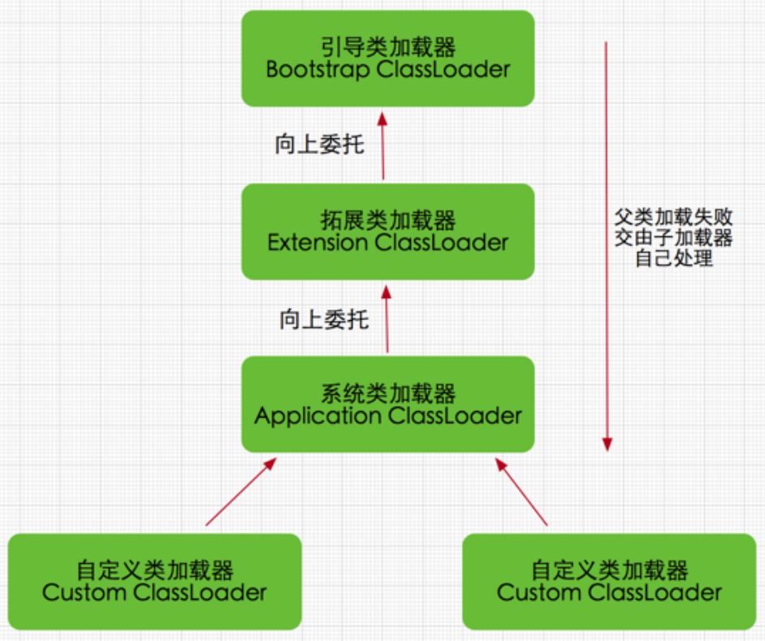
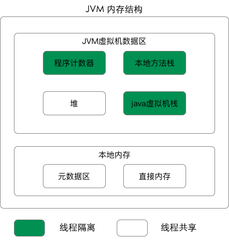
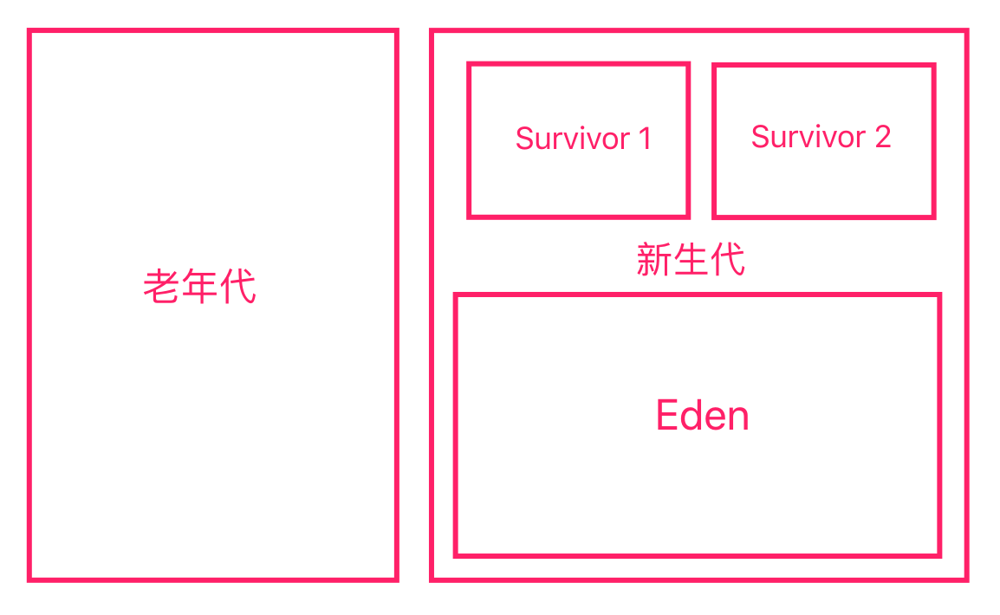
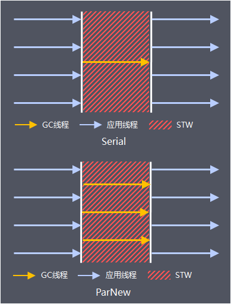
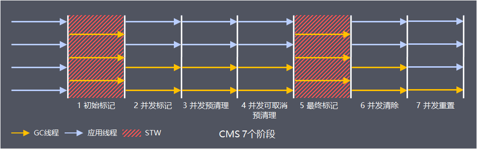
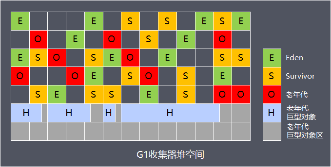

# Java/JVM/多线程

## Java

### ArrayList

ArrayList底层是一个数组，当初始化时维护的数组是空的，只有到第一次添加元素时，会被初始化为自定义值或默认值10。

当容量满了后会扩充到1.5倍容量，因此当数组容量已经很大时再扩容容易造成OOM

ArrayList频繁扩容导致性能下降 => 可以通过在初始化时就设定好容解决

ArrayList支持随机读取，读取O(1)，写入O(n)，而LinkedList写入O(1)，读取O(n)

Vector与ArrayList相比除了线程安全外，Vector每次扩容2倍，而ArrayList为1.5倍，此外还可以使用Collections.synchronizedList来转为线程安全

### HashMap

拉链法：本质是个数组，但这个数组中的节点有个next，冲突时就挂在next后面

成环/死循环: JDK1.7中两个线程一同resize时，链表原来是1 -> 2 -> 3，被倒序时因头插法的原因resize后变成了3 -> 2 -> 1，那么2 -> 1和1 -> 2之间就形成了环

红黑树：AVL树这颗树更平衡，查找快，插入慢，但AVL树的旋转是O(logn)，而红黑树只需要两次，因此综合选择红黑树

8转换为红黑树：因为红黑树节点相对于链表节点占用空间更大，而链表出现8的概率为千万分之一，过早转化为红黑树反而更浪费性能

hash算法：hashcode高16位不动，低16位和高16位异或

线性探测法：如果发生冲突，就向后寻找空的位置插进去

红黑树(二三树)：
- 每个节点非黑即红
- 根节点一定是黑色的
- 红色节点的子节点一定是黑色的
- 每个叶子结点一定是黑色的
- 每个叶子节点到根节点经过的黑色节点数量一定是相同的(二三树中的树高)

hashtable：为每个方法加上synchronized来保证并发安全，但同时因为公用一把锁，所以性能很低

HashMap中的容量默认是16，负载因子默认是0.75

HashMap中容量必须是2^n，因为HashMap中通过hashcode计算位置时不是%运算，而是&运算，提高计算效率。因此即使自定义了HashMap容量后其内部还是会找比该值大的第一个2^n值作为真正的容量

又因为容量必须是2^n，因此负载因子为0.75(3/4)两者乘积一定能保证是整数

HashMap中存储是无序的，如果需要有序可以使用LinkedHashMap(继承HashMap的Node，添加了before和after两个节点)/TreeMap(底层红黑树)

HashMap中put流程：
- 判断数组是否为空(new的时候只会配置一些参数而不会创建数组)，如果为空则初始化配置长度的数组(默认16)
- 通过对key的hashcode的hash计算得到对应数组下标，如果该下标处没有元素则直接创建一个即可
- 如果有元素，说明出现了hash冲突
  - 通过equals方法判断发生冲突的key是否相等，如果相等则直接将新的值赋值给原先的value
  - 如果冲突的key不相等，则判断是否是红黑树，如果是红黑树则直接给该树添加元素
  - 否则就是链表，追加到链表中，并判断链表长度，如果大于等于8就转化为红黑树
- 对迭代器的modCount做+1操作
- 最后判断当前数组的元素是否已经大于阈值，大于的话就进行resize操作

### 强引用/软引用/弱引用/虚引用

强引用：比如`Object o = new Object()`就是个强引用，不会被GC回收

软引用：SoftReference，对于软引用关联着的对象，只有当JVM内存不足时会将它GC回收

弱引用：WeakReference，相对于软引用生命周期更短，当一旦发现对象只有弱引用，那么就会GC回收掉

虚引用：PhantomReference，虚引用不会影响对象的生命周期，如果对象只有虚引用，那么马上就会被GC回收掉

虚引用配合引用队列（ReferenceQueue）使用，当准备回收一个对象时，如果它还有虚引用，会讲虚引用加入引用队列，那么就可以通过判断是否在引用队列中来了解该对象是否要个回收了，并做相对应的工作

### new一个对象过程

假设是第一次使用该类，此时new一个对象分为加载并初始化类和创建对象

## JVM

### JVM常用命令

- jps：显示当前运行的java进程以及相关参数
- jstack + pid：查看当前时刻该线程虚拟机中的快照信息(可用于查找死锁)
- jmap + pid：用于查看指定线程中共享内存的对象数量，大小或堆内存细节(堆dump是反映Java堆使用情况的内存镜像，包括系统信息，虚拟机信息，具体类和对象，在GC异常或内存泄露的情况下可以通过dump来分析)
- jstat + pid：用于监控虚拟机各种运行状态信息，比如`jstat -gcutil pid 1000`可以每1秒打印JVM内存各个区占用情况和各种GC次数

### 类加载过程

加载 -> 链接 (校验 -> 准备 -> 解析) -> 初始化

1. 加载

把class字节码文件通过类加载器加载到内存中(在加载Class时，class对象(xxx.class)是存储在堆中的，而类的元数据(method，public，变量名等)是存在方法区的)

字节码来源不限，本地/网络/动态代理实时编译的皆可

注：加载阶段和链接阶段是交叉运行的，很可能加载阶段还未执行完就进入了链接阶段

2. 校验

校验class字节码文件是否符合JVM规范，比如private/public访问权限，调用的方法是否定义了，重载是否合理，是否继承了final修饰的类

3. 准备

为静态变量(即类变量，不是实例变量)分配内存，并赋予初值(不是代码中的初始值，而是类型的初值，比如int为0，引用类型为null)

4. 解析

将符号引用替换为直接引用，即将类的类名，方法名，字段名替换为具体内存中的地址

解析过程在某些情况下可以在初始化之后再开始，这是为了支持Java的动态链接

5. 初始化

初始化时才是真正开始执行类中定义的Java代码，比如构造函数，按程序设定初始化遍历初始值

类初始化时机：

- 通过new实例化对象、使用静态变量或调用静态方法
- 使用java.lang.reflect包的方法对类进行反射调用的时候
- 初始化一个类时，如果其父类还没初始化，则先初始化父类
- 当虚拟机启动时，用户需要指定一个要执行的主类(包含 main() 方法的那个类)，虚拟机会先初始化这个主类

### Java对象创建过程

- 首先判断该类是否已经被加载，链接和初始化过，如果没有就进行类加载过程
- 从堆中为对象分配内存
  - 指针碰撞法：已分配的内存和空闲的内存分别在两侧，通过指针作为分界点，当分配内存时仅需要将指针空闲端移动大小为对象的距离即可(要求堆完整，Serial/ParNew这些标记-复制的GC)
  - 空闲列表法：已分配内存和空闲内存相互交错，JVM通过维护一个列表记录空闲的内存信息，当分配时从列表中找到足够大小的内存块分配给对象即可(堆不完整，CMS这些标记-清除的GC)
- 当多线程时为对象分配内存，会出现把这块地址分配给A对象后还没来得及修改指针又被B对象给分配走了
  - 将多线程中所有分配操作同步执行
  - JVM为每个线程预先在堆中分配一块缓冲区TLAB(Thread Local Allocation Buffer)，接着所有线程都在自己的TLAB中分配内存用
- JVM将所有分配到的内存初始化为零值，这样就能保证该对象在Java代码块中可以不赋初始值就使用
- 设置头对象：例如该类是什么类的实例，对象的GC年龄，对象的Hash值等
- 执行init方法：执行自定义/默认的构造函数进行初始化
  1. 父类静态成员和静态初始化块，按在代码中出现的顺序依次执行 
  2. 子类静态成员和静态初始化块，按在代码中出现的顺序依次执行 
  3. 父类实例成员和实例初始化块，按在代码中出现的顺序依次执行 
  4. 父类构造方法 
  5. 子类实例成员和实例初始化块，按在代码中出现的顺序依次执行 
  6. 子类构造方法

### 类加载器

JVM中内置了三个类加载器，除了BootstrapClassLoader其他所有类加载器都继承于java.lang.ClassLoader

1. BootstrapClassLoader(启动类加载器)：最顶层的加载类，由C++实现，负责加载`%JAVA_HOME%/lib`下的jar包或`-Xbootclasspath`参数指定的类
2. ExtensionClassLoader(扩展类加载器)：负责加载`%JRE_HOME%/lib/ext`下的jar包，比如`javax`包
3. ApplicationClassLoader(应用程序类加载器)：面向用户的类加载器，负责加载classpath下的所有jar包

双亲委派模型：

每一个类都有一个对应他的类加载器。JVM中ClassLoader协同工作时默认使用双亲委派模型。

在类加载时，JVM会判断该类是否已经被加载过了，已经被加载过的类会被直接返回，而没加载过的类会把加载请求先委派给该类加载器的父加载器的loadClass()处理，因此所有类加载请求都会被传递到BootstrapClassLoader中，当BootstrapClassLoader无法处理时，会再委派给其子类(即委托上来的类)，一层层再委派下去直到某个类加载器加载成功，就立即返回

ApplicationClassLoader的父类加载器为ExtensionClassLoader，而ExtensionClassLoader的父类加载器为null，null并不代表没有父类加载器，而是BootstrapClassLoader

双亲委派模型好处：

1. 避免类重复加载，加载过的会直接返回
2. 保证Java核心API不会被篡改，比如用户也编写一个java.lang.Object类，系统就会出现两个不同的Object类

当然可以通过自定义类继承ClassLoader来使用自己的类加载策略，而不是双亲委派模型

JDBC中破坏了双亲委派模型的原因：

因为Driver接口是JDK中定义的，而其具体实现是由厂家实现的，但根据类加载机制，当被加载类1引用了别的类2时类1和类2都会使用类1的类加载器加载，类1Driver在JDK中，而具体实现类2在其他包中，那么由于类1在BoostarpClassLoader中加载，而BoostarpClassLoader中找不到类2，因此会加载失败

注：当A类分别被两个不同的ClassLoader加载进了JVM(这两个ClassLoader肯定不能是父类调用关系)，此时如果被不同类加载器加载进来的之间没有联系。引用，那么是可以正常运行的，但是如果发生A = A，两个A是来自不同类加载器，JVM会校验它们的类加载是否相同，如果不同会报错(就是同一个类不同的类加载器加载进来后，它们是不同的类型，因此在A = A时就无法做强制类型转换)

总结：只有是同一个类加载器加载进来的才是同一个类

### ClassLoader和Class.forName

Class.forName()会完成加载-链接-初始化三步，即static变量会被初始化并会执行static代码块(JDBC中需要forName是因为需要执行static代码块向DriverManager注册自己)

ClassLoader中可以调用JVM自带的类加载器(双亲委派模型)来加载类，但只加载，不做其余步骤，即仅仅将该Class加载到JVM中

### Java对象的创建过程

类加载检查 -> 分配内存 -> 初始化零值 -> 设置头对象 -> 执行init方法

1. 类加载检查

当遇到new指令时，会检查这个指令的参数是否能在常量池中定位到这个类的符号引用，并检查和这个类是否被加载/链接/初始化，如果没有就执行相应的类加载过程

2. 分配内存

对象所需的内存大小在类加载完成后便可确定，因此可以从堆中划分出制定大小内存

内存分配的两种方式：
- 指针碰撞：堆内存规整(对应GC收集器算法是标记-整理(复制)，Serial，ParNew)
- 空闲列表：堆内存不规整，存在内存碎片(对应GC收集器算法是标记-清理，CMS)

内存分配并发问题：
- CAS失败重试：乐观锁+自旋
- TLAB：为每一个线程现在Eden区分配一块内存，那么线程在分配内存时现在这块内存中分配，直到用完再用CAS方法进行分配

3. 初始化零值

JVM将分配到的内存空间都设为零值，这样就能保证该对象在Java代码块中可以不赋初始值就使用

4. 设置头对象

例如该对象是什么类的实例，对象的hash，对象的GC年龄等信息需要设置到对象头中，还有就是synchronized用到的无锁/偏向锁/轻量级锁/重量级锁的头对象设置

5. 执行init方法

按照程序员的意愿进行初始化，执行构造函数

### JVM内存结构

线程私有：程序计数器，虚拟机栈，本地方法栈
线程共享：堆，方法区

1. 程序计数器

存放着当前线程所执行到的字节码的行号

2. Java虚拟机栈

每次方法调用的数据都是通过栈传递的

Java虚拟机栈是由一个个栈帧组成，而每个栈帧中都拥有：局部变量表、操作数栈、动态链接、方法出口信息

3. 本地方法栈

虚拟机栈为虚拟机执行Java方法（也就是字节码）服务，而本地方法栈则为虚拟机使用到的Native方法服务

4. 堆

这是JVM管理的最大的一块内存，几乎所有的对象实例和数组都会存储在堆中

堆中分为新生代和老生代，而新生代中又分为了Eden和Survivor1和Survivor2

对象首先被分配在Eden区，其中大多数对象很快就会消亡，Eden区是连续的内存空间，因此分配速度很快

当Eden区满了执行Minor GC，根据GC Root将仍存活的对象都复制到Survivor0中(Survivor0和Survivor1之间一定有一个是空的)

此后每当Eden区满了后，就执行Minor GC将Survivor0和Eden中存活的一起复制到Survivor1中

接着只要Eden区满了，就执行Minor GC将Survivor1和Eden中存活的复制到Survivor0中，如此循环，每次复制都会给这个对象年龄 + 1

当对象在两个Survivor区间切换到了MaxTenuringThreshold设定值时(默认15)，就会被复制到老年代中

GC Root(可达性分析算法)：

用于判断对象是否存活，通过一系列GC Root对象(系统类加载器，栈中对象，激活状态的线程)作为起点，基于对象的引用关系，从GC Root开始向下搜索，所走过的路径称为引用链，当一个对象没有任何引用链相连，那么这个对象代表已死亡

新生代到老生代的判断条件：
- 在Survivor0和Survivor1之间交换次数达到15次
- 如果对象大小大于Eden的一半，就直接分配在老生代中
- Minor GC后Servivor仍然放不下，也会放入老生代中
- 动态年龄判断，大于等于某个年龄的对象超过Survivor的一半时，大于这个年龄的对象全部复制到老生代

5. 方法区

用于存储已被虚拟机加载的类信息、常量、静态变量等信息

在1.7中永久代是方法区的实现，在1.8中转而使用元空间，而元空间是直接的内存(永久代是JVM管理的，因此上限受限于JVM管理的内存大小，当类信息太多时会导致内存不足，但元空间是直接的系统内存，大小受限于系统，那么出现内存不足的可能性就远远降低了)

运行时常量池：

运行时常量池是方法区的一部分，例如String的常量池

因为原先常量池在方法区中，因此受限于方法区的内存限制，在1.7及之后的版本中在堆中开辟了一个区域来存放运行时常量池

### 垃圾回收方法

1. Serial/ParNew

用于新生代的GC算法(Minor GC)，采用标记-复制算法，GC时将所有GC Root链接到的(表示存活的对象)复制到Survivor中

标记-复制算法速度慢，但是不会生成内存碎片，而新生代中对象往往很快消亡，因此适合新生代

Serial/ParNew在GC时会导致STW(Stop The World)，即应用线程被停止来执行GC

ParNew是Serial的并发版本，支持多线程

Serial/ParNew是Young GC，触发条件是Eden区满了

2. CMS

用于老生代的GC算法，采用标记-清除算法，在GC时将所有未被GC Root链接到的对象全部清除

初始标记：会导致STW，标记老生代中由GC Root引用或新生代中的引用的所有对象

并发标记：和用户线程并行，遍历初始标记中存活对象，递归标记这些对象的可达对象

在并发标记过程中，由于和用户线程并行的，因此可能产生新的对象或对象引用关系发生改变，为了提高重新标记的速度，在这个阶段会将发生改变的Card设为Dirty Card

并发预清理：遍历上一步中的Dirty Card，标记其中引用的对象

可中断的并发预清理：继续遍历标记Dirty Cardy中引用的对象并将Survivor中新对象所引用的对象也标记，目的就是减少最终标记的STW时间

最终标记：会导致STW，重新扫描标记之前并发预处理中没标记的更新对象

并发清理：标记-清理算法，与用户线程并行，但会导致内存碎片

并发重置：重置CMS状态

CMS是Old GC，触发条件为默认每两秒判断当前老生代中内存占用率是否到达阈值，到了就触发

CMS的GC时间过长问题：

CMS的GC停顿时间80%都在最终标记阶段，常见原因是新生代对老生代的无效引用(新生代的对象已经死亡)，而导致这原因是没来得及Young GC，因此可以设定在最终GC前去执行一次Young GC

当新生代在执行垃圾回收时，老生代中却没有空间来存储晋升的对象，这就会引起Full GC(Full GC会回收新生代，老生代还有永久代/元空间中的内存，Full GC采用的是Serial GC。单线程回收，对年轻代是复制-清除算法，老年代是标记-整理)

3. G1

G1主要为了解决大内存的STW过长问题(内存小，复制/标记的STW时间短，但内存大了，时间就长了)

G1把堆划分成了大小相等的Region，每个Region都有可能是老生代/Eden/Survivor，这样在GC时可能只处理一部分Region，回收掉回收价值高的Region，从而降低GC的STW时间

Young GC(新生代)：当Eden区满了，标记-复制算法

Mixed GC(老生代)：当老生代到达阈值，会根据全局并发标记阶段计算出来的回收收益高的Region进行GC，标记-压缩，从而解决了CMS回收后的内存碎片问题

G1中维护着RememberSet来记录Region和Region之间的引用关系，这样在标记的时候就不用扫描整个堆，但是RememberSet还依赖于Write Barrier(写屏障)来保证GC移动对象时去更新RememberSet，消耗性能

4. ZGC

引入了有色指针的概念，里面的所有指针都会有几位来保存颜色信息

与标记对象的传统算法相比，ZGC在指针上做标记，在访问指针时加入Load Barrier（读屏障），比如当对象正被GC移动，指针上的颜色就会不对，这个屏障就会先等待该指针移动好(相当于部分GC完成)，然后再返回移动好的指针位置，也就是，永远只有单个对象读取时有概率被减速(等待该指针移动好)，而不存在为了保持应用与GC一致而粗暴整体的Stop The World

### JVM调优

### JVM启动参数
