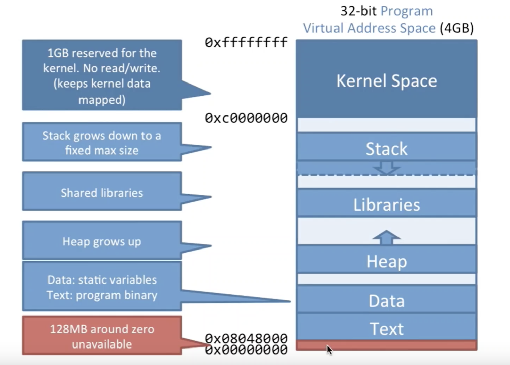

# 操作系统

## 进程/线程/协程

进程：资源分配的基本单位
线程：CPU调度的基本单位

进程如果挂了，那么是不会影响到别的进程的，而线程如果挂了，那么这个进程也挂了

在Linux中进程和线程都用`task_struct`来表示，唯一的区别就是进程的mm(指向的内存区域)和files(输入流/输出流)是不同的，而线程是相同的

虽然进程和线程在调度时都需要切换到内核态，但因为线程是共享内存的，因此一个进程下的多个线程间切换就无需刷新页表和TLB，只需要刷新一下寄存器即可(总结：进程间的切换往往会导致CPU缓存失效，快表TLB无法命中的问题)

协程：无论线程还是进程的切换都需要由用户态切换到内核态由操作系统完成，而协程则完全由编程语言来实现和调度，且切换在用户态完成，即用户态的线程

进程线程上下文切换：上下文切换指的是将该进程的CPU寄存器/程序计数器中的值保存到内存中，下次使用时再恢复到CPU寄存器/程序计数器中，这个操作有两部分耗时，内核态到用户态间的切换耗时和寄存器的状态保存耗时

## 进程调度算法

- FCFS：先来先服务，先进先出，但会导致短进程耗时过长
- SPF：短进程优先，但会导致长进程一直得不到CPU资源
- HRRN：高响应比优先算法，短进程和长进程都能考虑到，响应比 = (等待时间 + 执行时间) / 执行时间，响应比高的先执行
- 时间片轮转法：进程在时间片用完后被中断放入队尾，让下一个进程执行时间片时间，但进程切换是消耗CPU的，因此时间片大小需要特别注意
- 优先级调度算法：按进程的优先级选择执行顺序
- 多级反馈队列调度算法：设置多个辅助队列，每个队列优先级不同，且优先级高的时间片越小，当一个进程到来时先进第一队列(先进先出)，在时间片内如果无法执行完就到第二队列(先进先出)，以此类推，且只有当第一队列中没有进程后第二队列才能执行，这样无需提前知道进程的运行时间还能满足各类型进程的需求

## 进程间通信方式

### 管道

管道分为匿名管道(`|`)和命名管道(`mkfifo`)，匿名管道将前一个命令的输出作为后一个命令的输入，用完就销毁，而命名管道则会创建个类型为p(pipe)的文件用于数据写入和读出

管道的通信是单向的，通信的数据都遵循FIFO(不能指定offset读)，是无格字节流数据，并且传输数据的进程必须等接受数据的进程接收完数据后才能返回，否则就会一直阻塞，因此效率低下

匿名管道创建原理：通过`int pipe(int fd[2])`函数创建个只存在于内存中的特殊文件，返回读和写两个fd，接着可以通过fork子进程，子进程会复制父进程的文件描述符fd，此时父子进程都持有了读和写两个fd，接着按需要关闭父子进程各自一个fd，从而保证数据单向传输，避免混乱。如果父子进程间需要双向通信，那就需要创建两个匿名管道，分别负责父->子和子->父的数据传输

匿名管道的通信范围只能在父子进程间，而命名管道会创建类型为管道的设备文件用于数据通信，因此任何的进程都可以通过命名管道通信

比如`ls | grep 'name'`中`ls`和`grep 'name'`明显不是父子进程，但它们都是shell父进程创建出来的子进程，因此他们可以理解为兄弟进程，因此也就可以共享匿名管道的fd进行通信了

### 消息队列

消息队列是保存在内核中的消息链表，发送方和接收方确定好消息体的数据类型，因此每个消息体都是固定大小的存储块，如果不主动释放，消息队列会一直存在

消息队列存在通信不及时和大小限制的问题，linux中规定了队列的最大长度和消息的最大长度，此外在数据写入消息队列和读出消息队列存在着用户态和内核态间的数据拷贝的消耗

### 共享内存

共享内存即进程各自不同的虚拟地址映射到同一块物理地址上，这样一个进程写入的数据立刻能被另一个进程读取，即解决了消息队列中存在的用户态和内核态间的数据拷贝的消耗问题

共享内存的通信方式会带来多个进程同时修改同一块物理地址的问题，因此就需要保护机制来保证共享内存在任一时刻只能被一个进程访问，这就是信号量

信号量其实是一个整型的计数器，主要用于实现进程间的互斥与同步，而不是用于缓存进程间通信的数据

控制信号量有两个原子操作P和V，P表示将信号量-1，而V表示将信号量+1，当信号量小于0后表示该资源不可用，进程被阻塞等待，大于0则表示资源可用

### 信号

上面说的进程通信方式都是在正常的工作模式下，而当异常的情况下就需要信号的方式来通信(信号和信号量没有任何关系)，信号是进程通信中唯一的

对于信号有三种处理方式：
- 默认操作：linux对每种信号都规定了默认操作，当程序不主动处理信号时就会执行默认操作
- 捕获信号：在程序中自定义某一种信号的处理函数，当信号来时就执行自定义的函数
- 忽略信号：直接忽略某些信号，不作任何处理
在所有的信号中SEGSTOP和SIGKILL两个信号是不能被捕获和忽略的，他们用于在任何时候中断或结束一个进程

`ctrl + c`会发出SIGINT信号，通知该进程和其子进程结束进程
`kill`默认的kill命令会发出SIGNTERM(15)信号，通知进程正常退出，可以被进程自己捕获处理
`kill -9`会发出SIGKILL(9)信号，这个信号是不能捕获和忽略的，因此该命令一定能保存结束该进程

### Socket

Socket可以实现跨网络的不同机器上的进程通信

Socket除了TCP和UDP以外，当通信进程在同一主机上时，可以通过本地字节流/数据报的形式进行通信，其相较于TCP和UDP不再是绑定ip和端口，而是绑定一个本地文件

### 线程间通信

同个进程下的所有线程都是共享该进程的资源的，因此只要共享的变量就可以实现线程间通信

因为线程是共享内存的，所以对于线程间通信更需要关注的是对共享资源的同步和互斥的现实，可以通过信号量实现

## 页面置换算法

- 最佳置换算法(OPT)：优先淘汰未来不再会被使用到的页面，但是因为无法预知哪些页面不再会被使用，因此该算法无法实现
- 先进先出置换算法(FIFO)：优先淘汰最先进入内存的页面，但会存在Belady异常(分配的物理块越多但出现缺页中断的次数反而增加)
- 最近最久未使用置换算法(LRU)：优先淘汰最长时间没被访问过的页面，但需要寄存器和栈的硬件支持
- CLOCK：每个页面都有一个访问位，当该页被访问就+1，淘汰时扫描所有页的访问位，优先淘汰访问位为0的页，如果没有找到则再次扫描淘汰访问位为1的页，知道淘汰掉一个为止

## 磁盘寻道算法

- 先来先服务算法(FIFO)：依次处理服务队列中每一个寻道请求，但会导致磁头移动的平均距离比较大
- 最短寻道时间算法(SSTF)：优先处理距离当前磁头所在磁道最近的磁盘号，但会导致距离当前磁道较远的磁盘号请求一直无法被服务，即饥饿现象
- 扫描算法(SCAN，电梯算法)：磁头必须移动到最外侧磁道后才能反向向内移动，在向内移动到最内侧后才能再反向向外扫描
- LOOK算法：相较于SCAN算法，磁头不再必须移动到最外/最内侧磁道后才能返回，而是移动到某处且这处之后不再有需要访问的磁盘号就立即反向移动
- C-SCAN/C-LOOK循环算法：相较于SCAN和LOOK，当移动到一侧后，不再掉头反向查找服务，而是直接调换到另一侧头开始继续服务

## 用户态/内核态

在CPU的所有指令中有一些指令是很危险的，比如清内存等，因此不能允许所有程序都能使用这些指令，因此要执行这些特权指令就必须由用户态切换为核心态

用户态和核心态在程序状态字(寄存器)中通过0/1来标志，用户态到核心态也就是个设置程序状态字标志的操作

中断是CPU从用户态到核心态的唯一途径，发生中断就意味着需要操作系统介入进行工作，比如进程切换，IO操作等x

既然由用户态到核心态只能通过中断进行，但是中断也分成内中断和外中断：
- 内中断
  - 自愿中断：也就是系统调用，用户态进程申请执行操作系统提供的特权指令
  - 强迫中断：也就是程序在用户态下发生了事先不可知的异常，这就会触发切换到内核态由操作系统进行处理
- 外中断：比如外设中断，当外围设备完成用户的请求操作后，会像CPU发出中断信号，此时CPU就会暂停执行下一条即将要执行的指令，切换到内核态由操作系统去执行中断信号对应的处理程序

## 虚拟内存/分页/分段

分页和分段区别在于分的粒度不同，但都是为了更好的管理内存

当没有分页或分段的虚拟内存技术，程序加载到内存要求一段连续的内存地址，那么就会产生如下问题：
- 必须有连续的满足程序大小的空间地址
- 地址空间不隔离，进程可能会操作到别的进程的内存地址
- 程序运行时的地址不确定，如果在程序中写死操作某个物理地址，但无法保证程序每次加载进内存都在这块物理地址处
- 内存使用率低下，当程序移出内存后，如果这块区域太小无法容纳接下来的程序要求，那么就会造成内存碎片，此外应该可以将有些暂时不用的程序移到磁盘，让别的程序加载进内存(缺页中断)

分页/分段引入了虚拟地址空间的概念，通过将虚拟地址映射到物理地址上，从而程序只需要关心虚拟地址即可，但是分段模式下映射的还是一整块连续的内存地址(分段解决了地址空间不隔离和运行时地址不确定的问题)，但内存使用率低下的问题还是没能解决，而分页的方式，将虚拟地址分为页号和页内偏移量两部分，将内存的最小单元由一个程序所需的连续内存段转为粒度更细的页，从而有效解决了内存碎片的问题

分页通过页表记录虚拟地址和物理地址间的映射关系，页表存储在每个进程PCB中，这个页表是该进程独有的，当CPU读取数据时，需要先读一次内存中的页表，找到物理地址后才能访问到真正的数据，因此数据读取需要两次内存读取，于是就在CPU缓存中维护了个TLB快表，当查询虚拟内存地址时会先查TLB快表，如果不在再去内存中查询页表，从而加快速度

虚拟内存地址大于物理内存地址时，其实就是虚拟地址在页表中映射到了disk硬盘上，这时会发生缺页中断，此时切换到内核态，内核从磁盘中找到数据加载到内存中，并将物理地址重新填写到页表中，再重新寻址



## IO模型 


阻塞IO：同步阻塞，使用系统调用，并一直阻塞直到内核将数据准备好，之后再由内核缓冲区复制到用户态，在等待内核准备的这段时间什么也干不了
非阻塞IO：同步非阻塞，内核在没有准备好数据的时候会返回错误码，而调用程序不会休眠，而是不断轮询询问内核数据是否准备好
IO多路复用：同步阻塞，类似与非阻塞，只不过轮询不是由用户线程去执行，而是由内核去轮询，内核监听程序监听到数据准备好后，调用内核函数复制数据到用户态，但可以同时监听多个文件信息
信号驱动式IO：内核在数据准备就绪时通过信号通知
异步IO：异步非阻塞，等待数据和读取数据都由内核完成了

阻塞和非阻塞：阻塞代表着请求的进程必须等待，而非阻塞代表着请求的进程可以去干别的事情而不必阻塞在这里等待
同步和异步：同步代表进程请求的结果得自行去获取，而异步则代表会有别人在拿到结果后回来通知请求的进程(回调)

## 死锁

### 死锁的四个条件

1. 资源是互斥的，同时只有一个线程可以持有
2. 占有且等待，即线程持有互斥锁的同时还在等待另一个互斥锁
3. 不可抢占，即线程持有了互斥锁后其他线程是无法强制占用该互斥锁
4. 循环等待，即A线程在等待B线程持有的互斥锁，而B线程也在等待A线程持有的互斥锁

### 处理死锁

- 占有且等待：可以要求一次性请求所有的需要的锁，阻塞这个线程直到或得到所有的锁
- 不可抢占：拒绝持有锁的进程继续申请锁，要求必须先释放锁
- 不可抢占：如果一个进程请求的锁被另一个进程持有，那么操作系统可以要求持有锁的进程释放锁
- 循环等待：为锁的分类排序，按顺序请求

### 死锁避免

- 进程启动拒绝：如果一个进程的请求会造成死锁，就拒绝启动该进程
- 资源分配拒绝：如果一个进程增加的资源请求会造成死锁，则不允许此分配

## select/poll/epoll

select/poll/epoll都是IO多路复用的具体实现，好处就是单个process就可以同时处理多个网络连接的IO

### select

首先会维护一个1024的bitmap来标记FD，然后将这个bitmap拷贝到内核空间，然后系统发现置位的数据来了，那么就会在bitmap中标记并返回(用户调用select阻塞直到内核返回)，接着用户for循环O(n)找出系统说的来数据的FD，读取，然后重新标记一次bitmap，再拷贝到内核空间，周而复始

select存在的问题：
- bitmap最大1024
- 每次拷贝到内核空间的bitmap不可重用，返回后要新建一个再拷贝
- 每次都需要将所有fd信息(bitmap/pollfd)从内核态拷贝到用户态
- O(n)次遍历，每次select返回后都需要for循环所有FD

### poll

相较于select，poll有了自己的一个数据结构pollfd，其中fd表示fd对象，events表示这个fd是要读还是写，revent表示系统这里数据的情况，每次内核返回后，在for循环遍历O(n)后重置一下revent即可

poll解决了select中1，2问题，但3，4问题依然存在

### epoll

epoll_create：内核会创建个eventpoll结构体，整个结构体中有两个重要成员，红黑树和双向链表
   - 红黑树：用于存储所有添加到epoll中的事件，也就是epoll监听的事件
   - 双向链表：保存触发回调，满足条件的事件，将会通过epoll_wait方法返回给用户
epoll_ctl：将epoll对象添加进红黑树中，红黑树可以高效识别重复的节点。所有添加到epoll的事件都会和对应IO设备建立回调关系，当事件发生后回调用回调方法来将事件自身加入双向链表中
epoll_wait：检查双向链表中是否有事件，如果有就将他们复制到用户态内存中即可，无需像select/poll遍历所有事件，返回的事件一定是有意义的

epoll有两种工作模式LT和ET：
- LT(水平触发)：当被监控的文件描述符有可读写事件时，调用epoll_wait会返回对应的文件描述符通知程序去读写，如果这次没有把数据一次性全部读写完(如读写缓冲区太小)，那么下次调用epoll_wait时还会通知程序上次未读写完的文件描述符。但如果有些文件描述符是程序不关心的，但每次都会返回，会造成检索关心的文件描述符的速度
- ET(边缘触发)：相较于LT模式，在第一次epoll_wait返回可读写的文件描述符后，即使程序没能将数据全部读写完成，接下来除非该文件描述符上出现新的可读写事件，否则是不会再次通知程序的

总结：LT模式下开发较为简单，不用关心缓冲区数据是否全部处理完成，因为下次还会将未处理完的文件描述符继续通知程序进行处理，而ET模式下则需要程序关心缓冲区的数据是否被全部消费完成

## cache和buffer

- cache：缓存，将慢设备中的常用数据缓存起来，从而可以快速返回给高速设备，比如CPU缓存，磁盘缓存等
- buffer：缓冲，将高速设备中的数据缓冲一下，比如将多次的小块写入通过缓冲转变为一次大块的写入，从而解决快慢设备间交接的问题，比如操作系统中IO的buffer，看视频时加载的buffer

在操作系统中buffer和cache其实界限不是非常明确，比如写数据时，会先将数据写入cache中，此时读取该新的数据无需IO操作，可以通过cache直接返回，当cache中写入的数据量到一定大小后，统一一起落盘，这其实就是buffer的作用，但似乎也在cache中做完了

## 零拷贝

### 传统IO操作

下图展示传统IO操作从硬盘中读取数据然后通过网卡发送，整个过程涉及2次CPU拷贝，2次DMA拷贝和4次上下文切换(即内核态到用户态和用户态到内核态的切换)


1. 用户进程通过read()函数向内核(kernel)发起系统调用，将数据读入用户缓冲区，由用户态切换为内核态
2. DMA控制器将数据从硬盘拷贝到内核空间的读缓冲区(read buffer)
3. CPU将数据从内核空间的读缓冲区(read buffer)拷贝到用户空间的用户缓冲区(user buffer)
4. 由内核态切换为用户态，read()函数返回
5. 用户接着通过write()函数向内核(kernel)发起系统调用，将数据发送，由用户态切换为内核态
6. CPU将数据从用户空间的用户缓冲区(user buffer)拷贝到内核空间的网络缓冲区(socket buffer)
7. DMA控制器将数据从网络缓冲区(socket buffer)拷贝到网卡进行数据传输
8. 由内核态切换为用户态，write()函数返回

CPU拷贝：由CPU直接处理数据传输，整个数据拷贝过程中会一直占用CPU资源
DMA拷贝：由CPU向DMA磁盘控制器下达指令，让DMA控制器来处理数据的传输(由外设到内存)，数据传输完后会向CPU发送信号，整个数据拷贝过程中无需一直占用CPU

### mmap + write

mmap是一种内存映射文件的方法，即可以将文件或其他对象和进程的虚拟内存地址进行一一映射，从而进程可以通过指针的方式读取和修改这块内存，而系统会自动将更新的脏页写回磁盘上，在整个过程中对文件的操作不再需要read/write函数进行系统调用而是直接通过指针读取修改

零拷贝中mmap将内核空间的读缓冲区(read buffer)的地址和用户空间的缓冲区(user buffer)进行映射，从而实现内核缓冲区和程序的内存共享，省去了将数据从读缓冲区(read buffer)拷贝到用户缓冲区(user buffer)的过程

基于mmap + write的零拷贝方式会发生1次CPU拷贝，2次DMA拷贝和4次用户态和内核态之间的切换，相较于传统的IO，省掉了读数据时从内核空间的读缓冲区拷贝到用户空间的用户缓冲区的CPU拷贝操作


mmap主要是提高IO性能，尤其是大文件，如果是小文件，内存映射反而会导致碎片空间的浪费(比如页的最小单位为4kb，而映射个5kb的文件就需要4*2kb)

### sendfile

sendfile系统调用使得数据可以直接在内核空间内部进行传输，从而省去了数据在内核空间和用户空间间的来回拷贝

基于sendfile的零拷贝方式会发送1次CPU拷贝，2次DMA拷贝和2次用户态和内核态之间的切换
- 读和写操作的内核缓冲区和用户缓冲区间的CPU拷贝都被省去了，因此省掉了2次CPU拷贝
- 内核空间中由读缓冲区(read buffer)到网络缓冲区(socket buffer)的数据传输需要一次CPU拷贝


sendfile存在的问题是过程中用户不再能够对数据进行修改，因为sendfile只是一次单纯的数据传输

### sendfile + DMA gather copy

DMA拷贝中gather操作能够通过数据描述信息(内存地址和地址偏移量)将数据从别的内存空间通过DMA写入IO设备中，比如在上述例子中，网络缓冲区(socket buffer)不再通过CPU拷贝将读缓冲区(read buffer)中所有数据进行拷贝，而是将读缓冲区文件描述符和数据长度等信息拷贝到网络缓冲区(socket buffer)，DMA通过这些信息直接去读缓冲区(read buffer)中将数据传输给网卡

基于sendfile + DMA gather copy的零拷贝方式会发送0次CPU拷贝，2次DMA拷贝和2次用户态和内核态之间的切换，CPU拷贝被完全省掉了

注：DMA gather copy拷贝需要硬件支持，并且只能适用于将数据从文件拷贝到socket套接字上的传输过程


[深入剖析Linux IO原理和几种零拷贝机制的实现](https://juejin.im/post/6844903949359644680)

## 内存对齐

内存是由若干个内存颗粒(chip)组成，每个chip内部由8个bank组成，每个bank是个矩阵，矩阵中每个元素保存了1字节(8bit)

当从内存中连续的8个字节时，其并不是直接连续存储在一个bank上，而是将8个字节中每个字节分别保存在一个bank上(bank0~7)，因为每个bank内部的寻址是可以并行进行的，因此此时就相当于一次IO就可以从bank0~7各获取到一个字节来组合成8字节(如果连续存储在一个bank上，就必须串行在一个bank获取8次)

内存中bank总是组合成为chip的，因而内存内部总是以bank数为单位一次获取字节数的(比如4字节/8字节)，其次很多CPU只能从对齐的地址开始获取数据，因此如果不做内存对齐，明明总线上一次就能获取到需要的字节数却导致需要进行两次IO内存获取(比如要获取的是4字节，如果内存对齐(0x0000~0x0004)那么一次IO操作就能获取到，但如果不做内存对齐(0x0002~0x0006)，那么就要分两次IO获取(CPU必须从对齐的地址开始获取数据，0x0000~0x0004, 0x0004~0x0008))

总结：内存对齐可以减少内存IO次数，提高性能，但并不是必须的，比如编译器会自动替我们进行内存对齐，来尽量保证变量不跨列寻址，但往往并不完美

```c
struct A {
  int i;
  char c;
}
printf("%ul\n", sizeof(int));   // 4字节
printf("%ul\n", sizeof(char));  // 1字节
printf("%ul\n", sizeof(A));     // 8字节，A结构体中本身1字节的char被对齐为4字节
```

## 大端/小端
