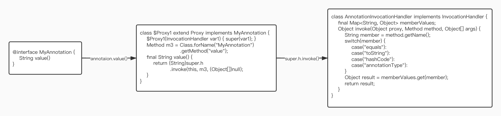

# Annotation

## 注解原理

注解本质是一个继承了`Annotation`接口的特殊接口，在获取自定义注解`MyAnnotation`中属性值时比如`myAnnotation.value()`，因为自定义注解是个接口是无法调用`value()`方法的，因此实质上JVM动态代理生成了`$Proxy1`类作为其实现类，其签名为`$Proxy1 extends Proxy implements MyAnnotation`，在`$Proxy1`中有一系列的`Method`类型字段，代表`MyAnnotation`和`Annotation`中的所有方法

`myAnnotation.value()`方法调用也即是调用`$Proxy1`类中的`value()`方法，`$Proxy1`类中的`value()`方法实现为调用`super.h.invoke(this, m1, (Object[]) null)`，其中参数中`m1`即为`$Proxy1`中的`Method`字段，该`Method`字段即代表`value()`方法，然后`super.h.invoke`中`h`是`$Proxy1`构造函数中传入的`AnnotationInvocationHandler`实例，并通过`super()`构造函数将`AnnotationInvocationHandler`传递给父类`Proxy`中，即`$Proxy1`中所有方法都被`AnnotationInvocationHanlder.invoke()`代理了

`AnnotationInvocationHanlder.invoke()`实现即对传入的`Method`字段获取方法名，通过方法名判断，如果是`equals/toString/hashCode/annotataionType`方法则调用默认实现，如果不是则说明是自定义注解中的方法名比如`value()`，通过方法名在`AnnotationInvocationHandler`中的Map类型成员变量`memberValues`中索引找到具体值

`memberValues`是在`AnnotationInvocationHanlder`的构造函数中传入的，`memberValues`实现是个`LinkedHashMap<String, Object>`，key为方法名，value为这个方法名所对应的值(即在标注注解时传入的`@MyAnnotation(value = "my")`)，`memberValues`通过`AnnotationParser`解析常量池创建

- [Java注解（Annotation）原理详解](https://blog.csdn.net/lylwo317/article/details/52163304)

