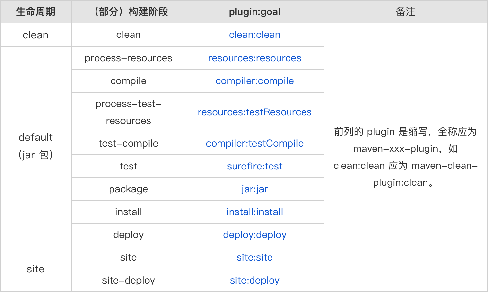

# Maven

## lifecycle/phase/goal

maven所有实际操作都是由插件完成的，如果没有插件maven就什么都干不了，当我们创建mavne项目后即使未在pom.xml中配置`<plugin>`，但在The Super Pom中已经默认引入了很多核心插件(所有maven项目都继承自The Super Pom)

maven对构建过程进行了统一抽象，定义了3套互相独立的生命周期(lifecycle)，每个生命周期中包含这不同的构建阶段(phase)，并且每个生命周期中的构建阶段是有有序性的要求的，即某个构建阶段必须在其前面所有的构建阶段都执行完成后才能执行该构建阶段(在maven-core.jar中`META_INF/plexus/components.xml`中定义了生命周期和对应的构建阶段)



插件的目标(goal)和生命周期中的一个构建阶段绑定，比如maven-clean-plugin的clean这个目标和生命周期中clean构建阶段绑定，当maven执行到clean阶段时会调用maven-clean-plugin插件的clean目标(可以将插件理解为一个类，而goal即是类中的一个方法，这个方法和maven生命周期中某个阶段绑定，当到了这个阶段时会调用这个方法)

插件目标的执行顺序是根据绑定的构建阶段的顺序来顺序执行的，如果多个插件目标被绑定到同一个阶段，那么根据插件在pom中声明的先后顺序执行

## dependence

通过`<dependency>`标签来引入一个依赖，其中`groupId, artifactId`标签是必填的，其他的都是可选的

`<version>`标签表示引入的依赖的版本，其分为soft requirement和hard requirement：
- 未使用`[]`修饰的版本号都属于soft requirement，即maven会尽可能使用指定的版本，但如果出现依赖冲突，可能会使用其他版本，比如`1.0.0`
- 使用`[]`修饰的版本号则属于hard requiremen，要求必须使用指定的版本，否则直接报错,比如`[1.0.0]`

`<type>`标签表示引入依赖的类型，即打包方式，默认值是jar，还可以声明为pom，war等

`<exclusion>`标签用于将引入依赖的包中的指定包排除引入

`<optional>`：maven中依赖默认有传递性，通过设置该标签值为true，表示该依赖是可选的，不会被默认被引入，比如A项目中的pom依赖了B项目，且将B项目设为可选的依赖，在别的项目pom中依赖A项目后是不会继承对B项目的依赖，如果需要依赖必须手动在当前项目的pom文件中添加B项目的依赖

`<scope>`标签用于控制依赖的传递性并决定依赖存在于classpath中时机
- compile：`<scope>`默认值，表示该依赖会一直存在于classpath中，任何阶段都可以使用，依赖具有传递性
- provided：仅在编译和测试时存在于classpath中，而运行时不在，运行时该依赖由JDK或容器提供，依赖不具有传递性
- runtime：仅在测试和运行时存在于classpath中，而编译时不在，即编译时不依赖，依赖具有传递性
- test：仅在编译测试和运行测试时存在于classpath，依赖不具有传递性

maven的工程是允许继承的，通过继承机制可以将一个大项目分成多个小项目来统一管理，通过`<parent>`标签来指定继承的父项目，并且可以通过子标签`<relativePath>`来指定继承未发布到repository的父项目

所有的maven项目的pom文件其实都继承自一个The Super Pom，在super pom文件中主要包括默认的`<repository>`，即默认使用官方的central repository，并在`<build>`定义一系列标签来指定源代码目录，测试目录等路径，还有通过`<pluginManagement>`来指定默认的插件版本

```xml
<project>
  <modelVersion>4.0.0</modelVersion>
  <repositories>
    <repository>...</repository>
  </repositories>
  <pluginRepositories>
    <pluginRepository>...</pluginRepository>
  </pluginRepositories>
  <build>
    <directory>${project.basedir}/target</directory>
    <outputDirectory>${project.build.directory}/classes</outputDirectory>
    <finalName>${project.artifactId}-${project.version}</finalName>
    <testOutputDirectory>${project.build.directory}/test-classes</testOutputDirectory>
    <sourceDirectory>${project.basedir}/src/main/java</sourceDirectory>
    <scriptSourceDirectory>${project.basedir}/src/main/scripts</scriptSourceDirectory>
    <testSourceDirectory>${project.basedir}/src/test/java</testSourceDirectory>
    <resources>
      <resource>
        <directory>${project.basedir}/src/main/resources</directory>
      </resource>
    </resources>
    <testResources>
      <testResource>
        <directory>${project.basedir}/src/test/resources</directory>
      </testResource>
    </testResources>
    <pluginManagement>
      <plugins>
        ...
        <plugin>
          <artifactId>maven-dependency-plugin</artifactId>
          <version>2.8</version>
        </plugin>
        ...
      </plugins>
    </pluginManagement>
  </build>
  <profiles>...</profiles>
</project>
```

maven的依赖是默认有传递性的，但这就会存在依赖包版本不同的问题，maven最近定义原则(nearest definition)来决定引入的包版本，比如项目A中存在依赖A-B-C1.0和A-D-E-C2.0，那么C1.0的路径最短，因此maven决定引入C1.0，再比如A-B-C1.0和A-D-C2.0，此时C1.0和C2.0的路径都相等，此时maven会根据在pom文件中声明的顺序来选择，选择先声明的包中的C，即C1.0

那么能不能打破maven的最近定义原则来自主选择需要使用的版本呢，最简单的方法就是在A项目中直接引入需要的版本的C包，比如A-C2.0，但是A并不直接依赖C，因此这种解决方法并不完美，`<dependencyManagment>`是更好的方法，可以将版本统一在`<dependencyManagment>`中管理，即maven会选择`<dependencyManagment>`中声明的C的版本

`<dependencyManagment>`标签仅是声明一个依赖，但并不会引入该依赖，其主要功能就是统一多模块下的版本

可以在`<dependencyManagment>`中声明依赖的`groupId, artifactId, version, scope`，然后在项目中引入在`<dependencyManagment>`中声明过的依赖时，就可以只声明`groupId, artifactId`，而无需显式声明`version, scope`

子模块中的`<dependencyManagment>`优先级高于父模块中的`<dependencyManagment>`，而在`<dependency>`中显式声明的依赖优先级高于`<dependencyManagment>`

BOM(Bill of Materials)是一种约定俗成的叫法，指的是利用`<dependencyManagment>`标签来统一依赖版本的pom，BOM目的是统一依赖版本而不是具体引入依赖，比如通过Spring Initializer生成Spring Boot项目时，其中pom.xml是继承自spring-boot-dependencies这个pom，而spring-boot-dependencies中只通过`<dependencyManagment>`进行统一版本，而spring-boot-dependencie这个pom就是BOM

## resources

resources代表着资源文件，在普通Java项目中往往通过`Class.getResource()`和`ClassLoader.getResource()`方法来加载资源文件，但是如何定位到资源文件，即资源文件的路径到底该怎么填，这并非易事(像`new File()`中相对路径起始为main方法所在类的第一个包名的同级目录)

所有maven项目都继承自The Super Pom文件，在super pom文件中分别通过`<resources>`和`<testResources>`定义了默认的资源路径，因此无需在maven项目中做任何设置，在`src/main/resources`和`src/test/resources`路径下的文件都会被maven视为resources并在编译后maven会将他们拷贝到`target/classes`或`target/test-classes`

```xml
<build>
    <resources>
        <resource>
            <directory>${project.basedir}/src/main/resources</directory>
        </resource>
    </resources>
    <testResources>
        <testResource>
            <directory>${project.basedir}/src/test/resources</directory>
        </testResource>
    </testResources>
</build>
```

当然也可以在pom文件中自定义resource路径，通过`<resources>`和`<testResources>`标签中的子标签`directory`定义resource所在位置，`targetPath`定义在项目构建后将资源文件拷贝到的位置

此外可以通过设置`<filtering>`标签为true来对resources资源文件中的占位符(`${xxx}`)进行替换，占位符分为系统占位符(比如`${project.version}`，`${env}`等)和在`<properties>`标签中自定义的项目中的属性值  

## packaging

jar是Java Archive的缩写，jar包其实就是个zip类型的压缩包，每个jar包中都包含manifest文件(`META-INF/MANIFEST.MF`)，其中记录了jar包的一些信息，比如manifest版本，jdk版本，构建者等，如果是可执行的jar包还会包含启动类等信息

`mvn package`命令进行打包，其通过maven-jar-plugin插件完成，可以在该插件中配置`<classesDirectory>`指定要打包的文件的目录，`<outputDirectory>`指定jar包的存放目录，`<archive>`指定对manifest文件的自定义配置

在maven-jar-plugin打包时是不会将依赖一起打包进来的，因此如果需要打包成可单独执行的jar包就需要用到别的插件
- maven-shade-plugin插件默认会将依赖打包到jar包中，并通过设置`<mainClass>`标签就可以打包成可独立执行的jar包，但当依赖包和当前项目中文件冲突时就需要手动解决
- maven-dependency-plugin插件会将依赖的包都单独拷贝保存到个单独的目录中，然后maven-jar-plugin插件中配置`addClasspath`为true，并将依赖包存放的目录配置到`classpathPrefix`标签中，然后就可以通过jar命令允许了，但依赖的包所在目录并不包含在jar包内，因此上传到服务器时还需要自行压缩后上传(这个压缩的过程可以通过maven-assembly-plugin插件实现)

## others

1. 在项目继承自定义的parent后，通过其他pom.xml实现统一版本的能力

```xml
<parent>
    <groupId>myself</groupId>
    <artifactId>myself-project</artifactId>
    <version>1.0.0</version>
</parent>

<dependencyManagement>
    <dependencies>
        <dependency>    
            <groupId>org.springframework.cloud</groupId>
            <artifactId>spring-cloud-dependencies</artifactId>
            <version>2020.0.0</version>
            <type>pom</type>
            <scope>import</scope>   <!-- scope的import仅用作于在dependencyManagement中引入pom -->
        </dependency>
    </dependencies>
</dependencyManagement>
```

2. 通过mvn命令执行指定要运行的类

```bash
mvn exec:java -Dexec.mainClass="class path"
```
