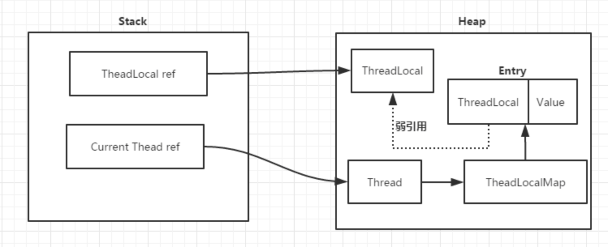

# ThreadLocal

## 作用

首先要明确，ThreadLocal与线程同步无关，它并不是解决多线程共享变量的问题

两大使用场景
- 每个线程需要个独享的对象(通常是工具类，比如线程不安全的SimpleDateFormat和多线程中性能不佳的Random)
- 每个线程需要保存该线程的全局变量(比如Web中拦截器获取的用户信息)

其实上述的两大使用场景本质都是在每个线程中单独存储一份变量，且这个变量只属于这个线程且不会被别的线程共享，该线程的所有对该变量的操作只会影响自己所持有的，不会影响别的线程中的

而两个主要场景区别在于前一个在new ThreadLocal时候就通过重写initialValue或withInitial + Lambda来在初始化时就赋值(虽然真正赋值初始化在get方法后)，而后一个则是在使用时先set再get

## 原理



首先在每一个Thread线程中有一个`threadLocals`变量，该类型是`ThreadLocal.ThreadLocalMap`，本质上来说就是个Map，这个Map以ThreadLocal作为key，而具体的值作为value

ThreadLocal中的get/set/remove等操作都是在操作`threadLocals`，具体流程：
- 获取到当前线程`currentThread`
- 从当前线程中取出`threadLocals`变量
- 如果`threadLocals`为空就去初始化该变量
- 否则就用当前ThreadLocal变量(即this对象)作为key去`threadLocals`这个map中进行操作

ThreadLocalMap中通过维护一个默认大小为16的Entry数组来存储，通过对key的hashcode取模来确定在数组中的位置，并且它的hash算法使用的是线性探测法，因此无需像HashMap中的Node节点一样需要一个next指针(没有next指针那么Enrty之间就没有引用，帮助GC)

总结，ThreadLocal中不存储任何具体的数据，真正数据存储在Thread的`threadLocals`变量中，ThreadLocal其是作为`threadLocals`的key，此外对`threadLocals`的系列操作是由ThreadLocal提供。所以不要误认为ThreadLocal中存储数据，其本质可以理解为一个工具类，提供了对线程中`threadLocals`该变量的一系列操作

## 内存泄漏问题

首先看到原理中的那张图，其中`threadLocals`这个map的key准确说是弱引用的ThreadLocal对象，而不是直接的ThreadLocal对象，这是为了帮助GC，一旦该key不再被其他地方引用，该key(即ThreadLocal对象)就会被GC (弱引用的特点：如果这个对象只被弱引用关联，而无强引用关联，那么这个对象就可以被GC回收)

key被GC变成了null，但是value还是普通的强引用，此时是无法被GC的，因此会发生该线程中的`threadLocals`中的某个key(即ThreadLocal对象)已经为null，当key为null，表示value也没有意义了(key都没了，都无法取出value了)，因此此时value指向的对象应该被GC，而又因为value是强引用，GC是无法自主回收的，因此此时就造成了内存泄漏问题。尤其是线程池中，一个线程往往会被重复使用执行不同任务，其中就会存储大量key已经是null的value，而这些value却GC无能为力，因此会造成内存泄漏问题

既然value也应该被GC回收，那么可以显式将value设置为null，告诉GC可以回收了。在ThreadLocal中，resize方法显式将key为null的value也设为null，来帮助GC，其他比如set，remove等方法中使用`expungeStaleEntry`方法来清除不再使用的value(当然这个清除只是顺便的，是清除你传入的位置到第一个不为null位置中符合条件的，而不是全部扫描)

```txt
To help deal with very large and long-lived usages, the hash table entries use WeakReferences for keys. However, since reference queues are not used, stale entries are guaranteed to be removed only when the table starts running out of space.
```

这段是ThreadLocal的内部类ThreadLocalMap中的注释，说明了由于value未使用弱引用，因此仅仅当容量满了以后才会被保证清除不用的value

总结，为了防止内存泄漏问题，必须在使用完后手动调用remove方法

