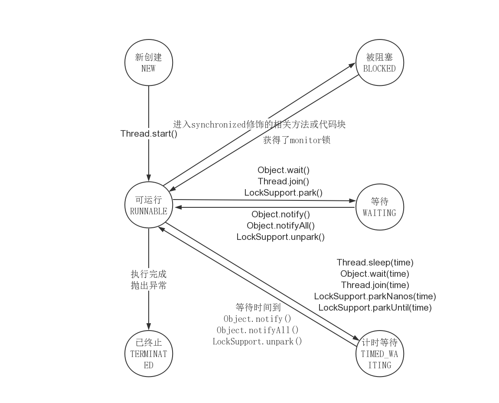

# 多线程杂录

## 实现多线程的两种方法

本质上实现多线程有且仅有两种方法，继承Thread类并重写run方法，或者在new Thread类时传入Runnable接口

而传入Runnable接口往往是更好的选择：
1. Ruunable的写法中，逻辑与线程的创建解耦
2. 每次创建Thread性能消耗是巨大的，而Runnable接口则可以复用Thread(例如线程池)
3. Java不支持多继承，因此如果继承了Thread类就无法继承其他类

## 启动线程

使用start方法而不是run方法

start方法会真正新起一个线程，并调用run方法

而直接调用run方法则仅仅是个普通函数，只会在main主线程中运行

> 连续两次调用start()，由于前一次start的调用，线程的状态已不是NEW状态，因此第二次调用会抛出IllegalThreadStateException异常

## 停止线程

使用interrupt方法来通知线程中断，而不是stop方法强制中断线程，因为线程中很可能需要运行到某个节点后才能中断，否则破坏原子性

如果使用interrupt方法就需要被调用方法中显式处理了中断信号(`Thread.currentThread().isInterrupted()`)，否则中断信号发出后线程还是继续执行，直到线程运行完成。即调用interrupt方法无法确保线程一定中断，只能起到通知线程中断的作用

在基础方法中，比如`Thread.sleep()`，`wait()`中已经显式处理了Interrupt信号，这些方法接收到中断信号后会向外抛出`InterruptedException`，并清除中断信号(即线程不再是中断状态)，因此如果以try catch形式捕获并处理了异常，这很可能会导致外层函数方法无法接收到中断信号，从而导致线程无法正确中断

处理中断信号的方法：
1. 中断传递：将`InterruptedException`以函数签名的方式显式向外层函数抛出
2. 恢复中断：在try catch处理了`InterruptedException`后，重新设置interrupt，使得外层方法能够接受该中断信息

用volatile设置boolean标记位

此方法在大部分场合是可行的，但是在例如生产者生产速度很快，而消费者速度很慢的情况下，阻塞队列满后，生产者将会被阻塞，这种情况下，即使修改了标记位，线程也无法终止

原因是因为阻塞队列被阻塞后，代码是无法继续执行下去的，因此就到不了判断标记位处的代码，因此就无法正确中断线程。但如果使用interrupt，因为阻塞队列阻塞状态下也是能响应interrupt中断信号的，因此代码得以继续执行到达判断isInterrupted处，线程得以中断

## synchronized

JVM会自动通过对象头上的monitor来加锁和解锁，保证同时只有一个线程可以执行指定代码，保证来线程安全

因为是通过对象头上的monitor加锁实现的，那么synchronized锁的本质上就是一个对象

- `public synchronized void method()` 关键词在方法上，此时锁的是this对象
- `synchronized (object) {}` 关键词后跟代码块，此时锁的是指定传入的object对象
- `public static synchronized void method()` 关键词在静态方法上，此时锁的就是该类，即XXX.class(java中.class也是对象)

当synchronized关键词加在static方法上时，锁的对象是XXX.class，而整个运行过程中XXX.class有且仅有一个，因此该方法可以保证调用时其他线程调用一定会被阻塞

通过synchronized代码块的形式是需要传入对象的，此时其他线程执行该方法是否阻塞依赖于传入的被加锁对象是否相同，如果希望同时所有线程中只有一个线程中的该方法被调用，可以将待锁的对象设置为XXX.class

两个特性：
- 可重入：即如果已经持有了待锁的对象，那么该对象的所有synchronized方法都能够执行(即该线程可以继续请求获得该锁对象)
- 不可中断：如果该锁对象已经被其他线程获取了，那么除了等待或阻塞持有该锁的线程自主释放，别无他法(对比Lock类，其有权中断持有该锁的线程的执行)

可重入原理：
JVM管理这对该monitor的加锁次数计数器，如果线程获取时其值为0，表示可以获取，JVM会对其值加一，此时其他线程因为计数器值不为0就无法获取该锁了。如果在持有该锁的线程中继续请求该锁，则将计数器再加一。每次释放一次锁就减一，直到为0表示可以被其他线程获得了

## 线程的六个状态

六个状态分别为NEW，RUNNABLE，BLOACKED，WAITING，TIMED_WAITING，TERMINATED，它们都可以在Thread类中的State枚举类中找到。使用getState方法查看线程状态

- NEW：一旦new了个线程(但还未start)，此时线程处于NEW状态
- RUNNABLE：一旦new了的线程调用了start方法后，就处在RUNNABLE状态，无论其是正在运行中还是等待获取系统资源运行
- BLOCKED：当线程运行synchronized代码块或方法时，尝试获取锁时处于BLOCKED状态，直到成功获取到了对象锁后才重新返回RUNNABLE状态
- WAITING：当线程运行wait/join等方法时，处于WAITING状态
- TIMED_WAITING：当线程运行wait(TIME)/join(TIME)等方法时，处于TIMED_WATING状态
- TERMINATED：当线程运行完后的状态

## wait/notify/notifyAll

- wait：该方法释放持有的调用对象的锁(使得其他synchronized代码块能够获取到该锁)，线程进入WAITING状态，直到其他线程唤醒它再执行后续代码
- notify：该方法从所有WAITING该调用的对象的锁的线程中唤醒一个(具体唤醒哪一个由JVM实现，是不公平的)，虽然是唤醒了WAITING的线程，但要该线程执行完synchronized代码块后才会释放锁(即该线程notify后，JVM会从所有WAITING该锁的线程中选取一个变成BLOCKED，而BLOCKED线程真正能获取到该锁还要等持有该锁的线程执行完同步代码块后释放锁)(JVM是随机从WAITING状态的线程中唤醒一个，而该线程还要和其他BLOCKED线程去竞争，因此即使被唤醒也不保证马上就能获取到锁)
- notifyAll：相较于notify，notifyAll将所有处在WAITING状态的该对象锁的线程都唤醒，进入BLOCKED状态

### 为什么wait必须在同步代码块中使用？

因为如果不是在同步代码块中执行的话，就代表很可能该线程在执行到wait语句前就切换到别的线程上执行了，在别的线程上将notify的语句都执行完了，重新切回去执行到wait方法后，再无别的notify来唤醒它了，那么就会造成死锁

### 为什么wait/notify/notifyAll定义在Object中而非Thread中？

因为线程持有的锁对应的是每个对象头上monitor，而非具体线程。此外一个线程中可能需要多个锁配合使用，定义在Object中操作更方便

### 如果调用Thread.wait()会怎么样？

每个线程也是个对象，因此调用wait方法语法上不存在问题，但是Thread类在退出时是会自动调用notify方法的，因此往往会造成与我们自定义的逻辑混乱冲突

### sleep和wait方法异同？

都会响应中断并且阻塞

sleep在Thread类中，wait在Object类中

wait方法会释放所持有的锁(即调用该方法的对象)，sleep方法则不会(无论是synchronized的锁还是lock的锁)

wait方法必须在同步代码块中执行，而sleep方法则不需要

## join

join方法的作用就是等待某个线程执行完成后再执行后续代码。在main线程中执行thread1.join()，意思就是将thread1线程加入main线程中，即让main线程等thread1线程执行完后再执行后续代码

join的源码中调用的是wait方法，因为在JVM实现中每个线程执行完后都会自动notify。举个例子，在main线程中执行thread1.join()，就相当于thread1.wait(当然是要在synchronized代码块中的)，只有在thread1执行完后JVM自动调用notify才能够唤醒main线程，使其接着执行

因为join源码中调用的是wait方法，因此join时线程处在WAITING/TIMED_WAITING状态(不是那个被等待的线程，是上例中的main)，而如果调用join的线程(上例中的main)被中断了，那么等同于wait方法处理中断，而wait方法是能够响应中断的，因此调用join的线程会接收到InterruptedException异常

## yeild

yeild的作用就是告诉JVM释放我的CPU时间片，但是JVM中的实现却不能保证一定会释放它的时间片，很可能因为CPU空闲而不释放，因此该方法很少使用

### yeild和sleep的区别

线程一旦sleep，那么就处于阻塞状态，不再消耗CPU资源，且不能被JVM调度，而yeild则随时可能被JVM调度，继续执行

## 线程的属性

### 线程ID

通过`++threadSeqNumber`设定，用户无法修改线程ID，初始值为`++0`即是1

### 线程名称

可以在新建线程是自定义，默认为`Thread-{threadInitNumber++}`，用户只能在线程还未start前修改，否则修改的名称仅仅只是在JVM上的，而不是native里的

### 守护线程和用户线程的区别

用户线程适用于执行业务逻辑的，而守护线程则是服务于我们的(比如垃圾回收线程)

用户线程会影响JVM的离开，而守护线程则不会(JVM通过判断是否还有用户线程来决定是否需要退出)

注：通常无需再将用户线程设定为守护线程，系统默认的守护线程已经够用了

### 线程优先级

优先级最低为0，最高为10，Thread默认为5，因此继承Thread的实现的用户线程默认也是5

程序设计不应依赖于优先级
- 不同操作系统中的优先级划分不同，比如windows中是7，就会存在映射的问题
- 操作系统会自行更改线程的优先级

## 线程中未捕获异常处理

主线程中抛出异常后整个程序会中断，而子线程中抛出异常后是不会中断主线程的继续执行的

子线程中是无法直接使用try catch来捕获子线程中的异常的。原因是try catch只能捕获所在线程中的异常，比如只能捕获到子线程start失败的异常，而是没办法捕获到子线程中的异常的

- 在子线程中使用try catch捕获所有异常(不推荐)
- 为所有线程设置一个默认handle(`Thread.setDefaultUncaughtExceptionHandler()`)或为线程单独设置handle(`thread1.setUncaughtExceptionHandler()`)。两个方法中接受的都是一个`UncaughtExceptionHandler`接口(函数式接口，可以直接传lambda)

run方法是不能再向上层抛出异常的，当子线程抛出异常后，进入TERMINATED状态

