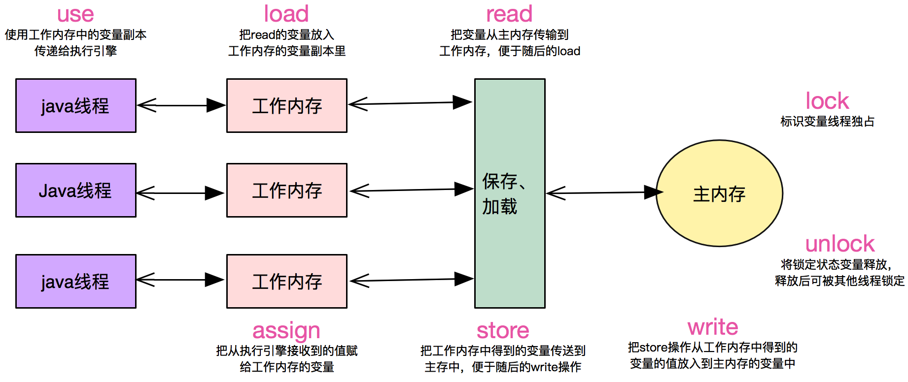
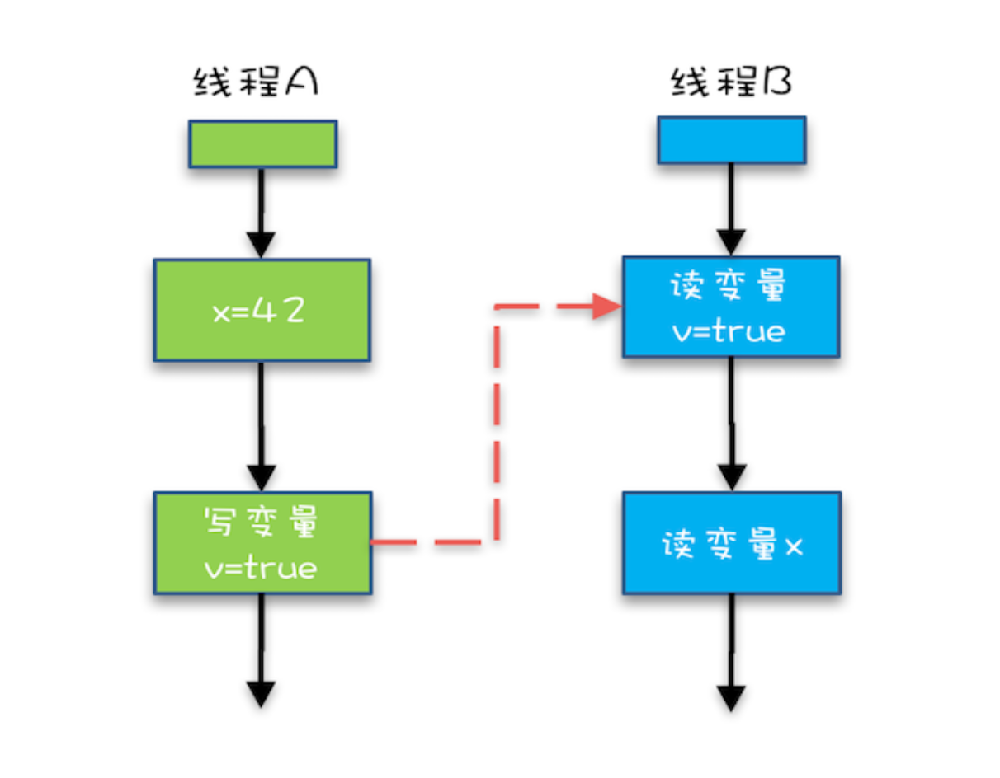

# 多线程杂录

## 实现多线程的两种方法

本质上实现多线程有且仅有两种方法，继承Thread类并重写run方法，或者在new Thread类时传入Runnable接口

而传入Runnable接口往往是更好的选择：
1. Ruunable的写法中，逻辑与线程的创建解耦
2. 每次创建Thread性能消耗是巨大的，而Runnable接口则可以复用Thread(例如线程池)
3. Java不支持多继承，因此如果继承了Thread类就无法继承其他类

## 启动线程

使用start方法而不是run方法

start方法会真正新起一个线程，并调用run方法

而直接调用run方法则仅仅是个普通函数，只会在main主线程中运行

> 连续两次调用start()，由于前一次start的调用，线程的状态已不是NEW状态，因此第二次调用会抛出IllegalThreadStateException异常

## 停止线程

使用interrupt方法来通知线程中断，而不是stop方法强制中断线程，因为线程中很可能需要运行到某个节点后才能中断，否则破坏原子性

如果使用interrupt方法就需要被调用方法中显式处理了中断信号(`Thread.currentThread().isInterrupted()`)，否则中断信号发出后线程还是继续执行，直到线程运行完成。即调用interrupt方法无法确保线程一定中断，只能起到通知线程中断的作用

在基础方法中，比如`Thread.sleep()`，`wait()`中已经显式处理了Interrupt信号，这些方法接收到中断信号后会向外抛出`InterruptedException`，并清除中断信号(即线程不再是中断状态)，因此如果以try catch形式捕获并处理了异常，这很可能会导致外层函数方法无法接收到中断信号，从而导致线程无法正确中断

处理中断信号的方法：
1. 中断传递：将`InterruptedException`以函数签名的方式显式向外层函数抛出
2. 恢复中断：在try catch处理了`InterruptedException`后，重新设置interrupt，使得外层方法能够接受该中断信息

用volatile设置boolean标记位

此方法在大部分场合是可行的，但是在例如生产者生产速度很快，而消费者速度很慢的情况下，阻塞队列满后，生产者将会被阻塞，这种情况下，即使修改了标记位，线程也无法终止

原因是因为阻塞队列被阻塞后，代码是无法继续执行下去的，因此就到不了判断标记位处的代码，因此就无法正确中断线程。但如果使用interrupt，因为阻塞队列阻塞状态下也是能响应interrupt中断信号的，因此代码得以继续执行到达判断isInterrupted处，线程得以中断

## synchronized

synchronized关键词提供了原子性和可见性的保证(关于symchronized是否提供了禁止重排序的功能，由于synchronzied保证了原子性，即里面的代码类似于单线程运行，因此此时是否重排序都不会影响到程序的运行结果)

JVM会自动通过对象头上的monitor来加锁和解锁，保证同时只有一个线程可以执行指定代码，保证来线程安全

因为是通过对象头上的monitor加锁实现的，那么synchronized锁的本质上锁的就是一个对象

- `public synchronized void method()` 关键词在方法上，此时锁的是this对象
- `synchronized(object) {}` 关键词后跟代码块，此时锁的是指定传入的object对象
- `public static synchronized void method()` 关键词在静态方法上，此时锁的就是该类，即XXX.class(java中.class也是对象)

当synchronized关键词加在static方法上时，锁的对象是XXX.class，而整个运行过程中XXX.class有且仅有一个，因此该方法可以保证调用时其他线程调用一定会被阻塞

通过synchronized代码块的形式是需要传入对象的，此时其他线程执行该方法是否阻塞依赖于传入的被加锁对象是否相同，如果希望同时所有线程中只有一个线程中的该方法被调用，可以将待锁的对象设置为XXX.class

注意：`synchronized(object)`中锁的object建议用final修饰保证不被修改，如果在执行过程中object被改变就会造成多个线程synchronzied竞争的不再是同一把锁，导致synchronzied失效

两个特性：
- 可重入：即如果已经持有了待锁的对象，那么该对象的所有synchronized方法都能够执行(即该线程可以继续请求获得该锁对象)
- 不可中断：如果该锁对象已经被其他线程获取了，那么除了等待或阻塞持有该锁的线程自主释放，别无他法(对比Lock类，其有tryLock来中断阻塞获取锁的状态)

可重入原理：
JVM管理这对该monitor的加锁次数计数器，如果线程获取时其值为0，表示可以获取，JVM会对其值加一，此时其他线程因为计数器值不为0就无法获取该锁了。如果在持有该锁的线程中继续请求该锁，则将计数器再加一。每次释放一次锁就减一，直到为0表示可以被其他线程获得了

synchronized提供的可见性：相同锁的synchronizde代码块，前者执行完后，后者是一定能够看到前者synchronzied代码块中的所有操作以及前者synchronzied代码块前的操作

```java
// Thread 1
int a = 100;
synchronized(lock) {
    b = 100;
}

// Thread 2
synchronzied(lock) {
   // 此处一定能看到b = 100和a = 100
}
```

利用以上所说的特点，可以synchronzied一部分代码块而达到更大范围变量的可见性的保证

## 线程的六个状态

六个状态分别为NEW，RUNNABLE，BLOACKED，WAITING，TIMED_WAITING，TERMINATED，它们都可以在Thread类中的State枚举类中找到。使用getState方法查看线程状态

- NEW：一旦new了个线程(但还未start)，此时线程处于NEW状态
- RUNNABLE：一旦new了的线程调用了start方法后，就处在RUNNABLE状态，无论其是正在运行中还是等待获取系统资源运行
- BLOCKED：当线程运行synchronized代码块或方法时，尝试获取锁时处于BLOCKED状态，直到成功获取到了对象锁后才重新返回RUNNABLE状态
- WAITING：当线程运行wait/join等方法时，处于WAITING状态
- TIMED_WAITING：当线程运行wait(TIME)/join(TIME)等方法时，处于TIMED_WATING状态
- TERMINATED：当线程运行完后的状态


## wait/notify/notifyAll

- wait：该方法释放持有的调用对象的锁(使得其他synchronized代码块能够获取到该锁)，线程进入WAITING状态，直到其他线程唤醒它再执行后续代码
- notify：该方法从所有WAITING该调用的对象的锁的线程中唤醒一个(具体唤醒哪一个由JVM实现，是不公平的)，虽然是唤醒了WAITING的线程，但要该线程执行完synchronized代码块后才会释放锁(即该线程notify后，JVM会从所有WAITING该锁的线程中选取一个变成BLOCKED，而BLOCKED线程真正能获取到该锁还要等持有该锁的线程执行完同步代码块后释放锁)(JVM是随机从WAITING状态的线程中唤醒一个，而该线程还要和其他BLOCKED线程去竞争，因此即使被唤醒也不保证马上就能获取到锁)
- notifyAll：相较于notify，notifyAll将所有处在WAITING状态的该对象锁的线程都唤醒，进入BLOCKED状态

wait/notify/notifyAll都是在`synchronized{}`代码块内部被调用的，因为wait/notify/notifyAll这三个方法被调用的前提都是已经获取到了相对应的互斥锁了，如果在`synchronzied{}`外部调用，JVM在运行时会抛出`IllegalMonitorStateException`异常

wait在使用时考虑使用`while`代替`if`判断，因为当wait返回时，很可能前面`if`里判断的条件还是不满足的，因此还需要再次再做一次条件判断

```java
// 不满足条件
while (!condition) {
  wait();
}

```

尽量使用notifyAll而不是notify，因为notify会随机唤醒等待队列中的一个线程，因为是随机的所以很可能每次被唤醒的线程都还是条件不满足，继续等待，从而导致条件满足的线程一直没被唤醒，一直等待

### 为什么wait/notify/notifyAll定义在Object中而非Thread中？

因为线程持有的锁对应的是每个对象头上monitor，而非具体线程。此外一个线程中可能需要多个锁配合使用，定义在Object中操作更方便

### 如果调用Thread.wait()会怎么样？

每个线程也是个对象，因此调用wait方法语法上不存在问题，但是Thread类在退出时是会自动调用notify方法的，因此往往会造成与我们自定义的逻辑混乱冲突

### sleep和wait方法异同？

都会响应中断并且阻塞

sleep在Thread类中，wait在Object类中

wait方法会释放所持有的锁(即调用该方法的对象)，sleep方法则不会(无论是synchronized的锁还是lock的锁)

wait方法必须在同步代码块中执行，而sleep方法则不需要

## join

join方法的作用就是等待某个线程执行完成后再执行后续代码。在main线程中执行thread1.join()，意思就是将thread1线程加入main线程中，即让main线程等thread1线程执行完后再执行后续代码

join的源码中调用的是wait方法，因为在JVM实现中每个线程执行完后都会自动notify。举个例子，在main线程中执行thread1.join()，就相当于thread1.wait(当然是要在synchronized代码块中的)，只有在thread1执行完后JVM自动调用notify才能够唤醒main线程，使其接着执行

因为join源码中调用的是wait方法，因此join时线程处在WAITING/TIMED_WAITING状态(不是那个被等待的线程，是上例中的main)，而如果调用join的线程(上例中的main)被中断了，那么等同于wait方法处理中断，而wait方法是能够响应中断的，因此调用join的线程会接收到InterruptedException异常

## yeild

yeild的作用就是告诉JVM释放我的CPU时间片，但是JVM中的实现却不能保证一定会释放它的时间片，很可能因为CPU空闲而不释放，因此该方法很少使用

### yeild和sleep的区别

线程一旦sleep，那么就处于阻塞状态，不再消耗CPU资源，且不能被JVM调度，而yeild则随时可能被JVM调度，继续执行

## 线程的属性

### 线程ID

通过`++threadSeqNumber`设定，用户无法修改线程ID，初始值为`++0`即是1

### 线程名称

可以在新建线程是自定义，默认为`Thread-{threadInitNumber++}`，用户只能在线程还未start前修改，否则修改的名称仅仅只是在JVM上的，而不是native里的

### 守护线程和用户线程的区别

用户线程适用于执行业务逻辑的，而守护线程则是服务于我们的(比如垃圾回收线程)

用户线程会影响JVM的离开，而守护线程则不会(JVM通过判断是否还有用户线程来决定是否需要退出)

注：通常无需再将用户线程设定为守护线程，系统默认的守护线程已经够用了

### 线程优先级

优先级最低为0，最高为10，Thread默认为5，因此继承Thread的实现的用户线程默认也是5

程序设计不应依赖于优先级
- 不同操作系统中的优先级划分不同，比如windows中是7，就会存在映射的问题
- 操作系统会自行更改线程的优先级

## 线程中未捕获异常处理

主线程中抛出异常后整个程序会中断，而子线程中抛出异常后是不会中断主线程的继续执行的

子线程中是无法直接使用try catch来捕获子线程中的异常的。原因是try catch只能捕获所在线程中的异常，比如只能捕获到子线程start失败的异常，而是没办法捕获到子线程中的异常的

- 在子线程中使用try catch捕获所有异常(不推荐)
- 为所有线程设置一个默认handle(`Thread.setDefaultUncaughtExceptionHandler()`)或为线程单独设置handle(`thread1.setUncaughtExceptionHandler()`)。两个方法中接受的都是一个`UncaughtExceptionHandler`接口(函数式接口，可以直接传lambda)

run方法是不能再向上层抛出异常的，当子线程抛出异常后，进入TERMINATED状态

## 线程安全问题

### 什么是线程安全

当多个线程访问某个对象或方法时，无需做额外的处理(即可以像单线程编程一样)，程序也可以正常运行，这就是线程安全

### 多线程带来的性能问题

- 上下文切换
  - 需要保存线程(比如寄存器信息，运行到的指令位置)
  - 缓存失效(切换了线程导致CPU缓存全部失效)
- 内存同步
  - 为了数据的正确性，往往会禁止编译器优化，使CPU内缓存失效(Java内存模型)

### 线程不安全的情况

- 运行结果错误(比如a++)
- 死锁，活锁，饥饿等问题(synchronized锁住一把锁是请求另一把锁)
- 对象发布和初始化的问题(在初始化时引入子线程，而子线程中有具体初始化逻辑，导致初始化依赖于子线程的执行)(可以使用副本或工厂模式解决)

### 为什么会发生线程不安全的情况

- 访问共享的变量或资源
- 执行依赖时序的操作
- 数据见存在依赖/捆绑关系
- 第三方的类是线程不安全的

## Java内存模型(JMM)

Java内存模型/JVM内存结构/Java对象模型是三个不同的东西

Java内存模型是一种规范，需要各个JVM来遵守JMM规范，以便开发者可以利用这些规范更方便的开发多线程程序

如果没有JMM，那么代码会因为在不同实现的JVM上重排序，导致不同的JVM上运行结果不同(如果没有JVM，那么就依赖于CPU的指令，也会造成运行结果不同的问题)

例如`synchronized`, `voliate`等关键字和并发的工具类能够保证其正确性正是因为JMM的存在

### 重排序

重排序可以提高代码的执行速度，但是就会导致语句的执行顺序可能发生改变

发生重排序的三种情况：
- JVM，JIT等编译器的优化
- CPU中的指令重排序

当两条指令之间没有顺序/数据依赖关系，CPU会对其进行指令重排序，重排序在单线程下可以提高代码执行速度，但在多线程环境下会造成数据不一致等情况

### 可见性

由于CPU有三级缓存，每个核心都有自己独有的缓存，因此很可能运行时读取到的缓存中的值而不是最新的值(最新的值可能在别的缓存中也可能在主内存中)



在上图中可以看到Java内存模型中抽象了内存和缓存，从而只要关心JMM中抽象出的工作内存和主内存，而不用细节到具体的内存和缓存中了

#### JMM中主内存和工作内存的关系

- 所有变量都存储在主内存中，同时每个线程都有自己独立的工作内存，工作内存中的变量内容是主内存中的拷贝
- 线程不能直接读写主内存中的变量，只能操作自己工作内存中的变量，然后同步到主内存中
- 主内存是所有线程共享的，但线程间不共享工作内存，如果线程间需要通信，则必须借助主内存来完成

所有共享变量都存在主内存中，而每个线程中又有自己独立的工作内存，而数据共享也是通过主内存交换的，**因此就会导致可见性问题**

#### Happens-Before规则

A Happens-Before B，不是指A在B之前执行，而是说A的执行的操作在B中是一定可以看到的

在JMM中，如果一个操作执行的结果需要对另一个操作可见，那么这两个操作之间必须存在happens-before关系

JMM 通过 happens-before 关系向程序员提供跨线程的内存可见性保证

##### 1. 单线程规则

在单个线程中，后面运行的语句是一定能看到前面语句的操作的，即两条语句`a = 1; b = a;`中`b = a;`语句是一定能看到前面语句`a = 1;`的操作的，是能够感知到a变量值发生了改变。即使发生了重排序，也只要保证重排序后的语句一定能看到前面语句的操作即可

##### 2. 锁操作(synchronized和lock)

在加锁前一定能够看到同一把锁解锁前的所有操作(对于synchronized来说，代码块最后，即执行到右侧打括号处会自动释放锁)

```java
b = 10;
synchronized(lock) {
  a = 10;
}
```

在上述代码块中，synchronzied释放锁后，别的synchronzied获取到该锁后，是一定保证能看到`a = 10`和`b = 10`的操作的(能看到`b = 10`是因为还有传递性 + 单线程规则)

```java
b = 10;
lock.lock();
a = 10;
lock.unlock();
```

在上述代码块中，unlock后其他线程成功lock了该锁后，是能保证一定能看到`a = 10`和`b = 10`的操作的(能看到`b = 10`原因同synchronzied)

##### 3. volatile变量

被volatile修饰的变量，当一个线程对该变量写入新值后，其余所有线程中都能读取到该变量的最新值

volatile和传递性的结合



再上图中：
- 线程A中的 `x = 42` Happens-Before 写volatile变量`v = true` (单线程原则)
- 线程A中的写volatile变量`v = true` Happens_Before 线程B中的读volatile变量`v` (volatile原则)
- 因此根据传递性原则 线程A中的`x = 42` Happens-Before 线程B中的读volatile变量`v`
- 这是1.5中对volatile语义增强，可以通过volatile来实现可见性

可以理解为在读取volatile修饰的变量时，是一定能够看到前一次写入该volatile变量的操作及该写入操作前的所有操作

##### 4. 线程启动

主线程在启动子线程A后，子线程A是能够看到主线程在启动(即调用start())前的操作的。即在new了个子线程A后，在主线程start其之前，主线程进行的操作在子线程启动后也是能够看到的

##### 5. 线程join

[join](#join)方法调用后的代码都是能够看到其join等待的线程中的所有操作的(join方法本来就是在等待子线程完成，如果子线程完成后的结果却不可见，那join就没意义了)

##### 6. 传递性

如果代码段A和代码段B满足Happens-Before原则，代码段B和代码段C也满足Happens-Before原则，那么代码段A和代码段C之间也满足Happens-Before原则

##### 7. 线程中断

当一个线程被另一个线程发起interrupt中断信号时，该线程内是一定能够看到interrupt的中断信号的，即isInterupted()是一定能感知到的，抛出的InterruptedException是一定能看到的

##### 8. 构造方法(了解即可)

finalize()执行的时候一定能够看到构造方法的最后一条指令

### 原子性

原子性表示一系列操作要么都执行，要么都不执行，或者说这一系列的操作是不可分割的。最常见的a++就不是原子性操作，具体来说++有三个操作，取出a的值，对其加1，然后写回

Java中是原子性的操作
- 除long，double外的基本类型的赋值操作
- 所有引用的赋值操作(无论是32位还是64位机器)
- java.concurrent.Atomic.*包中所有类的原子操作

**原子操作 + 原子操作 != 原子操作**

#### long和double赋值不是原子性：

long和double类型是64位，因此在32位机器上对该类型数据操作需要多条CPU指令组合来完成，因此无法保证原子性。而64位机器上就一定能保证原子性

因为JMM中没有规定long和double必须要原子写入，因此在某些JVM实现上可以存在问题，但是商用的JVM已经考虑了该问题，即使是32位机器也是原子写入，因此无需多虑

为了解决赋值原子性问题，可以通过为long和double添加volatile关键词，或者用同步代码块包裹

## volatile

volatile关键词提供了可见性和禁止指令重排序的保证

- 可见性：读取volatile变量前，需要先使相应的本地缓存失效，然后在主内存中读取。写入volatile变量则会立即刷入主内存中。voliate变量不会再工作内存中缓存，永远从主内存中读取
- 禁止指令重排序优化

volatile相较于synchronzied，没有了原子性的保证，因此在一些无需原子性(比如赋值操作)而只需可见性的场合中可以使用，并且volatile比synchronzied相比，没有了加锁释放锁等操作，所以说是低成本的

适用场景：
- 变量需要被多线程共享，且对该变量的操作都是保证原子性的(比如赋值)
- 由于[volatile和传递性的结合](#3%20.volatile变量)的支持，所以可以将volatile修饰的变量作为触发器，因为在读取其值时，写入和其前面的所有操作都是可见的了
- voliate使得long和double的赋值也是原子性的

volatile底层原理：

内存屏障：阻止屏障两侧指令重排序； 强制把缓存区的数据写入主存，让缓存失效

编译器在生成字节码时在指令序列中插入内存屏障(memory barrier)来禁止特定类型的处理器重排，对于编译器来说以最优化最小化插入屏障几乎不可能，因此基于如下规则采用保守插入策略：
- 在每个volatile写操作的前面插入一个StoreStore屏障
- 在每个volatile写操作的后面插入一个StoreLoad屏障
- 在每个volatile读操作的后面插入一个LoadLoad屏障
- 在每个volatile读操作的后面插入一个LoadStore屏障

```txt
StoreStore屏障 -> 确保volatile写操作前的所有操作都被同步到主内存(即其他线程读到的是最新值)，并禁止上面的普通写操作和该volatile写操作进行重排
volatile写操作
StoreLoad屏障 -> 确保volatile写操作的值被同步到主内存，并禁止该volatile写操作和后面的volatile读写操作进行重排
```

```txt
volatile读操作
LoadLoad屏障 -> 禁止下面的普通/volatile读操作和该volatile读操作进行重排
LoadStore屏障 -> 禁止下面的普通/volatile写操作和该volatile读操作进行重排
```

当然这是保守的插入策略，编译器在生成字节码时会做一些优化，比如volatile写操作时后面还跟着个volatile写操作，那么前一个写操作就无需在后面加上StoreLoad屏障，因为后一个volatile写操作上的StoreStore屏障会提供确保数据同步到主内存的能力，因此就可以省略掉前一个volatile写操作的StoreLoad屏障

在X86处理器中仅会对写-读操作做重排序，对读-读，读-写和写-写操作不会做重排序，因此可以省略掉这三种操作对应的内存屏障

## 死锁

发生死锁的必要4个条件(必须同时满足)：
1. 资源是互斥的，同时只有一个线程可以持有
2. 占有且等待，即线程持有互斥锁的同时还在等待另一个互斥锁
3. 不可抢占，即线程持有了互斥锁后其他线程是无法强制占用该互斥锁
4. 循环等待，即A线程在等待B线程持有的互斥锁，而B线程也在等待A线程持有的互斥锁

```java
// Thread 1
synchronized(lock1) {
    Thread.sleep(100);
    synchronized(lock2) {
      // 发生死锁
    }
}
// Thread 2
synchronized(lock2) {
    Thread.sleep(100);
    synchronized(lock1) {
      // 发生死锁
    }
}
```

### 检测死锁

- jstack 命令行工具
- ThreadMXBean Java类，可以直接在代码中检测到死锁，然后直接做处理

### 修复死锁

- 避免策略：更改请求锁的顺序
- 检测与恢复策略：检测是否有死锁，有的话就剥夺该资源来打开死锁

### 避免死锁

- 设置超时时间(tryLock)
- 多使用并发类代替自己设计锁
- 降低锁的粒度：用多把锁而不是一把锁
- 使用同步代码块代替同步方法：可以自己选择锁定对象

### 活锁和饥饿

活锁：虽然线程还在不断运行，但是是没有意义的运行，因为在运行着等待其他锁，相比于死锁反而更浪费性能且不易察觉(比如两个线程在谦让一个锁，在拿到该锁后不使用反而谦让给另一个线程，从而导致虽然每次都能拿到该锁，但永远没法运行，一直在谦让中)

饥饿：一个线程尝试请求一把锁，但这把锁永远被其他人占用，该线程就处于饥饿的状态

## synchronized锁升级

synchronized代码块：编译后字节码在synchronzied代码块前插入monitorenter指令，并在正常和异常执行路径上都加上monitorexit保证任何执行流程下一定会被解锁

synchronzied方法：编译后方法的字节码标记`flag:ACC_SYNCHRONIZED`，JVM会在进入该方法前执行monitorenter指令，并在方法退出时，无论是正常退出还是异常退出执行monitorexit指令


Java对象在内存中布局分为三块：对象头(Header)、实例数据(Instance Data)和对齐填充(Padding)，其中对象头包括两部分：Mark Word(标记字段) 和 Klass Pointer(类型指针)

对象头中的标记字段(Mark Word)其最后两位表示该对象的锁状态，00代表轻量级锁，01代表无锁或偏向锁，10代表重量级锁，11则和垃圾回收算法标记相关


JVM默认情况下首先使用轻量级锁，然后膨胀到重量级锁，`-XX:BiasedLockingStartupDelay`参数用于设置从轻量级锁转向偏向锁的延迟时间，即在该延迟时间后JVM会首先使用偏向锁，再膨胀到轻量级锁和重量级锁，在JDK10后该参数值设置为0，即一开始就使用偏向锁

重量级锁：JVM会阻塞加锁失败的线程，并在目标锁被释放的时候唤醒这些线程。线程的阻塞和唤醒都依靠操作系统来完成，通过pthread的互斥锁mutex实现，因为涉及到系统调用，需要由用户态切换到内核态，开销极大。因此当线程获取重量级锁失败后(包括唤醒后未能竞争到锁)并不会立即阻塞，而是会进入自旋状态，在CPU上空跑并轮询该锁是否被释放，如果在自旋过程中锁被释放即可以直接获得该锁而无需进入阻塞状态。JVM采用自适应自旋，根据自旋等待时间是否能够获取到锁来动态调整自旋时间

轻量级锁：加锁时，JVM会判断是否已经是重量级锁，如果不是则在当前线程的栈桢中划出一块空间作为该锁的锁记录，并将锁对象的标记字段复制到其中，接着JVM会尝试通过CAS替换锁对象的标记字段，即标记字段前面要求相同，最后两位要求为01(表示无锁或偏向锁)，如果CAS成功即最后两位改为00(表示轻量级锁)并将锁对象的标记字段替换为该线程中的锁记录地址，成功获取到轻量级锁，反之表示其他线程持有该锁，于是JVM会将该锁膨胀为重量级锁并阻塞该线程。解锁时，JVM尝试通过CAS比较标记字段的值是否为当前线程锁记录的地址，如果是表示还是轻量级锁没有别的线程请求该锁，于是将锁对象中替换为其原本的标记字段，此时线程已经成功释放该锁，如果不是则表示该锁已经膨胀为重量级锁，此时JVM会进入重量级锁释放过程，唤醒竞争该锁的其他线程

偏向锁：在线程加锁时，如果该锁对象支持偏向锁，那么JVM通过CAS将当前线程的地址记录在锁对象的标记字段中，并将最后三位设为101，当其他线程请求该锁时只需要判断最后三位是否为101，是否标记字段中包含当前线程地址，以及锁对象的epoch值是否与该锁对象的类的epoch值相同，如果都满足则直接返回表示该线程持有该偏向锁(相较于轻量级锁当线程多次请求同一把锁减少了性能消耗)。epoch值：当请求加锁的线程与锁对象标记字段保存的线程地址不同时，JVM会撤销偏向锁，并替换为轻量级锁，这个撤销过程很麻烦，要求持有偏向锁的线程达到安全点才能进行撤销，因此每个类维护了个epoch值，当创建该类的偏向锁时需要将该epoch复制到该偏向锁内，当该偏向锁进行撤销，JVM会将该偏向锁的类的epoch加1，并等待所有该类的偏向锁到达安全点后对偏向锁中的epoch也加1，整个过程是非常消耗性能的，因此JVM中参数`-XX:BiasedLockingBulkRevokeThreshold`设置了总撤销次数阈值，默认40，当到达该阈值后JVM会认为该类不再适合偏向锁，并在之后加锁过程中直接创建为轻量级锁。为什么锁对象中也要保存epoch？因为由重偏向，当一个线程持有50个同一个类的不同锁对象的偏向锁时，另一个线程请求这50个偏向锁，前20个(通过`XX:BiasedLockingBulkRebiasThreshold`设置)会被撤销替换为轻量级锁，而因为类的epoch值并不会立即更新到偏向锁中的epoch值，因此此时偏向锁的epoch值和类的epoch值不同，于是就可以进行重偏向，即第21个偏向锁并不会被替换为轻量级锁而是会重偏向(重新设置标记字段中线程地址)到这个请求锁的线程

总结：重量级锁即假设由不同的线程同时竞争该锁，轻量级锁假设有不同的线程竞争该锁，但是竞争时间是错开的，即没有冲突，偏向锁则假设只有一个线程会竞争该锁

## 参考

- [Monitor好文1](http://songkun.me/2019/11/02/2019-11-02-java-jvm-synchronized-impl-2/)
- [Monitor](http://bigdatadecode.club/JavaSynchronizedTheory.html)
- [不可不说的Java锁事](https://tech.meituan.com/2018/11/15/java-lock.html)
- [Synchronized的底层实现及锁升级](https://pjmike.github.io/2019/04/13/%E6%B5%85%E6%9E%90-Synchronized%E7%9A%84%E5%BA%95%E5%B1%82%E5%AE%9E%E7%8E%B0%E5%8F%8A%E9%94%81%E5%8D%87%E7%BA%A7/)
