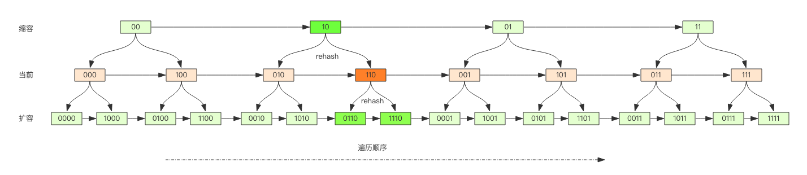
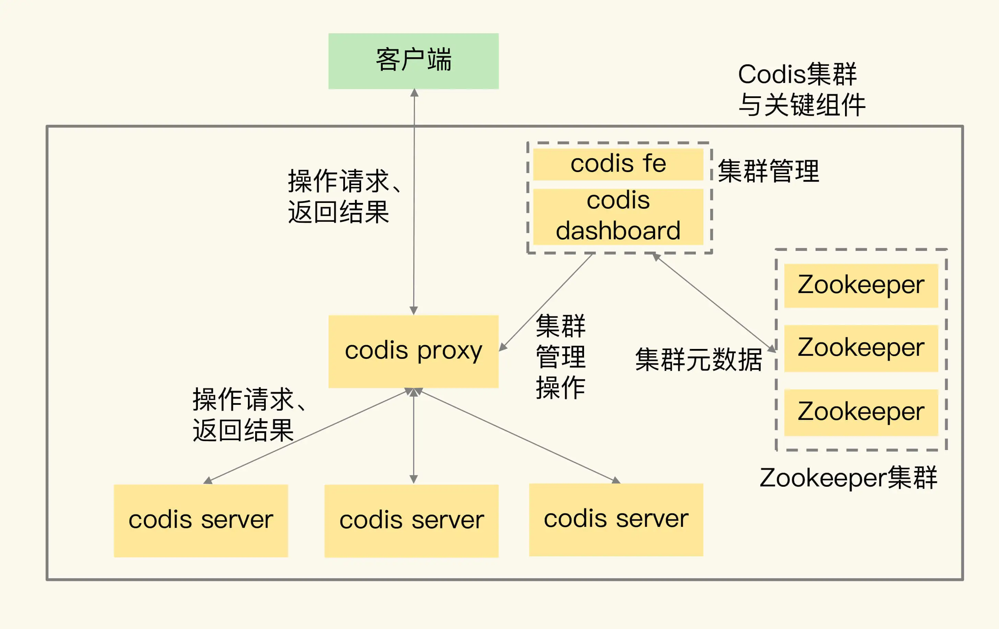

# Redis笔记

## 数据类型和底层数据结构

Redis使用全局哈希表来保存所有的键值对，全局哈希表中value保存的是(key, value)的键值对的指针


当key出现哈希冲突时，在全局哈希表中会通过链地址法(即哈希冲突的entry会以链表的形式保存)，那么此时当查询到哈希冲突的key时就需遍历整个链表才能找到所查找的entry，链表的遍历是O(n)，所以就非常耗时

此时Redis就会对全局哈希表做rehash动作，为了使rehash操作更高效，Redis默认使用两个全局哈希表并采用渐进式rehash。全局哈希表1和全局哈希表2，当一开始插入数据时都插入全局哈希表1，当需要rehash时：
1. 首先给哈希表2分配更大的空间(即增加桶的数量减少哈希冲突的情况)
2. 然后并不是直接把哈希表1中的数据全部拷贝到哈希表2(因为做全量拷贝时就会造成Redis线程阻塞而无法服务其他请求)，而是Redis仍正常处理客户端请求，每处理一个请求时将哈希表1中第一个索引(即桶)上的所有entry拷贝到哈希表2，然后等到处理下一个请求再将哈希表1中第二个索引上的所有entry全部拷贝到哈希表2，以此类推
3. 最后等到哈希表1中全部拷贝到了哈希表2后，释放哈希表1中空间

通过渐进式rehash，将一次性的大量拷贝的开销，分摊到多次处理过程中，保证了Redis的快速响应

全局哈希表中的每一项都是个dicEntry结构体，用来指向一个键值对，dicEntry有三个8字节的指针，分别指向key、value和下一个dicEntry(哈希冲突的链地址实现使用)


虽然dicEntry中有三个指针分别8字节，应该只占用24字节，但实质上因为Redis使用的内存分配库jemalloc，其会根据申请的字节数N，找一个比N大但最接近N的2次幂作为分配空间以减少频繁分配的次数，因此申请24字节，但jemalloc会分配32字节，也就是dicEntry结构体会最终占用32字节

- String：简单动态字符串
- List：双向列表 / 压缩列表
- Hash：哈希表 / 压缩列表
- Sorted Set：跳表 / 压缩列表
- Set：整数数组 / 压缩列表

跳表：其在链表的基础上，增加多级索引，通过索引位置的跳转实现数据的快速定位，整个查询过程就是在多级索引上跳来跳去，因此叫做跳表，跳表查找的时间复杂度为O(logN)


对于所有Redis的操作来说，对单个元素的操作基本都是O(1)，比如HGET，HSET，SADD，SREM等；对于范围操作，比如HGETALL，SMEMBERS等返回集合中所有数据的操作，是需要遍历整个集合的，复杂度一般都为O(N)，因此尽量避免；对于统计操作，比如LLEN，SCARD统计集合中元素个数的复杂度都是O(1)，Redis可以高效完成；此外比如对集合首尾元素的操作，因为压缩列表的支持，复杂度也只有O(1)

-----

Redis的数据类型有很多，并且不同的数据类型都有相同的元数据需要记录(比如最后一次访问的时间、被引用次数等)，所以Redis中会用一个RedisObject结构体来统一记录这些元数据

RedisObject包括8字节的元数据8字节的指针，指针进一步指向具体的数据类型的实际数据，比如string就是指向SDS结构所在地址


RedisObject元数据包括：
- type：表示值的类型，包括五大基本类型String、List、Set、Sorted Set、Hash
- encoding：表示值得编码方式，用来表示Redis中实现各个基本类型的底层数据结构，包括SDS、压缩列表、哈希表、跳表等
- lru：记录这个对象最后一次被访问的时间，用于淘汰过期的键值对
- refcount：记录对象的引用计数


为节省空间，Redis对long类型(Redis基本类型并没有long类型，但当保存的是64位有符号整数时会把string类型保存为一个8字节的long类型整数)和SDS做了专门不同的设计

int编码：当保存的是long类型的整数时，RedisObject中指针就直接赋值为整数数据，这样就无须通过指针再指向整数了，节省了指针空间开销
embstr编码：当保存的是string类型数据并且字符串小于等于44字节时，RedisObject中元数据、指针和SDS会被分配到连续的内存上，避免内存碎片的问题
raw编码：当字符串大于44字节时，就会给SDS单独分配内存空间，并通过RedisObject的指针指向SDS


### string

当保存的是64位有符号整数时，string类型会被保存为一个8字节的long类型整数，称作为int编码方式

当保存的数据中包含字符时，string类型就会使用简单字符串SDS(Simple Dynamic String)结构来保存


buf：字节数组，保存实际数据，为了表示字节数组结束，Redis会自动在字节数组最后加个`\0`，这会额外增加1字节开销
len：占4字节，表示buf已用长度
alloc：占4字节，表示buf实际分配的长度

### 压缩列表(ziplist)

压缩列表表头有三个字段zlbytes、zltail和zllen分别表示列表长度、列表尾的偏移量和列表中entry个数，表尾还有个zlend表示列表结束


压缩列表是一种非常节省内存的数据结构，因为它使用一系列连续的entry保存数据，entry都是挨个放置的，因此不需要额外指针进行连接，这样就可以节约内存

此外压缩列表的优势还在于如果要查找第一个元素和最后一个元素都是O(1)的，并且查询元素个数也是O(1)，但对于其他元素的查找就还是O(N)

entry结构：
- prev_len：表示前一个entry长度，当前一个entry长度小于254字节该prev_len字段就占1字节，反之就占5字节(虽然一字节可以表示0-255数字，但是压缩列表的zlend默认值就是255，用于表示列表结束，因此255不可用，而5字节时第一个字节一定是254，所以只有前面entry长度必须小于254才可占1字节，如果可以等于254的话就会导致无法分别是1字节还是5字节)
- len：表示entry自身长度，4字节
- encoding：表示编码方式，1字节
- content：保存实际数据

Redis中基础类型比如Hash，分别有两种底层实现，分别为压缩列表和哈希表，Hash类型设置了使用压缩列表进行保存的两个阈值(hash-max-ziplist-entries表示用压缩列表保存时哈希集合中最大元素个数，hash-max-ziplist-value表示用压缩列表保存时哈希集合中当个元素的最大长度)，当超过阈值Redis就会把Hash类型的实现结构从压缩列表转为哈希表，并且一旦转为哈希表后就不会再转回压缩列表(像其他基本类型，List、Set、Sorted Set底层也是有两种实现方式，压缩列表和双向链表/整数数组/跳表，也分别有阈值用于控制何时要从压缩列表转为对应的数据结构)

压缩列表的优势就是非常节省内存，但每次查找和插入元素时都需要遍历整个压缩列表，虽然可以利用CPU高速缓存，但也不宜存储过多数据(这也就是为何在超过阈值后会转为对应的数据结构)，即时间换空间。并且因为压缩列表每个entry都是连续排列的，因此一但某个entry进行修改就会引发多个entry的联级调整，从而引发性能问题

可以利用Hash这种基础类型使用压缩列表的特性，将简单的string类型的kv键值对转为Hash类型存储(比如可以将整个key的前6位作为kv对中的key，而将后三位作为Hash类型中的key)，因为当Hash类型底层实现为压缩列表时非常节省内存，因此每增加一个value占用的内存空间比string类型小的多，但要注意控制Hash类型中的元素个数(也就是控制key位数的拆分)，防止超过阈值转化为哈希表的实现，这样就起不到节省内存的作用了
但此时就无法针对每个键值对设置过期时间(因为key被拆分成了两部分)，简单说这样就是把Redis作为了数据库而不是缓存使用，需要自行保证数据可靠、淘汰策略等方面

## 单线程

Redis的单线程主要是指Redis的网络IO和键值对读写是由一个线程完成的，这也是Redis对外提供键值存储服务的主要流程。但Redis的其他功能，比如持久化，异步删除，集群数据同步等，其实是由额外的线程执行的

单线程模式避免了多线程下共享资源的并发访问控制的问题

此外Redis使用到了IO多路复用的能力，由内核负责监听套接字上的连接请求和数据请求，一旦请求到了，就会通过回调的方法交给Redis线程处理，而不再会被阻塞在套接字上(比如阻塞在`recv()`上)


但单线程处理模式也存在个两个方面的问题：
1. Redis单线程中任意一个请求耗时(比如操作bigkey)会影响到后面的所有请求，进而影响整个Redis的性能。需要业务人员自行去规避
2. 并发量大时，单线程读写客户端数据存在性能瓶颈，虽然IO多路复用是非阻塞的，但单线程读写客户端数据是阻塞的。在Redis6.0中可以在高并发场景下通过多线程读写客户端数据，但真正键值对的读写还是由单线程完成

## AOF和RDB

Redis持久化主要有两大机制，AOF(Append Only File)日志和RDB快照

AOF是写后日志，意思是先将数据写入内存，然后再记录到日志，相较于MySQL中的WAL(Write Ahead Log)写前日志，在数据实质写入前先写入redo log以便故障时进行恢复

写后日志AOF中记录的是Redis收到的每一条命令，这些命令以文本的形式保存，AOF日志中`*n`表示当前命令有三个部分，每个部分都是以`$n`开头，表示该部分所占的字节数，而每个部分中具体的内容就是具体的命令、键、值，而写前日志redo log中保存的是对数据页的修改

写后日志AOF有两个好处：
- 因为写日志前已经执行过了命令，所以如果命令执行失败那么在日志中不会记录这个错误命令，而写前日志就会存在记录了错误命令的情况
- 其在命令执行后才记录日志，所以不会阻塞当前的写操作

AOF在写回磁盘时机存在两个问题：
- 当一个命令刚写入内存但还没来得及将日志写入磁盘时就宕机了，那么这个命令和相应的数据就有丢失的风险，因此这个命令无法通过日志进行恢复
- AOF虽然避免了对当前命令的阻塞，但如果写入磁盘的操作很慢，那么就会导致后续的写命令被阻塞无法执行

AOF三种写回策略：
- Always(同步回写)：每个命令执行完成后，立马将日志同步写回磁盘（其实并没有立即写回磁盘，而只是写入aof_buf中，等到下一个事件来临才会fsync到磁盘，所以即使是always，也存在着丢失一个命令数据的可能性）
- Everysec(每秒回写)：每个命令执行完后，只是先将日志写到AOF文件的内存缓冲区，然后每隔一秒把缓冲区中内容写回磁盘
- No(操作系统控制回写)：每个命令执行完后，只是先将日志写到AOF文件的内存缓冲区，然后由操作系统决定何时将缓冲区内容写回磁盘


随着AOF中记录的日志越来越多就会导致AOF文件越来越大，文件过大会造成三个问题：
- 文件系统对文件大小有限制，无法保存过大的文件
- 当文件过大时，再追加命令记录效率降低
- 当使用AOF进行故障恢复时，需要重新执行AOF中所有命令日志，如果日志文件过大就会导致恢复过程非常慢

AOF重写机制来解决这个问题，重写的核心在于整个AOF日志中针对同一个key会存在多个操作，而这些操作只需要将他们重写成一条命令即可，比如`set a 1`和`set a 2`最后重写成`set a 2`一条即可

AOF重写过程：一个拷贝，两处日志

每次执行重写时，主进程fork出后台线程bgrewriteaof子进程，fork会把主线程内存拷贝一份给bgrewriteaof子进程，其中就包括了数据库最新的数据，子进程就可以在不影响主进程的情况下逐一将内存中数据记入重写日志。因为主进程并未被阻塞，仍然可以处理新来的操作，如果有写操作就会追加到现有的AOF文件中并追加到AOF重写缓存中，在子进程完成AOF重写后会想主进程发出信号，接着主进程会执行两个步骤，步骤一是将AOF重写缓存中内容写入重写日志，步骤二是对重写日志改名覆盖原有的AOF文件，整个重写过程中只有这两步是阻塞主进程的 (写本来的AOF日志作用是在重写过程中如果发生宕机，此时AOF日志还是齐全的，写AOF重写缓存作用是当子线程重写完成后，将AOF重写日志应用到重写完的日志中即可保证此时该日志处在数据库最新的状态)


父子进程重写潜在的阻塞风险：首先fork子进程这个瞬间是会阻塞主进程的，fork子进程需要拷贝进程必要的数据结构，比如拷贝页表(虚拟内存和物理内存的映射关系)等，但并不真正拷贝父进程拥有的内存中所有数据，fork采用操作系统提供的Copy On Write机制，避免了一次性拷贝大量数据给子进程造成长时间阻塞，也就是说虽然fork了子进程，但并没有申请和父进程相同的内存大小，此时父子进程指向的内存地址是相同的，只有当写操作发生时，才会拷贝出一份内存中真正数据提供给进程进行写操作。因此当AOF重写过程中，父进程还是有写操作命令进入，此时父进程就需要真正拷贝这个key所对应的内存数据，申请新的内存空间，内存分配是以页为单位进行的，默认是4k，因此当父进程操作的是个bigkey时就需要申请大块内存，产生阻塞，此外如果操作系统开启内存大页机制(Huge Page，默认页大小4k，大页内存页大小2M)，父进程即使操作的是个value和小的key，但因为内存分配是以页为单位，就必须至少分配2M，因此非常容易造成阻塞(Huge Page在Redis实际使用时建议关闭)

为什么重写时不复用原先的日志：因为父子进程同写一份日志必然会产生竞争问题，控制竞争就会影响父进程的性能，此外如果在重写过程中如果发送错误，复用原先的日志就会导致日志被污染，而重写一份新日志的情况下直接删除该文件即可

-----

RDB(Redis DataBase)文件记录的是某一时刻Redis内存中全量数据的快照，RDB快照相较于AOF日志，当宕机后恢复的很快，因为记录的就是内存中的数据，而AOF记录的是命令，必须将全部命令执行完后才能完成恢复

Redis提供两个命令来生成RDB文件：
- save：在主进程中执行，会导致阻塞，其他请求命令无法被执行
- bgsave：主进程fork一个子进程，专门负责写入RDB文件，避免了主进程的阻塞，是Redis RDB文件生成的默认配置

bgsave中，虽然fork出的子进程负责写入RDB文件，不会阻塞主进程，但主线程写操作并不能正常被处理，因为如果写操作更新的数据在更新前就被子进程写入RDB文件，那么这个写操作将会被丢失。Redis通过操作系统提供的Copy On Write写时复制技术(fork子进程时只会阻塞主进程申请内存空间并拷贝必要的进程数据结构，比如页表等，但主进程内存数据并不会被拷贝一份给子进程，而是读数据时共用，只有当写数据时才申请内存空间并对应的内存数据拷贝到新的内存地址上进行修改)，如果主进程只有读操作，那么bgsave子进程互不影响，当主进程有写操作时，这块数据将被拷贝一份到新的内存地址，主进程修改新的数据副本，然后bgsave子进程会把这个副本写入RDB文件，从而使得主进程可以正常执行并且数据保证不会丢失

RDB文件不易频繁生成快照，比如秒级生成，虽然bgsave不阻塞主线程，但：
- RDB文件每次都是内存数据全量写入磁盘，造成磁盘压力很大，当多个快照同时竞争磁盘带宽，更易导致性能下降
- fork子进程这个动作瞬间是需要阻塞主进程的，频繁bgsave也就是频繁fork，最终也就导致频繁阻塞主进程

因此更好的方案是快照+基于此快照的修改记录，也就是RDB+AOF，在Redis4.0中混合使用AOF和RDB快照，即快照不必频繁生成，通过AOF记录两个快照间的操作命令，并且当第二次快照生成时就可以清空AOF日志

RDB快照方案不适用于写操作非常频繁的场景，因为fork出bgsave子进程后，当主进程有写操作时需要先拷贝数据副本后进行修改，如果写操作非常频繁，那么在bgsave后台生成RDB文件过程中，就会频繁申请内存空间，导致内存很快被占用完，如果此时系统开启swap，那么Redis内存中数据就会被交换到磁盘上，性能骤降，如果没有开启swap，那么直接触发OOM，父子进程可能被操作系统直接kill掉

## 主从同步

Redis主从模式下，主从库间采用的是读写分离的方式，读操作主库和从库都可以接受，而写操作首先到主库被执行，然后主库将写操作同步给从库

### 主从第一次同步

启动多个Redis实例后，通过replicaof(Redis5.0之前为slaveof)命令形成主从关系`replicaof [master-ip] [master-port]`


1. 从->主：`psync ? -1`，psync命令表示从库要进行数据同步，该命令包括主库的runID(Redis实例启动后都会自动生成一个随机ID用于唯一标识这个实例)和复制进度offset两个参数，主库根据这两个参数启动复制，第一次复制复制时runID未知所以传`?`，offset传`-1`
2. 主->从：`FULLRESYNC [runID] [offset]`，主库收到psync命令后，用FULLRESYNC命令(FULLRESYNC表示第一次复制采用全量复制)带上主库的runID和主库目前的复制进度offset返回给从库，从库记录runID和offset
3. 主->从：主库执行bgsave，生成RDB文件，将RDB文件发给从库，从库接收到RDB文件后清空当前数据库后加载RDB文件。在主库将RDB文件从库过程中主库并不会被阻塞，此时主库收到的写命令并没有记录到RDB文件中，因此主库会将这些命令写入Redis分配给这个从库的replication buffer中
4. 主->从：当主库完成RDB文件传输后，将此时replication buffer中记录的写操作发给从库，从库执行这写操作后就实现了主从同步

因为每个从库第一次主从同步都需要主库完成一次RDB文件的生成和传输，如果从库数量很多就会给主库带来压力，比如fork子进程时的阻塞，传输RDB文件占用的带宽等，此时可以通过主-从-从模式将主库生成和传输RDB文件压力分摊到从库上，即从库不在直接和主库进行交互，而是和另一个从库相互完成同步`replicaof [slave-ip] [slave-port]`

### 增量同步

当网络出现抖动时，从库重连主库如果每次也都进行全量同步开销就会很大，因此通过repl_backlog_buffer环形缓冲区实现增量同步

当主库的Redis实例只有有从库连接，主库就会将所有写命令缓存到repl_backlog_buffer中，repl_backlog_buffer是一个环形缓冲区，主库会记录自己写到的位置(master_repl_offset)，从库则会记录自己已经读到的位置(slave_repl_offset)

当刚开始时主库和从库读写位置是相同的，随着主库不断接受写命令，master_repl_offset也就不断增加(offset单调递增)，从库在接收到主库发送的写命令并执行完成后也会增加slave_repl_offset，正常情况下两个偏移量应该是级别相等的。当网络抖动后从库重新连上主库后，从库会先发送psync并带上slave_repl_offset，主库将从库传来的slave_repl_offset和自己的master_repl_offset对比，将两者之间的写命令同步给从库即可。但是因为repl_backlog_buffer是个环形缓冲区，即内存大小是固定的，当不够时会覆盖掉旧的数据，如果从库断开很长时间或从库读取速度比较慢，就会导致从库还未读取的写命令已经被主库新的写命令给覆盖了(master_repl_offset偏移量大于slave_repl_offset一个环的大小)，此时从库就不得不进行全量同步以保证数据一致性

因此可见，repl_backlog_buffer大小设置非常关键，因为一旦超出限制就会导致全量同步，这是非常消耗性能的，repl_backlog_buffer大小通过repl_backlog_size参数调整，计算公式是`repl_backlog_size = 2 * (主库写入命令速度 * 操作大小 - 主从库间网络传输命令速度 * 操作大小)`，但是还是会存在覆盖未同步写命令的情况，除了进一步加大repl_backlog_size大小外，还可以使用切片集群

repl_backlog_buffer：其目的是在从库断开连接后，帮助找到主从间未同步的数据而设计的环形缓冲区，从而避免全量同步带来的性能消耗

replication buffer：无论是客户端还是从库，Redis都会为他们分别分配一个内存buffer进行数据交互，Redis先把数据写到buffer中，然后再把buffer中数据发送到client socket中完成网络发送，从而完成数据交互，而replication buffer正是Redis分配给从库用户传输主库写操作命令的buffer(Redis分配的每个buffer大小是有限制的，通过client-output-buffer-limit参数限制，当buffer超过限制主库会强制断开这个客户端的连接)

总结：repl_backlog_buffer只要当有从库的时候主库就会创建，主库的所有写命令都会缓存到repl_backlog_buffer中，当主从间不一致时，通过repl_backlog_buffer中找到需要同步的增量数据然后通过replication buffer完成发送，而replication buffer是Redis为每个client(客户端或者从库)分别创建的buffer

## 哨兵机制

哨兵机制主要就是负责当主库挂了后从从库中选举出新的主库，哨兵主要负责的就是三个任务：监控，选择主库，通知客户端

- 监控：判断主从库是否下线
- 选主：从从库中选举出新的主库
- 通知：让从库执行replicaof与新主库同步，并通知客户端和新主库连接

哨兵本质就是一个运行在特殊模式下的Redis进程，但不负责处理Redis的读写命令，其运行在独立的机器上，并且可以部署在多个不同的机器上组成哨兵集群，当主从库实例运行时它也在运行

### 监控

哨兵进程会使用ping命令检测自己和主从库的网络连接情况，当哨兵发现主库或从库对ping命令超时了(超时时间由down-after-milliseconds控制)，那么哨兵就会先把它标记为`主观下线`(从库下线影响不大，主库和其他从库还能继续服务读操作，但主库下线就会导致写操作无法被处理，因此主库下线就要求进行新主库切换)

注：超时时间down-after-milliseconds配置非常关键，如果配置过短，就会造成正常的网络抖动引发主库切换，而配置过长则会造成主库发送故障后需要很长时间后才能被哨兵感知到

选举新主库并进行主库切换是非常消耗性能的，因此如果仅仅以一个哨兵判断的`主观下线`就进行切换是不合理的，因为很可能是网络抖动等原因造成的，此时主库往往还是在正常服务的，因此可以通过部署多个哨兵形成哨兵集群来解决这个问题，并且哨兵集群还可以保证当其中的某个哨兵实例宕机后其他哨兵还可以继续服务

哨兵集群通过是否有一定数量的哨兵实例都认为该主库已经`主观下线`来判断是否该主库`客观下线`，简单来说，`主观下线`就是某个哨兵实例自己发现主库下线，而`客观下线`则是整个集群根据每个哨兵判断出来该主库是否已经下线，`客观下线`即认为是真正下线了

`客观下线`判断过程：当任何一个哨兵实例判断主库`主观下线`后，就会给其他哨兵实例发送is-master-down-by-addr命令，其他哨兵根据自己和主库的连接状态，如果也判断主库`主观下线`即做出Y相当于赞成票，反之为N相当于反对票，当收到的赞成票数大于等于哨兵配置文件中的quorum配置的值(quorum一般配置为`哨兵实例个数 / 2 + 1`)，那么就可以将该主库标记为`客观下线`

在配置哨兵时通过`sentinel monitor [master-name] [ip] [port] [quorum]`，设置主库的IP，端口，quorum是个数值

哨兵实例通过Redis的pub/sub机制来发现集群中的其他哨兵，当哨兵实例和主库建立连接后，就可以订阅频道或在频道内发布信息(频道用于区分消息类别，只有订阅了同一频道的应用才能通过发布进行信息交换)，在主库上有一个名为`__sentinel__:hello`的频道，不同的哨兵就是通过该频道实现互相发现和通信。当哨兵实例连接和主库建立连接后，就会把自己的ip和端口发步到该频道中，并订阅该频道，当其他哨兵连接到主库后就能够互相发现了，接着通过订阅到的ip和端口，哨兵间就可以相互建立连接

哨兵实例通过向主库发送INFO命令，主库接收到后将从库列表返回给哨兵(ip+端口)，接着哨兵根据从库列表中的连接信息和每个从库建立连接，并在这个连接上持续对从库进行监控

### 选主

选举出负责进行新主库切换的哨兵实例：

当某个哨兵实例发现主库`主观下线`并在哨兵集群内完成仲裁(投票)将主库标记为`客观下线`后，该哨兵可以给其他哨兵发送命令，表明希望由自己来执行主从切换，并让其他哨兵进行投票，整个过程称作Leader选举

在投票过程中任何想要成为Leader的哨兵都需要满足两个条件：第一，拿到半数以上的赞成票(包括已经宕机的哨兵节点)；第二，拿到的票数还要大于哨兵配置文件中的quorum值

整个选举过程类似于raft协议，即申请成为Leader的哨兵会首先给自己投一票，接着广播给其他哨兵，其他哨兵会给他最先收到的请求的哨兵投票，之后收到的请求不给投票，最后申请成为Leader的哨兵判断票数是否达标，如果没有，等待随机秒后进行下一轮投票

注：哨兵集群中哨兵实例不是越多越好，在判定`客观现象`和选举哨兵Leader时都需要和其他哨兵进行通信，如果哨兵实例过多就会导致网络带宽压力，也就意味着各个过程所需时间变长，切换主库的时间变长

挑选出哪个从库作为新的主库：

1. 该从库必须处在在线运行状态
2. 检查从库之前的网络连接状态，如果该从库之前经常会和主库断连，并且断连次数超过一定的阈值，就说明该从库网络状况不佳，将它选举为主库后很可能会出现网络故障导致又得重新选主
3. 通过从库优先级，用户通过slave-priority为从库分别设置优先级，比如给机器性能较好的从库设置的优先级更高
4. 通过和旧的主库的同步程度，哨兵获取每个从库的slave_repl_offset(该偏移量保存在从库中，因此即使主库宕机，该偏移量依旧可以被获取)，slave_repl_offset值越大就说明和主库同步程度越高，即更优先选为主库
5. 通过实例的runID，在优先级和同步程度相同的情况下，runID越小的更优先选为主库

### 通知

哨兵本质上就是个运行在特殊模式下的Redis实例，因此哨兵实例也提供了pub/sub机制，客户端可以通过哨兵订阅消息，哨兵提供的消息频道很多


客户端通过订阅`+switch-master`频道后，当哨兵集群选举出了新的主库后，客户端就能够收到switch-master事件消息，其中就会包含新主库的IP和端口，此时客户端就能够及时感知到主库进行了切换并和新主库建立连接进行通信

### 切换主库影响

客户端读写分离的模式下，读操作不受影响，依旧可以打到从库上，因为主库已经挂了而且还没有选出新的主库，此时写操作就会失败，失败的持续时间 = 哨兵切换主从的时间 + 客户端感知到新主库的时间

如果不想让业务端感受到异常，客户端可以先将写操作缓存起来或者写入消息队列，等待新主库切换完成后再将写操作发送给新的主库，但这种对于业务的局限性比较强，要求对写入的数据要不敏感，并且如果积压的写操作很多就会导致切换后执行这些积压操作消耗大量时间

## 切片集群

注：redis不推荐通过读写分离(即写请求打到主库，读请求打到从库)，因为这样会存在一致性问题，而redis本身单线程的模式就是为了避免出现一致性问题，所以提供性能的最好方法还是通过切片集群而不是读写分离

Redis应对数据量增大的情况有两种方案：
- 纵向扩展：升级单个Redis实例机器的内存和CPU配置
- 横向扩展：增加Redis实例个数，数据会被写到不同的Redis实例上

纵向扩展实施简单，但是受到硬件很成本的限制，并且当单机数据量庞大时，fork子进程过程就会造成长时间阻塞(fork需要申请拷贝页表等进程必要的数据结构，数据量大也就是页表大)，因此在面对百万级别的用户规模时，横向扩展Redis切片集群是更好的方案

在Redis3.0开始，官方提供了Redis Cluster方案来实现切片集群，即解决数据和切片实例的对应关系，即数据应该到哪个实例上去读写

Redis Cluster方案采用哈希槽(Hash Slot)来处理数据和实例间关系，一个Redis切片集群固定有16384个哈希槽，首先将key按照CRC16算法计算得到一个16bit值，然后将这个16bit值对16384取模，得到0～16383间的模数，模数即对应了相应编号的哈希槽(`CRC16(key) % 16384`)

注：在手动分配哈希槽时需要将16384个槽都分配完，否则Redis集群无法正常工作

Redis实例会将自己的哈希槽信息发给和它相连的其他实例，来完成哈希槽分配信息的扩散，当客户端连接到一个Redis实例后，实例就会把哈希槽的分配信息发给客户端，从而无论是Redis实例还是客户端都能够拥有哈希槽的分配信息，并且客户端可以在本地就根据key计算得到相应的哈希槽，然后将请求发给对应的Redis实例

Redis Cluster提供重定向机制来解决当哈希槽重新分配时(当切片集群扩容)让客户端能够感知到的问题，当客户端将某个key的请求发给一个Redis实例后，如果该Redis实例上没有该key对应的哈希槽（该哈希槽被迁移到别的实例上了），那么就会返回一个MOVED命令`MOVED [hash-slot] [ip:port]`，说明客户端访问的哈希槽现在所在的实例ip，然后客户端将请求重新发给返回的ip的Redis实例，并更新客户端本地哈希槽和Redis实例的映射关系。如果客户端请求时，哈希槽迁移还未完成，即比如某个哈希槽需要被分配给一个新的Redis实例，那么就需要将该哈希槽上在旧实例上的数据迁移到新实例上，在这个迁移过程中，如果客户端请求的key已经被迁移到新实例上时，Redis实例就不会返回MOVED命令而是返回ASK命令`ASK [hash-slot] [ip:port]`，说明该哈希槽还在迁移中并告知了新实例的ip，然后客户端需要先向新的Redis实例发送ASKING命令，让这个实例允许执行接下来客户端接下来发来的命令，然后重新将key操作命令发给该机器，ASK命令不会更新客户端本地缓存的哈希槽分配信息

哈希槽中数据迁移步骤：
1. 在源实例上从哈希槽中随机选出一个key，发送给新实例
2. 在新实例确认接受到数据后，会给源实例返回确认消息，此时源实例会在本地将刚才迁移的key删除
3. 整个迁移过程就是不断重复第一步和第二步，直到要迁移的哈希槽中的数据全部迁移完

同步迁移：在源实例将key发送给新实例的过程中，源实例是阻塞的，无法处理新的请求操作，但迁移过程中包含在源实例上序列化、网络传输、新实例上反序列化以及源实例上删除，如果迁移的是个bigkey就会造成源实例阻塞较长时间，无法及时处理用户请求

Redis Cluster只支持同步迁移，而Codis支持异步迁移，即源实例在将key发送给新实例后就可以立即处理其他请求，新实例在接收到数据并保存成功后发送ACK给源实例，表明迁移完成，此时源实例再将该key删除，此外Codis对bigkey的异步迁移采用将bigkey中每个元素拆分成单独命令进行迁移，防止源实例序列化bigkey时阻塞，并且因为bigkey被拆分迁移，就会导致存在bigkey的一部分数据在源实例而另一部分在新实例，为了防止迁移过程中实例宕机破坏bigkey迁移的原子性，会给新实例上bigkey的元素设置一个临时过期时间，当迁移完成后取消过期时间，这样当迁移过程中宕机新实例上的key会自动过期，保证了迁移的原子性

切片集群的主从：每个切片Redis实例都作为一个主库，然后为每个主库分别再建立多个从库，即整个集群存在多个主库，每个主库自主拥有一套主从集群

总结：Redis集群方案两大核心问题：请求路由和数据迁移

请求路由：像Redis Cluster在客户端和Redis实例都缓存路由信息(即哈希槽分配信息)，便于客户端直接找到key对应的实例，但要求客户端SDK必须支持；像Codis是中心化模式，即增加了Proxy层，所有Redis实例都挂在Proxy层后，客户端请求都打到Proxy层上，由Proxy层完成路由分发，这样客户端对路由就无感了，可以像操作单个Redis一样，但增加一次Proxy会带来性能损耗

数据迁移：Redis Cluster还是Codis都需要服务端和客户端/Proxy层相互配合，迁移过程中，Redis实例针对正在迁移的key会让客户端/Proxy层重定向访问，从而能够保证迁移过程中key访问不受影响，但会增加访问延迟，迁移完成后，Redis Cluster会让客户端也感知到并更新本地缓存，而Codis则直接在Proxy层更新路由表即可，客户端在整个过程中无感。此外在迁移过程中还需要关注迁移超时、迁移失败这些异常情况和加快迁移速度、bigkey处理这些性能问题

## 数据类型的选择

### 聚合统计

Set和Sorted Set，但Sorted Set只支持交集、并集，不支持差集运算，而Set都支持

### 排序统计

List和Sorted Set，List基于插入先后顺序进行排序的，而Sorted Set基于元素的权重进行排序，当分页查询时，因为List是根据偏移量进行定位的，因此如果新插入了元素就会导致原先所有的元素的偏移量发生变更，而Sorted Set是根据权重，因此不会出现这个问题

### 二值状态统计

Bitmap，Bitmap本身是用String类型作为底层数据结构实现的一种二值状态的数据类型，因为String底层会被保存成一个二进制数组，所以Bitmap也可以看做是bit数组。Bitmap也可以按位做与/或/异或操作

### 基数统计

Set和Hash都可以，但当一个key对应的Set和Hash非常大时，就会导致占用较大内存，成为big key。Redis还提供HyperLogLog，其固定占用12KB内存，但可以计算接近2^64个元素的基数，但HyperLogLog统计是基于概率的，标准误差为0.81%，如果需要精确统计，只能使用Set或Hash

### LBS(Location-Based Service)基于位置信息服务

GEO数据结构。LBS应用访问的数据是人或物关联的一组经纬度信息，且要查询相邻的经纬度范围，比如叫车是查询附近的车

LBS场景下Hash无法满足范围查找，Sorted Set权重是float，而经纬度是两个值，无法将两个值保存为一个float，因此就要用到GEO类型的GeoHash编码

GeoHash编码基本原理就是：二分区间，区间编码

在对经纬度进行GeoHash编码时，首先对经度和纬度分别进行编码，然后再把经纬度合成一个最终的编码

对于地理位置而言，经度范围`[-180, 180]`，GeoHash对一个经度值进行N次二分区操作，比如先分为左区`[-180, 0]`和右区`[0, 180]`，如果经度在左区就记0反之记1，经过N次二分区操作得到N位的二进制数；纬度范围为`[-90, 90]`，采用同样二分区操作得到编码值，最后将经纬度的编码值按奇偶位生成最终编码(比如经度编码值abc，纬度编码值xyz，则最终编码值axbycz)

GEO数据结构底层也是Sorted Set结构，其将最终的编码值作为Sorted Set权重值

使用GeoHash编码后相当于将整个地理空间划分为一个各方格，每个方格覆盖了一定范围的经纬度，分区越多(二分区操作N越大)，每个方格覆盖到的地理空间就越小，也就越精准，当把所有方格编码值映射到一维空间时，相邻的方格的编码值相近，且表示的实际经纬度是相邻的


上图中可以看到相邻的编码的方格代表的实际经纬度也是相邻的，因此在查询时直接查询所在经纬度编码的邻近的编码处即可找到实际相邻的记录，但注意并不是所有编码值相邻的在实际空间上也是相邻的，比如0111和1000这两个方格，因此在实际查询中可以同时查询所在经纬度周围的4或8个方格，以避免该问题

### 点查询 + 范围查询 + 聚合计算

比如一个设备每秒都会上报自身信息，我们在查询时需要能够查出指定某一秒的信息(点查询)，某一时间范围的信息(范围查询)，某一时间范围内的聚合信息(聚合计算)

可以通过同时写入Hash和Sorted Set实现点查询和范围查询：

以每秒作为Hash中的key，从而实现根据每秒在O(1)时间内查到对应信息

以每秒作为Sorted Set的Score，从而实现在O(1)时间内查出指定秒数范围内的信息

当Hash插入相同key时是会覆盖掉旧值(某一秒的数据更新了两次)，但Sorted Set中不会覆盖而是新增一条记录(某一秒的数据记录了两条)，这点需要尤其注意，因为可能造成数据不一致(即使保证了原子性)

注意：Hash + Sorted Set方式下聚合计算只能由Redis将所有数据传回客户端自行计算，当数据量大时会造成网络IO压力，如果特别关注聚合计算，可以使用RedisTimeSeries模块，这是专门为存取时间序列数据而设计的扩展模块

最后在写入数据时通过Redis的事务来保证写入的原子性，即保证要么Hash和Sorted Set都写入了，要么Hash和Sorted Set都没写入

通过MULTI命令表示一系列原子性操作开始，收到这个命令后Redis会将接下来收到的命令都放到一个内部队列中，后续一起执行；通过EXEC命令表示一系列原子性操作结束，当Redis收到该命令后会开始执行前面放到内部队列中的所有命令。在使用MULTI和EXEC时客户端建议使用pipeline，这样客户端会将命令一次性发给服务端，从而减少客户端和服务端来回网络IO次数，提升性能

### 充当消息队列

消息队列需要保证三个需求：消息保序，处理重复消息和消息可靠性

通过Redis的List结构实现：

List本身的数据结构保证了有序性，生产者通过LPUSH写入List，消费者通过RPOP读取消息，因为生产者生产消息后是无法通知到消费者的，而RPOP又是立刻返回的，所以消费者就必须死循环调用RPOP来查看是否有新消息，这是非常消耗性能的。Redis对此提供了BRPOP阻塞式读取，消费者在没有读取到队列数据时自动阻塞，直到有新数据写入队列再返回给消费者，这样节省CPU开销

List本身无法保证重复消息的处理，因此需要自行为每个信息提供一个唯一ID，消费者将已消费过的ID记录下来以避免重复消费消息

List本身无法保证可靠性，当消费者从List中取出一条消息后List就不会再保存该消息，如果消费者消费失败就代表这条消息被丢失了，因此Redis提供BRPOPLPUSH命令，当消费者读取消息后会先从本来的List中删除，再写入备份List中，当消费者宕机恢复后可以到备份List中重新处理。注意即使清理备份List中的数据，否则备份List会存储过多无用的数据浪费内存

通过Redis的Stream结构实现：

Stream本身保证了有序性，并提供了block配置，实现类似BRPOP阻塞读取的功能并且支持指定阻塞时间，此外其本身还会自动生成一个唯一ID以保证重复消息处理的问题，Stream通过ACK机制保证消息可靠性，即消费者消费了该消息后需要主动给Redis发送XACK命令以表示该消息成功被消费，否则消费者在重启后依旧可以继续处理未被ACK的消息

Stream结构相较于List最大的区别在于提供了消费组的概念，在List中笼统来说只有一个消费组，所有消费者去消费List中消息，一旦一个消息被一个消费者消费后其他消费者都消费不到，又因为只有一个消费组或者说没有消费组的概念，不可能再被其他消费者消费了，而Stream中提供了消费组的概念，同一消费组下的消费者消费过的消息是会被同消费组下其他消费者消费的，但消费组和消费组之间是隔离的，在被的消费组中这些消息还是可以被再次消费的(非常类似于Kafka，并且实现机制也类似于offset机制)


总结：Redis虽然能够实现消息队列的能力，但存在消息丢失的可能，其一是如果AOF是每秒落盘的话，Redis宕机时会丢失这个一秒的数据，如果想保证就必须AOF同步落盘，性能就会下降，其二，当采用主从集群时，如果写入量比较大时会存在主从延迟的问题，此时如果进行主从切换也会存在数据丢失的问题(主库还没同步到从库的数据)，相较于专业的消息队列Kafka，在集群写入操作时采用多个节点+预写磁盘的方式以保证数据一致性，即使主节点挂了也能保证集群中数据不丢失

个人理解：用Redis实现消息队列也会造成big key的问题，因为所有的消息数据都被放在同一key中，无法利用到切片集群的优势，也会导致内存分配不均匀的问题

## 性能

### 阻塞操作

- 集合全量查询和聚合操作：涉及集合的O(N)复杂度的操作
- bigkey删除操作：删除操作的本质是释放键值对占用的内存空间，为了更高效管理内存，操作系统在释放内存后会将释放掉的内存插入一个空闲内存块的链表以便后续管理和再分配，这个过程本身就需要一定时间，当释放的是bigkey时就代表一下子释放大量内存，插入空闲内存块的链表的耗时就会增长，造成阻塞
- 清空数据库：涉及到所有kv的删除操作
- AOF日志同步：AOF落盘时会进行磁盘写操作，如果AOF文件很大且是同步写回就会阻塞主线程
- 从库清空当前数据库并加载RDB文件：RDB文件越大，加载过程越慢，阻塞时间越长
- 切片集群进行负载均衡或加减机器：哈希槽数据量不大，不会造成阻塞，而数据是渐进迁移的，只要不存在bigkey也不会造成阻塞

上述阻塞操作中，只有”集合全量查询和聚合操作“和”从库清空当前数据库并加载RDB文件“这两个是阻塞在关键路径上的，即后续的操作都是依赖这些操作执行的结果的，而其他的阻塞操作可以由Redis的异步子线程机制来实现

异步子线程机制：

Redis主线程启动后，会使用操作系统提供的pthread_create函数创建三个子线程，分别负责AOF日志写操作、键值对删除操作以及文件关闭的异步执行

主线程通过一个链表形式的任务队列和子线程进行交互，当主线程收到收到键值对删除和清空数据库的操作时，主线程会将这个操作封装成一个任务，放到任务队列中，然后给客户端返回一个完成信息，表示删除已完成，同样的，当AOF配置为everysec后，主线程会把AOF写操作封装成一个任务放到任务队列中，最后子线程在后台读取任务队列中任务并执行，从而实现删除键值对、清空数据(异步删除称为惰性删除lazy free)和写AOF都不阻塞主线程


异步删除键值对的lazy free机制：lazy free是Redis4.0新增的功能，默认是关闭的，需要手动开启

手动开启lazy free后会有4个选项控制是否开启异步释放内存机制：
- lazyfree-lazy-expire：key在过期删除时尝试异步释放内存
- lazyfree-lazy-eviction：内存达到maxmemory并设置了淘汰策略时尝试异步释放内存
- lazyfree-lazy-server-del：执行RENAME/MOVE等命令或需要覆盖一个key时，删除旧key尝试异步释放内存
- replica-lazy-flush：主从全量同步，从库清空数据库时异步释放内存

可以看到即使开启了lazy free机制，除了replica-lazy-flush场景，其他都是有可能进行异步释放而不是必定进行异步释放

真正异步释放内存和key的类型、编码方式、元素数量都有关系：
- 当Hash/Set底层采用哈希表存储(非ziplist/int编码存储)时，并且元素数量超过64个
- 当Sorted Set底层采用跳表存储(非ziplist编码存储)时，并且元素数量超过64个
- 当List链表节点数量超过64个(注意，不是元素数量，而是链表节点的数量，List的实现是在每个节点包含了若干个元素的数据，这些元素采用ziplist存储)

只有上述情况才会真正放到子线程中异步执行，其他情况一律还是在主线程中执行，也就是说String(不管内存占用多大)、List(少量元素)、Set(int编码存储)、Hash/Sorted Set(ziplist编码存储)这些情况下的key在释放内存时，依旧在主线程中操作，因此即使开启了lazy free，删除String的bigkey还是会有阻塞主线程的风险，因此尽量不要在Redis存bigkey

### CPU

多核CPU架构：一个CPU中有多个物理核，而通常每个物理核都会运行两个超线程，也叫做逻辑核(这也就是常说的6核12线程)，每个物理核都会私有的一级核二级缓存，而一个CPU中所有核共享三级缓存


多路CPU架构：即一台机器上有多个CPU，每个CPU都有自己的物理核和一级、二级和三级缓存，以及各自连接的内存(内存是不共享的)，CPU间通过总线连接

在多路CPU架构上，应用程序可以在不同的处理器上运行，当一个程序现在一个CPU上运行到一半后切换到另一个CPU上执行时程序需要访问前面的数据就必须访问前一个CPU的内存，这种访问属于远端内存访问，和访问该CPU自己直连的内存相比，远端内存访问会增加应用程序的延迟，也因此将多路CPU架构称为非统一内存访问架构(Non-Uniform Memory Access, NUMA)


因为时间切片的原因，一个逻辑核只能执行程序固定的一段时间，当到达时间切片后就必须停止等待操作系统调度，而如果Redis的线程不停的被在多个物理核之间调度执行(注意是物理核而不是逻辑核，同一物理核下的逻辑核相互调度问题不大)，那么就会造成不停地content switch上下文切换，并且还会导致每个物理核的私有一级二级缓存无法命中该程序需要的数据(因为在不同的物理核上切换，上一次执行的结果在另一个核的一二级缓存中)，因此为了避免Redis总在不同的CPU物理核上调度执行的话，可以尝试通过taskset命令将Redis和CPU的一个物理核绑定(为什么绑定物理核而不是逻辑核，因为Redis本身除了主线程还有子线程、后台线程，如果绑定在一个逻辑核上就会造成子线程竞争这个逻辑核资源，当子线程竞争到后就会造成主线程的阻塞，增加Redis请求延时)

当然，也可以通过直接优化Redis源码的方式，将主线程，子线程和后台线程分别绑到不同的CPU核上，但这需要对Redis源码非常熟悉

为了提升Redis性能，将操作系统的网络中断处理程序(当网卡收到数据后会触发网卡中断，用来通知操作系统内核，操作系统内核会将数据从内核的缓冲区拷贝到应用程序缓冲区，负责拷贝的程序就是网络中断处理程序)和CPU核绑定，这样可以避免网络中断程序在不同核上来回调度执行，可以有效提升Redis网络性能，因为网络中断程序是要和Redis实例进行网络数据交互的，因此一旦把网络中断程序绑核后，我们就需要注意Redis实例是绑在哪个核上了

在单CPU架构下，因为CPU的所有核都是共享三级缓存核内存的，因此没有问题，但是当多路CPU架构下，如果网络中断处理程序和Redis实例绑定的核不在同一个CPU上，那么当Redis读取网络数据时就需要跨CPU访问内存，也就是远端内存访问，这是非常耗时的，因此在多路CPU架构下需要保证网络中断处理程序和Redis实例绑定的核在同一CPU上(注意：多路CPU架构下CPU的核的编号并不是先将一个CPU的所有逻辑核都编完后再编下一个CPU的所有逻辑核，而是先给每个CPU中每个物理核的第一个逻辑核编号，然后再给每个CPU中每个物理核的第二个逻辑核编号，以此类推以至全部编完，因此在绑核的时候需要注意逻辑核的编号)

### 排查Redis变慢

Redis变慢主要可能发生在三个地方：Redis自身，操作系统，文件系统

1. 在排查Redis变慢的原因前需要先确定Redis是不是真的变慢了，最直接的方法就是查看Redis的响应延迟的绝对值

大部分时候Redis的延迟很低，但在某些时刻有些Redis实例出现很高的相应延迟，但只要持续的时间不长也没问题(称作延迟毛刺)，当持续的时间较长时基本就可以判定Redis是变慢了

此外，查看Redis的响应延迟是关注其的绝对值，因为Redis在不同软硬件下基准的响应延迟也是不同的，可以通过在当前环境机器上执行`redis-cli --intrinsic-latency 120`监测120秒内响应延迟，其中的最大值就可以作为该环境机器下的基准响应延迟，只有大于基准值才算变慢了

2. Redis自身：慢查询

使用复杂度较高的命令(比如SORT/SUNION/KEYS等)，或一次查询大量数据(比如set中有大量元素，使用SMEMBER查询其中所有元素)，此外可以通过slowlog查询慢查询或CPU使用率是否飙升(在进行聚合操作)进行判断

解决方法：
- 不使用复杂度过高的命令，或将将复杂度较高的聚合等操作拿到客户端执行
- 数据尽量分批查询，比如SCAN代替KEYS，SSCAN代替SMEMBER

SACN为什么优于KEYS：

KEYS命令本质上是遍历Redis所有kv映射的那个哈希表，并且一下子返回所有的key，因此整个遍历过程是比较耗时的，并且会阻塞主线程

`SACN cursor [match] [count]`命令，其中cursor游标代表着Redis本身的那个哈希表的每个桶的索引，count代表要遍历几个桶，Redis执行该命令会在cursor处的桶开始向后遍历count个桶，将每个桶中链着的所有元素返回个客户端，SCAN并不是一次性返回所有key，因此不会阻塞主线程，可以通过不断执行SCAN命令将所有key遍历出来

SCAN命令采用高位进位加法的遍历顺序，因此在rehash操作后，无论是缩容还是扩容都能够保证不会遍历丢失key，只可能存在遍历出重复key



上图可以看到高位进位加法遍历顺序下，在rehash后的槽位在遍历顺序上还是相邻的，从而就可以保证不会漏掉key

3. Redis自身：过期key操作

Redis默认每100毫秒会删除一些过期的key，其会采样20个key(`ACTIVE_EXPIRE_CYCLE_LOOKUPS_PER_LOOP`控制，默认值20)，将其中的过期的key删除，当采用的key中超过25%都过期了，那么就会继续进行采样判断，直到采样的key过期率降低到25%以下，因此虽然Redis并不是一下子所有的过期的key，但当同时存在大量过期的key时就会导致循环采样删除，阻塞主线程

当为大量key设置了相同的过期时间就会导致在同一时刻存在大量过期的key，导致Redis变慢

解决方法：
- 为同时过期的大量key的过期时间分别加上个随机数，从而保证不会在同一时刻存在大量key过期

4. 文件系统：AOF

AOF日志提供了三种日志写回策略(no, , everysec, always)，三种写回策略都依赖文件系统的两个系统调用完成的，分别是write和fsync

write表示只要把日志写到内核缓冲区就可以返回了，并不需要等待日志实际写回磁盘
fsync表示需要将日志真正写回到磁盘后才可以返回，时间较长


对于always策略来说，Redis需要保证每个操作日志都写回磁盘，因此必须在主线程执行，而对于everysec策略，其是允许丢失1秒的操作记录的，因此也就没必要在Redis主线程确保每个操作都写入磁盘，主线程通过write写到内核缓冲区，然后后台子进程异步每秒执行fsync将日志真正写入磁盘，从而不阻塞主线程

但要注意：当后台子线程fsync写入较大文件进磁盘时，比如AOF重写，因为fsync必须等待所有数据写入后才能返回，因此文件较大时fsync会阻塞，而主线程会监控子线程fsync执行进度，如果发现上一次fsync还未执行完毕则会阻塞直到子线程fsync执行完毕，因此即使AOF日志由子线程负责落盘，但还是可能存在导致主线程阻塞，使Redis变慢的可能

解决方法：
- 选择业务合适的AOF写回策略，如果仅仅将Redis作为缓存，允许数据丢失就没必要将AOF写回策略设为always
- 如果业务允许数据丢失，可以将no-appendfsync-on-rewrite配置项设置为yes，表示AOF重写时仅写入内核缓存而不调用fsync写入磁盘，避免AOF重写和fsync竞争磁盘IO资源
- 选择高速的固态硬盘作为AOF日志的写入设备

5. 操作系统：swap

操作系统swap操作是将内存中数据在内存和磁盘间来回换入和换出的机制，涉及到磁盘读写，因此一旦触发swap，Redis的操作就必须等待磁盘读取完毕后才能完成，而触发swap原因就是物理内存不足，可能是Redis本身占用内存过大也可能同机器中其他程序占用了大量内存导致物理内存不足

解决方法：
- 增加机器内存
- 使用Redis集群，将数据分散到多台机器上

6. 操作系统：大页内存

Linux常规内存分配是按4KB大小的粒度，而Linux也支持2MB大小粒度分配，其本意是为了减少大内存下分配次数，并且能够增加TLB快表中存储的页表数量，加快内存访问速度，但大页内存并不适合Redis，虽然其能够享受到上述的优势，但同时也存在个巨大问题，Redis中AOF重写和RDB的写入都利用到了Copy On Write机制，此时当客户端对正在持久化的数据做写操作时Copy On Write机制下会并不直接修改内存中数据，而是将这些数据拷贝一份再修改，当使用大页内存时，即使写操作的数据很小，但也不得不复制很大一块内存，因此当写操作较多的时候就会导致大量内存的复制，内存的复制是会阻塞主线程的，也就会造成Redis变慢

解决方法：
- 关闭大页内存机制

## 内存碎片

Redis释放的内存并不会立即返回给操作系统，所以操作系统仍然会记录着给Redis分配了大量内存，这也是为什么在删除大量数据后，使用top命令查看还是会发现Redis占用了大量内存

Redis释放的内存空间可能并不是连续的，那么当Redis需要连续的内存空间时很可能发生虽然Redis拥有空闲的内存，但因为这些空闲的空间是不连续的导致无法分配内存，这不仅会减少Redis能够实际保存的数据量，还会降低Redis运行机器的成本回报率

内存碎片产生的原因：

- Redis使用jemalloc进行内存分配，jemalloc分配策略就是按2^n字节大小的固定值分配，程序申请的内存时会按程序申请的内存大小的最接近的固定值进行真正分配，比如程序申请6字节，jemalloc会分配8字节，这样当程序还要继续写入2字节时就不需要再向操作系统申请，但Redis每次向操作系统申请的内存大小和实际数据大小不一样，就会导致内存碎片
- 键值对的删除或修改：比如修改了一个键值对，使其字节数减少，但减少的字节数很少无法被分配给其他新键值对使用，那么这块空间就是内存碎片

判断内存碎片：

Redis提供INFO命令，其中mem_fragmentation_ratio表示当前Redis的内存碎片率，其是通过used_memory_rss(操作系统实际分配给Redis的内存空间，里面包含了内存碎片)和used_memory(Redis保存的数据的实际内存大小)相除的结果

```bash
INFO memory
# Memory
used_memory:1073741736
used_memory_human:1024.00M
used_memory_rss:1997159792
used_memory_rss_human:1.86G
mem_fragmentation_ratio:1.86
```

- mem_fragmentation_ratio小于1：说明操作系统分配给Redis的内存小于Redis实际数据所需要的内存，说明Redis的一部分数据被操作系统交换到swap分区中了
- mem_fragmentation_ratio大于1但小于1.5：这种情况是合理的，因为Redis使用的分配策略必然会存在内存碎片
- mem_fragmentation_ratio大于1.5：说明存在了大量内存碎片，需要降低内存碎片率

清理内存碎片：

最直接的方法就是重启Redis实例，但Redis中未持久化的数据就会丢失，并且重启后从RDB中恢复是非常耗时的

从Redis4.0开始Redis自身提供了一种内存碎片自动清理的方法，将本不连续的键值对的地址空间拷贝到连续的地址空间上，从而消除内存碎片，腾出连续的内存空间

通过`config set activedefrag yes`命令开启Redis的自动清理内存碎片的机制，但因为清理内存碎片是有代价的，因此通过限制当内存碎片大小大于阈值后才进行自动清理，其次因为Redis是单线程的，因此清理过程必然会阻塞其他命令的处理并且清理过程涉及到内存拷贝，这是非常消耗CPU的，因此还限制了自动清理过程所占用的CPU时间的最小和最大阈值，无论小于最小阈值还是大于最大阈值都会停止清理

## 缓冲区

### 客户端缓冲区

Redis为每个客户端都设置了个输入缓冲区和输出缓冲区，称之为客户端输入/输出缓冲区，输入缓冲区用于将客户端发来的命令暂存起来，Redis主线程再从输入缓冲区中读取命令执行，在Redis主线程执行完命令后将结果写入输出缓冲区，再通过输出缓冲区返回给客户端


输入缓冲区溢出：

客户端输入缓冲区是用于暂存客户端的指令的，因此可能存在缓冲区溢出的情况，即要写入的数据大小超过了缓冲区的大小限制，以下两种情况会导致溢出：
- 写入bigkey，比如一下子写入百万级别的集合数据类型
- 服务器Redis处理请求速度过慢，无法及时处理缓冲区的命令，比如Redis主线程出现阻塞

通过`CLIENT LIST`命令可以查看每个客户端对输入缓冲区的使用情况，其返回结果中，`cmd`表示客户端最新执行的命令，`qbuf`表示该客户端的输入缓冲区已使用大小，`qbuf-free`表示该客户单的输入缓冲区未使用的大小，`qbuf`和`qbuf-free`的大小之和就是Redis分配给该客户端的输入缓冲区大小上限

通常情况下，一个Redis服务端会连接多个客户端，当多个客户端连接占用的缓冲大小超过Redis的`maxmemory`配置大小后，就会触发Redis的数据淘汰，将数据淘汰出Redis，如果再需要访问该数据就必须去后端数据区读取，此外，多客户端导致Redis占用内存过大还可能导致内存溢出的问题，进而导致Redis崩溃

避免输入缓冲区溢出方法：
- 调整输入缓冲区大小，但在Redis中客户端输入缓冲区上限在Redis代码中就被写死为1G，除非修改源代码，否则是无法调整输入缓冲区的大小的
- 尽可能避免bigkey和Redis主线程阻塞的问题

输出缓冲区溢出：

Redis为每个客户端设置的输出缓冲区包括两部分：一部分为16kb的固定缓冲区，用于暂存OK响应和出错信息(比如set)，另一部分为可以动态增加的缓冲区空间，用于暂存大小可变的响应结果(比如get)

发生输出缓冲区溢出情况：
- 服务器端返回bigkey，bigkey本身就会占用大量内存，导致输出缓冲区溢出
- 执行了MONITOR命令，MONITOR命令用于检测Redis执行，其会持续返回检测到的Redis指令，也就是持续占用输出缓冲区从而将输出缓冲区占满，因此不建议在线上环境使用MONITOR命令，主要在调试环境中使用
- 缓冲区大小设置得不合理

输出缓冲区不同于输入缓冲区，其是可以通过client-output-buffer-limit进行配置的：
- 与Redis进行读写命令交互的普通客户端：因为Redis是串行执行的，也就是将一条命令的结果返回给输出缓冲区后再处理下一条指令，因此除非是bigkey一下子把输出缓冲区塞满，一般不会出现占用非常大的内存的情况，因此建议设置成不限制大小
- 订阅Redis频道的订阅客户端：因为订阅频道并不是阻塞发送，因此如果频道数据很多可能会占用较大的缓冲区，因此建议设定上限值

### 主从集群缓冲区

主从集群间数据复制包括全量复制和增量复制两种

全量复制：

在全量复制过程中，主节点向从节点传输RDB文件同时也会继续接受客户端发送的写命令，这些写命令就会被暂存在复制缓冲区中，在RDB传输完成后将复制缓冲区的写命令发送给从库去执行，以保证主从节点间的数据一致

全量复制时从库接受和加载RDB文件较慢时就会导致主节点的复制缓冲区暂存了大量命令，从而导致缓冲区溢出

解决方法：

- 控制主节点的保存数据的大小，即RDB文件大小，从而是得主从同步执行速度更快，避免复制缓冲区累积大量命令
- 通过client-output-buffer-limit设置合理的复制缓冲区大小

注：主节点上的复制缓冲区的内存开销是所有从节点客户端输出缓冲区的总和，因此还是需要控制主节点连接的从节点数量，可以让从节点向别的从节点进行数据同步复制

增量复制：

增量复制也就是将同步期间的写命令写到复制积压缓冲区中，当主从节点间发生网络抖动时，从节点再次和主节点发生连接后，从节点会从复制积压缓冲区中读取到断连期间的写命令进行增量同步，避免每次断连都进行全量同步

只要有从节点连接上了主节点，主节点就会创建复制积压缓冲区，并将所有写命令写一份到复制积压缓冲区中，复制积压缓冲区也就是主从同步时说道的环形缓冲区(repl_backlog_buffer)

需要合理设置复制积压缓冲区大小限制，因为当主节点将复制积压缓冲区写满后，会覆盖掉缓冲区中旧的数据，如果从节点还没来得及同步这些命令就会导致主从不一致，从节点就必须进行全量复制

### 总结

缓冲区溢出对Redis影响进行分类：

- 缓冲区溢出导致网络连接关闭：Redis客户端(包括普通客户端、订阅客户端、主从节点客户端)和服务端间的缓冲区都是为了传输数据而维护的，这些缓冲区一旦发生溢出，处理机制都是直接断开客户端和服务端间的连接或主从节点间的连接，网络连接关闭导致客户端无法正常读写数据，必须重连重新执行
- 缓冲区溢出导致命令数据丢失：主节点上的复制积压缓冲区属于环形缓冲区，一旦发生溢出就会覆盖掉旧的缓冲数据，导致旧的缓冲数据丢失，进而导致主从节点进行全量复制

## 作为缓存

旁路缓存：就是读写缓存都需要显式的在应用程序中完成，相较于cpu的高速缓存和内存的page cache不同，它们则无需显式的在我们的代码中进行创建，所以redis都是作为旁路缓存

缓存的类型：
- 只读缓存：当更新数据时，首先更新数据库中的数据，然后将redis中该记录删除，下次请求时就需要从数据库中读取该数据然后再写入redis中
- 读写缓存：当更新数据时，首先更新redis中的数据，然后采用同步或异步的策略更新数据库
  - 同步直写：写请求发给redis的同时也发给数据库进行处理，等到redis和数据库都写完数据才返回客户端，这样即使缓存宕机最新的数据也保存在数据库中，提供了数据可靠性的保证，但降低了性能
  - 异步写回：写请求只发给redis处理，当这些增改的数据要被从内存中淘汰时，将它们写回数据库，这样响应延迟低性能高，但存在缓存宕机导致的数据丢失的风险

频繁修改的数据一般采用读写模式，比如商品大促中的库存信息，而修改不频繁的数据则采用只读模式，比如短视频app中的视频属性，因为它们基本一旦确认就不太修改了

### 替换策略

当缓存容量超过最大容量时（maxmemory），就需要进行缓存淘汰策略

不进行数据淘汰：noeviction
对设置了过期时间的数据进行淘汰：
  - volatile-ttl：根据过期时间，越早过期的越先删除
  - volatile-random：在设置了过期时间的键值对进行随机删除
  - volatile-lru：使用LRU算法删除设置了过期时间的键值对
  - volatile-lfu：使用LFU算法删除设置了过期时间的键值对
对所有范围的数据进行淘汰：
  - allkeys-random：从所有键值对中随机删除
  - allkeys-lru：使用LRU算法在所有键值对中删除
  - allkeys-lfu：使用LFU算法在所有键值对中删除

普通LRU算法：需要把所有数据都通过链表管理，会带来额外的空间消耗，此外频繁的链表间元素移动也会消耗性能
Redis中LRU算法：Redis中会默认记录每个数据最近一次访问的时间戳（存在RedisObject中的lru字段），当Redis决定淘汰数据时，第一次会随机选出N个数据构成链表（N由maxmemory-samples配置控制），然后把其中lru字段值最小的淘汰（也就是最长时间未被访问的），当再次需要淘汰数据时，必须选择lru值小于此时链表中最小的lru值的数据，当链表中数据个数达到maxmemory-samples值后再把lru值最小的淘汰出去
注：淘汰的时候不一定是只淘汰一个，而是根据内存占用量超maxmemory的情况选择淘汰的数据量

- 优先使用allkeys-lru策略，把最近最长访问的数据留在内存中，并且尤其适用于数据中有明显的冷热数据的情况
- 如果没有明显冷热数据区分，那么推荐使用allkeys-random策略
- 如果有必须不能被淘汰的数据需求，那么可以使用volatile-lru策略，不给这些必须不能被淘汰的数据设置过期时间即可

处理淘汰的数据：Redis对于被淘汰的数据就会直接把他删除，并不会写回到数据库，因此需要使用方自行保证被淘汰的数据已经落到过数据库了

### 缓存异常

- 缓存雪崩：大量数据同时过期/缓存实例宕机
  解决方案：
    - 给同时过期的数据的过期时间加上一定的随机值，防止同时过期
    - 主从集群
    - 降级/熔断/限流
- 缓存击穿：热点数据过期
  解决方案：
    - 不给热点数据设置缓存时间
    - 实时监控为热点数据延长过期时间
- 缓存穿透：大量恶意请求访问缓存和数据库中都没有的数据
  解决方案：
    - 缓存空值或缺省值 
    - 使用布隆过滤器在缓存前进行一次判断
    - 请求入口就进行拦截

布隆过滤器可以考虑放在缓存和数据库的最前面，因为布隆过滤器返回不存在那就一定不存在，就没必要走缓存和数据库了。Redis实现的布隆过滤器是用string类型实现的，因此存储的就是个bigkey，所以建议部署时单独部署在一个实例上，不要和业务数据混用，否则在集群环境下数据迁移时会导致redis阻塞问题

缓存和数据库数据一致性：
读写缓存：如果要保证数据一致性，就必须通过事务实现写缓存和数据库的一致性问题，即要么一起更新要么一起不更新。其次针对并发写问题，需要对同一资源加分布式锁，这样保证同一时间只有一个线程在更新缓存和数据库，通过分布式锁保证多线程操作同一资源的顺序性和数据的一致性
只读缓存：推荐先更新数据库再删除缓存，因为如果先删缓存可能删掉热点数据给数据库带来压力，并且如果先删缓存再更新数据库，那么在删完缓存还没能更新数据库的间隙，其他线程有读取了该数据并再次写入缓存，就会导致最后数据库中更新了值但缓存中还是旧值，造成数据不一致的问题，如果要解决这个问题又不得不加分布式锁

### 缓存污染

缓存污染：有些数据被访问次数非常少，甚至只被访问一次，如果访问完后这些数据还在缓存中，就白白占用了缓存空间

LRU缓存策略：
  核心思想：最近被访问的数据就是热点数据，越近被访问的数据就越可能再次被访问
  LRU字段：存储在每个数据对应的RedisObject中的lru字段
  问题：比如大量数据最近被访问了一次，那么这些数据就会在缓存中滞留很长时间（因为最近刚被访问过，不会被LRU淘汰），但这些数据只会被访问一次就不会再被访问了，那么这些数据就会造成缓存污染

LFU缓存策略：
  核心思想：最长被访问的数据就是热点数据，被访问的频率越高就越可能被再次访问。当访问频率相同时，再根据最近访问时间判断，将最久没被访问的数据淘汰
  LFU字段：将RedisObject中的24bit的lru字段的前16bit记录访问时间戳，后8bit记录访问次数。因为只有8bit记录次数，最大值也就是255，因此并不是每访问一次就+1，而是根据一定的算法判断是否需要+1（算法简单来说就是生成个随机数，判断随机数范围确定需不需要+1）。通过lfu_log_factor的取值来控制次数的+1频率，lfu_log_factor值越大，递增频率越低，一般建议取10，因为此时在百、千、十万级别的访问次数值已经有了明显的区分
  访问次数衰减：通过lfu_decay_time控制访问次数的衰减，lfu_decay_time值越大相应的衰减值就越小，建议设置为1从而较快衰减它们的访问次数，避免缓存污染

### 原子操作和分布式锁

#### 原子操作

原子操作和加锁都可以对并发访问进行控制，但加锁容易导致系统并发度下降

Redis两种原子操作方法：
- Redis本身提供的原子命令，比如incr/decr将读取值、对值加一、写入三个操作转变成了个原子操作
- 将多个操作写到一个lua脚本中，Redis会把整个lua脚本作为一个整体原子执行，通过编写lua脚本可以实现更为复杂的原子逻辑

编写lua脚本时尽量不要把不需要并发控制的操作写入脚本中，减少执行该脚本的时间并增加Redis的并发度

使用lua脚本时尽量通过`SCRIPT LOAD`命令将lua脚本加载到Redis中，然后得到个该脚本的摘要值，再通过`EVALSHA + 脚本摘要值`来执行脚本，避免每次执行脚本都需要将脚本内容发送到Redis，减少网络开销

#### 分布式锁

##### 单个Redis节点实现分布式锁

加锁：`SETNX key value`命令，如果key不存在则会创建key并设置值为value，如果key已经存在，`SETNX`不做任何操作
释放锁：直接`DEL`删除锁变量
问题：
  1. 如果客户端在加锁成功后发生了异常，未能释放锁，就会导致其他所有客户端都无法获取到该锁。可以通过给锁加过期时间解决
  2. 当客户端A加锁成功后，客户端B执行了`DEL`释放了锁，那么客户端C此时又可以进行加锁了，也就是客户端A和C同时加锁成功。可以通过为锁设置不同的值区分不同的客户端

Redis为`SET`命令添加了`NX`参数来达到`SETNX`相同的能力
加锁：`SET key value [EX expired-seconds | PX expired-milliseconds]  [NX]`，其中将value设为客户端生成的唯一ID从而区分不同的客户端，并通过expireTime实现锁自动过期
释放锁：通过实现lua脚本以保证原子操作，先判断锁的值是否和传的客户端唯一ID相同，如果相同则调用`DEL`删除
问题：
  1. 客户端A加了锁，锁过期时间为1s，但客户端实际运行时间超过1s，此时redis的锁就自动过期被删除了，那么此时其他客户端就可以成功加上锁，导致同时两个客户端在操作共享资源。单纯的加大锁的过期时间不是最优解，因为我们很难评估到最慢情况下的允许时间，可以通过加锁的时候同时开启一个守护线程，定时检查该锁的过期时间，如果客户端还在运行即不能释放锁而锁又将要过期，那么可以进行续期的操作，Redisson库中封装了这些功能

总结问题和解决方案：
- 死锁：设置锁过期时间
- 锁提前过期：守护线程，自动续期
- 锁被别人释放：锁中写入唯一标识，释放锁前先检查标识再释放

单Redis节点实现的分布式锁，一旦该Redis实例宕机，那么不但锁变量没有了，并且客户端也无法进行锁操作了，从而影响到业务

##### 多个Redis节点实现分布式锁

Redis主从架构不适宜Redis主从架构，因为Redis主从库间是异步复制的，也就是当在主库加锁成功后，主库宕机，切换到从库后，从库此时还未同步到该锁信息，也就是该锁丢失了

Redis作者提出Redlock方案：不再部署从库和哨兵实例，但主库需要部署多个，至少5个

Redlock具体流程：
1. 客户端获取【当前时间戳T1】
2. 客户端依次向所有的Redis实例发起加锁请求（SET命令），且每个请求会设超时时间（毫秒级，要远小于锁的有效时间），如果某一个实例加锁失败（包括网络超时、锁已被其他人持有等），就立即向下一个Redis实例发起加锁请求
3. 如果客户端成功从超过半数的Redis实例加锁成功，则再次获取【当前时间戳T2】，如果T2 - T1 < 锁的过期时间，那么客户端就认为加锁成功，反之则是失败
4. 加锁成功，操作共享资源
5. 加锁失败，向所有Redis发起释放锁请求（lus脚本保证原子性）

Redlock加锁重点：
1. 客户端必须在多个Redis实例上申请加锁
2. 必须保证大于半数的实例加锁成功
3. 总加锁耗时要小于锁设置的过期时间（因为如果加锁总耗时如果大于锁的过期时间，那么代表有些实例上的锁可能已经过期了，这个锁就没有意义了）
4. 释放锁需要向所有Redis节点发起释放锁请求

Redlock的问题：
1. 时钟漂移：某个Redis时钟漂移，快进到了锁释放的时间，导致锁被提前释放，这样就存在其他客户端可以同时成功加上锁（因为Redlock只需要超过半数实例加锁成功即可）
2. 无法保证持有锁的客户端可以一直持有锁直到其主动释放：一旦给锁设置了过期时间，那么当客户端执行出现某些问题，比如GC或网络抖动造成运行时间过长，超过了设置的锁过期时间，那么Redis中的锁就会自动释放，导致其他客户端就能成功加上锁，造成两个客户端同时操作共享资源，问题的核心就是无法保证客户端在加锁成功到主动释放锁之间其一直持有Redis上的锁

##### zookeeper实现分布式锁

基于zookeeper创建分布式锁流程：
1. 客户端发起请求，创建临时节点，比如/lock
2. 因为zookeeper保证同时只能创建一个同名的临时节点，也就是多个客户端请求创建同名目录，只有一个客户端可以成功创建，成功创建的客户端也就是成功获得锁
3. 客户端操作共享资源
4. 客户端删除/lock临时节点，释放锁

因为zookeeper采用临时节点（临时节点：一个连接session有效期内临时节点是有效地，当连接断开后session会自然过期，session过期那么临时节点也会自然被删除）的方式加锁，只要包括客户端拿到锁后保持连接（客户端和zookeeper间通过定时心跳保持连接），就可以一直持有锁，无须考虑死锁、锁过期时间、锁被他人释放的问题

虽然zookeeper的加锁方式看起来没有锁过期的问题，但因为客户端需要和zookeeper保持心跳，当客户端进入GC或者网络抖动，就可能导致客户端和zookeeper连接断开从而导致锁被释放（其实这个问题Redis也有，Redis通过设置过期时间，但当客户端GC很长时间或网络抖动导致执行时间过长导致锁过期释放了，这个问题的核心在于拿到锁后怎么保证这个锁一直能够被该客户端持有着，这其实是无解的）

zookeeper实现分布式锁优点：
1. 不需要考虑锁的过期时间
2. watch机制，加锁失败，可以watch等待锁释放，实现乐观锁
缺点：
1. 性能不如Redis
2. 部署和运维成本高
3. 客户端与zookeeper的长时间失联，锁被释放问题

##### Redis分布式锁总结

加锁主要两个目的：
1. 效率：使用分布式锁的互斥能力做幂等，过滤掉一些重复请求，这种该情况下锁失效并不会带来【恶性】后果
2. 准确：使用分布式锁来防并发，当锁失效会造成【恶性】后果，比如多个线程同时操作同一条数据造成数据不一致、数据错误等结果

结论：不推荐使用Redlock，因为Redlock是建立在【时钟正确】的前提下的，从硬件角度来说时钟偏移是无法避免的，比如CPU温度就会造成时钟偏移，其次还存在人为导致时钟偏移的情况，所以对于大部分情况直接使用单节点分布式锁即可

- 对于使用分布式锁达到互斥目的的，直接使用单节点分布式锁即可，虽然在极端情况下锁可能失效，但不会造成恶性后果
- 对于要求数据绝对正确的，不挖完全依赖分布式锁完成，还要在最后一层比如DB层做好兜底，比如使用version等乐观锁的思路，保证数据正确性和一致性

## ACID

Redis事务操作：
- `MULTI`表示开启一个事务
- `EXEC`表示提交事务（在`MULTI`后的所有命令都会被加入队列而不立即执行，等到`EXEC`后Redis一次性执行队列中所有命令）
- `DISCARD`表示放弃事务（但没有回滚的能力）
- `WATCH`检测某个键的值在事务`MUTIL`到`EXEC`之间是否发生变化，如果发生变化就放弃执行该事务

当使用`MULTI`开启一个事务后：
- 命令入队时就报错，会放弃事务执行，保证原子性和一致性
- 命令入队时没报错，执行是报错，成功执行的命令并不会被回滚，不保证原子性和一致性
- EXEC执行事务中途实例宕机，如果开启AOF，需要通过redis-check-aof工具将aof文件中未完成的事务命令去除，可以保证原子性和一致性，而RDB是定时生成快照，因此只要是要执行过程中没有生成快照，也就是一部分的事务命令并没有被落到RDB中，也是能保证原子性和一致性的

Redis的隔离性不同于MySQL的版本号+锁的机制，而是通过`WATCH`命令检测键的值，只要在事务`MULTI`到`EXEC`间发生过变化，就直接放弃事务，这核心也就在于Redis的命令执行是单线程的，不同于MySQL可以并发执行多个事务，只要将多个命令串行连续执行，就可以理解为是事务

事务配合pipline使用：如果不使用pipline，客户端就必须先发`MULTI`到Redis服务端，待客户端接收到ok后再一个个发生操作命令，客户端依次接受queued，最后客户端再发送`EXEC`执行整个事务，这样一个事务需要多次网络通信，效率较低，并且在多次请求间别的客户端可能已经将值做了修改，无法保证隔离性，而使用pipline则是将所有命令一次性打包好发给服务端，服务端全部执行完后再返回，一是减少了网络请求次数，二是一次性将所有命令发给服务端，服务端单线程串行执行完所有命令，期间不会被别的请求打断，也就保证了隔离性（这里保证的隔离性是`MULTI`到`EXEC`之间的隔离性，对于某些需要先读然后计算出新值再写回Redis的需求，事务仅仅包含了写回这个操作，那么就需要在读取值钱就加上`WATCH`该值，保证读取该值后到事务真正执行间值没有被修改）

事务和lua脚本：lua脚本不但保证了原子性并且可以进行复杂逻辑处理，而事务则并不能完全保证原子性，并且也无法进行逻辑处理，推荐直接使用lua脚本

## 主从数据不一致

因为主从库之间的命令复制是异步的，所有就会造成主从不一致的问题

原因：
1. 主从间的网络存在传输延迟
2. 即使从库接收到了主库的命令，但也可能因为在操作其他高复杂的命令而阻塞（比如集合操作命令）

解决：
1. 硬件层面保证主从库间的网络连接良好
2. 通过检测主从间的复制进度来保证主从切换时从库的进度已赶上主库。Redis的`INFO replication`命令可以查看主库接受写命令的进度（master_repl_offset）和从库复制写命令的进度（slave_repl_offset），所以可以通过检测master_repl_offset - slave_repl_offset的差值，就能够知道主从之间复制的进度的差值

## 读取到过期数据

Redis同时使用两种策略来删除数据
1. 惰性删除：当一个数据过期时间到后并不会被立即删除，而是等到再有请求来读写这个数据时，对该数据进行检查，如果发现数据已过期，再删除该数据
2. 定期删除：Redis每隔一段时间（默认100ms），就会随机选出一定数量的数据，将其中过期的数据删除，这样可以及时释放一定的内存

Redis设置数据过期的命令共4个：
1. EXPIRE和PEXPIRE：从命令执行时开始计算存活的时间
2. EXPIREAT和PEXPIREAT：直接将数据的过期时间设定为一个具体的时间点

因此，主库9:00接收到一条EXPIRE key 60的命令，那么key过期时间为9:01，等从库接收到这条命令时是9:02，那么从库上这个key的过期时间就是9:03，主从库相同key的过期时间不同，也就会造成读取到过期数据的情况

解决：
1. 在业务中尽可能使用EXPIREAT/PEXPIREAT命令，将过期时间设定为具体的时间点，以避免读到过期数据
2. Redis一般不需要读写分离，Redis不存在磁盘IO性能瓶颈，读写主库还便于保证数据一致性

此外，Redis为了保证主从的数据一致性，不会让从库主动删除过期的key，而必须是由主库过期后向从库发送个DEL命令，从库接收到DEL命令后再将过期的key删除

## 主从同步问题

1. 主从库设置的maxmemory不同，假如从库的maxmemory值小于主库的，那么从库的内存就会比主库先满，然后从库就会开始淘汰数据，导致主从数据不一致
2. 主从同步的client-output-buffer-limit设置过小，当主库实时写入数据量很大时，主从全量同步时就会导致replication buffer溢出，从而导致全量同步失败
3. protected-mode为yes时哨兵实例只能在部署的服务器本地进行访问，而如果此时其他哨兵被部署在其他服务器上，那么哨兵间就无法通信导致主库故障时哨兵无法判断主库下线并进行主从切换，正确做法是将protected-mode设置为no，并将bind配置项设置为其他哨兵实例IP
4. cluster-node-timeout配置项设置了Redis Cluster中实例响应心跳的超时时间，比如当集群为一主一从，当主库故障时触发主从切换，如果切换时间较长超过了cluster-node-timeout的值，就会被判断为异常，也就是从库也被判断为异常，而Redis Cluster正常运行的条件是有半数以上的实例都能正常运行，那么此时整个集群就挂了，正确做法是将cluster-node-timeout调大一些，比如10s或20s

## 脑裂问题

哨兵判断主库已下线，于是进行主从切换，但事实上主库并没有宕机，只是和哨兵间心跳都超时了（比如主库CPU突然被打满），在主从切换期间，原主库仍然和客户端进行通信并处理客户的写入命令，当主从切换完成后，哨兵会让原主库变为新主库的从库，于是原主库就需要向新主库进行全量同步，而因为新主库并没有主从切换期间的客户端写入的数据，那么当全量同步完成后原主库上的写入的数据也就丢失了，在主从切换阶段同时存在两个主库，这就是脑裂

min-slaves-to-write：主库能进行数据同步的最少从库数量，可以设置为从库数量 / 2 + 1
min-slaves-max-lag：主从库间进行数据复制时，从库给主库发送ACK消息的最大延迟秒数，可以设置为十几秒

假设原主库假故障，那么自然也就无法和哨兵进行心跳和从库进行ACK消息，当哨兵心跳超时达到阈值进行主从切换时，因为原主库和从库间ACK消息达到最大延迟秒数，原主库也就被禁止节后客户端的请求，从而达到主从切换过程中即使假故障的原主库也无法继续接受请求，避免了脑裂的情况

但其实通过这两个参数还是可能存在脑裂的情况（比如在进行主从切换时，在还没到min-slaves-max-lag值之间，假故障的原主库恢复了开始处理客户端请求，那么此时就是脑裂的情况），究其原因是因为Redis内部没有共识算法保证数据一致性，写数据时写入主库即返回成功，而不是同步写入半数以上节点才算写入成功

## 数据倾斜

### 数据量倾斜

原因1：数据中有bigkey，导致某个实例数据量增加
解决：业务层避免创建bigkey，将bigkey拆分成多个key存到不同的实例上

原因2：slot手工分配不均，导致大量slot在某个实例上，从而导致该实例上有大量数据
解决：指定运维规范，避免把过多的slot分配到同一实例上，其次当某个实例上slot过多时可以将slot迁移到其他实例上

原因3：使用HashTag导致数据集中到某些实例上（HashTag是指key中使用`{}`括起来的一部分，客户端在计算key路由时会只对`{}`内的进行计算而不是对整个key计算，通过HashTag可以实现将一些数据固定hash到同一个实例上，从而可以在这个实例上进行事务操作或范围操作）
解决：预先判断使用HashTag是否会造成数据倾斜，如果可能会造成则不适用HashTag，优先保证不会造成数据倾斜，因为事务或范围操作还是可以放到客户端来做的

### 数据访问倾斜

原因：存在热点数据
解决：热点数据多副本，客户端在请求热点key时，给这个key拼接一个随机前缀，从而使它能够路由到其他实例上，但热地数据多副本方法只适用于只读的热点数据

## Redis Cluster 和 Codis



对比：
- 数据路由信息：
  - Codis：中心化保存在zookeeper，proxy在本地缓存
  - Redis Cluster：每个实例都保存一份
- 集群扩容：
  - Codis：增加codis-server和codis-proxy
  - Redis Cluster：增加Redis实例
- 数据迁移：
  - Codis：支持同步和异步迁移
  - Redis Cluster：支持同步迁移
- 客户端兼容性：
  - Codis：兼容单实例客户端
  - Redis Cluster：需要客户端升级到支持Cluster功能的客户端
- 可靠性：
  - Codis：codis-server：主从集群机制保证可靠性；codis-proxy：无状态设计，故障后重启即可；zookeeper：可靠性高，只要有半数以上节点存在就能继续服务
  - Redis Cluster：实例使用主从集群保证可靠性

注：Codis是基于开源的Redis 3.2.8开发的，所以Codis并不支持Redis后续版本中新增的命令和数据结构

总结：
- Redis Cluster将所有功能都集成在Redis实例上，包括路由表的交换、实例健康检查、故障自动切换等等，好处是部署和使用非常简单，只需要部署实例，让多个实例组成切片集群即可，缺点就是每个实例负责的工作比较重，并且如果其中一个功能出现bug，就必须升级整个Redis Cluster来解决
- Codis将各个功能拆分成多个组件，每个组件负责的工作非常纯粹，codis-proxy负责转发请求，codis-dashboard负责路由表的分发和数据迁移控制，codis-server负责数据存储和数据迁移、哨兵负责故障自动切换，codis-fe负责提供友好的运维界面，每个组件都可以单独升级这些组件相互配合，完成整个集群的对外服务。但其缺点是组件比较多，部署和维护比较复杂

## Redis使用规范

1. key的长度尽量短，节省内存空间
2. 避免bigkey，防止阻塞主线程
3. 4.0+版本建议开启lazy-free
4. 把Redis当作缓存使用时，设置过期时间
5. 不使用复杂度过高的命令，例如SORT、SINTER、SINTERSTORE、ZUNIONSTORE、ZINTERSTORE
6. 查询数据尽量不一次性查询全量，写入大量数据建议分多批写入
7. 批量操作建议MGET/MSET替代多次GET/SET，HMGET/HMSET替代多次HGET/HSET
8. 禁止使用KEYS/FLUSHALL/FLUSHDB命令
9. 避免集中过期key
10. 根据业务场景选择合适的淘汰策略
11. 使用连接池操作Redis，并设置合理的参数，避免短连接
12. 只使用db0，减少SELECT命令的消耗
13. 读请求量很大时，建议读写分离，写请求量很大，建议使用切片集群


