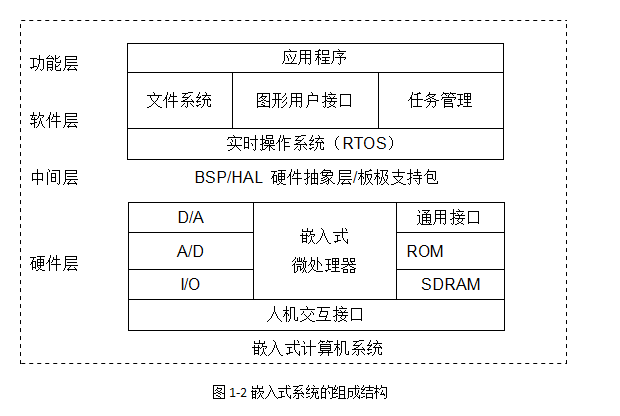
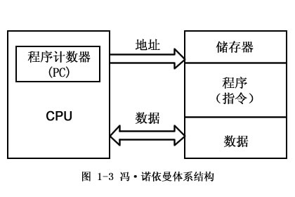
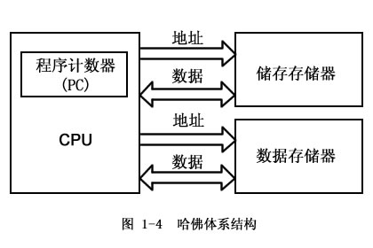
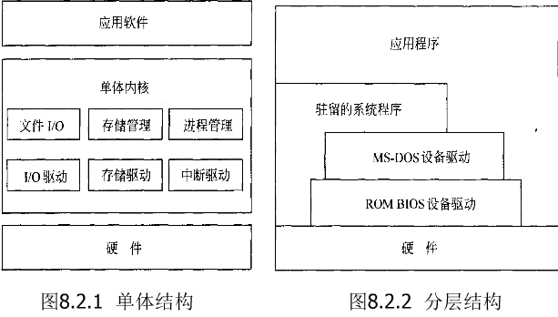
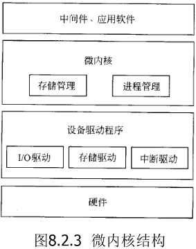
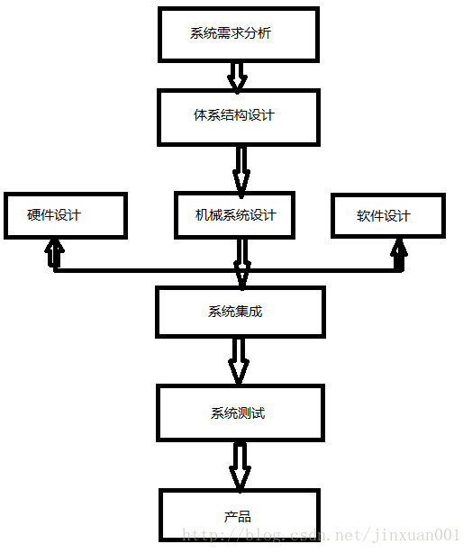
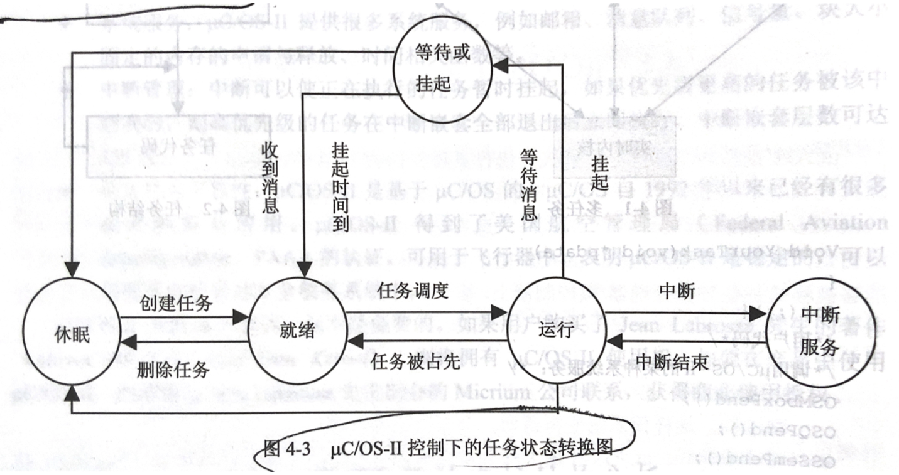
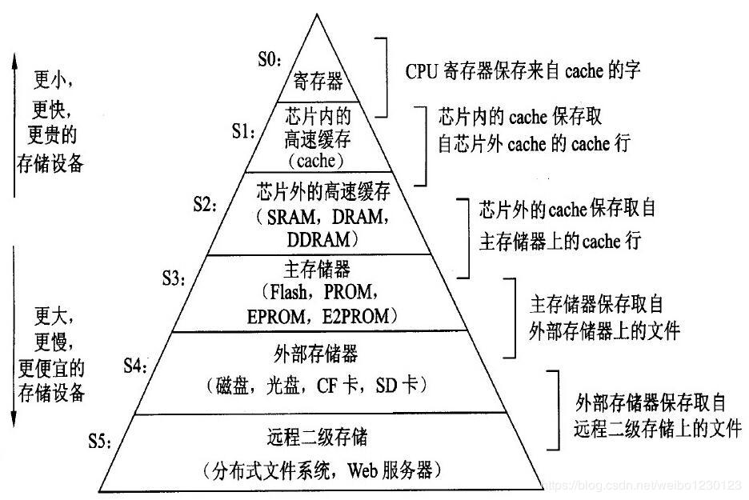

# 嵌入式系统

## 第一章 嵌入式系统概述

### 嵌入式系统的定义

以应用为中心、以计算机技术为基础，软硬件可剪裁，适应应用系统对功能、可靠性、成本、体积、功耗、严格要求的专用计算机系统

嵌入式系统的框架可分为4个部分：处理器，存储器，输入/输出（I/O），软件

### 知识产权核

片上系统（System On Chip，SOC）：在单芯片上集成数字信号处理器、微控制器、存储器、数据转换器、接口电路等电路模块，可以直接实现信号的采集、转换、存储、处理等功能，其中知识产权核（IP Core）设计是SOC设计的基础

IP核是指具有知识产权的、功能具体的、接口规范的、可在多个集成电路设计中重复使用的功能模块，是实现系统芯片（SOC）的基本构件

- IP软核：用硬件描述语言文本形式提交给用户，其中不包含任何具体的物理信息。软核是以源代码的形式提供，IP知识产权不易维护
- IP硬核：基于半导体工艺的物理设计，提供给用户的形式是电路物理结构掩模版图和全套工艺文件。IP易于保护，但灵活性与可移植性差
- IP固核：设计介于软核和硬核之间

### 嵌入式系统特点

1. 系统内核小
2. 专用性强
3. 系统精简
4. 高实时性的操作系统软件是嵌入式软件的基本要求
5. 嵌入式软件开发要想走向标准化，就必须使用多任务的操作系统
6. 嵌入式系统开发需要专门的开发工具和环境

### 嵌入式系统的组成

#### 1. 硬件层

1. 嵌入式微处理器：ARM、MIPS、PowerPC、x86、SH
2. 存储器：Cache、主存、辅助存储器
3. 通用设备接口和I/O接口

#### 2. 中间层

也称为硬件抽象层（HAL）或板级支持包（BSP），使得底层驱动程序与硬件无关

BSP两大特点
- 硬件相关性
- 操作系统相关性

嵌入式系统硬件初始化
- 片级初始化
- 板级初始化
- 系统初始化

#### 3. 系统软件层

系统软件层由实时多任务操作系统（RTOS）、文件系统、图形用户接口（GUI）、网络系统、通用组建模块组成

RTOS是嵌入式应用软件的基础和开发平台

### 嵌入式系统的分类

#### 1. 嵌入式系统的硬件

4个特征：
- 对实时多任务操作系统具有很强的支持能力
- 具有功能很强的存储区保护功能
- 处理器结构可扩展
- 低功耗

一般将嵌入式处理器分成四类：
- 嵌入式微控制器（MCU）
- 嵌入式DSP处理器（DSP）
- 嵌入式微处理器（MPU）
- 嵌入式片上系统（SOC）

#### 2. 嵌入式系统的软件

操作系统有4个主要任务：
- 进程管理
- 进程间通信与同步
- 内存管理
- I/O资源管理

嵌入式操作系统可以分为**实时操作系统**和**分时操作系统**

实时系统可以分为**硬实时系统**和**软实时系统**

商业RTOS的两个评价指标：
- 中断响应时间：从中断发生到相应的ISR（中断服务程序）运行的时间间隔
- 临界情况执行时间（WCDE）：每个系统调用的时间

### 嵌入式系统的发展趋势

1. 嵌入式开发是一项系统工程，因此要求嵌入式系统厂商不仅要提供嵌入式软硬件系统本身，同时还需要提供强大的硬件开发工具和软件包支持
2. 网络化、信息化的要求随着因特网技术的成熟、带宽的提高而日益提高，使得以往单一功能的设备如电话、手机、冰箱、微波炉等功能不再单一，结构更加复杂
3. 网络互联成为必然趋势
4. 精简系统内核、算法、降低功耗和软硬件成本
5. 提供友好的多媒体人机界面

## 第二章 嵌入式系统的基本知识

### 嵌入式微处理器简介

嵌入式硬件系统一般由嵌入式微处理器、存储器和输入/输出部分组成

其中**嵌入式微处理器是核心**，通常由三大部分组成：控制单元、算术逻辑单元和寄存器

- 控制单元：负责取指、译码和取操作数等基本动作，控制单元中两个重要寄存器：程序计数器（PC）和指令寄存器（IR）
- 算术逻辑单元：分为算术运算单元和逻辑运算单元两部分
- 寄存器：存储暂时性的数据

### 嵌入式微处理器体系结构

冯·诺依曼体系结构中程序和数据共用一个存储空间，采用统一的地址和数据总线，程序指令和数据宽度相同

哈佛体系结构中将程序指令和数据分开存储，两个存储器对应4套总线

#### CISC和RISC

- 复杂指令集计算机（CISC）
- 精简指令集计算机（RISC）

| 类别 | CISC | RISC |
| :-: | :-: | :-: |
| 指令系统 | 指令系统指令数量很多 | 较少，通常少于100 |
| 执行时间 | 有些指令执行时间很长，如整块的存储器内容复制；或将多个寄存器的内容复制到存储器 | 没有较长执行时间的指令 |
| 编码长度 | 编码长度编码长度可变，1~15字节 | 编码长度固定，通常为4个字节 |
| 寻址方式 | 寻址方式多样 | 简单寻址 |
| 操作 | 可以对存储器和寄存器进行算术和逻辑操作 | 只能对寄存器进行算术和逻辑操作，Load Store体系结构 |
| 编译 | 难以用优化编译器生成高效的目标代码程序 | 采用优化编译技术，生成高效的目标代码程序 |

#### 信息存储的字节顺序

- 小端：低字节数据存放在内存低地址的位置，高字节数据存放在内存高地址的位置
- 大端：高字节数据存放在内存低地址的位置，低字节数据存放在内存高地址的位置

选择大端还是小端存储法并不存在技术原因，只涉及处理器设计厂商的习惯

### 嵌入式微处理器的分类

- ARM
- MIPS
- Power PC
- x86
- 68K/Coldfire

### 嵌入式软件概述

对于嵌入式软件而言，它除了具有通用软件一般的特性，还具有一些与嵌入式系统密切相关的特点
- 规模较小
- 开发难度大
- 实时性和可靠性要求高
- 要求固化存储

### 嵌入式软件体系结构

#### 1. 无操作系统的情形

1. 循环轮转方式：把系统功能分解为若干个不同的任务，然后把它们包含在一个永不结束的循环语句中
2. 前后台系统：在循环轮转的基础上，增加了中断处理功能

#### 2. 有操作系统的情形

优点：
1. 提高了系统的可靠性
2. 提高了系统的开发效率，降低了开发成本，缩短了开发周期
3. 有利于系统的扩展和移植

内核：提供包括任务管理、存储管理、输入输出I/O设备管理和文件系统管理的功能

### 嵌入式操作系统的分类

#### 1. 按系统的类型分类

- 商用系统：VxWorkd、Windows CE、PalmOS
- 专用系统
- 开源系统：µC/OS、嵌入式Linux系统

#### 2. 按响应时间分类

可以分为实时操作系统（RTOS）和非实时操作系统

- 硬实时系统：系统对响应时间有严格的要求，如果响应时间不能满足，这是绝对不允许的，可能会造成系统崩溃或其他错误
- 软实时系统：系统对响应时间有要求，如果响应时间不能满足，将带来额外的代价，但是这种代价通常是能够接受的

### 3. 按软件结构分类

- 单体结构：嵌入式Linux和PDOS
- 分层结构：MS-DOS结构
- 微内核结构：OS-9、VxWorks、CMX-RTX、Nucleus Plus

### 嵌入式操作系统的重要概念

1. 占先式内核
2. 调度策略分析
3. 任务优先级分配
4. 时间的可确定性
5. 任务切换时间
6. 中断响应时间（可屏蔽中断）
7. 优先级反转
8. 任务执行时间的抖动
9. 任务划分

### 常见实时嵌入式操作系统

#### 1. 商用型实时嵌入式操作系统

- VxWorks
- Windows Embedded
- pSOS
- PalmOS
- OS-9
- LynxOS
- QNX

#### 2. 免费型实时嵌入式操作系统

- 嵌入式Linux
- µC/OS

### 嵌入式操作系统的选型原则

1. 操作系统的硬件支持
2. 开发工具支持程度
3. 能否满足应用需求

### 嵌入式系统的设计方法

## 第三章 ARM嵌入式微处理器概述

### 嵌入式微处理器简介

目前消费市场主流的还是32位嵌入式微处理器

评价指标：
- 功耗
- 代码存储密度
- 集成度
- 多媒体加速

### ARM微处理器概述

ARM是一种32位微处理器结构，采用RISC体系结构

除了ARM7采用了冯·诺依曼体系结构，ARM9以上都采用了哈佛结构

ARM体系结构对数据类型支持如下：
- 字
- 半字
- 字节

ARM微处理器有两种工作状态：
- ARM状态：此时处理器执行32位的字对齐的ARM指令
- Thumb状态：此时处理器执行16位的、半字对齐的Thumb指令

> Thumb指令集可以看作ARM指令压缩形式的子集，具有16位的代码密度

### ARM的3级流水线

1. 取指：将指令从内存中取出来
2. 译码：操作码和操作数被译码以决定执行何种操作
3. 执行：执行已译码的指令

### ARM的通用寄存器

- 未分组寄存器 R0-R7
- 分组寄存器 R8-R14
- 程序计数器 PC（R15）

### 指定寄存器

- R13在ARM指令中作为堆栈指针
- R14称为子程序链接寄存器
- R15用作程序计数器（PC）

#### 程序状态寄存器

ARM体系结构包含一个当前程序状态寄存器（CPSR）和5个备份程序状态寄存器（SPSR）

- 保存ALU中的当前操作信息
- 控制允许和禁止中断
- 设置处理器的运行模式

条件码标志：

- `N`：补码运算时，N=1表示负数，N=0表示正数
- `Z`：Z=1表示运算结果为0，Z=0表示运算结果非0
- `C`：加减法或移位运算的进位或溢出位
- `V`：补码运算时的符号位溢出
- `Q`：增强DFP运算是否发生溢出

### ARM处理器模式

7种运行模式：
1. 用户模式（USR）：正常程序执行状态
2. 快速中断模式（FIQ）：用于高速数据传输或通道管理
3. 外部中断模式（IRO）：用于通用的中断处理
4. 管理模式（SVC）：操作系统使用的保护模式
5. 数据访问终止模式（ABT）：当数据或指令预取终止时进入该模式，保护存储
6. 系统模式（SYS）：运行具有特权的操作系统任务
7. 未定义指令终止模式（UND）：当未定义指令执行时进入该模式

### ARM处理器的异常

- 复位
- 未定义指令
- 软件中断
- 指令预取中止
- 数据中止
- IRQ（外部中断请求）
- FIQ（快速中断请求）

### 嵌入式系统初始化过程

嵌入式系统中整个初始化过程由一段引导程序Boot Loader完成

Boot Loader有启动加载模式和下载模式，一般存放在ROM、EEPROM、Flash中

Boot Loader启动过程可以分为两个阶段：初始化硬件配置，加载操作系统

#### 第一阶段

1. 异常中断初始化
2. 相关硬件设备初始化
3. 拷贝第二阶段代码拷贝到内存中
4. 跳到第二阶段的内存处

#### 第二阶段

1. BSS段清零
2. 设置各种模式下的堆栈
3. 开IRQ中断
4. 跳转到C代码的MAIN入口

## 第四章 µC/OS-II嵌入式实时操作系统内核分析

### µC/OS-II主要特点

- 公开源代码
- 可移植性好
- 可固化
- 可裁剪
- 抢占式内核
- 多任务
- 可确定性
- 任务栈
- 系统服务
- 中断管理
- 稳定性和可靠性

### µC/OS多任务

- 休眠态
- 就绪态
- 运行态
- 等待或挂起态
- 中断态

### 任务互斥和同步

#### 1. 任务之间的关系

- 相互独立
- 任务互斥
- 任务同步
- 任务通信

#### 2. 任务互斥

解决任务互斥：
1. 关闭中断法
2. 繁忙等待法
3. 信号量法

### 任务间的通信

1. 共享内存
2. 消息传递

### 任务通信机制

1. 时间控制块
2. 信号量
3. 邮箱
4. 消息队列

### 移植µC/OS-II基本要求

1. 处理器的C编译器能产生可重入代码
2. 在程序中可以打开或关闭中断
3. 处理器支持中断，并且能产生定时中断
4. 处理器支持能够容纳一定量数据的硬件堆栈
5. 处理器有将堆栈指针和其他CPU寄存器存储、读出到堆栈的指令

## 第五章 嵌入式系统硬件平台与接口设计

### 内存管理单元

在CPU和物理内存之间进行地址转换

内存管理单元MMU主要完成一下工作：
- 虚拟存储空间到物理存储空间的映射
- 存储器的访问权限的控制
- 设置虚拟存储空间的缓冲特性

### I/O接口设计

### I/O接口

- 解决主机CPU和外围设备之间的时序配合和通信联络问题
- 解决CPU和外围设备之间的数据格式转换和匹配问题
- 解决CPU的负载能力和外围设备端口选择问题

### I/O接口编址方式

- I/O接口独立编址
- I/O接口与存储器统一编址方式
