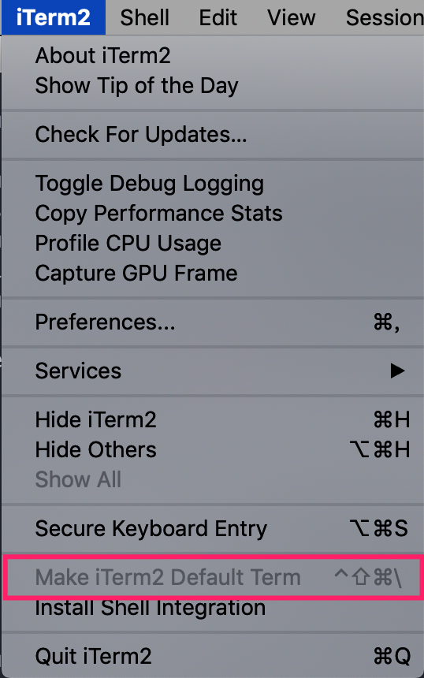
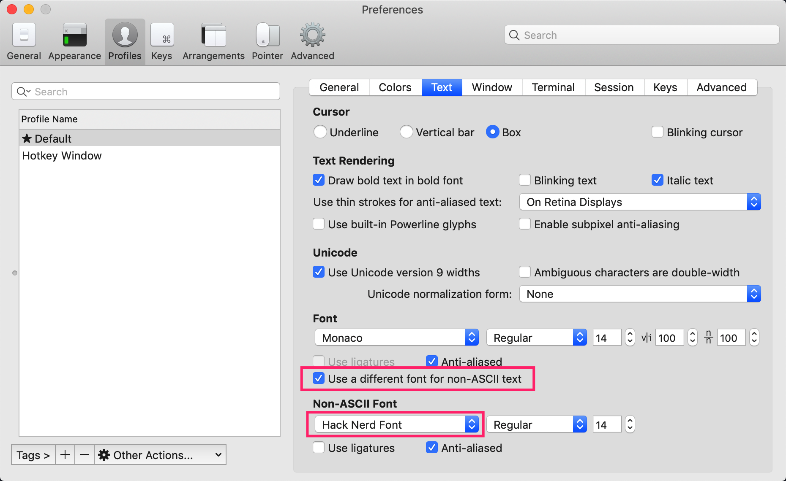
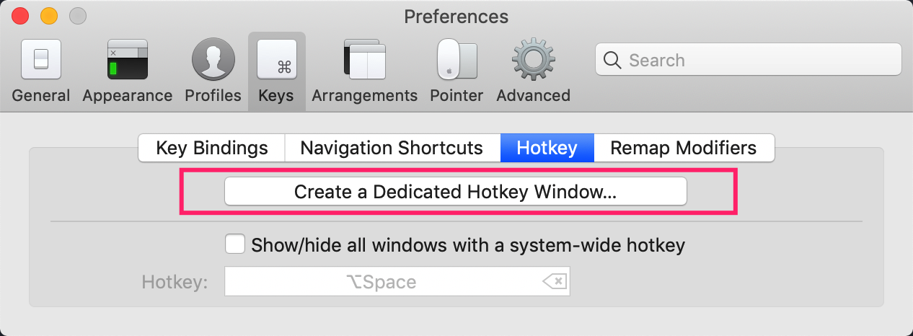
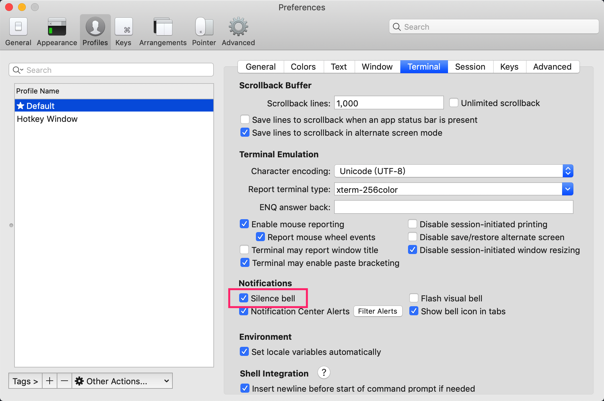
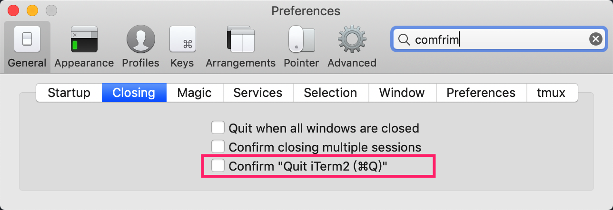

# iTerm2使用

## 安装

[iTerm2](https://www.iterm2.com/)是Mac下终端更好的代替者 

## 基本配置

### 1. 将iTerm2作为默认终端

### 2. 设置iTerm2中非ASCII字符字体

设置[nerd-fonts](https://github.com/ryanoasis/nerd-fonts)字体作为非ASCII字体用于展示表情等符号

### 3. 下拉式终端

配置快捷键打开下拉式终端，下拉式终端配置在`Profiles -> Hotkey Window`下

### 4. 关闭警告音

### 5. 关闭退出确认提示

