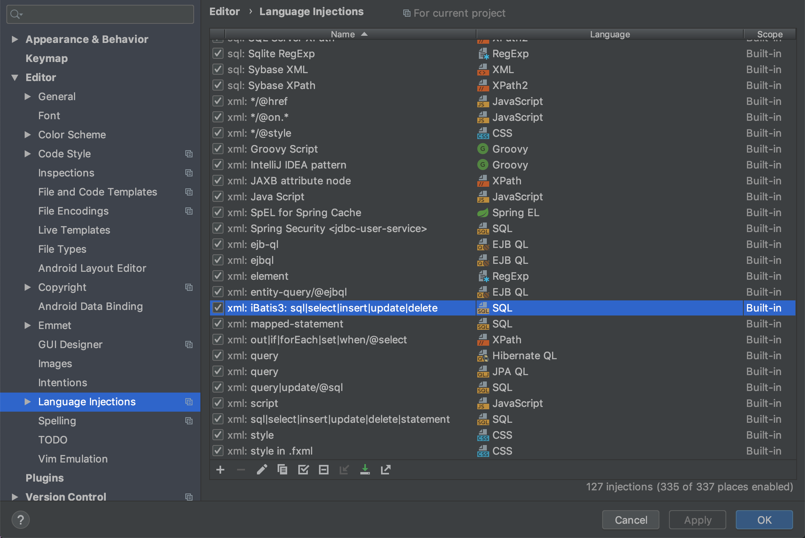

# IDEA基础配置

## 关闭提示大小写敏感

1.`Setting -> Editor -> General -> Code Completion`
2.将`match case`或者`case sensitive completion`去掉勾选

## 为文件自动添加作者和日期

1.`Settings -> File and Code Templates-> Include -> File Header`
2.将如下代码写入`File Header`

## 去除注入语言的背景色

1. `Settings -> Editor -> Color Scheme -> General -> Code -> Injected language fragment`
2. 将右侧`Backgroud`的勾去除

## 设置SQL关键词为大写

1.`Settings -> Editor -> Code Style -> SQL -> Case -> Word Case -> Keywords`
2.将`Keywords`改为`To upper`

## SQL语句列名提示语匹配

1.`Editor -> General -> Appearance -> Show parameter name hints -> Configure`
2.点击`Configure`按钮，在language中选择`SQL`，将`Show column names in insert values`打上勾

## 自定义Live Templates

1.`Settings -> Editor -> Live Templates`
2.在右侧加号中先新建一个`Template Group`,将自定义的Live Templates都存放在此group下
3.然后在右侧加号中再新建一个`Live Template`

## 去除无用警告

### 去除 SQL dialect is not configured 警告

1.`Settings -> Editor -> Inspections -> SQL -> SQL dialect detection`
2.将`SQL sialect detection`后面的勾去除

### 去掉 No data sources configure 警告

1.`Settings -> Editor -> Inspections -> SQL -> No data sources configured`
2.将`No data sources configured`后面的勾去除

### 配置数据库源和数据库语言的选择即可解决以上两个问题(除了第一个问题)

1.`Settings -> Languages & Frameworks -> SQl Dialects`
2.将`Global SQL Dialect`和`Project SQL Dialect`均改为正在使用的数据库类型

### 去除public权限警告

1. `Settings -> Editor -> Inspections`
2. 去除`Java -> Declaration redundancy -> Declartion access can be weaker`的勾

### mybatis报错：<statement> or DELIMITER expected, got 'id'

1. `Settings -> Language Injections -> xml:iBatis3:sql|select|insert|update|delete|statement`
2. 点开后在`Local Name`中删除`sql|`

### 显示内存状况

1. `Settings -> Appearence & Behavior -> Appearence`
2. 勾上`Show memory indictor`

### 隐藏自动生成的.idea和.iml

1. `Settings -> Editor -> File Types`
2. 在`Recognized File Types`中选中`ActionScript`，并在最下方的`Ignore files and folders`中添加`.idea;*.iml;`

### tab多行显示

1. `Settings -> Editor -> General -> Editor Tabs`
2. 在`Apparance`中将默认勾选上的`Show tabs in one line`的勾去掉

