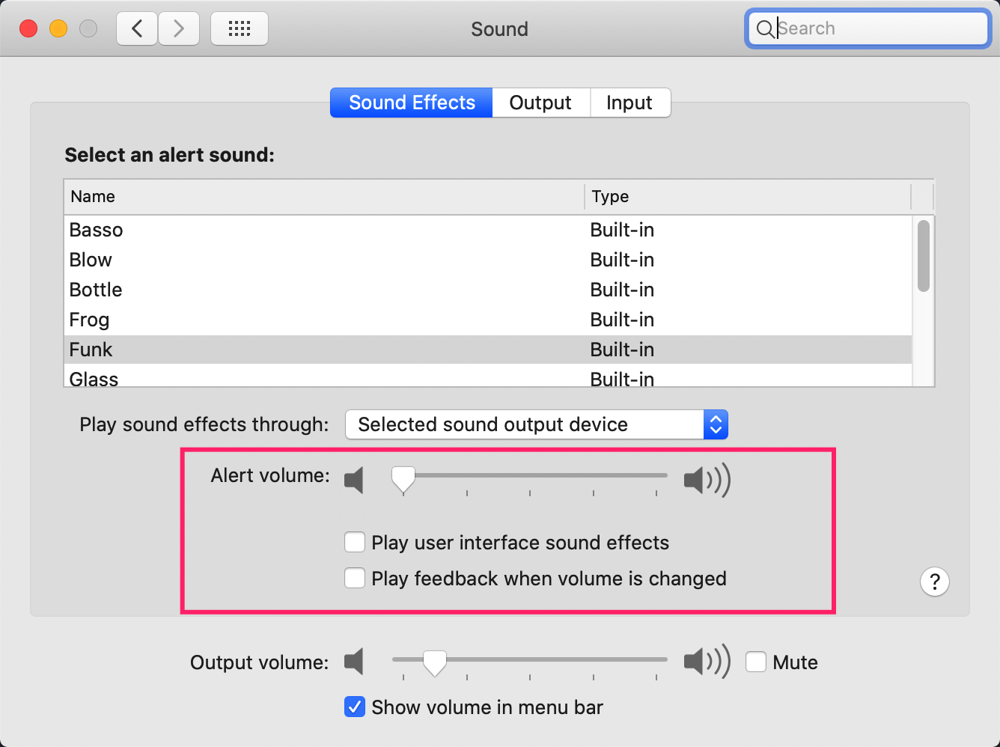
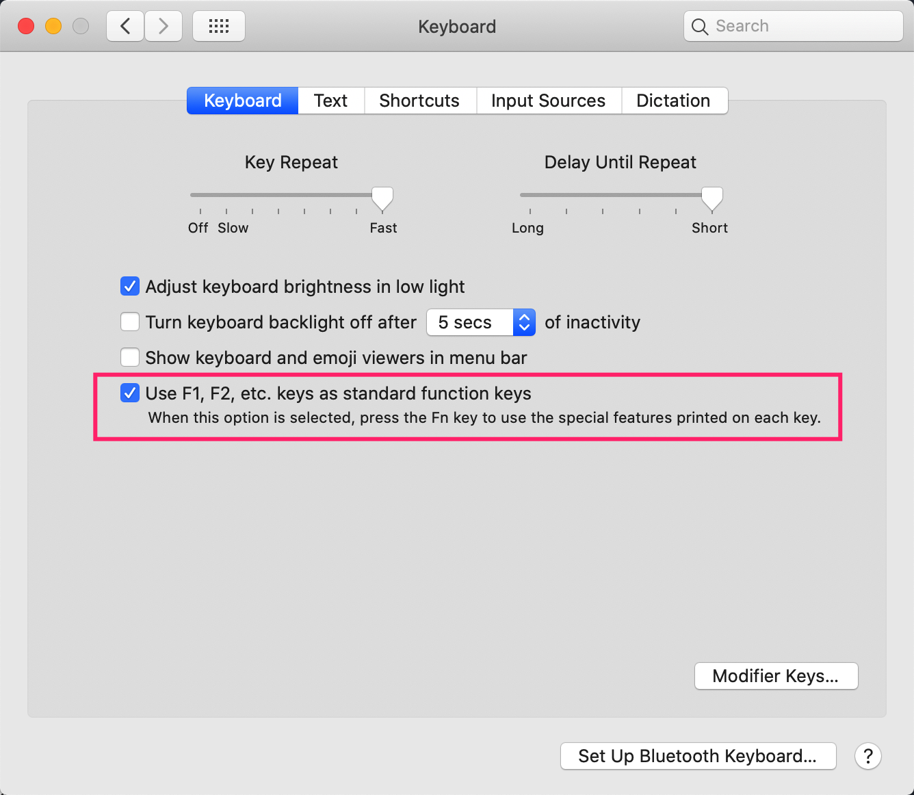

# Mac使用

## 系统

- `Command + Space` 打开聚焦搜索
- `Command + Tab` 在应用程序间切换 (在`Command + Tab`模式下，使用向上键或向下键来显示该应用程序的所有窗口)
- `Command + Tab + Option` 在应用程序间切换，最小化或被隐藏的窗口将被打开
- `Command + ` ` 在应用程序中的窗口间切换
- `Command + H` 隐藏当前窗口
- `Command + M` 最小化当前窗口
- `Command + W` 关闭当前窗口
- `Command + Control + Space` 快速调用emoji表情包
- 按住`Command`可以移动使用非焦点窗口并不激活它
- 按住`Command`键即可自由移动图标
- `Option + Shift + 音量/亮度调节按键` 微量调节音量/亮度
- 按住`Option`点击wifi图标，显示隐藏网络信息
- 按住`Option`点击右上角通知栏，可以打开勿扰模式
- 按住`Option`点击关闭，可以关闭当前软件的所有窗口
- 在`Command + Tab`切换页面的时候，使用`Command + Q`退出指定软件
- 在开机界面长按`Command + R`，进入恢复模式
- 在开机界面长按`Command + Option + R`，进入网络恢复模式

## Finder

- `Space` 预览所选文件
- `Enter` 重命名所选文件
- `Command + C` 复制所选文件
- `Command + V` 粘贴所选文件
- `Command + Option + V` 剪切文件，粘贴所选文件并删除`Command + C`所选的文件
- `Command + Delete` 删除所选文件
- `Command + O` 打开所选文件
- `Command + I` 显示文件简介
- `Option + Command + I` 打开检查器，可以分别查看文件简介
- `Command + Option + C` 复制当前文件夹的绝对路径
- `Command + Shift + .` 显示隐藏文件
- `Command + Shift + G` 输入绝对路径，直达文件
- `Command + T` 新建标签页
- 按住`Option`拖拽文件，以达到复制的效果（默认拖拽是剪切）
- 按住`Option`右键文件，可以更改默认打开方式
- 按住`Option`右键文件，可以复制文件路径
- 按住`Option`打开文件夹，可以自动展开所有文件夹显示其中文件

### 在Finder下标题栏显示当前文件夹的绝对路径

```text
# 在标题栏显示文件夹的绝对路径
defaults write com.apple.finder _FXShowPosixPathInTitle -bool TRUE;
# 恢复默认状态
defaults delete com.apple.finder _FXShowPosixPathInTitle;
# 重启Finder
killall Finder
```

### Finder的偏好设置

- 高级
  - 显示所有文件扩展名
  - 执行搜索时：搜索当前文件夹
  
### Finder打开顶部Tab Bar和底部路径栏

Finder -> View -> Show Tab Bar
Finder -> View -> Show Path Bar

### Finder显示用户资料库

```bash
chflags nohidden ~/Library/
```

## 设置默认浏览器和邮件

### 设置默认浏览器

System Preferences -> General


### 设置默认邮件

Mail -> Perferences(Command + `) + General


## 屏幕快照

- `Command + Shift + 3` 全屏截图
- `Command + Shift + 4` 自定义区域截屏
- `Command + Shift + Control + 3` 全屏截图并保存到剪贴板
- `Command + Shift + Control + 4` 自定义区域截屏并保存到剪贴板
- `Command + Shift + 4 + Space` 窗口截图
- `Command + Shift + 5`  录屏或自定义截图选项

### 修改截图默认保存路径

```bash
# 修改截图默认保存路径
defaults write com.apple.screencapture location [path]
# 重启服务
killall SystemUIServer
```

## 强制退出

- `Command + Q`
- 按住`Option`，右键点击程序坞中软件图标，退出选项会变成强制退出
- `Command + Option + Esc` 打开强制退出应用窗口

## 删除

- `Delete` 删除前一个字符
- `Fn + Delete` 删除后一个字符
- `Option + Delete` 删除前一个单词

## Caps Lock

- 单击 `CapsLock` 中英文切换
- 长按 `CapsLock` 锁定大写

## U盘

- `Command + E` 安全弹出U盘

## Spotilight

- 输入待搜索内容，使用`Command + B`进行Google搜索

## 命令行

- 按住`Command`单击路径，可在Finder中打开文件夹
- `open -a [application] [file]` 使用特定软件打开文件

## 软件安装

在Mac10.12后不再在设置中显示`允许任何来源`选项，需在命令行中执行如下命令

```bash
sudo spctl --master-disable
```

## 修改计算机名称

将默认的计算机名称修改为英文，在终端中能更好的展示

`设置` -> `共享` -> `电脑名称`

## Mac下.DS_Store文件

`.DS_Store`是Mac OS保存文件夹的自定义属性的隐藏文件，如文件的图标位置或背景色，相当于Windows的`desktop.ini`


```bash
# 禁止.DS_Store生成
defaults write com.apple.desktopservices DSDontWriteNetworkStores -bool TRUE

# 恢复`.DS_Store`生成
defaults delete com.apple.desktopservices DSDontWriteNetworkStores
```

删除所有目录下的`.DS_Store`

```bash
sudo find / -name ".DS_Store" -depth -exec rm {} \;
```

## 权限列表中的@

@表示文件或目录有额外属性，例如mac从网上下载个文件有时会提示“此文件来自网络下载不安全”时，就是这个属性起作用了

从mac下copy文件到linux系统上时会因为这个属性造成在linux下打不开的错误，必须删除属性

```bash
# 查看属性
xattr -l [FILE]
# 删除属性
xattr -c [FILE]
```

## 修改Launchpad中图标个数

默认是5行7列

```bash
# 修改行数为6
defaults write com.apple.dock springboard-rows -int 6
# 修改列数为8
defaults write com.apple.dock springboard-columns -int 8
# 重启Launchpad
killall Dock
```

```bash
# 恢复默认设置
defaults write com.apple.dock springboard-rows Default defaults write com.apple.dock springboard-columns Default killall Dock
```

## 打开不受信任的软件

1. 在设置的安全性与隐私中在允许从以下位置下载的APP中选择任何来源
2. 若选择任何来源后无效，则在Finder中软件处按住Control单击软件，点击打开

## iPhone有线投屏到Mac

1. 将iPhone通过数据线连接到Mac，并选择信任该Mac
2. 打开QuickTime Player，在左上角中 -> 文件 -> 新建影片录制
3. 在新打开的界面(FaceTime摄像头)中的录制按钮(红色圆圈按钮)旁，点击向下的小箭头，选择待投屏的iPone即可

## Mac关闭错误声音



## Mac默认使用F1～12功能



## 加速Time Machine备份速度

MacOS对Time Machine备份过程中占用的系统资源做了限制，可以通过以下命令强制关闭限制，以加速备份速度

```bash
# 强制关闭限流
sudo sysctl debug.lowpri_throttle_enabled=0
# 打开限流
sudo sysctl debug.lowpri_throttle_enabled=1
```


