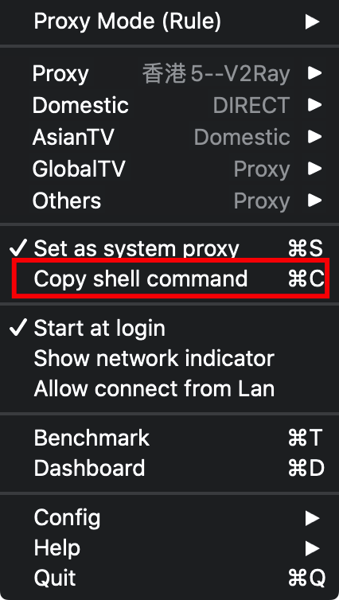

# Mac杂录

## 通过brew安装openjdk

[AdoptOpenJDK GitHub](https://github.com/AdoptOpenJDK/homebrew-openjdk)

```bash
# 直接安装最新版本的openjdk
brew cask install adoptopenjdk
# 安装指定版本的openjdk
brew tap AdoptOpenJDK/openjdk
brew cask install [adoptopenjdk8 | adoptopenjdk9 | 更多选择查看AdoptOpenJDK]
```

## 配置命令行代理

brew/git下载时往往需要终端代理，例子中使用的是ClashX做的代理

ClashX的代理端口可通过`Copy shell Command`查看



```bash
# 写入~/.zshrc，通过proxy开启代理，unproxy关闭代理
alias proxy="export https_proxy=http://127.0.0.1:7890; export http_proxy=http://127.0.0.1:7890; export all_proxy=socks5://127.0.0.1:7891; echo proxy open"
alias unproxy="unset https_proxy; unset http_proxy; unset all_proxy; echo proxy close"
```

## SlowQuitApps设置延时时间

[SlowQuitApps](https://github.com/dteoh/SlowQuitApps)默认延迟时间太长了，所以可以设置的较短一些

```bash
# 关闭SlowQuitApps
killall SlowQuitApps
# 设置延迟时间，450比较合适
defaults write com.dteoh.SlowQuitApps delay -int [TIME]
```