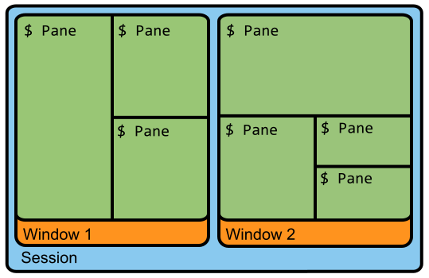

# tmux安装与使用

## 安装

```bash
brew install tmux
```

## 配置文件

tmux默认配置文件位于`~/.tmux.config`

使用`tmux source ~/.tmux.conf`更新配置文件

## 会话、窗口与窗格的概念

- `session` 在开启Tmux时会自动创建一个session，且会在这个session中开启一个默认window。Tmux可以在多个session中切换
- `window` 一个session中能有多个window，且这些window都由该session控制
- `panel` 由window分割出来的单位叫做panel

`Session -> Window -> Panel`



## 会话命令

```bash
tmux new -s [demo]  # 新建一个名称为demo的会话
tmux ls  # 查看所有会话
tmux detach  # 断开会话连接，在后台运行
tmux attach -t [demo]  # 进入名称为demo的会话
tmux kill-session -t [demo]  # 关闭名称为demo的会话
tmux kill-server  # 关闭服务器，所有的会话都将关闭
```

## 快捷键

**tmux中默认的`prefix`为`Cttrl+b`**

### session指令

- `prefix + :new` 启动新会话
- `prefix + d` 断开当前会话
- `prefix + s` 显示会话列表用于选择并切换
- `prefix + $` 重命名当前会话

### window指令

- `prefix + c` 新建窗口
- `prefix + &` 关闭当前窗口
- `prefix + w` 显示所有窗口和会话
- `prefix + p` 切换到前一个窗口
- `prefix + n` 切换到后一个窗口
- `prefix + f` 通过关键词定位窗口

### panel指令

- `prefix + %` 水平打开新面板
- `prefix + "` 垂直打开新面板
- `prefix + x` 关闭当前面板
- `prefix + z` 最大化当前面板
- `prefix + up/down/left/right` 切换面板
- `prefix + t` 展示时钟

[更多快捷键](http://louiszhai.github.io/2017/09/30/tmux/)

## 插件管理

推荐使用[tpm](https://github.com/tmux-plugins/tpm)

- `prefix + I` 安装插件并重载tmux环境
- `prefix + U` 更新插件
- `prefix + alt + u` 删除卸载插件