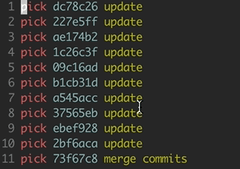

# vim使用技巧

## 多行编辑

### 删除

1. 使用`Ctrl + V`进入`Visual Block`模式
2. 块状选择待删除文字
3. 使用`d`删除

### 添加

1. 使用`Ctrl + V`进入`Visual Block`模式
2. 块状选择带添加的文字，将会在块状的头部添加
3. 使用`I`进入编辑模式，在块状第一行添加待添加文字
4. 使用`Esc`退出，将会自动在多行生成带添加文字

## 缓冲区状态

当使用`buffers`或`ls`会在列表头部展示缓冲区信息

- `-` 只读缓冲区，禁用modifiable选项
- `=` 只读缓冲区
- `a` 活动缓冲区，即当前显示在屏幕上的缓冲区
- `h` 隐藏缓冲区，即已加载但没有展示在屏幕上的缓冲区
- `+` 已更改的缓冲区
- `x` 读入时报错的缓冲区
- `%` 当前缓冲区
- `#` 交换缓冲区
- `u` 使用`buffers!`或`ls!`才会显示的缓冲区，是加载后被删除的缓冲区

## 键位映射
