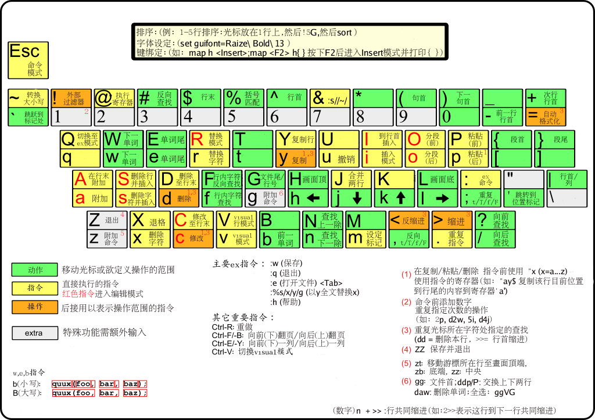

# vim使用指南

## 文档操作

- `:e!` 重新加载当前文档，并丢弃已做的改动
- `:e [file]` 打开文件file
- `:e#` 切换为上一个文件
- `:f` 显示文档名，是否修改，和光标位置
- `:q` 退出vim，若文档已被修改，则退出失败
- `:qa` 退出所有窗口的vim
- `:q!` 强制退出vim，修改将被丢弃
- `:wq` 或 `x` 保存修改并退出
- `:saveas [filename]` 将修改后的文件另存为filename

## 光标移动

- `hjkl` 左移下移上移右移
- `+` 移到下一行到第一个字符
- `-` 移到上一行到第一个字符
- `w` 移到下一个单词的第一个字符
- `b` 移到上一个单词的第一个字符
- `e` 移动到当前单词到末尾
- `0` 移到行首
- `$` 移到行尾
- `G` 移动到文件尾行
- `gg` 移动到文件首行
- `[n]G` 移动到第n行的行首
- `[n]+` 向下移动n行
- `[n]-` 向上移动n行
- `H` 移动到屏幕最顶端一行
- `M` 移动到屏幕最中央一行
- `L` 移动到屏幕最末尾一行
- `f[c]` 移动到同一行下一个c字符处
- `F[c]` 移动到同一行上一个c字符处
- `;` 配合`f & F`，重复一次

## 翻页

- `Ctrl + F` 下翻一屏
- `Ctrl + B` 上翻一屏
- `Ctrl + D` 下翻半屏
- `Ctrl + U` 上翻半屏
- `[n]%` 到文件n%的位置
- `zz` 将当前行移动到屏幕中央
- `zt` 将当前行移动到屏幕顶端
- `zb` 将当前行移动到屏幕底端

## 文本插入

- `i` 在当前字符前插入
- `I` 在当前行首插入
- `a` 在当前字符后追加
- `A` 在当行末后追加
- `o` 在当前行下方另起一行
- `O` 在当前行上方另起一行
- `cc` 删除当前行，然后修改当前行
- `C` 删除当前光标到行尾，然后修改
- `s` 删除光标所在字符然后插入
- `S` 删除光标所在行然后插入

## 复制，剪切和粘贴

- `yy` 复制当前行
- `[n]yy` 复制当前n行
- `yw` 复制当前单词
- `x` 剪切当前字
- `X` 剪切当前字符的前一个字符
- `D` 剪切当前字符到行尾
- `dd` 剪切当前行
- `[n]dd` 剪切当前n行
- `"+dd` 剪切当前行到系统剪切板
- `"_d` 删除当前行，不复制
- `d$` 剪切光标到该行行尾
- `d0` 剪切光标到该行行首
- `dgg` 剪切当前行到文件首行
- `dG` 剪切当前行到文件末尾
- `dw` 剪切当前单词
- `:[n1],[n2]d` 删除n1行到n2行
- `p` 粘贴内容到光标之后
- `P` 粘贴内容到光标之前
- `u` 撤销上一次操作
- `Ctrl + R` 恢复上一次的撤销

## 查找

- `/` 从光标后面的文本中查找
- `?` 从光标前面的文本中查找
- `n` 向后查找下一个
- `N` 向前查找下一个

## 替换

- `:s/[old]/[new]` 用new替换当前行第一个old
- `:s/[old]/[new]/g` 用new替换当前行所有的old
- `:[n1],[n2]s/[old]/[new]/g` 用new替换文件n1行到n2行所有的old
- `:%s/[old]/[new]/g` 用new替换文件中所有的old
- `:%s/^/[word]/g` 在每一行的行首插入word
- `:%s/$/[word]/g` 在每一行的行尾插入word
- 在每一个替换命令的最后加上`c`，则每个替换都需要用户确认

## 排版

- `>>` 所在行右移一个Tab
- `<<` 所在行左移一个Tab
- `J` 将下一行内容合并到这一行

## 分屏

- `vim -o [file1] [file2] ...` 水平分屏打开多个文件
- `vim -O [file1] [file2] ...` 垂直分屏打开多个文件
- `:sp [file]` 水平分屏打开文件
- `:vsp [file]` 垂直分屏打开文件
- `:q` 或 `:close` 关闭当前分屏
- `Ctrl + W` + `w` 切换到上一个分屏
- `Ctrl + W` + `h` 切换为左边的分屏
- `Ctrl + W` + `l` 切换为右边的分屏
- `Ctrl + W` + `j` 切换为下边的分屏
- `Ctrl + W` + `k` 切换为上边的分屏
- `Ctrl + W` + `>` 垂直分屏线向右移
- `Ctrl + W` + `<` 垂直分屏线向左移
- `Ctrl + W` + `+` 水平分屏线向下移
- `Ctrl + W` + `-` 水平分屏线向上移
- `Ctrl + W` + `=` 恢复均等
- `Ctrl + W` + `H` 将该分屏置于左边
- `Ctrl + W` + `L` 将该分屏置于右边
- `Ctrl + W` + `J` 将该分屏置于下边
- `Ctrl + W` + `K` 将该分屏置于上边

## 分页

- `vim -p [file1] [file2] ...` 以多标签页形式打开多个文件
- `:tabnew` 新增一个标签页
- `:tabe [file]` 在新标签页中打开文件
- `:tabn` 或 `gt` 移动到下一个标签页
- `:tabp` 或 `gT` 移动到上一个标签页
- `:tabn[n]` 切换到第n个标签页
- `:tabc` 关闭当前标签页
- `:tabo` 关闭所有其他标签页
- `:tabs` 查看所有标签页
- `:tabfirst` 切换到第一个标签页
- `:tablast` 切换到最后一个标签页

## 缓冲区 buffer

- `vim [file1] [file2] ...` 打开多个文件，加载到缓冲区
- `:buffers` 或 `ls` 列出所有缓冲区文件
- `badd [file]` 打开文件到缓冲区
- `:bn` 切换到下一个缓冲区
- `:bp` 切换到上一个缓冲区
- `:bfirst` 切换到第一个缓冲区
- `:blast` 切换到最后一个缓冲区
- `:b[n]` 切换到第n个缓冲区
- `:b [file]` 切换到文件为file的缓冲区
- `bdelete [file]` 删除指定文件缓冲区

